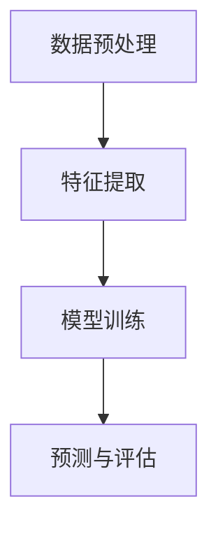
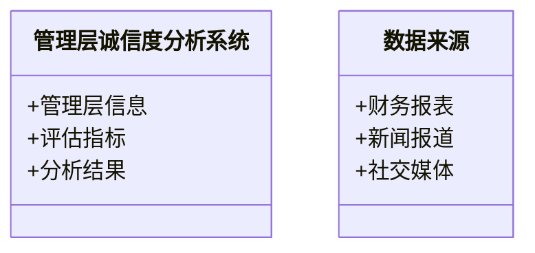
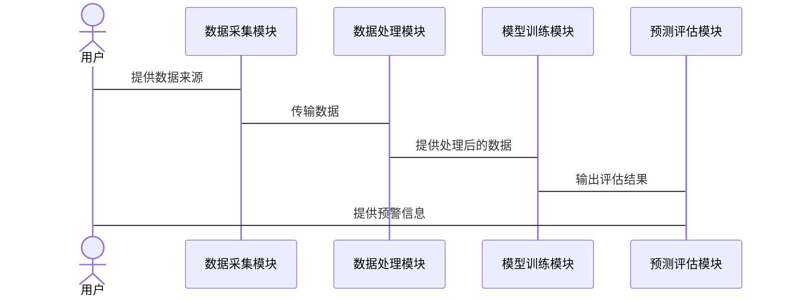
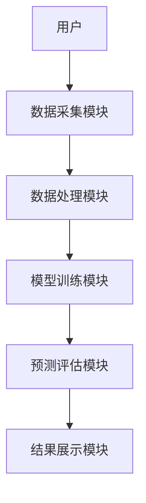

                 


# AI驱动的管理层诚信度分析：防范公司治理风险

> 关键词：AI技术，管理层诚信度，公司治理，风险防范，数据分析，自然语言处理，机器学习

> 摘要：本文深入探讨了利用人工智能技术分析管理层诚信度，以防范公司治理风险的方法。通过结合自然语言处理和机器学习，构建了高效的分析模型，并通过实际案例展示了如何运用这些技术手段来评估和监控管理层的诚信表现，从而为公司治理提供科学依据。

---

## 第1章: 问题背景与描述

### 1.1 管理层诚信度的重要性

#### 1.1.1 诚信度对企业治理的影响
管理层的诚信度是公司治理的核心要素之一。诚信的管理层能够确保公司战略的正确实施，维护股东利益，促进企业长期发展。反之，诚信缺失可能导致公司治理风险，如财务造假、利益输送等问题。

#### 1.1.2 现有诚信度评估的局限性
传统的诚信度评估方法主要依赖于主观判断和少量数据，存在以下问题：
- 数据来源单一，难以全面反映管理层诚信。
- 评估标准不统一，缺乏客观性。
- 评估周期长，难以及时预警风险。

#### 1.1.3 AI技术在诚信度分析中的潜力
人工智能技术，尤其是自然语言处理和机器学习，能够从大量非结构化数据中提取信息，识别潜在风险，为诚信度评估提供新的解决方案。

### 1.2 问题描述与目标

#### 1.2.1 问题背景分析
随着企业规模的扩大和市场竞争的加剧，管理层诚信度的评估变得越来越重要。传统的评估方法难以满足现代企业的需求，亟需引入新技术来提升评估的准确性和效率。

#### 1.2.2 问题解决的目标
通过AI技术，构建一个自动化、智能化的管理层诚信度分析系统，实现以下目标：
- 实时监控管理层的诚信表现。
- 提供数据驱动的评估结果，帮助公司及时发现和防范治理风险。
- 为公司治理决策提供科学依据。

#### 1.2.3 边界与外延
本系统仅关注管理层的诚信度分析，不涉及其他公司治理问题。分析范围包括管理层的行为数据、公开声明、媒体报道等。

---

## 第2章: 核心概念与联系

### 2.1 管理层诚信度分析的定义

#### 2.1.1 核心概念的定义
管理层诚信度分析是指利用AI技术，从多源数据中提取信息，评估管理层的诚信表现，包括其行为、决策和公开声明的真实性。

#### 2.1.2 关键属性的特征对比
| 特性 | 描述 |
|------|------|
| 数据来源 | 包括财务报表、新闻报道、社交媒体等 |
| 评估指标 | 包括决策透明度、信息披露准确性、行为合规性等 |
| 分析方法 | 基于NLP和机器学习的文本分析、模式识别等 |

#### 2.1.3 实体关系图（ER图）

```mermaid
erd
actor: 管理层诚信度分析系统
aggregate: 管理层信息
role: 数据来源
```

---

## 第3章: 算法原理与数学模型

### 3.1 管理层诚信度分析的算法

#### 3.1.1 自然语言处理（NLP）技术
NLP用于从文本数据中提取情感、关键词和主题，帮助评估管理层的声明是否真实。

#### 3.1.2 机器学习模型
使用支持向量机（SVM）和随机森林（RF）等算法，对管理层的行为数据进行分类，预测其诚信度。

#### 3.1.3 图论与网络分析
通过构建社交网络，分析管理层之间的关系，识别潜在的利益输送行为。

### 3.2 算法流程图



---

## 第4章: 系统分析与架构设计

### 4.1 问题场景介绍

#### 4.1.1 问题背景
公司需要实时监控管理层的诚信表现，防范治理风险。

#### 4.1.2 系统目标
构建一个AI驱动的分析系统，实现自动化的诚信度评估。

#### 4.1.3 使用场景
企业内部审计部门、董事会和高层管理者使用该系统进行监督和决策。

### 4.2 系统功能设计

#### 4.2.1 领域模型设计



#### 4.2.2 功能模块划分
- 数据采集模块：从多源数据中获取信息。
- 数据处理模块：清洗和预处理数据。
- 模型训练模块：构建和优化AI模型。
- 预测评估模块：生成评估结果并提供预警。

#### 4.2.3 模块交互流程



### 4.3 系统架构设计

#### 4.3.1 总体架构图



#### 4.3.2 关键模块设计
- 数据采集模块：负责获取多源数据。
- 数据处理模块：清洗和预处理数据。
- 模型训练模块：构建AI模型并进行训练。
- 预测评估模块：生成评估结果并提供预警。

#### 4.3.3 接口设计
- 数据接口：与数据源进行数据交互。
- 用户接口：提供直观的评估结果展示和预警信息。

---

## 第5章: 项目实战

### 5.1 环境安装与配置

#### 5.1.1 Python环境安装
安装Python 3.8及以上版本。

#### 5.1.2 库的安装与配置
安装必要的库：
```bash
pip install numpy pandas scikit-learn spacy
```

#### 5.1.3 数据集准备
获取管理层的相关数据，包括财务报表、新闻报道等。

### 5.2 核心代码实现

#### 5.2.1 数据预处理代码

```python
import pandas as pd
import spacy

# 加载数据
data = pd.read_csv('managerial_data.csv')

# 文本预处理
nlp = spacy.load('en_core_web_sm')
def process_text(text):
    doc = nlp(text)
    return ' '.join([token.text for token in doc if not token.is_stop])

data['processed_text'] = data['text'].apply(process_text)
```

#### 5.2.2 模型训练代码

```python
from sklearn.feature_extraction.text import TfidfVectorizer
from sklearn.svm import SVC
from sklearn.metrics import accuracy_score

# 特征提取
vectorizer = TfidfVectorizer()
X = vectorizer.fit_transform(data['processed_text'])

# 模型训练
model = SVC()
model.fit(X, data['label'])

# 模型评估
y_pred = model.predict(X)
print('Accuracy:', accuracy_score(data['label'], y_pred))
```

#### 5.2.3 预测与评估代码

```python
import joblib
import numpy as np

# 加载模型
model = joblib.load('model.pkl')

# 预测新数据
new_data = pd.read_csv('new_managerial_data.csv')
new_data['processed_text'] = new_data['text'].apply(process_text)
X_new = vectorizer.transform(new_data['processed_text'])
y_pred_new = model.predict(X_new)

# 评估结果
print('Prediction:', y_pred_new)
```

### 5.3 实际案例分析

#### 5.3.1 案例背景
某公司管理层最近频繁更换，可能存在诚信问题。

#### 5.3.2 数据分析
通过NLP分析新闻报道和社交媒体数据，发现管理层的声明存在矛盾，预测其诚信度为低。

#### 5.3.3 结果解读
系统预测该管理层的诚信度为低，提示公司需要加强监督和审计。

### 5.4 项目小结
通过实际案例分析，验证了AI驱动的管理层诚信度分析系统的效果和实用性。

---

## 第6章: 总结与展望

### 6.1 本书内容总结

#### 6.1.1 核心概念回顾
本文介绍了如何利用AI技术分析管理层的诚信度，构建了高效的分析模型。

#### 6.1.2 算法与模型总结
主要使用了NLP和机器学习技术，构建了自动化、智能化的分析系统。

#### 6.1.3 系统设计回顾
系统设计包括数据采集、处理、模型训练和预测评估模块，提供了完整的解决方案。

### 6.2 未来研究方向

#### 6.2.1 新算法与模型探索
探索更先进的AI算法，如深度学习和图神经网络，提升分析的准确性和效率。

#### 6.2.2 数据隐私保护
研究数据隐私保护技术，确保系统的合规性和安全性。

#### 6.2.3 应用场景扩展
将该技术扩展到更多领域，如政府机构、非营利组织等，提升整体治理水平。

---

## 第7章: 最佳实践与注意事项

### 7.1 最佳实践Tips

#### 7.1.1 数据采集建议
- 确保数据来源的多样性和代表性。
- 定期更新数据，保持分析的实时性。

#### 7.1.2 模型优化技巧
- 使用交叉验证优化模型参数。
- 结合领域知识，调整特征提取方法。

#### 7.1.3 系统部署建议
- 部署在云平台上，方便扩展和维护。
- 提供良好的用户界面，便于非技术人员使用。

### 7.2 注意事项与风险提示

#### 7.2.1 数据隐私风险
- 确保数据的合法使用，避免侵犯隐私。
- 遵守相关法律法规，确保系统的合规性。

#### 7.2.2 模型局限性
- AI模型可能存在过拟合或欠拟合的问题，需要定期验证和优化。
- 数据质量和数量直接影响分析结果的准确性，需谨慎处理。

#### 7.2.3 系统维护
- 定期更新模型和数据，保持系统的有效性。
- 监控系统的运行状态，及时发现和解决问题。

---

## 第8章: 拓展阅读

### 8.1 相关技术书籍
- 《Python机器学习实战》
- 《自然语言处理入门》
- 《企业风险管理》

### 8.2 学术论文推荐
- "Deep Learning for Text Analysis"（自然语言处理领域的经典论文）
- "AI in Corporate Governance"（企业治理与AI的关系）

### 8.3 在线资源
- [Kaggle](https://www.kaggle.com/)：提供丰富的数据集和教程。
- [Coursera](https://www.coursera.org/)：提供机器学习和自然语言处理的在线课程。

---

通过以上目录，读者可以系统地了解AI在管理层诚信度分析中的应用，从理论到实践，逐步掌握相关技术和方法。

