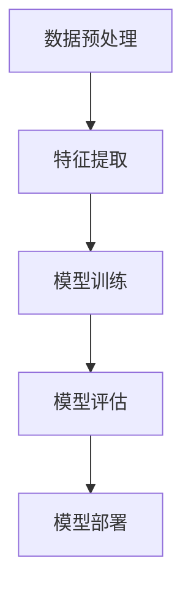
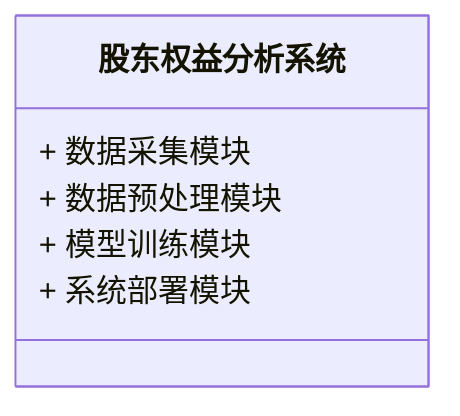

                 


# AI驱动的股东权益分析：深入理解公司治理

## 关键词：AI，股东权益分析，公司治理，机器学习，数据驱动决策

## 摘要：本文深入探讨了如何利用人工智能技术分析股东权益，以更好地理解公司治理结构。通过介绍核心概念、算法原理和系统设计，结合实际案例，展示了AI在股东权益分析中的应用和优势。文章还讨论了系统的实现细节，包括数据处理、模型训练和结果解读，为读者提供了全面的技术指导。

---

# 第一部分: 股东权益分析的背景与基础

## 第1章: 股东权益分析的核心概念

### 1.1 股东权益的基本概念

#### 1.1.1 股东权益的定义与组成部分
股东权益是公司所有者在公司中的权益，包括股本、资本公积、盈余公积、未分配利润等。这些部分共同构成了公司的净资产，反映了股东对公司的所有权和收益权。

#### 1.1.2 股东权益分析的重要性
股东权益分析对于评估公司的财务健康状况、投资价值以及治理结构至关重要。通过分析股东权益的变化，可以了解公司的盈利能力、资本运作效率以及股东的权益保障情况。

#### 1.1.3 股东权益与公司治理的关系
股东权益分析是公司治理的重要组成部分，它不仅影响股东的决策，还影响公司的长期战略和发展。有效的股东权益管理可以提升公司的透明度和信任度，优化公司治理结构。

### 1.2 问题背景与问题描述

#### 1.2.1 传统股东权益分析的局限性
传统的股东权益分析主要依赖财务报表和人工计算，存在效率低、主观性强、数据量有限等问题。这种方法难以应对大数据环境下的复杂分析需求，且容易受到人为因素的影响。

#### 1.2.2 AI驱动的股东权益分析的优势
人工智能技术的应用可以显著提升股东权益分析的效率和准确性。通过机器学习模型，可以自动提取和分析大量数据，发现隐藏的模式和趋势，提供更精准的分析结果。

#### 1.2.3 问题解决的思路与方法
AI驱动的股东权益分析通过构建机器学习模型，结合自然语言处理和大数据分析技术，实现对股东权益的实时监测和预测。这种方法能够快速处理大量数据，发现潜在风险，并为决策提供支持。

### 1.3 核心概念与边界

#### 1.3.1 核心概念的结构与组成
股东权益分析的核心概念包括数据来源、分析模型、结果解读三个主要部分。数据来源涉及财务报表、市场数据和新闻舆情；分析模型包括特征提取、模型训练和预测；结果解读则涉及风险评估和决策支持。

#### 1.3.2 核心概念的属性特征对比
| 属性 | 传统分析 | AI驱动分析 |
|------|----------|------------|
| 数据量 | 小       | 大         |
| 效率  | 低       | 高         |
| 准确性 | 中       | 高         |
| 灵活性 | 低       | 高         |

#### 1.3.3 边界与外延的定义
股东权益分析的边界在于公司内部的财务数据，而外延则扩展到市场环境、行业趋势和政策变化等外部因素。AI驱动的分析可以将内外部数据结合起来，提供更全面的分析结果。

### 1.4 本章小结
本章详细介绍了股东权益分析的核心概念，分析了传统方法的局限性和AI驱动方法的优势，为后续的分析奠定了基础。

---

# 第二部分: AI驱动的股东权益分析模型

## 第2章: 核心概念与原理

### 2.1 AI在股东权益分析中的应用

#### 2.1.1 AI技术的基本原理
人工智能通过机器学习、深度学习等技术，从大量数据中提取特征，建立预测模型，实现自动化分析。在股东权益分析中，AI可以用于预测股东权益的变化趋势，识别潜在风险。

#### 2.1.2 AI在股东权益分析中的具体应用
- 自动化数据处理：AI可以快速处理大量财务数据，提取关键指标。
- 风险预测：通过机器学习模型预测股东权益的变化，识别潜在风险。
- 实时监控：AI可以实时监控公司财务状况，提供及时的预警。

#### 2.1.3 AI驱动的股东权益分析的优势
- 高效性：AI能够快速处理大量数据，提高分析效率。
- 准确性：通过机器学习模型，可以发现数据中的潜在规律，提高分析准确性。
- 可扩展性：AI模型可以轻松扩展到更多的数据源和分析场景。

### 2.2 股东权益分析的数学模型

#### 2.2.1 股东权益的基本公式
股东权益（E）= 资产（A）- 负债（L）

#### 2.2.2 股东权益分析的数学模型
使用线性回归模型预测股东权益的变化：
$$ E_{t} = \beta_0 + \beta_1 E_{t-1} + \beta_2 R_{t} + \epsilon $$

其中，\( E_{t} \) 表示第t期的股东权益，\( E_{t-1} \) 表示第t-1期的股东权益，\( R_{t} \) 表示第t期的收益，\( \epsilon \) 表示误差项。

#### 2.2.3 模型的属性与特征
| 模型属性 | 线性回归模型 |
|----------|--------------|
| 适用场景 | 时间序列分析 |
| 优点     | 简单易懂，计算效率高 |
| 缺点     | 无法捕捉非线性关系 |

### 2.3 数据流与模型结构

#### 2.3.1 数据流的定义与作用
数据流是指从数据输入到模型处理再到结果输出的整个流程。在股东权益分析中，数据流包括数据采集、预处理、特征提取、模型训练和结果输出。

#### 2.3.2 模型结构的定义与作用
模型结构决定了数据如何在模型中流动和处理。在AI驱动的分析中，模型结构通常包括特征提取层、预测层和结果输出层。

#### 2.3.3 数据流与模型结构的关系
数据流驱动模型结构，模型结构处理数据流，两者相互依赖，共同完成股东权益分析的任务。

### 2.4 本章小结
本章详细介绍了AI在股东权益分析中的应用，分析了数学模型的构建和数据流的处理过程，为后续的系统设计奠定了基础。

---

# 第三部分: 算法原理与实现

## 第3章: 算法原理

### 3.1 算法原理概述

#### 3.1.1 算法的基本原理
机器学习算法通过训练数据，建立预测模型，实现对股东权益的预测和分析。常用的算法包括线性回归、随机森林和神经网络等。

#### 3.1.2 算法的核心思想
机器学习算法的核心思想是通过数据训练，找到数据中的规律，建立预测模型。在股东权益分析中，常用监督学习算法。

#### 3.1.3 算法的实现步骤
1. 数据预处理：清洗数据，处理缺失值和异常值。
2. 特征提取：从数据中提取有用的特征，如财务指标和市场指标。
3. 模型训练：使用训练数据训练模型，调整模型参数。
4. 模型评估：使用测试数据评估模型的性能，调整模型参数。
5. 模型部署：将模型部署到实际应用中，进行实时分析。

### 3.2 算法流程图



### 3.3 算法实现的数学模型

#### 3.3.1 算法实现的数学模型
使用随机森林算法进行股东权益预测：
$$ y = \sum_{i=1}^{n} \text{Tree}(x_i) $$

其中，\( y \) 表示预测的股东权益，\( x_i \) 表示输入特征，\( n \) 表示决策树的数量。

#### 3.3.2 算法实现的数学公式
随机森林算法的预测公式为：
$$ y = \frac{1}{n} \sum_{i=1}^{n} \text{Tree}(x) $$

#### 3.3.3 算法实现的数学推导
随机森林算法通过集成多个决策树，减少过拟合的风险，提高模型的泛化能力。

### 3.4 本章小结
本章详细介绍了AI驱动的股东权益分析算法的原理和实现过程，包括数据预处理、特征提取、模型训练和评估等内容。

---

# 第四部分: 系统分析与架构设计

## 第4章: 系统分析

### 4.1 问题场景介绍

#### 4.1.1 问题场景的定义
股东权益分析系统需要实时监控公司的财务状况，预测股东权益的变化趋势，提供风险预警。

#### 4.1.2 问题场景的分析
系统需要处理大量的财务数据和市场数据，要求高效的计算能力和实时的分析能力。

### 4.2 项目介绍

#### 4.2.1 项目的目标与范围
项目目标：构建一个AI驱动的股东权益分析系统，实现对股东权益的实时监测和预测。
项目范围：包括数据采集、模型训练、系统部署和结果展示。

#### 4.2.2 项目的实施步骤
1. 数据采集：收集公司财务数据和市场数据。
2. 数据预处理：清洗数据，处理缺失值和异常值。
3. 模型训练：训练机器学习模型，进行预测和评估。
4. 系统部署：将模型部署到实际应用中，进行实时分析。
5. 系统测试：测试系统的性能和稳定性，进行优化。

### 4.3 系统功能设计

#### 4.3.1 领域模型类图



#### 4.3.2 系统架构图


### 4.4 系统接口设计

#### 4.4.1 接口描述
系统接口包括数据输入接口、模型训练接口和结果输出接口。数据输入接口接收财务数据和市场数据，模型训练接口训练机器学习模型，结果输出接口输出预测结果和风险预警。

#### 4.4.2 接口交互流程图


### 4.5 本章小结
本章详细介绍了股东权益分析系统的功能设计和架构设计，包括系统模块、接口设计和交互流程。

---

# 第五部分: 项目实战

## 第5章: 项目实战

### 5.1 环境安装

#### 5.1.1 环境配置
需要安装Python、Pandas、NumPy、Scikit-learn和Jupyter Notebook等工具。

#### 5.1.2 数据获取
可以从公开的财务数据源获取数据，如Yahoo Finance或Google Finance。

### 5.2 系统核心实现源代码

#### 5.2.1 数据预处理代码

```python
import pandas as pd
import numpy as np

# 读取数据
df = pd.read_csv('financial_data.csv')

# 处理缺失值
df = df.dropna()

# 标准化处理
from sklearn.preprocessing import StandardScaler
scaler = StandardScaler()
df_scaled = scaler.fit_transform(df)
```

#### 5.2.2 模型训练代码

```python
from sklearn.ensemble import RandomForestRegressor
from sklearn.model_selection import train_test_split

# 划分数据集
X = df_scaled[:, 1:]
y = df_scaled[:, 0]

X_train, X_test, y_train, y_test = train_test_split(X, y, test_size=0.2, random_state=42)

# 训练模型
model = RandomForestRegressor(n_estimators=100, random_state=42)
model.fit(X_train, y_train)

# 预测结果
y_pred = model.predict(X_test)
```

#### 5.2.3 结果分析

```python
from sklearn.metrics import mean_squared_error

mse = mean_squared_error(y_test, y_pred)
print(f'Mean Squared Error: {mse}')
```

### 5.3 本章小结
本章通过具体的代码示例，展示了AI驱动的股东权益分析系统的实现过程，包括数据预处理、模型训练和结果分析。

---

# 第六部分: 总结与展望

## 第6章: 总结与展望

### 6.1 本章小结
本文详细介绍了AI驱动的股东权益分析系统的构建过程，包括核心概念、算法原理、系统设计和项目实战。通过这些内容，读者可以全面了解如何利用人工智能技术进行股东权益分析。

### 6.2 未来展望
未来，随着AI技术的不断发展，股东权益分析将更加智能化和自动化。可以进一步研究更复杂的模型，如深度学习模型，以提高分析的准确性和效率。同时，结合自然语言处理技术，可以从非结构化数据中提取更多的信息，提升分析的深度和广度。

### 6.3 最佳实践 tips
- 数据预处理是关键，确保数据的准确性和完整性。
- 选择合适的模型，根据数据特征和分析目标进行选择。
- 模型调优和评估是提高模型性能的重要步骤。

### 6.4 本章小结
本章总结了全文的主要内容，并展望了未来的研究方向，为读者提供了进一步的学习和研究方向。

---

通过以上内容，读者可以系统地了解AI驱动的股东权益分析的理论和实践，掌握如何利用人工智能技术进行公司治理分析，提升企业的决策能力和竞争力。

