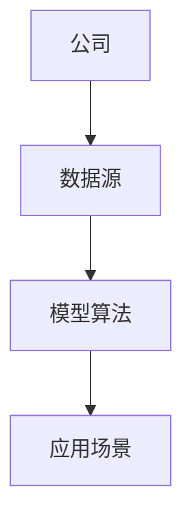
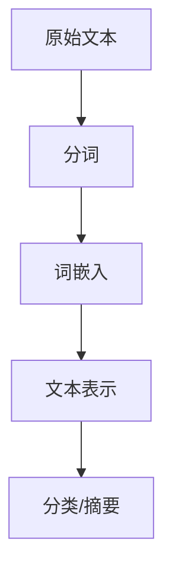
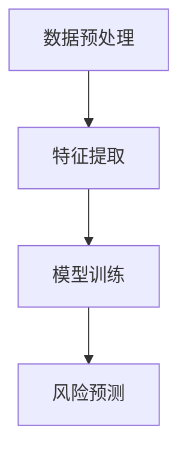
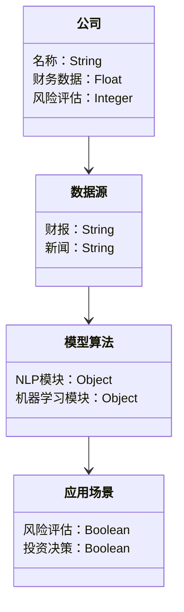
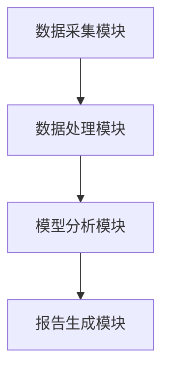

                 


# AI驱动的自动化公司尽职调查

## 关键词：
- AI驱动、公司尽职调查、自动化、自然语言处理、机器学习、数据分析

## 摘要：
本文探讨了如何利用人工智能技术实现公司尽职调查的自动化。通过分析AI在文档处理、风险评估和决策支持中的应用，展示了如何提高尽职调查的效率和准确性。文章详细讲解了核心概念、算法原理、系统架构，并通过实际案例展示了AI驱动尽职调查的优势，为读者提供了全面的技术视角。

---

# 第一部分：AI驱动的公司尽职调查背景与概念

## 第1章：公司尽职调查概述

### 1.1 公司尽职调查的基本概念
- **定义**：公司尽职调查是指在商业交易（如并购、投资）前，对目标公司进行全面的调查，以评估其财务状况、法律风险和经营状况。
- **目的**：识别潜在风险，确保交易的合法性和合理性，为决策提供依据。
- **流程**：信息收集、数据分析、风险评估、报告撰写。

### 1.2 AI驱动的背景与意义
- **传统尽职调查的局限性**：数据量大、耗时长、成本高、依赖人工判断。
- **AI的优势**：自动化处理、高效分析、提高准确性。
- **价值**：节省时间、降低成本、提升决策质量。

### 1.3 AI驱动尽职调查的技术趋势
- **NLP的应用**：用于分析文本数据，提取关键信息。
- **机器学习的应用**：用于风险预测和评估。
- **大数据分析**：整合多源数据，提供全面视角。

## 第2章：AI驱动的公司尽职调查核心概念

### 2.1 核心概念与定义
- **数据源**：包括公司财报、法律文件、新闻报道等。
- **模型算法**：如NLP、机器学习模型、知识图谱构建。
- **应用场景**：风险评估、价值评估、投资决策支持。

### 2.2 核心概念之间的关系
- **数据源与模型算法**：数据源为模型提供输入，模型分析数据以生成结果。
- **模型算法与应用场景**：模型输出用于特定场景，如投资决策。
- **数据质量对模型性能的影响**：高质量数据提升模型准确性。

### 2.3 核心概念的属性对比
| 概念 | 属性 | 描述 |
|------|------|------|
| 数据源 | 类型 | 文本、结构化数据 |
| 模型算法 | 类型 | NLP、机器学习 |
| 应用场景 | 类型 | 风险评估、投资决策 |

### 2.4 实体关系图


---

# 第二部分：AI驱动的公司尽职调查算法原理

## 第3章：自然语言处理（NLP）在文档分析中的应用

### 3.1 NLP的基本原理
- **词嵌入**：将词语转换为向量表示，如Word2Vec。
- **文本分类**：对文本进行主题或情感分类。
- **文本摘要**：提取关键信息。

### 3.2 使用Mermaid图展示NLP流程


### 3.3 Python代码实现
```python
import spacy
nlp = spacy.load("en_core_web_sm")
doc = nlp("This is a sample text for NLP processing.")
for token in doc:
    print(token.text, token.pos_)
```

## 第4章：机器学习在风险评估中的应用

### 4.1 机器学习模型
- **逻辑回归**：用于分类问题。
- **随机森林**：用于特征重要性分析。
- **深度学习模型**：如LSTM用于时间序列分析。

### 4.2 使用Mermaid图展示机器学习流程


### 4.3 数学模型
- **逻辑回归公式**：$$P(y=1|x) = \frac{1}{1 + e^{-\beta x}}$$

---

# 第三部分：AI驱动的公司尽职调查系统架构

## 第5章：系统功能设计

### 5.1 领域模型


### 5.2 系统架构


---

# 第四部分：项目实战

## 第6章：案例分析与代码实现

### 6.1 环境安装
- Python 3.8+
- Spacy、Scikit-learn、Tensorflow

### 6.2 核心代码实现
```python
from sklearn.feature_extraction.text import TfidfVectorizer
from sklearn.linear_model import LogisticRegression

# 数据预处理
vectorizer = TfidfVectorizer()
X = vectorizer.fit_transform(documents)
y = [0, 1]  # 标签

# 模型训练
model = LogisticRegression()
model.fit(X, y)

# 预测
new_doc = ["Positive sentiment text."]
new_X = vectorizer.transform([new_doc])
print(model.predict(new_X))
```

### 6.3 案例分析
- **数据源**：某科技公司财报和新闻。
- **模型分析**：识别财务风险，预测投资回报。

### 6.4 代码解读
- 使用TF-IDF提取特征，训练逻辑回归模型，用于分类任务。

---

# 第五部分：最佳实践与总结

## 第7章：总结与展望

### 7.1 最佳实践
- **数据质量**：确保数据准确、完整。
- **模型选择**：根据任务选择合适算法。
- **隐私保护**：遵守数据隐私法规。

### 7.2 注意事项
- 定期更新模型，适应市场变化。
- 结合人工审核，提高准确性。

### 7.3 拓展阅读
- 推荐书籍和论文，深入学习AI和数据分析技术。

---

通过以上结构，文章详细讲解了AI驱动的公司尽职调查的背景、核心概念、算法原理、系统架构和项目实战，为读者提供了全面的技术视角和实践指南。

