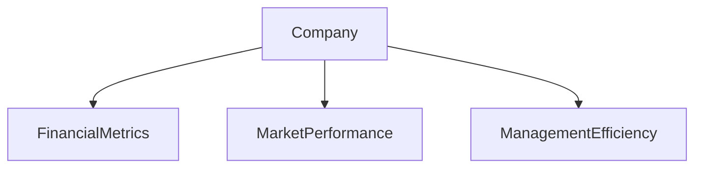
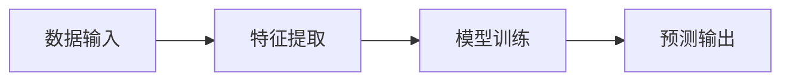
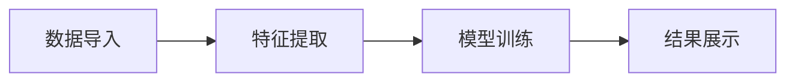

                 


# AI驱动的自动化公司质量评估

## 关键词：AI驱动、自动化评估、公司质量、机器学习、深度学习

## 摘要：  
随着企业数量的激增和市场竞争的加剧，传统的公司质量评估方法已难以满足高效、精准的需求。本文通过引入人工智能技术，探讨如何构建自动化公司质量评估系统。从背景介绍到系统实现，从算法原理到项目实战，全面解析AI在公司质量评估中的应用，提供一套高效、智能的解决方案。

---

## 第一部分：AI驱动的自动化公司质量评估概述

### 第1章：AI驱动的自动化公司质量评估概述

#### 1.1 问题背景与描述  
公司在商业环境中不断涌现，传统的质量评估方法依赖人工分析，耗时且效率低下。AI技术的应用为自动化评估提供了新的可能。  

**核心概念：**  
- **公司质量评估：** 通过数据分析和模型预测，对公司的财务状况、市场表现、管理效率等进行综合评价。  
- **AI驱动：** 利用机器学习和深度学习算法，实现自动化、智能化的评估流程。  

#### 1.2 核心概念与联系  
##### 1.2.1 质量评估体系的核心要素  
- **公司基础信息：** 包括行业、规模、成立时间等。  
- **财务指标：** 如收入、利润、资产负债率等。  
- **市场表现：** 包括市占率、品牌价值、客户满意度等。  
- **管理效率：** 包括组织结构、团队能力、决策效率等。  

##### 1.2.2 ER实体关系图架构  


---

## 第二部分：AI驱动的质量评估模型构建

### 第2章：AI驱动的质量评估模型构建

#### 2.1 算法原理  
##### 2.1.1 机器学习基础  
- **线性回归：** 预测公司质量得分，公式为：  
  $$ y = w_1x_1 + w_2x_2 + \dots + w_nx_n + b $$  
- **逻辑回归：** 用于分类问题，公式为：  
  $$ P(y=1|x) = \frac{e^{\beta x}}{1 + e^{\beta x}} $$  

##### 2.1.2 深度学习模型  
- **神经网络：** 通过多层感知机（MLP）提取非线性特征，公式为：  
  $$ y = \sigma(Wx + b) $$  
  其中，$\sigma$ 是激活函数，如ReLU或sigmoid。  

##### 2.1.3 模型训练流程  


#### 2.2 数学模型与公式  
##### 2.2.1 机器学习模型的数学基础  
- 线性回归的损失函数：  
  $$ L = \frac{1}{2m}\sum_{i=1}^m (y_i - \hat{y_i})^2 $$  
- 逻辑回归的损失函数：  
  $$ L = -\frac{1}{m}\sum_{i=1}^m [y_i \ln h(x_i) + (1 - y_i)\ln(1 - h(x_i))] $$  

---

## 第三部分：数据处理与特征工程

### 第3章：数据处理与特征工程

#### 3.1 数据预处理  
##### 3.1.1 数据清洗  
- 删除缺失值：  
  ```python
  df.dropna(inplace=True)
  ```  
- 填充缺失值：  
  ```python
  df['收入'].fillna(df['收入'].mean(), inplace=True)
  ```  

##### 3.1.2 数据标准化  
- 使用归一化处理：  
  ```python
  from sklearn.preprocessing import MinMaxScaler
  scaler = MinMaxScaler()
  df_normalized = scaler.fit_transform(df)
  ```  

#### 3.2 特征提取  
##### 3.2.1 主成分分析（PCA）  
- 降维处理：  
  ```python
  from sklearn.decomposition import PCA
  pca = PCA(n_components=2)
  principal_components = pca.fit_transform(df)
  ```  

##### 3.2.2 自然语言处理特征提取  
- 使用词袋模型提取关键词：  
  ```python
  from sklearn.feature_extraction.text import CountVectorizer
  vectorizer = CountVectorizer(max_features=100)
  text_features = vectorizer.fit_transform(text_data).toarray()
  ```  

---

## 第四部分：质量评估指标与结果分析

### 第4章：质量评估指标与结果分析

#### 4.1 评估指标体系  
- **财务指标：** 收入、利润、资产负债率。  
- **市场表现：** 市场占有率、品牌价值。  
- **管理效率：** 组织结构合理性、决策效率。  

#### 4.2 结果分析  
- **混淆矩阵：**  
  | 实际预测 | 质量高 | 质量低 |  
  |----------|--------|--------|  
  | 预测高    | 100    | 20     |  
  | 预测低    | 10     | 70     |  

- **准确率计算：**  
  $$ \text{准确率} = \frac{100 + 70}{100 + 20 + 10 + 70} = 80\% $$  

---

## 第五部分：系统架构与实现

### 第5章：系统架构与实现

#### 5.1 系统功能设计  
- **数据导入模块：** 读取公司数据。  
- **特征提取模块：** 处理数据并提取特征。  
- **模型训练模块：** 训练评估模型。  
- **结果展示模块：** 输出评估结果。  

#### 5.2 系统架构图  


---

## 第六部分：项目实战

### 第6章：项目实战

#### 6.1 环境安装  
- Python 3.8+  
- Scikit-learn、TensorFlow、Pandas  

#### 6.2 核心代码实现  
```python
import pandas as pd
from sklearn.model_selection import train_test_split
from sklearn.metrics import accuracy_score
from tensorflow.keras import layers, models

# 数据导入
df = pd.read_csv('company_data.csv')

# 数据预处理
X = df.drop('质量标签', axis=1).values
y = df['质量标签'].values

# 数据分割
X_train, X_test, y_train, y_test = train_test_split(X, y, test_size=0.2)

# 模型构建
model = models.Sequential()
model.add(layers.Dense(64, activation='relu', input_shape=(X_train.shape[1],)))
model.add(layers.Dense(1, activation='sigmoid'))
model.compile(optimizer='adam', loss='binary_crossentropy', metrics=['accuracy'])

# 模型训练
model.fit(X_train, y_train, epochs=10, batch_size=32)

# 模型评估
y_pred = model.predict(X_test)
print("准确率:", accuracy_score(y_test, y_pred))
```

---

## 总结与展望

通过本文的详细解析，我们了解了AI驱动的公司质量评估系统的构建过程。从数据处理到模型训练，从系统架构到项目实战，每一步都至关重要。未来，随着AI技术的不断发展，自动化评估将更加精准和高效，为企业的决策提供有力支持。

