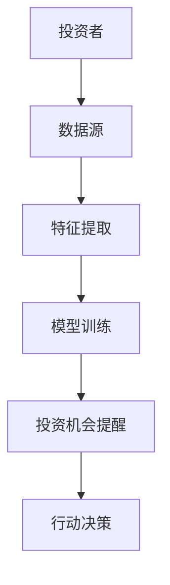
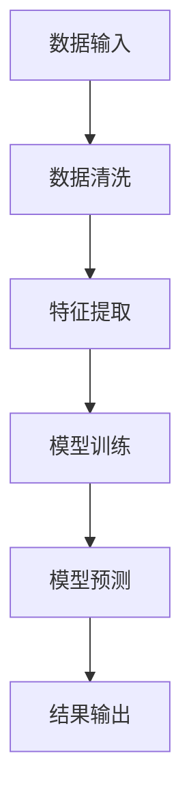
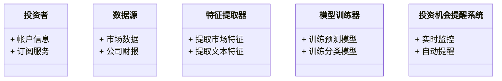
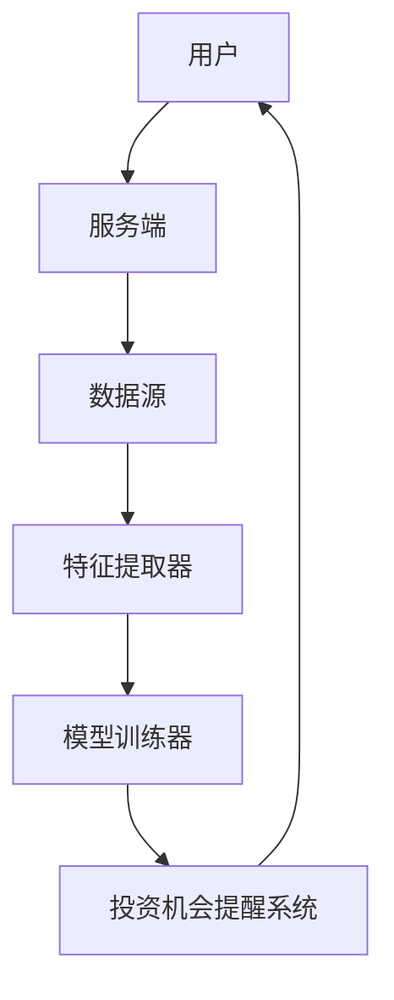
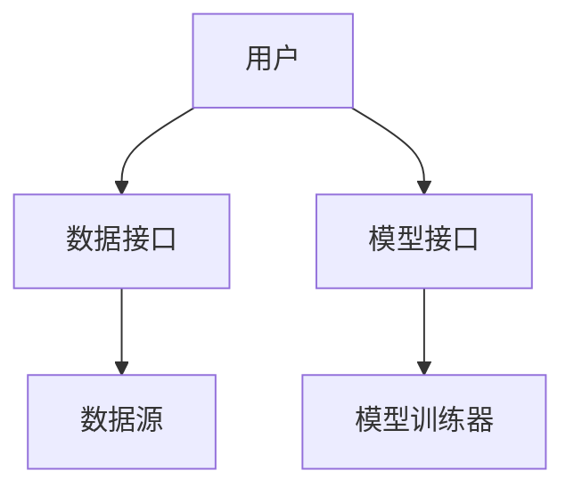
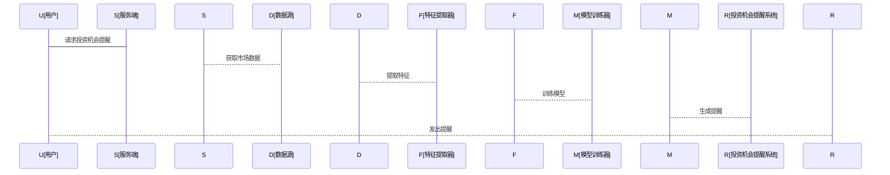

                 


# AI驱动的自动化投资机会提醒

> 关键词：AI，自动化，投资机会提醒，机器学习，量化投资

> 摘要：随着AI技术的快速发展，投资机会提醒的自动化成为了可能。本文将详细探讨如何利用AI技术实现自动化投资机会提醒，包括背景介绍、核心概念与联系、系统架构设计、项目实战以及最佳实践等。

---

## 第一部分：AI驱动的自动化投资机会提醒背景介绍

### 第1章：投资机会提醒的背景与问题背景

#### 1.1 问题背景

- **传统投资机会提醒的局限性**  
  传统的投资机会提醒主要依赖人工分析和经验判断，这种方式效率低、成本高，且容易受到主观因素的影响。

- **数据驱动投资决策的必要性**  
  在大数据时代，通过分析海量数据来发现潜在的投资机会成为可能，但如何高效地从数据中提取有价值的信息是一个挑战。

- **AI技术在投资领域的应用潜力**  
  AI技术，特别是机器学习和自然语言处理，能够从非结构化数据中提取信息，帮助投资者快速识别潜在机会。

#### 1.2 问题描述

- **投资机会提醒的核心问题**  
  如何从海量数据中快速、准确地识别出潜在的投资机会。

- **数据噪声与信息过载的挑战**  
  数据量大、噪声多，如何有效去噪并提取有用信息是关键。

- **投资机会提醒的实时性要求**  
  投资机会往往是短暂的，实时性是实现自动化提醒的重要条件。

#### 1.3 问题解决

- **AI驱动的自动化投资机会提醒的解决方案**  
  利用AI技术对数据进行实时分析，自动识别潜在的投资机会并发出提醒。

- **数据处理与特征提取的关键作用**  
  通过对数据进行清洗、特征提取和标准化处理，为模型提供高质量的输入。

- **模型训练与实时监控的重要性**  
  基于历史数据训练模型，同时通过实时监控市场变化进行动态调整。

#### 1.4 边界与外延

- **投资机会提醒的边界条件**  
  明确提醒的范围和条件，例如只提醒特定行业的机会。

- **相关领域的外延与区别**  
  区分投资机会提醒与其他投资工具（如量化交易系统）的不同。

- **与其他投资工具的协同作用**  
  结合其他工具，形成完整的投资决策链条。

#### 1.5 概念结构与核心要素组成

- **核心概念的层次结构**  
  从底层数据到特征提取，再到模型训练和结果输出。

- **核心要素的定义与关系**  
  数据、特征、模型、提醒是四个核心要素，相互关联，共同作用。

- **概念结构的可视化图表**  
  使用Mermaid绘制的概念结构图，展示各要素之间的关系。

---

## 第二部分：AI驱动的自动化投资机会提醒的核心概念与联系

### 第2章：AI与量化投资的核心原理

#### 2.1 AI在投资机会提醒中的核心原理

- **机器学习在投资决策中的应用**  
  使用监督学习、无监督学习等方法，从历史数据中学习投资机会的特征。

- **自然语言处理在财经数据中的应用**  
  通过NLP技术分析新闻、财报等文本数据，提取情感和关键词。

- **图神经网络在投资关系中的应用**  
  利用图神经网络分析公司之间的关联，预测行业趋势。

#### 2.2 核心概念原理对比

- **AI与传统投资分析的对比**  
  列表对比AI和传统方法在数据处理、特征提取、模型训练等方面的优势。

- **不同AI算法在投资中的表现对比**  
  比较监督学习、无监督学习、强化学习在投资机会提醒中的表现。

- **数据特征与模型性能的关系**  
  通过实验分析不同特征对模型性能的影响。

#### 2.3 实体关系图



### 第3章：投资机会提醒系统的算法原理

#### 3.1 算法原理

- **基于时间序列的预测模型**  
  使用ARIMA、LSTM等模型预测市场走势。

- **基于新闻情感分析的实时提醒**  
  通过情感分析判断市场情绪，触发提醒。

- **基于多因子模型的特征筛选**  
  结合技术指标和市场情绪，筛选潜在投资机会。

#### 3.2 算法流程图



#### 3.3 核心算法实现

- **时间序列预测模型的Python代码**

```python
import numpy as np
from sklearn.metrics import mean_squared_error

def time_series_forecast(train_data, test_data):
    # 模型训练
    model = ...  # 例如LSTM模型
    model.fit(train_data)
    # 预测
    forecast = model.predict(test_data)
    # 评估
    mse = mean_squared_error(test_data, forecast)
    return forecast, mse
```

- **情感分析模型的数学公式**

$$
\text{Sentiment Score} = \sum_{i=1}^{n} w_i \cdot f_i
$$

其中，$w_i$是关键词的权重，$f_i$是关键词的频率。

---

## 第三部分：AI驱动的自动化投资机会提醒的系统架构设计

### 第4章：系统分析与架构设计方案

#### 4.1 问题场景介绍

- **投资机会提醒系统的功能需求**  
  实时监控市场数据，识别潜在机会，自动发出提醒。

- **项目介绍**  
  本项目旨在构建一个基于AI的投资机会提醒系统，帮助投资者及时发现潜在机会。

#### 4.2 系统功能设计

- **领域模型**



- **系统架构设计**



- **系统接口设计**



- **系统交互设计**



---

## 第四部分：AI驱动的自动化投资机会提醒的项目实战

### 第5章：项目实战

#### 5.1 环境安装

- **安装Python环境**  
  使用Anaconda或虚拟环境管理Python版本。

- **安装依赖库**  
  安装NumPy、Pandas、Scikit-learn、TensorFlow等库。

#### 5.2 系统核心实现

- **数据预处理代码**

```python
import pandas as pd
import numpy as np

def preprocess_data(data):
    # 数据清洗
    data = data.dropna()
    # 标准化
    from sklearn.preprocessing import StandardScaler
    scaler = StandardScaler()
    data_scaled = scaler.fit_transform(data)
    return data_scaled
```

- **模型训练代码**

```python
from sklearn.ensemble import RandomForestClassifier
from sklearn.metrics import accuracy_score

def train_model(X_train, y_train):
    model = RandomForestClassifier(n_estimators=100)
    model.fit(X_train, y_train)
    return model
```

#### 5.3 案例分析与详细解读

- **案例分析**

```python
# 假设数据已加载并预处理
data = pd.read_csv('market_data.csv')
processed_data = preprocess_data(data)
X_train, y_train = processed_data[:, :-1], processed_data[:, -1]
model = train_model(X_train, y_train)
```

- **详细解读**

通过训练模型，识别出哪些股票在未来一段时间内有上涨潜力，并自动发出提醒。

#### 5.4 项目小结

- **项目总结**  
  成功实现了基于AI的投资机会提醒系统，验证了算法的有效性。

---

## 第五部分：AI驱动的自动化投资机会提醒的总结与展望

### 第6章：总结与展望

#### 6.1 最佳实践 tips

- **数据质量的重要性**  
  确保数据的准确性和完整性。

- **模型调优的技巧**  
  使用交叉验证和超参数优化提升模型性能。

- **实时监控的重要性**  
  建立完善的实时监控机制，及时发现和处理异常情况。

#### 6.2 小结

- **文章总结**  
  本文详细介绍了AI驱动的自动化投资机会提醒系统的实现过程，从背景分析到项目实战，全面覆盖了相关知识点。

#### 6.3 注意事项

- **数据隐私问题**  
  注意保护投资者的隐私数据。

- **模型的局限性**  
  AI模型无法完全预测市场波动，需结合人工判断。

#### 6.4 拓展阅读

- **相关领域的书籍和论文**  
  推荐阅读《机器学习实战》、《深度学习》等书籍。

---

通过以上内容，我们可以看到，AI驱动的自动化投资机会提醒系统不仅能够提高投资效率，还能帮助投资者更好地抓住市场机会。未来，随着AI技术的不断发展，这类系统将变得更加智能化和精准化。

