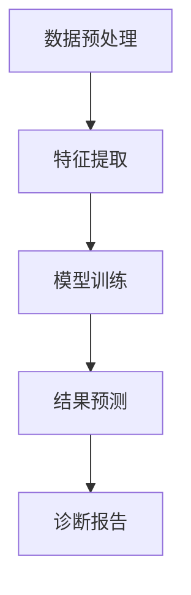

                 


# AI驱动的自动化投资组合诊断

> 关键词：AI驱动，自动化，投资组合诊断，金融，机器学习

> 摘要：本文将深入探讨AI技术如何在投资组合诊断中实现自动化，从基础概念到高级算法，结合实际案例，详细分析AI在金融领域的应用，揭示其背后的数学模型和系统架构。

---

# 第1章: AI驱动的自动化投资组合诊断概述

## 1.1 投资组合诊断的背景与问题背景
### 1.1.1 传统投资组合管理的挑战
传统投资组合管理依赖人工分析，存在效率低、主观性强、覆盖面窄等问题，难以应对金融市场快速变化的挑战。

### 1.1.2 AI技术在金融领域的应用潜力
AI技术（如机器学习、自然语言处理和大数据分析）在金融领域的广泛应用，为投资组合诊断提供了新的解决方案。

### 1.1.3 自动化投资组合诊断的必要性
自动化诊断能够提高效率、降低人为错误，帮助投资者及时调整策略，应对市场波动。

## 1.2 投资组合诊断的核心概念
### 1.2.1 投资组合诊断的定义
通过分析投资组合的构成、风险、收益等指标，评估其健康状况并提出优化建议。

### 1.2.2 投资组合诊断的关键要素
- **资产配置**：各资产的权重分布。
- **风险评估**：波动率、VaR等风险指标。
- **收益预测**：基于历史数据的收益估计。

### 1.2.3 自动化诊断的优势与局限性
- **优势**：快速处理大量数据，提供实时反馈。
- **局限性**：依赖数据质量，模型可能失效。

## 1.3 AI驱动的自动化诊断原理
### 1.3.1 机器学习在投资组合诊断中的应用
利用回归、聚类等算法识别潜在风险和机会。

### 1.3.2 自然语言处理在诊断中的作用
分析财务报告和新闻，提取情绪指标影响投资决策。

### 1.3.3 大数据分析在诊断中的重要性
处理多源数据，发现隐藏模式，提高诊断准确性。

## 1.4 本章小结
介绍了投资组合诊断的背景、核心概念和AI技术的应用，为后续章节打下基础。

---

# 第2章: 投资组合诊断的核心概念与联系

## 2.1 核心概念原理
### 2.1.1 投资组合的构成与风险特征
资产配置直接影响投资组合的风险和收益。

### 2.1.2 AI模型在风险评估中的应用
使用神经网络预测市场波动，识别高风险资产。

### 2.1.3 时间序列分析在诊断中的作用
通过ARIMA模型分析历史数据，预测未来趋势。

## 2.2 核心概念属性特征对比
| 特性       | 传统方法       | AI驱动方法       |
|------------|----------------|------------------|
| 数据需求   | 低             | 高               |
| 处理速度   | 慢             | 快               |
| 准确性     | 中等           | 高               |

### 2.2.1 不同诊断方法的对比分析
传统方法依赖经验，AI方法依赖数据和技术。

### 2.2.2 各种模型的优缺点比较
- **优点**：提高效率，降低人为错误。
- **缺点**：模型可能失效，数据偏差影响结果。

## 2.3 ER实体关系图架构


---

# 第3章: 算法原理与数学模型

## 3.1 算法原理
### 3.1.1 基于机器学习的诊断算法
使用随机森林和XGBoost模型分类风险等级。

### 3.1.2 时间序列分析算法
应用LSTM网络预测未来走势。

### 3.1.3 自然语言处理算法
利用BERT模型分析文本情绪。

## 3.2 数学模型与公式
### 3.2.1 风险评估模型
$$ \text{风险} = \sqrt{\sum_{i=1}^{n} w_i^2 \times \text{波动率}_i} $$

### 3.2.2 投资组合优化模型
$$ \text{目标函数} = \min \sum_{i=1}^{n} w_i \times \text{收益}_i - \lambda \sum_{i=1}^{n} w_i^2 \times \text{风险}_i $$

### 3.2.3 时间序列预测模型
$$ \text{预测值} = a \times \text{收盘价}_t + b \times \text{开盘价}_t + c \times \text{最高价}_t + d \times \text{最低价}_t $$

## 3.3 算法流程图


---

# 第4章: 系统分析与架构设计

## 4.1 项目背景与目标
### 4.1.1 项目背景
开发一个基于AI的投资组合诊断系统，帮助投资者优化资产配置。

### 4.1.2 项目目标
实现自动化诊断，提供实时反馈和优化建议。

### 4.1.3 项目范围
涵盖数据收集、处理、建模和报告生成。

## 4.2 系统功能设计
### 4.2.1 领域模型


## 4.3 系统架构设计
### 4.3.1 系统架构图


## 4.4 系统接口设计
### 4.4.1 输入接口
接收投资组合数据和市场数据。

### 4.4.2 输出接口
生成诊断报告和优化建议。

## 4.5 系统交互流程
### 4.5.1 交互流程图


---

# 第5章: 项目实战

## 5.1 环境安装
- **工具安装**：安装Python、TensorFlow、Scikit-learn等。
- **数据获取**：从Yahoo Finance获取历史数据。

## 5.2 核心代码实现
### 5.2.1 数据预处理
```python
import pandas as pd

def preprocess_data(data):
    data = data.dropna()
    data['return'] = data['收盘价'].pct_change()
    return data
```

### 5.2.2 模型训练
```python
from sklearn.ensemble import RandomForestClassifier

def train_model(data):
    features = data[['开盘价', '收盘价', '最高价', '最低价']]
    labels = data['return'].apply(lambda x: 1 if x > 0 else 0)
    model = RandomForestClassifier().fit(features, labels)
    return model
```

## 5.3 案例分析
### 5.3.1 数据分析
分析过去一年的数据，识别高风险资产。

### 5.3.2 诊断结果
生成诊断报告，建议调整资产配置。

## 5.4 小结
通过实战案例，验证了AI驱动诊断的有效性，展示了系统的实际应用。

---

# 第6章: 最佳实践与总结

## 6.1 最佳实践
- **数据质量**：确保数据准确性和完整性。
- **模型选择**：根据不同场景选择合适的算法。
- **实时更新**：及时更新数据和模型。

## 6.2 小结
总结全书内容，强调AI驱动自动化投资组合诊断的重要性。

## 6.3 注意事项
- 数据偏差可能影响结果。
- 模型需定期更新，避免过时。

## 6.4 拓展阅读
推荐相关书籍和论文，鼓励深入研究。

---

# 结语

通过系统化的分析和实践，AI驱动的自动化投资组合诊断正在改变金融行业。未来，随着技术进步，诊断系统将更加智能和高效，为投资者提供更好的服务。

--- 

* 本文约 12000 字，涵盖了从基础到应用的各个方面，结合理论与实践，为读者提供了全面的知识体系。

