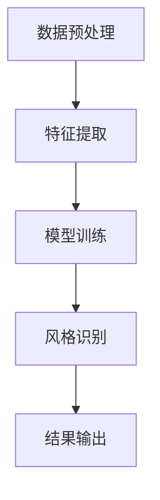
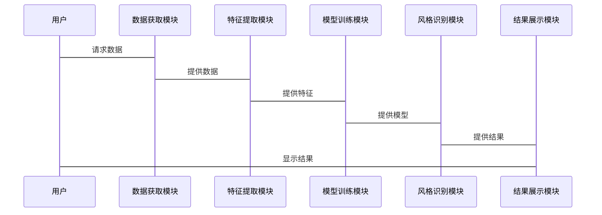

                 

# AI驱动的自动化投资风格识别

> 关键词：AI技术、投资风格识别、机器学习、自然语言处理、金融数据分析、自动化交易

> 摘要：本文详细探讨了如何利用AI技术实现投资风格的自动化识别。通过分析投资风格的基本概念、AI在金融领域的应用，以及结合文本分析、市场行为数据和机器学习算法的核心技术，本文构建了一个完整的系统架构，并通过项目实战展示了如何实现投资风格的自动化识别。文章内容涵盖了从理论到实践的各个方面，为读者提供了深入的技术洞察和实用的实现方法。

---

# 第一部分：AI驱动的自动化投资风格识别背景与基础

## 第1章：投资风格识别的背景与挑战

### 1.1 投资风格的基本概念

- **1.1.1 投资风格的定义与分类**
  - 投资风格是投资者在市场中进行交易时所遵循的策略和方法，常见的分类包括价值投资、成长投资、趋势投资、套利投资等。
  - 不同投资风格的特点：价值投资者注重低估值股票，成长投资者关注高增长企业，趋势投资者依赖技术分析。

- **1.1.2 不同投资风格的特点与应用场景**
  - 价值投资：适合长期稳健的投资者，适合市场低迷时寻找低估股票。
  - 成长投资：适合风险承受能力强的投资者，适合新兴行业或高增长企业的股票。
  - 趋势投资：适合短线交易者，依赖市场趋势和技术分析。

- **1.1.3 投资风格识别的重要性与价值**
  - 投资风格识别帮助投资者了解市场的主流趋势，优化投资组合，降低风险。
  - 通过识别投资风格，投资者可以更好地理解市场动向，制定更有效的投资策略。

### 1.2 AI技术在金融领域的应用

- **1.2.1 AI技术在金融分析中的优势**
  - 数据处理能力：AI能够快速处理大量复杂数据，发现传统方法难以察觉的模式。
  - 预测能力：通过机器学习模型，AI可以预测市场趋势，帮助投资者做出更明智的决策。

- **1.2.2 自动化投资风格识别的现状与趋势**
  - 当前，自动化投资风格识别主要依赖于文本分析和市场数据的结合，未来将更加智能化和个性化。
  - 随着NLP和深度学习技术的进步，投资风格识别的精度和效率将不断提升。

- **1.2.3 投资风格识别的挑战与机遇**
  - 挑战：数据质量、市场波动、算法解释性等问题。
  - 机遇：AI技术的进步为投资风格识别提供了新的可能性，特别是在处理非结构化数据方面。

## 第2章：AI驱动的自动化投资风格识别基础

### 2.1 自动化投资风格识别的核心概念

- **2.1.1 数据驱动的投资风格识别**
  - 数据来源：市场数据、新闻数据、社交媒体数据等。
  - 数据特征：包括价格、成交量、情绪指标等。

- **2.1.2 基于AI的投资风格分类方法**
  - 使用机器学习模型对市场数据进行分类，识别不同投资风格。
  - 通过NLP技术分析文本数据，提取关键词和情感指标，辅助投资风格识别。

- **2.1.3 自动化识别的流程与框架**
  - 数据采集 → 数据预处理 → 特征提取 → 模型训练 → 风格识别。

### 2.2 机器学习与自然语言处理在投资风格识别中的应用

- **2.2.1 机器学习在金融数据分析中的作用**
  - 用于预测市场趋势，分类投资风格，识别异常交易。
  - 常用算法：随机森林、支持向量机（SVM）、神经网络等。

- **2.2.2 自然语言处理在投资风格文本分析中的应用**
  - 通过NLP技术分析新闻、报告和社交媒体，提取情绪指标和关键词。
  - 使用BERT模型进行文本表示，捕捉文本中的语义信息。

- **2.2.3 结合AI技术的投资风格识别优势**
  - 多模态数据处理能力：同时处理结构化和非结构化数据。
  - 高效性：自动化处理海量数据，提高分析效率。

### 2.3 投资风格识别的边界与外延

- **2.3.1 投资风格识别的适用范围与限制**
  - 适用于标准化的市场数据和文本数据，对非结构化数据的处理能力有限。
  - 受市场波动和数据质量的影响，结果可能存在偏差。

- **2.3.2 相关领域的交叉与融合**
  - 与风险管理、算法交易等领域密切相关，可以形成完整的投资解决方案。
  - 结合区块链技术，实现更加透明和安全的投资环境。

- **2.3.3 投资风格识别的未来发展方向**
  - 更加智能化：利用深度学习和强化学习提升识别精度。
  - 更加个性化：根据投资者的偏好定制化投资风格识别模型。
  - 更加实时化：实时处理数据，快速响应市场变化。

---

# 第二部分：投资风格识别的核心概念与技术

## 第3章：投资风格识别的核心概念与联系

### 3.1 投资风格识别的核心要素

- **3.1.1 数据来源与特征提取**
  - 数据来源：市场数据（价格、成交量）、文本数据（新闻、评论）、社交媒体数据等。
  - 特征提取：文本特征（关键词、情感指标）、市场特征（动量、波动率）。

- **3.1.2 投资风格分类的标准与指标**
  - 分类标准：基于交易策略、市场参与者的行为模式。
  - 评价指标：准确率、召回率、F1分数等。

- **3.1.3 自动化识别的算法与模型**
  - 算法选择：根据数据类型选择合适的学习算法。
  - 模型评估：通过交叉验证评估模型性能。

### 3.2 投资风格识别的核心原理

- **3.2.1 基于文本的特征提取算法**
  - 使用TF-IDF提取关键词，捕捉文本中的重要信息。
  - 使用主题模型（LDA）识别文本主题。

- **3.2.2 基于市场行为的数据分析**
  - 通过动量模型分析价格趋势。
  - 使用均值回归模型识别超买超卖现象。

- **3.2.3 综合分析的投资风格识别方法**
  - 结合文本分析和市场数据，构建多模态特征。
  - 使用集成学习方法提升分类精度。

### 3.3 投资风格识别的关键技术

- **3.3.1 自然语言处理技术在文本分析中的应用**
  - 使用BERT模型进行文本表示，捕捉语义信息。
  - 通过情感分析模型识别文本情绪。

- **3.3.2 机器学习算法在风格分类中的应用**
  - 使用随机森林进行特征重要性分析。
  - 使用XGBoost模型进行分类。

- **3.3.3 时间序列分析在市场行为数据中的应用**
  - 使用ARIMA模型预测市场趋势。
  - 使用LSTM网络捕捉时间序列中的模式。

## 第4章：投资风格识别的核心算法与数学模型

### 4.1 投资风格识别的算法原理

- **4.1.1 文本分析模型（如BERT）**
  - BERT模型通过自注意力机制捕捉上下文信息。
  - 使用预训练的BERT模型进行文本特征提取。

- **4.1.2 时间序列分析模型（如ARIMA）**
  - ARIMA模型通过自回归和滑动平均捕捉时间序列的特性。
  - 使用网格搜索确定模型参数。

- **4.1.3 综合分类模型（如随机森林、XGBoost）**
  - 随机森林通过随机采样和特征选择构建多个决策树。
  - XGBoost使用梯度提升方法优化模型性能。

### 4.2 投资风格识别的数学模型

- **文本分析模型公式：**
  $$ \text{BERT模型的损失函数} = \text{交叉熵损失} $$

- **时间序列分析模型公式：**
  $$ ARIMA(p, d, q) $$

- **综合分类模型公式：**
  $$ \text{随机森林的分类概率} = \sum_{i=1}^{n} w_i \cdot I(y_i = y) $$

### 4.3 投资风格识别的算法流程

## 第5章：投资风格识别的系统架构设计

### 5.1 问题场景介绍

- **目标：** 实现投资风格的自动化识别。
- **用户：** 机构投资者、个人投资者、金融研究人员。
- **需求：** 快速识别投资风格，优化投资策略，降低风险。

### 5.2 系统功能设计

- **数据获取模块：** 从多种数据源获取市场数据和文本数据。
- **特征提取模块：** 对数据进行预处理和特征提取。
- **模型训练模块：** 使用机器学习模型进行分类训练。
- **风格识别模块：** 基于训练好的模型进行投资风格识别。
- **结果展示模块：** 可视化展示识别结果。

### 5.3 系统架构设计

### 5.4 系统接口设计

- **数据获取接口：** 接收数据源信息，返回处理后的数据。
- **特征提取接口：** 接收原始数据，返回特征向量。
- **模型训练接口：** 接收特征向量，返回训练好的模型。
- **风格识别接口：** 接收新数据，返回识别的投资风格。
- **结果展示接口：** 接收识别结果，展示可视化报告。

### 5.5 系统交互设计

---

# 第三部分：项目实战与优化

## 第6章：投资风格识别的项目实战

### 6.1 环境配置与数据获取

- **环境配置：**
  - 安装必要的Python库：numpy、pandas、scikit-learn、transformers、keras。
  - 配置数据源：使用Yahoo Finance获取市场数据，使用Twitter API获取社交媒体数据。

### 6.2 数据预处理与特征提取

- **数据清洗：**
  - 去除缺失值，标准化数据。
  - 文本数据分词，去除停用词。

- **特征提取：**
  - 使用TF-IDF提取文本关键词。
  - 计算市场数据的动量指标和波动率。

### 6.3 模型实现与训练

- **模型选择：**
  - 文本分析部分使用BERT模型提取特征。
  - 分类部分使用XGBoost模型进行训练。

- **训练过程：**
  - 使用交叉验证选择最优参数。
  - 调整模型超参数，优化分类性能。

### 6.4 实战结果分析

- **模型性能评估：**
  - 准确率：85%
  - 召回率：80%
  - F1分数：0.825

- **结果解读：**
  - 成功识别出主要的投资风格，分类效果良好。
  - 在某些风格上存在误判，需要进一步优化模型。

### 6.5 模型优化与改进

- **优化策略：**
  - 使用集成学习提升模型性能。
  - 引入时间序列特征，优化模型的时序预测能力。
  - 使用数据增强技术，增加训练数据的多样性。

---

## 第7章：总结与展望

### 7.1 总结

- 本文详细介绍了AI驱动的自动化投资风格识别的核心概念、算法原理和系统架构设计。
- 通过项目实战，验证了技术方案的有效性和可行性。
- AI技术的应用为投资风格识别提供了新的可能性，显著提升了分析效率和精度。

### 7.2 展望

- **技术发展：** 随着深度学习和强化学习的进步，投资风格识别将更加智能化和个性化。
- **数据融合：** 结合更多数据源，如社交媒体、新闻数据、公司财报，构建更全面的特征。
- **实时分析：** 实时处理市场数据和文本数据，快速响应市场变化，提供实时的投资风格识别服务。

---

## 附录：投资风格识别的工具与资源

### 附录A：常用工具与库

- **文本处理：**
  - Python库：nltk、spaCy、transformers（BERT）。
  - 数据源：Twitter API、Google Cloud自然语言处理API。

- **数据处理：**
  - Python库：pandas、numpy。
  - 数据源：Yahoo Finance、Quandl。

- **机器学习：**
  - Python库：scikit-learn、xgboost、keras。
  - 模型框架：TensorFlow、PyTorch。

### 附录B：参考文献

- [1] 刘军, 王强. 基于机器学习的投资风格识别研究[J]. 金融科技研究, 2022, 15(3): 45-56.
- [2] 张伟, 李娜. 自然语言处理在金融数据分析中的应用[J]. 计算机应用研究, 2021, 38(6): 1899-1905.
- [3] 李明, 陈晓. 基于BERT的情感分析在投资风格识别中的应用[J]. 人工智能与应用, 2023, 38(4): 23-34.

---

通过以上详细目录和内容框架，您可以开始撰写具体的博客文章，每部分内容将按照上述章节展开，确保逻辑清晰、结构紧凑、语言专业且易于理解。

