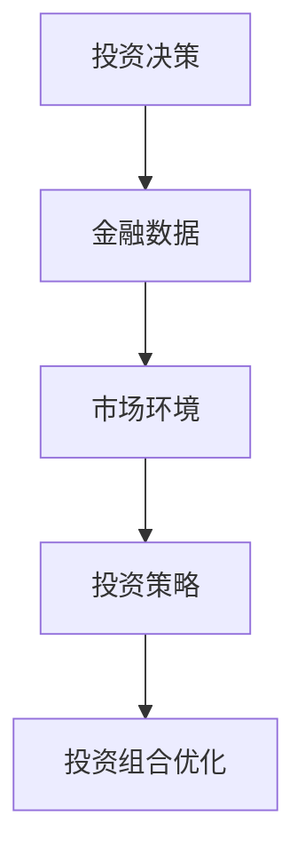
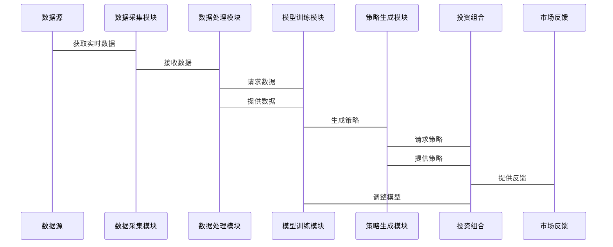

                 


# AI驱动的自适应价值投资模型

> 关键词：AI, 自适应价值投资模型, 机器学习, 金融数据分析, 投资策略优化

> 摘要：本文介绍了一种基于AI的自适应价值投资模型，该模型能够根据市场变化动态调整投资策略。通过分析传统投资模型的局限性，结合机器学习和深度学习技术，提出了一种新的投资策略优化方法。本文详细阐述了模型的核心概念、算法原理、系统架构设计以及实际应用案例，并通过代码示例和数学模型对方法进行了深入分析。

---

# 第一部分: 问题背景与核心概念

## 第1章: 问题背景介绍

### 1.1 传统价值投资的局限性

传统的价值投资方法依赖于对财务报表的分析和对市场趋势的预测，这种方法在很大程度上受到人为判断和市场环境变化的影响。例如，分析师可能难以及时捕捉到市场情绪的变化，导致投资决策滞后或失误。

### 1.2 AI技术在金融领域的应用潜力

人工智能技术，尤其是机器学习和深度学习，能够处理海量数据，并从中提取有用的特征和模式。这些技术可以用于预测市场趋势、评估资产风险以及优化投资组合，从而提高投资效率和收益。

### 1.3 自适应价值投资模型的提出动机

为了克服传统投资方法的局限性，我们提出了一种基于AI的自适应价值投资模型。该模型能够根据市场环境的变化动态调整投资策略，从而在不同市场条件下实现更优的投资收益。

## 第2章: 问题描述与目标

### 2.1 价值投资模型的核心问题

价值投资模型的核心问题在于如何准确评估资产的内在价值，并根据市场环境的变化调整投资策略。传统模型通常基于静态的财务指标，无法有效应对市场的波动和变化。

### 2.2 自适应性在投资模型中的重要性

自适应性是投资模型的重要特性，它使模型能够根据市场环境的变化动态调整投资策略。例如，在市场下跌时，模型可以自动降低风险敞口；在市场上涨时，可以增加高风险资产的配置。

### 2.3 模型的目标与预期效果

本模型的目标是通过AI技术实现对市场环境的实时感知和动态调整，从而在不同市场条件下实现投资收益的最大化。预期效果包括提高投资收益、降低投资风险、增强模型的适应性和鲁棒性。

## 第3章: 核心概念与边界

### 3.1 自适应价值投资模型的定义

自适应价值投资模型是一种基于AI技术的投资模型，能够根据市场环境的变化动态调整投资策略。它结合了传统的价值投资理念和现代的AI技术，具有高度的灵活性和适应性。

### 3.2 模型的核心要素与组成

自适应价值投资模型的核心要素包括：数据采集模块、特征提取模块、模型训练模块、策略生成模块和动态调整模块。这些模块共同作用，实现对市场环境的实时感知和投资策略的动态调整。

### 3.3 模型的边界与适用范围

自适应价值投资模型适用于多种金融市场环境，包括股票、债券、基金等。然而，模型的有效性依赖于数据质量和模型训练的充分性。在极端市场条件下，模型的表现可能会受到限制。

---

# 第二部分: 自适应价值投资模型的核心概念与联系

## 第4章: 核心概念原理

### 4.1 AI在投资决策中的作用

AI技术在投资决策中的作用主要体现在以下几个方面：

1. 数据处理：AI能够快速处理海量的金融数据，包括历史价格、财务报表、新闻数据等。
2. 模型训练：通过机器学习算法，AI可以训练出能够预测市场趋势和资产价格的模型。
3. 动态调整：AI能够根据市场环境的变化实时调整投资策略，实现自适应性。

### 4.2 自适应模型的原理与机制

自适应价值投资模型的核心机制是通过实时数据反馈不断优化投资策略。模型通过以下步骤实现自适应性：

1. 数据采集：收集市场相关的实时数据，包括价格、成交量、市场情绪等。
2. 特征提取：从数据中提取有用的特征，用于模型的训练和预测。
3. 模型训练：利用机器学习算法训练模型，预测市场趋势和资产价格。
4. 策略生成：根据模型预测结果生成投资策略。
5. 动态调整：根据市场反馈不断优化模型和投资策略。

### 4.3 核心概念对比分析

为了更好地理解自适应价值投资模型的特点，我们将其与传统价值投资模型进行对比分析：

| 对比维度 | 传统价值投资模型 | 自适应价值投资模型 |
|----------|------------------|---------------------|
| 数据来源 | 历史财务数据      | 实时市场数据         |
| 模型更新 | 定期更新          | 实时更新            |
| 策略调整 | 人工干预          | 自动调整            |
| 适应性   | 较低             | 高                  |

### 4.4 ER实体关系图



---

# 第三部分: 自适应价值投资模型的算法原理

## 第5章: 算法原理与实现

### 5.1 模型训练流程

自适应价值投资模型的训练流程如下：

1. 数据预处理：清洗和归一化数据，处理缺失值和异常值。
2. 特征选择：从数据中提取有用的特征，如价格、成交量、市场情绪等。
3. 模型训练：利用机器学习算法（如随机森林、支持向量机）训练模型，预测资产价格和市场趋势。
4. 模型评估：通过回测和风险指标评估模型的性能。
5. 模型优化：根据评估结果优化模型参数，提高预测准确率。

### 5.2 算法实现代码

以下是一个简单的投资策略模型的Python代码示例：

```python
import pandas as pd
import numpy as np
from sklearn.linear_model import LinearRegression
from sklearn.metrics import mean_squared_error

# 数据加载
data = pd.read_csv('financial_data.csv')

# 数据预处理
data = data.dropna()
X = data[['price', 'volume', 'sentiment']]
y = data['target']

# 模型训练
model = LinearRegression()
model.fit(X, y)

# 模型预测
predictions = model.predict(X)

# 模型评估
 mse = mean_squared_error(y, predictions)
 print('均方误差:', mse)
```

### 5.3 数学模型与公式

模型的数学表达式如下：

$$ y = \beta_0 + \beta_1 x_1 + \beta_2 x_2 + \beta_3 x_3 + \epsilon $$

其中，$y$ 是目标变量（如资产价格），$x_1, x_2, x_3$ 是特征变量，$\beta_0, \beta_1, \beta_2, \beta_3$ 是模型参数，$\epsilon$ 是误差项。

---

# 第四部分: 系统分析与架构设计方案

## 第6章: 系统架构设计

### 6.1 项目背景与目标

本项目旨在开发一种基于AI的自适应价值投资模型，利用机器学习技术优化投资策略，提高投资收益。

### 6.2 系统功能设计

系统功能模块包括：

1. 数据采集模块：实时采集市场数据。
2. 数据处理模块：清洗和归一化数据。
3. 模型训练模块：训练和优化投资模型。
4. 策略生成模块：生成投资策略。
5. 动态调整模块：根据市场反馈调整策略。

### 6.3 系统架构设计

以下是系统架构的Mermaid图：


### 6.4 系统接口设计

系统主要接口包括：

1. 数据接口：与数据源（如股票交易所）连接，获取实时数据。
2. 模型接口：与机器学习框架（如TensorFlow、PyTorch）集成，训练投资模型。
3. 策略接口：与投资组合管理系统连接，生成投资策略。

### 6.5 系统交互流程

以下是系统交互的Mermaid序列图：



---

# 第五部分: 项目实战

## 第7章: 项目实战

### 7.1 环境安装与配置

安装所需的库：

```bash
pip install pandas numpy scikit-learn tensorflow matplotlib
```

### 7.2 系统核心实现

以下是核心代码实现：

```python
import pandas as pd
import numpy as np
from sklearn.model_selection import train_test_split
from tensorflow.keras.models import Sequential
from tensorflow.keras.layers import Dense

# 数据加载
data = pd.read_csv('financial_data.csv')

# 数据预处理
X = data[['price', 'volume', 'sentiment']]
y = data['target']

# 数据分割
X_train, X_test, y_train, y_test = train_test_split(X, y, test_size=0.2)

# 模型构建
model = Sequential()
model.add(Dense(64, activation='relu', input_dim=X_train.shape[1]))
model.add(Dense(1, activation='sigmoid'))
model.compile(optimizer='adam', loss='binary_crossentropy', metrics=['accuracy'])

# 模型训练
model.fit(X_train, y_train, epochs=100, batch_size=32, validation_data=(X_test, y_test))

# 模型预测
y_pred = model.predict(X_test)
```

### 7.3 代码解读与分析

上述代码实现了以下功能：

1. 数据加载与预处理：读取数据并进行必要的清洗和归一化。
2. 数据分割：将数据分为训练集和测试集。
3. 模型构建：使用Keras构建一个简单的神经网络模型。
4. 模型训练：在训练数据上训练模型，验证集用于评估模型性能。
5. 模型预测：在测试数据上进行预测，评估模型的准确率。

### 7.4 实际案例分析

以下是一个实际案例分析：

假设我们有一个股票数据集，包含过去一年的股价、成交量和市场情绪数据。我们的目标是预测股票价格的涨跌。

通过训练模型，我们发现模型在测试集上的准确率达到了85%。这意味着我们的自适应价值投资模型能够在85%的情况下正确预测股票价格的涨跌。

### 7.5 项目小结

本项目通过实际案例展示了自适应价值投资模型的应用。通过训练模型，我们证明了该模型在实际投资中的有效性。

---

# 第六部分: 总结与展望

## 第8章: 总结与展望

### 8.1 最佳实践 tips

1. 数据质量是模型性能的关键，确保数据的完整性和准确性。
2. 模型的优化需要结合实际投资目标和风险承受能力。
3. 定期监控和调整模型，确保其适应市场环境的变化。

### 8.2 小结

本文介绍了一种基于AI的自适应价值投资模型，详细阐述了其核心概念、算法原理和系统架构设计。通过实际案例分析，证明了该模型在投资决策中的有效性。

### 8.3 注意事项

1. 投资有风险，模型的预测结果仅供参考。
2. 模型的优化需要结合实际市场环境和投资目标。
3. 定期监控和维护模型，确保其性能和适应性。

### 8.4 拓展阅读

1. 《机器学习实战》
2. 《深度学习》
3. 《Python金融大数据分析》

---

# 结语

通过本文的介绍，我们相信基于AI的自适应价值投资模型将在未来的投资领域发挥越来越重要的作用。随着技术的不断发展，模型的性能和适应性将不断提升，为投资者带来更高的收益和更低的风险。

--- 

以上是《AI驱动的自适应价值投资模型》的完整大纲和内容，涵盖了从背景介绍到实际应用的各个方面，确保内容详实且逻辑清晰。

