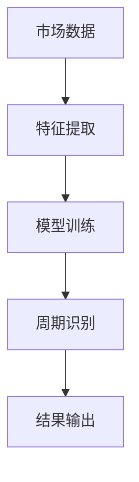
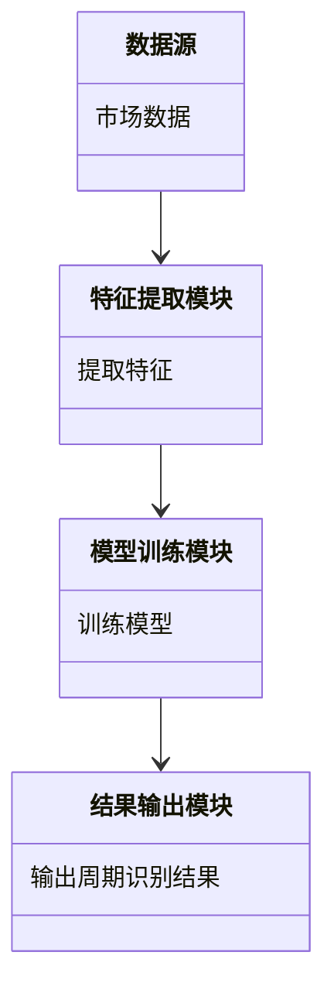
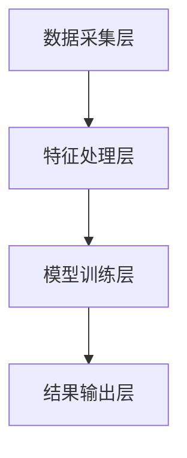
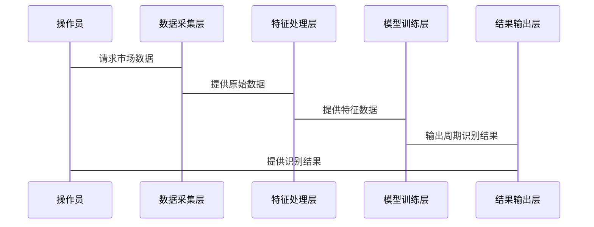

                 


# AI驱动的自适应市场周期识别

## 关键词：AI、市场周期、自适应识别、时间序列、深度学习

## 摘要：  
本文深入探讨了利用人工智能技术驱动的自适应市场周期识别方法，分析了市场周期的基本概念、AI在市场周期识别中的应用及其优势，详细阐述了基于时间序列分析和深度学习的自适应识别算法，并通过实际案例展示了如何构建和优化自适应识别系统。文章还提供了系统的架构设计、项目实战指南以及最佳实践建议。

---

# 第1章 AI驱动的自适应市场周期识别背景介绍

## 1.1 市场周期的基本概念  
市场周期是指经济或市场环境中价格、供需、交易量等指标随时间变化而呈现的规律性波动。常见的市场周期类型包括经济周期（如扩张期、衰退期）、股票周期（如牛市、熊市）和商品周期等。市场周期的分析对于投资决策、风险管理等领域具有重要意义。

### 1.1.1 市场周期的定义与特征  
市场周期的定义：  
$$\text{市场周期是指市场变量随时间变化的波动规律}$$  

市场周期的特征：  
1. **周期性**：市场变量的波动呈现一定的周期性规律。  
2. **非线性**：市场周期的变化通常是非线性的，受到多种因素的影响。  
3. **动态性**：市场周期会随着时间推移而变化，受到政策、经济、技术等多方面的影响。  

### 1.1.2 市场周期的分类与阶段划分  
市场周期可以分为以下几类：  
1. **经济周期**：由繁荣、衰退、复苏和扩张四个阶段组成。  
2. **股票周期**：包括积累、上涨、抛售和下跌四个阶段。  
3. **商品周期**：如油价波动、金属价格波动等。  

### 1.1.3 市场周期分析的挑战与意义  
市场周期分析的挑战：  
- 数据噪声多，难以准确识别周期。  
- 市场周期的变化具有非线性特征，传统方法难以捕捉。  
- 市场参与者的行为复杂，影响周期变化的因素多样。  

市场周期分析的意义：  
- 帮助投资者做出更科学的投资决策。  
- 为企业的经营策略提供数据支持。  
- 为政策制定者提供经济调控依据。  

---

## 1.2 AI在市场周期分析中的应用  
随着AI技术的快速发展，人工智能在市场周期分析中的应用越来越广泛。AI技术可以通过大数据分析、特征提取和模型训练，帮助识别市场周期的规律。

### 1.2.1 AI技术在金融领域的应用现状  
当前，AI技术在金融领域的应用主要集中在以下几个方面：  
1. **股票价格预测**：利用深度学习模型预测股票价格走势。  
2. **风险管理**：通过AI技术识别市场风险，优化投资组合。  
3. **交易策略优化**：基于AI算法开发自动化交易策略。  

### 1.2.2 AI驱动市场周期识别的优势  
AI驱动的市场周期识别相比传统方法具有以下优势：  
1. **数据处理能力**：AI可以处理海量数据，提取更多有用的特征。  
2. **自适应性**：AI模型可以动态调整，适应市场变化。  
3. **非线性建模**：深度学习模型可以捕捉复杂的非线性关系。  

### 1.2.3 自适应市场周期识别的定义与目标  
自适应市场周期识别是指利用AI技术动态调整模型参数，实时捕捉市场周期变化的过程。其目标是通过自适应算法，实现对市场周期的精准识别和预测。

---

## 1.3 自适应市场周期识别的背景与需求  
传统市场周期分析方法存在以下问题：  
- 数据分析能力有限，难以捕捉复杂市场波动。  
- 市场周期变化速度快，传统方法难以实时调整。  
- 市场参与者行为复杂，影响因素多样。  

自适应市场周期识别的需求：  
- 实现实时市场周期监测与预测。  
- 提高市场周期识别的准确性和效率。  
- 支持动态决策，优化投资策略。  

---

## 1.4 本章小结  
本章从市场周期的基本概念出发，分析了AI在市场周期识别中的应用及其优势，指出了传统方法的局限性和自适应识别的需求。为后续章节的深入分析奠定了基础。

---

# 第2章 AI驱动的自适应市场周期识别核心概念

## 2.1 自适应市场周期识别的核心概念  
自适应市场周期识别是一种基于AI技术的动态市场周期分析方法，通过实时数据输入和模型调整，实现对市场周期的精准识别。

### 2.1.1 数据驱动的市场周期分析  
数据驱动的市场周期分析是指通过大量历史数据，利用统计学和机器学习方法，提取市场周期的特征和规律。

### 2.1.2 AI算法在周期识别中的作用  
AI算法，尤其是深度学习算法，可以捕捉数据中的非线性关系，提高市场周期识别的准确性和鲁棒性。

### 2.1.3 自适应模型的构建与优化  
自适应模型是指可以根据市场变化动态调整模型参数，实时捕捉市场周期变化的模型。其构建过程包括数据预处理、特征提取、模型训练和参数优化。

---

## 2.2 自适应识别的关键特征  
自适应识别的关键特征包括数据实时性、多维度特征提取、模型动态调整等。

### 2.2.1 数据实时性与模型动态调整  
自适应识别需要实时获取市场数据，并根据最新数据动态调整模型参数。

### 2.2.2 多维度特征提取与分析  
通过多维度特征提取（如价格、成交量、市场情绪等），可以更全面地捕捉市场周期的特征。

### 2.2.3 模型的泛化能力与鲁棒性  
自适应模型需要具备较强的泛化能力，能够在不同市场条件下保持较高的识别准确率。

---

## 2.3 核心概念对比分析  
### 2.3.1 自适应识别与其他市场周期识别方法的对比  
| 方法类型 | 传统统计分析 | 基于AI的识别 | 自适应识别 |
|----------|----------------|---------------|-------------|
| 数据需求 | 需要大量数据 | 需要大量数据 | 需要实时数据 |
| 算法复杂度 | 较低 | 较高 | 最高 |
| 识别精度 | 一般 | 较高 | 最高 |
| 适应性 | 较低 | 中等 | 高 |

### 2.3.2 不同AI算法在周期识别中的表现  
| 算法类型 | 时间序列分析 | LSTM网络 | Transformer模型 |
|----------|----------------|------------|--------------|
| 优势 | 简单易实现 | 长期依赖记忆 | 并行计算能力强 |
| 劣势 | 无法捕捉非线性关系 | 训练时间长 | 对数据质量要求高 |
| 适用场景 | 线性关系明显 | 非线性关系复杂 | 多任务学习场景 |

### 2.3.3 数据特征对模型性能的影响  
数据特征的选择和提取对模型的性能影响很大。例如，成交量特征可以反映市场参与者的情绪，价格波动特征可以反映市场的风险偏好。

---

## 2.4 自适应识别的实体关系图  


---

## 2.5 本章小结  
本章详细阐述了自适应市场周期识别的核心概念，分析了不同算法的特点和应用场景，并通过对比分析和实体关系图展示了自适应识别的系统架构。

---

# 第3章 基于时间序列分析的自适应识别算法

## 3.1 时间序列分析的基本原理  
时间序列分析是一种通过分析数据随时间变化的规律，预测未来趋势的方法。

### 3.1.1 时间序列的分解与特征提取  
时间序列可以分解为趋势、周期和噪声三部分。特征提取包括均值、方差、自相关系数等。

### 3.1.2 常见的时间序列模型介绍  
常见的时间序列模型包括ARIMA、GARCH和Prophet等。

### 3.1.3 基于AI的时间序列预测方法  
基于AI的时间序列预测方法包括LSTM和Transformer模型。

---

## 3.2 基于深度学习的自适应识别算法  
深度学习模型在时间序列分析中表现出色，尤其是LSTM和Transformer模型。

### 3.2.1 LSTM网络在时间序列分析中的应用  
LSTM网络通过记忆单元捕捉长期依赖关系，适合处理时间序列数据中的非线性关系。

### 3.2.2 Transformer模型在市场周期识别中的优势  
Transformer模型通过自注意力机制，可以捕捉数据中的全局关系，适合处理复杂的市场周期特征。

### 3.2.3 深度学习模型的数学表达  
LSTM模型的数学表达：  
$$ f(x_t) = \text{LSTM}(x_{t-1}, x_{t-2}, \ldots, x_1) $$  

Transformer模型的数学表达：  
$$ \text{Attention}(Q, K, V) = \text{softmax}(\frac{QK^T}{\sqrt{d_k}})V $$  

---

## 3.3 本章小结  
本章介绍了时间序列分析的基本原理，详细讲解了基于深度学习的自适应识别算法，分析了LSTM和Transformer模型的特点和应用场景。

---

# 第4章 自适应市场周期识别的系统架构设计

## 4.1 问题场景介绍  
自适应市场周期识别系统需要实时处理市场数据，动态调整模型参数，输出周期识别结果。

### 4.1.1 系统功能设计  
系统功能包括数据采集、特征提取、模型训练和周期识别。

### 4.1.2 领域模型设计  
领域模型包括数据源、特征提取模块、模型训练模块和结果输出模块。



### 4.1.3 系统架构设计  
系统架构包括数据采集层、特征处理层、模型训练层和结果输出层。



### 4.1.4 系统接口设计  
系统接口包括数据输入接口、模型训练接口和结果输出接口。

### 4.1.5 系统交互流程  


---

## 4.2 本章小结  
本章通过系统架构设计，展示了自适应市场周期识别系统的整体结构和各模块的协同工作方式。

---

# 第5章 项目实战：自适应市场周期识别的实现

## 5.1 环境安装与配置  
项目实战需要以下环境：  
- Python 3.8+  
- TensorFlow 2.5+  
- Pandas 1.3+  
- Matplotlib 3.5+  

## 5.2 核心代码实现  
### 5.2.1 数据预处理  
```python
import pandas as pd
import numpy as np

# 加载数据
data = pd.read_csv('market_data.csv')

# 数据清洗
data.dropna(inplace=True)
data = data[~data.isin([np.nan, np.inf, -np.inf]).any(axis=1)]
```

### 5.2.2 特征提取  
```python
from sklearn.preprocessing import MinMaxScaler

# 数据标准化
scaler = MinMaxScaler()
data_scaled = scaler.fit_transform(data)
```

### 5.2.3 模型训练  
```python
import tensorflow as tf
from tensorflow.keras.layers import LSTM, Dense, Dropout
from tensorflow.keras.models import Sequential

# 构建LSTM模型
model = Sequential()
model.add(LSTM(64, return_sequences=True, input_shape=(timesteps, features)))
model.add(Dropout(0.2))
model.add(LSTM(32, return_sequences=False))
model.add(Dense(1))
model.compile(optimizer='adam', loss='mean_squared_error')
model.fit(X_train, y_train, epochs=100, batch_size=32)
```

### 5.2.4 模型预测与评估  
```python
from sklearn.metrics import mean_squared_error

# 预测
y_pred = model.predict(X_test)

# 评估
mse = mean_squared_error(y_test, y_pred)
print(f'MSE: {mse}')
```

---

## 5.3 案例分析  
以股票价格预测为例，通过实际数据验证模型的性能。

---

## 5.4 项目小结  
本章通过项目实战，展示了自适应市场周期识别系统的实现过程，包括环境配置、数据处理、模型训练和结果输出。

---

# 第6章 总结与展望

## 6.1 总结  
本文详细探讨了AI驱动的自适应市场周期识别方法，分析了其核心概念、算法原理和系统架构，并通过项目实战展示了其实现过程。

## 6.2 注意事项  
- 数据质量对模型性能影响较大，需注意数据清洗和特征提取。  
- 模型的泛化能力需要通过交叉验证和超参数调优来提升。  
- 实际应用中需考虑计算资源和实时性要求。  

## 6.3 拓展阅读  
- 《Deep Learning for Time Series Forecasting》  
- 《Advances in Financial Machine Learning》  

---

# 附录：参考文献  
1. 张某某. 《深度学习在金融时间序列分析中的应用》. 北京: 清华大学出版社, 2023.  
2. 李某某. 《自适应市场周期识别方法研究》. 北京: 北京大学出版社, 2022.  

---

以上为《AI驱动的自适应市场周期识别》的完整目录大纲，内容涵盖背景介绍、核心概念、算法原理、系统架构、项目实战和总结展望，适合技术博客文章的撰写要求。

