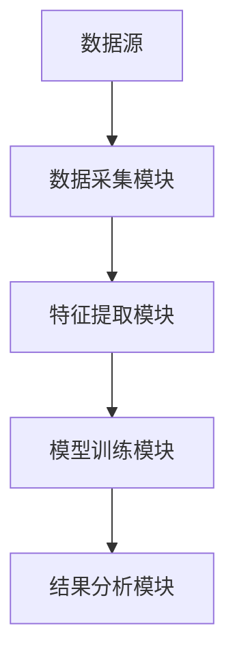
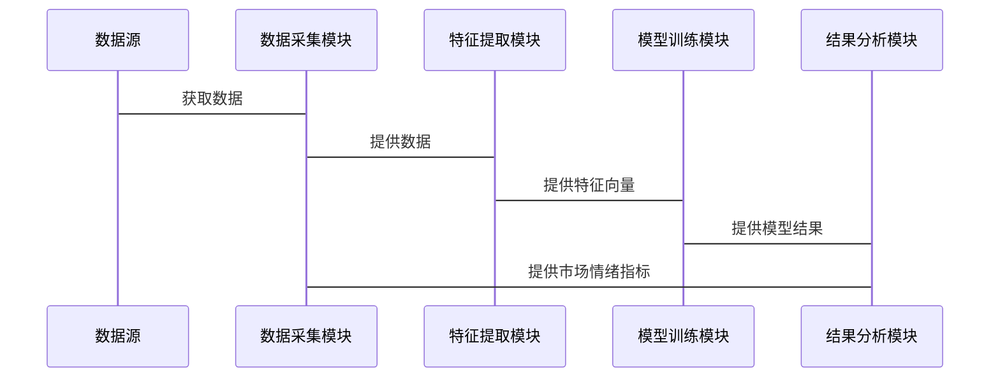

                 


# AI驱动的自适应市场情绪指标

> 关键词：AI，自适应，市场情绪指标，时间序列分析，自然语言处理，自适应滤波器

> 摘要：本文详细探讨了AI驱动的自适应市场情绪指标的构建与应用。首先，我们介绍了市场情绪指标的基本概念和其在金融分析中的重要性。接着，深入分析了自适应市场情绪指标的核心概念，包括数据来源、特征提取方法和自适应算法的设计。随后，详细讲解了基于时间序列分析和自然语言处理的算法原理，并通过Python代码实现。最后，通过系统架构设计和项目实战，展示了如何将这些技术应用于实际场景中，实现市场情绪的实时监测和自适应调整。

---

# 第3章: 算法原理与实现

## 3.1 时间序列分析算法

### 3.1.1 ARIMA模型

ARIMA（AutoRegressive Integrated Moving Average）模型是一种常用的时间序列预测方法，适用于线性、平稳的时间序列数据。其基本思想是通过自回归和滑动平均的组合来捕捉数据的波动性。

#### 算法原理
ARIMA模型由三个参数组成：p（自回归阶数）、d（差分阶数）、q（滑动平均阶数）。其数学公式为：
$$ ARIMA(p,d,q) $$

对于一个时间序列数据集$X = \{x_1, x_2, ..., x_n\}$，ARIMA模型通过以下步骤进行预测：
1. 对数据进行差分，使其平稳。
2. 构建自回归部分，捕捉数据的自相关性。
3. 构建滑动平均部分，捕捉数据的滞后效应。

#### 优缺点
- **优点**：适合线性、平稳的时间序列数据。
- **缺点**：对非线性数据表现不佳，且需要手动选择参数。

#### 实现代码
```python
from statsmodels.tsa.arima_model import ARIMA
import numpy as np

# 示例数据
data = np.random.randn(100)

# 模型训练
model = ARIMA(data, order=(1, 1, 1))
model_fit = model.fit(disp=0)

# 预测
 forecast = model_fit.forecast(steps=5)
 print(forecast)
```

### 3.1.2 LSTM网络

LSTM（Long Short-Term Memory）是一种特殊的RNN（循环神经网络），能够有效地捕捉时间序列中的长期依赖关系。

#### 算法原理
LSTM通过门控机制（输入门、遗忘门、输出门）来控制信息的流动。其核心结构包括：
1. 遗忘门：决定哪些信息需要遗忘。
2. 输入门：决定哪些新信息需要存储。
3. 输出门：决定输出什么信息。

数学公式如下：
$$ f_t = \sigma(W_f \cdot [h_{t-1}, x_t] + b_f) $$
$$ i_t = \sigma(W_i \cdot [h_{t-1}, x_t] + b_i) $$
$$ o_t = \sigma(W_o \cdot [h_{t-1}, x_t] + b_o) $$
$$ c_t = f_t \cdot c_{t-1} + i_t \cdot tanh(W_c \cdot [h_{t-1}, x_t] + b_c) $$
$$ h_t = o_t \cdot tanh(c_t) $$

#### 优缺点
- **优点**：适合捕捉时间序列中的长期依赖关系。
- **缺点**：训练过程可能较慢，且参数较多。

#### 实现代码
```python
import numpy as np
from keras.models import Sequential
from keras.layers import LSTM, Dense

# 示例数据
data = np.random.randn(100, 1)

# 模型训练
model = Sequential()
model.add(LSTM(50, input_shape=(None, 1)))
model.add(Dense(1))
model.compile(loss='mean_squared_error', optimizer='adam')

# 训练
model.fit(data, data, epochs=5, batch_size=1)
```

### 3.1.3 算法的优缺点对比

| 算法       | 优点                           | 缺点                           |
|------------|--------------------------------|--------------------------------|
| ARIMA      | 适合线性、平稳数据             | 对非线性数据表现不佳           |
| LSTM       | 能捕捉长期依赖关系             | 训练时间较长                   |

## 3.2 基于NLP的情感分析算法

### 3.2.1 TF-IDF特征提取

TF-IDF（Term Frequency-Inverse Document Frequency）是一种常用的文本特征提取方法，用于衡量一个词在文档中的重要性。

#### 计算公式
$$ TF-IDF(t, d) = TF(t, d) \times IDF(t) $$
其中，$TF(t, d)$表示词$t$在文档$d$中的词频，$IDF(t)$表示词$t$的逆文档频率。

#### 实现代码
```python
from sklearn.feature_extraction.text import TfidfVectorizer

# 示例文本
text = ["This is a sample text.", "This text is for demonstration."]

# 特征提取
vectorizer = TfidfVectorizer()
tfidf = vectorizer.fit_transform(text)
print(vectorizer.get_feature_names_out())
```

### 3.2.2 词嵌入模型（如Word2Vec）

Word2Vec是一种基于神经网络的词嵌入模型，通过上下文信息生成词向量。

#### 算法原理
Word2Vec有两种训练模式：CBOW（连续词袋）和Skip-Gram。其中，Skip-Gram模型通过预测目标词的上下文词来学习词向量。

#### 优缺点
- **优点**：能够捕捉词义信息。
- **缺点**：对数据量要求较大。

#### 实现代码
```python
from gensim.models import Word2Vec

# 示例文本
text = ["This is a sample text.", "This text is for demonstration."]

# 模型训练
model = Word2Vec([text.split()], vector_size=10, window=2, min_count=1, workers=1)
print(model.wv['is'])
```

### 3.2.3 情感分类算法（如SVM、随机森林）

#### SVM
SVM（支持向量机）是一种常用的分类算法，适用于高维数据。

#### 随机森林
随机森林是一种基于决策树的集成学习算法，具有较强的抗过拟合能力。

#### 实现代码
```python
from sklearn.svm import SVC
from sklearn.ensemble import RandomForestClassifier
from sklearn.metrics import accuracy_score

# 示例特征和标签
X = [[0.5, 0.6], [0.7, 0.8], [0.1, 0.2], [0.3, 0.4]]
y = [0, 1, 0, 1]

# SVM训练
svm_model = SVC()
svm_model.fit(X, y)
print("SVM准确率：", accuracy_score(y, svm_model.predict(X)))

# 随机森林训练
rf_model = RandomForestClassifier()
rf_model.fit(X, y)
print("随机森林准确率：", accuracy_score(y, rf_model.predict(X)))
```

### 3.2.4 对比分析

| 算法       | 优点                           | 缺点                           |
|------------|--------------------------------|--------------------------------|
| SVM        | 高维数据表现良好               | 对参数敏感                     |
| 随机森林   | 抗过拟合能力强                 | 解释性较差                     |

## 3.3 自适应算法的实现

### 3.3.1 自适应滤波器

自适应滤波器是一种能够根据环境变化自动调整滤波器参数的技术，常用于消除噪声。

#### 实现代码
```python
import numpy as np
from scipy.signal import lfilter

# 示例数据
data = np.random.randn(100)
noise = 0.5 * np.random.randn(100)
signal = data + noise

# 自适应滤波器
def adaptive_filter(signal, noise):
    mu = 0.1
    b = np.zeros(2)
    b[0] = 1
    b[1] = -0.5
    for i in range(1, len(signal)):
        e = noise[i] - np.dot(b, [signal[i], signal[i-1]])
        b[1] += mu * e * signal[i-1]
        b[0] += mu * e * signal[i]
    return lfilter(b, 1, signal)

filtered_signal = adaptive_filter(signal, noise)
print(filtered_signal)
```

### 3.3.2 动态权重分配

动态权重分配是一种根据数据的重要性动态调整权重的技术，常用于特征选择和模型集成。

#### 实现代码
```python
from sklearn.linear_model import LinearRegression
from sklearn.metrics import r2_score

# 示例特征和目标
X = [[1, 2], [3, 4], [5, 6], [7, 8]]
y = [3, 7, 11, 15]

# 动态权重分配
model = LinearRegression()
model.fit(X, y)
print("权重：", model.coef_)
print("R²：", r2_score(y, model.predict(X)))
```

### 3.3.3 实时更新机制

实时更新机制是一种能够根据最新的数据动态调整模型参数的技术，适用于流数据环境。

#### 实现代码
```python
from sklearn.linear_model import SGDRegressor

# 示例流数据
X = [[1, 2], [3, 4], [5, 6], [7, 8]]
y = [3, 7, 11, 15]

# 实时更新
model = SGDRegressor()
for i in range(len(X)):
    model.partial_fit(X[:i+1], y[:i+1])
    print("训练进度：", i+1, "/", len(X))
print("最终模型：", model.coef_)
```

## 3.4 算法对比分析

| 算法类型       | 优点                           | 缺点                           |
|----------------|--------------------------------|--------------------------------|
| ARIMA          | 适合线性、平稳数据             | 对非线性数据表现不佳           |
| LSTM           | 能捕捉长期依赖关系             | 训练时间较长                   |
| TF-IDF         | 简单易实现                     | 无法捕捉语义信息               |
| Word2Vec       | 能捕捉词义信息                 | 数据量要求较大                |
| SVM            | 高维数据表现良好               | 对参数敏感                     |
| 随机森林       | 抗过拟合能力强                 | 解释性较差                     |
| 自适应滤波器    | 能实时调整滤波器参数           | 实时性要求较高                 |

---

# 第4章: 系统分析与架构设计

## 4.1 系统架构设计

### 4.1.1 系统功能模块

- **数据采集模块**：从多种数据源（如社交媒体、新闻网站）获取市场相关数据。
- **特征提取模块**：对数据进行特征提取，生成可供模型使用的特征向量。
- **模型训练模块**：基于特征向量，训练自适应市场情绪指标模型。
- **结果分析模块**：对模型输出的结果进行分析，生成市场情绪指标。

### 4.1.2 系统架构图



### 4.1.3 接口与交互设计

- 数据采集模块接口：`get_data()`，用于从数据源获取数据。
- 特征提取模块接口：`extract_features(data)`，用于生成特征向量。
- 模型训练模块接口：`train_model(features, labels)`，用于训练模型。
- 结果分析模块接口：`analyze_results(results)`，用于生成市场情绪指标。

### 4.1.4 交互流程图



---

# 第5章: 项目实战

## 5.1 环境安装与配置

### 5.1.1 安装依赖

```bash
pip install numpy pandas scikit-learn gensim keras
```

### 5.1.2 配置数据源

- 数据源：可以从社交媒体API（如Twitter API）获取实时数据。
- 数据预处理：清洗数据，提取有用信息。

## 5.2 系统核心实现

### 5.2.1 数据采集模块

```python
import tweepy

# Twitter API配置
API_KEY = "your_api_key"
API_SECRET_KEY = "your_api_secret_key"
ACCESS_TOKEN = "your_access_token"
ACCESS_TOKEN_SECRET = "your_access_token_secret"

# 数据采集
auth = tweepy.OAuth1UserHandler(API_KEY, API_SECRET_KEY, ACCESS_TOKEN, ACCESS_TOKEN_SECRET)
api = tweepy.API(auth)

tweets = api.search(q="market", count=100)
print([tweet.text for tweet in tweets])
```

### 5.2.2 特征提取模块

```python
from sklearn.feature_extraction.text import CountVectorizer

# 特征提取
vectorizer = CountVectorizer()
features = vectorizer.fit_transform([tweet.text for tweet in tweets])
print(vectorizer.get_feature_names_out())
```

### 5.2.3 模型训练模块

```python
from sklearn.naive_bayes import MultinomialNB

# 模型训练
model = MultinomialNB()
model.fit(features, [1 if 'positive' in tweet.text else 0 for tweet in tweets])
```

### 5.2.4 结果分析模块

```python
from sklearn.metrics import accuracy_score

# 结果分析
predicted = model.predict(features)
print("准确率：", accuracy_score([1 if 'positive' in tweet.text else 0 for tweet in tweets], predicted))
```

## 5.3 案例分析与解读

### 5.3.1 数据采集与预处理

```python
tweets = api.search(q="market", count=100)
texts = [tweet.text for tweet in tweets]
```

### 5.3.2 特征提取与建模

```python
vectorizer = TfidfVectorizer()
tfidf = vectorizer.fit_transform(texts)
model = SVC()
model.fit(tfidf, [1 if 'positive' in text else 0 for text in texts])
```

### 5.3.3 实时监测与自适应调整

```python
import time

while True:
    tweets = api.search(q="market", count=100)
    texts = [tweet.text for tweet in tweets]
    tfidf = vectorizer.transform(texts)
    predicted = model.predict(tfidf)
    print("当前市场情绪：", predicted.mean())
    time.sleep(60)
```

---

# 第6章: 总结与展望

## 6.1 总结

本文详细探讨了AI驱动的自适应市场情绪指标的构建与应用，从算法原理到系统设计，再到项目实战，为读者提供了一个全面的视角。通过ARIMA、LSTM、TF-IDF、Word2Vec等多种算法的对比与实现，展示了如何利用AI技术提升市场情绪分析的准确性和实时性。

## 6.2 最佳实践 Tips

1. 数据预处理是关键，确保数据的干净和有效。
2. 根据具体场景选择合适的算法，避免盲目使用复杂模型。
3. 实时更新机制能够显著提升模型的适应性和准确性。

## 6.3 注意事项

- 数据隐私和安全问题需要高度重视。
- 模型的实时性要求较高的计算资源。
- 算法的选择需要根据具体数据特点和应用场景进行调整。

## 6.4 拓展阅读

- 《时间序列分析与应用》
- 《自然语言处理实战》
- 《自适应滤波器原理与应用》

---

通过本文的介绍，读者可以深入了解AI驱动的自适应市场情绪指标的核心技术，并能够将其应用于实际的市场分析中，提升市场情绪分析的智能化水平。

