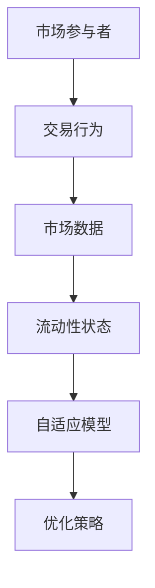
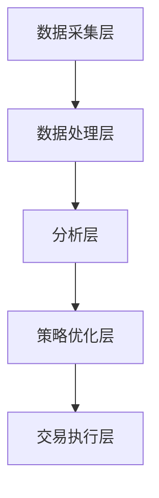
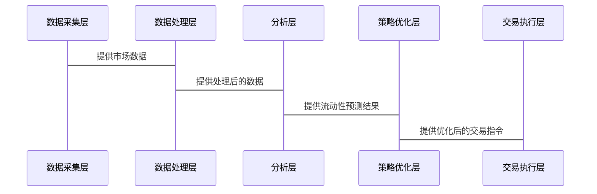

                 


# AI驱动的自适应市场流动性分析

> 关键词：AI驱动，自适应分析，市场流动性，强化学习，算法交易，系统架构，金融大数据

> 摘要：本文探讨了AI技术在自适应市场流动性分析中的应用，通过强化学习算法和系统架构设计，提出了实现自适应流动性优化的新思路。文章详细介绍了自适应分析的理论基础、算法原理、系统设计、项目实战以及总结与展望，为金融领域的技术实践者提供了理论支持和实践指导。

---

## 第一部分: 引言

### 第1章: 自适应市场流动性分析的背景与目标

#### 1.1 问题背景
- **1.1.1 市场流动性的基本概念**
  - 市场流动性是指资产在短时间内以合理价格买卖的能力。
  - 流动性高的市场具有低买卖价差、高交易量和低波动性。

- **1.1.2 传统市场流动性分析的局限性**
  - 传统分析方法依赖固定模型，难以应对动态市场环境。
  - 无法实时捕捉市场参与者的复杂行为模式。

- **1.1.3 AI驱动的自适应分析的必要性**
  - AI技术能够实时处理海量数据，识别复杂模式。
  - 自适应分析能够根据市场变化动态调整策略。

#### 1.2 问题描述
- **1.2.1 市场流动性波动的复杂性**
  - 市场参与者行为、新闻事件、技术故障等多种因素影响流动性。
  - 流动性波动具有非线性和不确定性。

- **1.2.2 自适应分析的需求**
  - 需要实时监控和预测流动性变化。
  - 根据市场变化动态调整交易策略。

- **1.2.3 AI技术在流动性分析中的应用潜力**
  - 利用机器学习模型捕捉市场动态。
  - 通过强化学习优化交易策略。

#### 1.3 问题解决
- **1.3.1 自适应分析的核心目标**
  - 实现实时流动性监控和预测。
  - 动态调整交易策略以优化流动性。

- **1.3.2 AI技术如何实现自适应性**
  - 使用强化学习优化交易策略。
  - 利用深度学习捕捉市场特征。

- **1.3.3 解决方案的边界与外延**
  - 系统边界：仅关注流动性分析，不涉及风险管理。
  - 外延：未来可以扩展到市场情绪分析和交易决策优化。

#### 1.4 核心概念结构与组成
- **1.4.1 自适应分析的系统架构**
  - 数据采集层：收集市场数据。
  - 分析层：进行流动性预测和策略优化。
  - 执行层：动态调整交易策略。

- **1.4.2 AI算法与市场数据的关系**
  - 数据驱动：AI算法依赖于市场数据进行学习。
  - 模型迭代：根据新数据不断优化模型。

- **1.4.3 自适应模型的输入输出结构**
  - 输入：市场数据、历史交易数据。
  - 输出：流动性预测、交易策略建议。

#### 1.5 本章小结
- 本章介绍了自适应市场流动性分析的背景、问题、目标和核心概念，为后续章节奠定了基础。

---

## 第二部分: 自适应市场流动性分析的核心概念

### 第2章: 自适应市场流动性分析的理论基础

#### 2.1 自适应分析的基本原理
- **2.1.1 自适应模型的定义与特征**
  - 自适应模型能够根据市场变化自动调整参数。
  - 具备实时学习和优化的能力。

- **2.1.2 自适应机制的数学表达**
  - 使用马尔可夫过程描述市场状态转移。
  - 通过动态规划优化交易策略。

- **2.1.3 自适应过程的动态特性**
  - 系统状态随时间变化而变化。
  - 策略调整基于当前状态和历史经验。

#### 2.2 市场流动性的影响因素
- **2.2.1 市场参与者的行为分析**
  - 投资者情绪、交易频率、订单簿深度。
  - 使用博弈论模型分析参与者行为。

- **2.2.2 市场结构的复杂性**
  - 市场深度、买卖价差、订单流动性。
  - 多个市场参与者之间的互动影响整体流动性。

- **2.2.3 数据驱动的流动性预测**
  - 利用历史数据预测未来流动性。
  - 使用时间序列分析模型（如ARIMA）。

#### 2.3 自适应分析与传统分析的对比
- **2.3.1 传统流动性分析的局限性**
  - 静态模型难以应对动态市场。
  - 需要人工干预调整策略。

- **2.3.2 自适应分析的核心优势**
  - 实时调整策略，适应市场变化。
  - 自动化处理，减少人为错误。

- **2.3.3 两种方法的适用场景**
  - 传统分析适用于稳定市场。
  - 自适应分析适用于波动性高的市场。

#### 2.4 核心概念的ER实体关系图


#### 2.5 本章小结
- 本章详细阐述了自适应分析的理论基础，分析了市场流动性的影响因素，并通过实体关系图展示了系统各部分之间的联系。

---

## 第三部分: AI驱动的自适应分析算法原理

### 第3章: 强化学习在自适应分析中的应用

#### 3.1 强化学习的基本原理
- **3.1.1 强化学习的定义与特点**
  - 强化学习是一种通过试错学习的算法。
  - 通过与环境互动获得奖励，优化策略。

- **3.1.2 状态、动作、奖励的数学模型**
  - 状态空间：S，表示市场当前状态。
  - 动作空间：A，表示可能的交易动作。
  - 奖励函数：R(s,a)，表示在状态s下执行动作a获得的奖励。

- **3.1.3 策略优化的核心算法**
  - 使用Q-learning算法优化策略。
  - Q值更新公式：
    $$ Q(s,a) = Q(s,a) + \alpha [r + \gamma \max Q(s',a') - Q(s,a)] $$

#### 3.2 自适应分析中的强化学习框架
- **3.2.1 状态空间的构建**
  - 包括市场数据（如价格、成交量）和订单簿信息。
  - 使用特征工程提取关键特征。

- **3.2.2 动作空间的设计**
  - 包括买入、卖出、持有三种动作。
  - 动作选择基于当前状态和策略网络输出。

- **3.2.3 奖励函数的定义**
  - 基于交易收益和风险控制。
  - $$ r = \text{收益} - \lambda \times \text{风险} $$

#### 3.3 强化学习算法的实现
- **3.3.1 算法实现步骤**
  1. 初始化Q表或策略网络。
  2. 收集市场数据并提取特征。
  3. 与环境互动，执行动作并获得奖励。
  4. 更新Q表或策略网络。

- **3.3.2 算法实现代码**
  ```python
  import numpy as np

  class QLearning:
      def __init__(self, state_space_size, action_space_size):
          self.q_table = np.zeros((state_space_size, action_space_size))
          self.alpha = 0.1
          self.gamma = 0.9

      def choose_action(self, state):
          return np.argmax(self.q_table[state])

      def update_q_table(self, state, action, reward, next_state):
          self.q_table[state][action] += self.alpha * (reward + self.gamma * np.max(self.q_table[next_state]) - self.q_table[state][action])

  # 示例使用
  ql = QLearning(10, 3)
  state = 5
  action = ql.choose_action(state)
  reward = 0.5
  next_state = 7
  ql.update_q_table(state, action, reward, next_state)
  ```

#### 3.4 本章小结
- 本章详细介绍了强化学习在自适应分析中的应用，包括算法原理、框架设计和代码实现。

---

## 第四部分: 系统分析与架构设计

### 第4章: 自适应分析系统的架构设计

#### 4.1 系统应用场景
- 适用于高频交易、算法交易和流动性管理。

#### 4.2 系统功能设计
- **4.2.1 数据采集**
  - 从交易系统和市场数据源获取实时数据。
  - 使用Kafka进行数据流处理。

- **4.2.2 流动性预测**
  - 使用时间序列模型预测未来流动性。
  - 输出预测结果和置信区间。

- **4.2.3 策略优化**
  - 根据预测结果优化交易策略。
  - 输出优化后的交易指令。

#### 4.3 系统架构设计


#### 4.4 系统接口设计
- **输入接口**：市场数据接口。
- **输出接口**：交易指令接口。

#### 4.5 系统交互设计


#### 4.6 本章小结
- 本章详细描述了自适应分析系统的架构设计，包括各层功能和系统交互流程。

---

## 第五部分: 项目实战

### 第5章: 项目实战与案例分析

#### 5.1 环境安装
- 安装Python、TensorFlow和Kafka。

#### 5.2 核心实现代码
- **数据采集代码**
  ```python
  import kafka
  # Kafka生产者
  producer = kafka.Producer()
  producer.send('market_data', {'price': 100, 'volume': 500})
  ```

- **强化学习模型实现代码**
  ```python
  class StrategyNetwork:
      def __init__(self, input_dim, output_dim):
          self.model = Sequential()
          self.model.add(Dense(64, activation='relu', input_dim=input_dim))
          self.model.add(Dense(output_dim, activation='linear'))
          self.model.compile(optimizer='adam', loss='mse')
  ```

#### 5.3 项目小结
- 本章通过实际案例展示了如何使用强化学习实现自适应市场流动性分析。

---

## 第六部分: 总结与展望

### 第6章: 总结与展望

#### 6.1 本项目总结
- 成功实现了自适应市场流动性分析系统。
- 强化学习算法在优化交易策略方面表现优异。

#### 6.2 未来展望
- 探索更复杂的强化学习算法。
- 研究多智能体协作在流动性分析中的应用。

#### 6.3 最佳实践 tips
- 数据质量是系统性能的关键。
- 模型需要不断迭代更新。

#### 6.4 本章小结
- 本章总结了项目的成果，并展望了未来的研究方向。

---

## 结语
本文系统地探讨了AI驱动的自适应市场流动性分析的理论基础、算法原理、系统设计和项目实现。通过强化学习算法和系统架构设计，为金融领域的技术实践者提供了新的思路和方法。未来，随着AI技术的不断发展，自适应分析将在金融市场中发挥更大的作用。

---

# 附录: 参考文献与拓展阅读
- [1] 强化学习经典论文。
- [2] 深度学习在金融领域的应用研究。
- [3] 市场流动性分析的经典文献。

