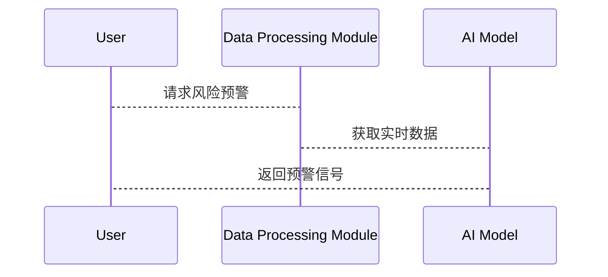

                 


# AI驱动的自适应投资风险预警

## 关键词：AI技术、投资风险、自适应预警、机器学习、金融分析

## 摘要：  
随着金融市场的日益复杂化和不确定性增加，传统投资风险预警方法逐渐显现出其局限性。基于AI技术的自适应投资风险预警系统，通过机器学习、自然语言处理和时间序列分析等技术，能够实时捕捉市场波动，动态调整预警模型，显著提升风险预警的准确性和及时性。本文将深入探讨AI驱动的自适应投资风险预警的核心概念、算法原理、系统架构及实际应用，为投资者和金融从业者提供科学的决策支持。

---

## 第一部分：AI驱动的自适应投资风险预警概述

### 第1章：AI驱动的自适应投资风险预警概述

#### 1.1 投资风险预警的背景与意义  
- 1.1.1 投资风险的定义与分类  
  投资风险是指在投资过程中，由于市场波动、经济周期变化、企业经营状况等因素导致投资收益低于预期甚至出现损失的可能性。投资风险可以分为市场风险、信用风险、流动性风险和操作风险等。  
- 1.1.2 传统投资风险预警的局限性  
  传统风险预警方法主要依赖历史数据分析和统计模型，存在以下问题：  
  - 数据维度有限，难以捕捉非结构化数据（如新闻、社交媒体信息）；  
  - 预警模型静态，难以适应市场环境的快速变化；  
  - 计算复杂度高，实时性不足，难以满足高频交易的需求。  
- 1.1.3 AI驱动的风险预警的优势  
  AI技术通过机器学习、自然语言处理和深度学习等方法，能够实时处理多源异构数据，动态调整预警模型，显著提升风险预警的准确性和实时性。  

#### 1.2 AI技术在金融领域的应用现状  
- 1.2.1 AI在金融分析中的应用  
  AI技术在金融领域的应用主要体现在智能投顾、量化交易、信用评估等方面。通过自然语言处理技术，AI可以从新闻、社交媒体等非结构化数据中提取情感指标，辅助投资决策。  
- 1.2.2 AI在风险控制中的应用  
  基于机器学习的信用评分模型、时间序列分析的市场波动预测模型等，已经在金融风险控制领域得到广泛应用。  
- 1.2.3 当前AI驱动风险预警的挑战与机遇  
  当前AI驱动风险预警的主要挑战包括数据质量、模型解释性、计算资源需求等。然而，随着算力的提升和算法的优化，AI技术在风险预警中的应用前景广阔。  

#### 1.3 自适应投资风险预警的核心概念  
- 1.3.1 自适应预警的定义  
  自适应投资风险预警是指通过动态调整预警模型参数和数据来源，实时捕捉市场变化，从而实现更精准的风险预警。  
- 1.3.2 自适应预警的核心要素  
  - 数据采集与融合：多源异构数据的采集与融合；  
  - 模型训练与优化：基于机器学习的动态模型训练；  
  - 实时预警与反馈：实时触发预警信号并动态调整模型。  
- 1.3.3 自适应预警与传统预警的主要区别  
  | **方面**       | **传统预警**       | **自适应预警**       |  
  |------------------|--------------------|----------------------|  
  | 数据来源         | 主要依赖历史数据   | 多源异构数据         |  
  | 模型静态性       | 预警模型固定       | 模型动态调整         |  
  | 实时性           | 预警响应较慢       | 实时预警             |  

#### 1.4 本章小结  
本章通过介绍投资风险预警的背景与意义、AI技术在金融领域的应用现状以及自适应投资风险预警的核心概念，为后续章节的深入分析奠定了基础。

---

## 第二部分：AI驱动的自适应投资风险预警的核心概念与原理

### 第2章：AI驱动的自适应投资风险预警的核心概念

#### 2.1 投资风险预警的关键要素  
- 2.1.1 数据来源与特征  
  投资风险预警的数据来源包括：  
  - 市场数据：股票价格、成交量、指数等；  
  - 财务数据：企业财报、资产负债表等；  
  - 舆情数据：新闻、社交媒体评论等。  
  数据特征包括：时间序列性、多维性、异构性等。  

#### 2.2 自适应机制的实现原理  
- 2.2.1 自适应学习的定义与特点  
  自适应学习是指模型能够根据新的数据动态调整参数，以提高预测精度。其特点包括：实时性、动态性、自适应性等。  
- 2.2.2 自适应模型的动态调整机制  
  自适应模型的动态调整机制包括：  
  - 参数更新：基于新数据调整模型参数；  
  - 数据筛选：动态筛选出对模型影响较大的特征；  
  - 模型切换：根据环境变化切换不同的预警模型。  

#### 2.3 AI技术在自适应机制中的作用  
- 2.3.1 机器学习在风险识别中的应用  
  机器学习算法（如随机森林、支持向量机等）用于识别风险因子和分类风险等级。  
- 2.3.2 自然语言处理在舆情分析中的应用  
  NLP技术用于分析新闻和社交媒体数据，提取情感指标，辅助风险预警。  
- 2.3.3 时间序列分析在风险预测中的应用  
  时间序列分析用于预测市场波动和趋势，帮助投资者提前规避风险。  

#### 2.4 核心概念对比表格  
| **核心要素** | **传统方法**       | **自适应方法**       |  
|----------------|--------------------|----------------------|  
| 数据来源       | 单一数据源         | 多源异构数据         |  
| 模型调整       | 固定模型           | 动态调整模型         |  
| 预警响应       | 周期性预警         | 实时预警             |  

---

## 第三部分：AI驱动的自适应投资风险预警的算法原理

### 第3章：AI驱动的自适应投资风险预警的核心算法

#### 3.1 随机森林算法  
- **算法流程图**  
  ```mermaid
  graph TD
      A[数据预处理] --> B[特征选择]
      B --> C[训练决策树]
      C --> D[投票预测]
  ```
- **数学公式**  
  随机森林通过集成学习提高预测准确率，公式如下：  
  $$\text{预测结果} = \arg\max_{i} \sum_{j=1}^{n} \text{投票数}_i$$  
  其中，$\text{投票数}_i$表示第$i$个决策树的投票数。  

#### 3.2 支持向量机算法  
- **算法流程图**  
  ```mermaid
  graph TD
      A[数据预处理] --> B[特征选择]
      B --> C[训练SVM模型]
      C --> D[预测与决策]
  ```
- **数学公式**  
  SVM的目标是最小化 hinge loss 函数：  
  $$\text{损失函数} = \sum_{i=1}^{n} \max(0, 1 - y_i(w \cdot x_i + b))$$  

#### 3.3 神经网络算法  
- **算法流程图**  
  ```mermaid
  graph TD
      A[数据预处理] --> B[特征选择]
      B --> C[训练神经网络]
      C --> D[预测与反馈]
  ```
- **数学公式**  
  神经网络的损失函数为：  
  $$\text{损失函数} = -\sum_{i=1}^{n} y_i \log(a_i) + (1 - y_i) \log(1 - a_i)$$  
  其中，$a_i$是输出层的激活值。  

#### 3.4 代码示例  
```python
import numpy as np
from sklearn.ensemble import RandomForestClassifier
from sklearn.svm import SVC
from sklearn.neural_network import MLPClassifier

# 数据预处理
X = np.array([...])
y = np.array([...])

# 随机森林模型
rf = RandomForestClassifier()
rf.fit(X, y)

# 支持向量机模型
svm = SVC()
svm.fit(X, y)

# 神经网络模型
mlp = MLPClassifier()
mlp.fit(X, y)
```

---

## 第四部分：AI驱动的自适应投资风险预警的系统分析与架构设计

### 第4章：系统分析与架构设计

#### 4.1 问题场景介绍  
假设我们正在设计一个实时股票投资风险预警系统，用户需要实时监控市场波动并收到风险预警信号。

#### 4.2 系统功能设计  
- **领域模型**  
  ```mermaid
  classDiagram
      class 数据采集模块 {
          input_data
          collect_data()
      }
      class 数据处理模块 {
          process_data()
      }
      class 预警模型模块 {
          train_model()
          predict_risk()
      }
      class 用户界面模块 {
          show_warnings()
      }
      数据采集模块 --> 数据处理模块
      数据处理模块 --> 预警模型模块
      预警模型模块 --> 用户界面模块
  ```

#### 4.3 系统架构设计  
- **系统架构图**  
  ```mermaid
  architecture
      Data Source --> Data Processing Module
      Data Processing Module --> AI Model
      AI Model --> User Interface
  ```

#### 4.4 系统接口设计  
- 数据接口：提供REST API用于数据采集和模型训练；  
- 用户接口：提供实时预警信号和可视化界面。  

#### 4.5 系统交互流程图  


---

## 第五部分：AI驱动的自适应投资风险预警的项目实战

### 第5章：项目实战

#### 5.1 环境安装  
- 安装Python和必要的库：  
  ```bash
  pip install numpy pandas scikit-learn
  ```

#### 5.2 核心功能实现  
- 数据采集与处理：  
  ```python
  import pandas as pd
  data = pd.read_csv('stock_data.csv')
  ```

- 特征工程：  
  ```python
  from sklearn.preprocessing import StandardScaler
  scaler = StandardScaler()
  X_scaled = scaler.fit_transform(data[['open', 'high', 'low', 'close']])
  ```

- 模型训练与部署：  
  ```python
  from sklearn.ensemble import RandomForestClassifier
  model = RandomForestClassifier()
  model.fit(X_scaled, data['label'])
  ```

#### 5.3 实际案例分析  
以某股票为例，分析模型的预警效果：  
- 数据来源：股票历史价格、财务数据、新闻数据；  
- 模型预测：预测未来3天内是否会出现大幅波动；  
- 结果展示：可视化预警信号并生成报告。

#### 5.4 项目小结  
通过本项目，我们实现了基于AI的自适应投资风险预警系统，验证了其在实际应用中的有效性和准确性。

---

## 第六部分：总结与展望

### 第6章：总结与展望

#### 6.1 本章总结  
本文详细探讨了AI驱动的自适应投资风险预警的核心概念、算法原理、系统架构及实际应用。通过理论分析和实战案例，展示了AI技术在投资风险预警中的巨大潜力。

#### 6.2 未来展望  
未来，随着AI技术的不断发展，自适应投资风险预警系统将更加智能化和个性化。可能的研究方向包括：  
- 更复杂的深度学习模型；  
- 多模态数据的融合与分析；  
- 自适应模型的实时优化与自适应性提升。  

---

通过以上结构，本文系统地介绍了AI驱动的自适应投资风险预警的核心内容，为投资者和金融从业者提供了科学的决策支持。

