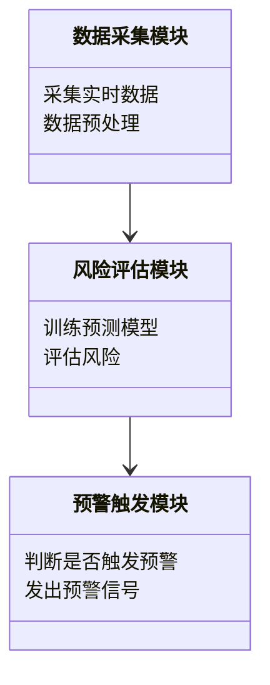
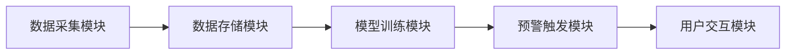
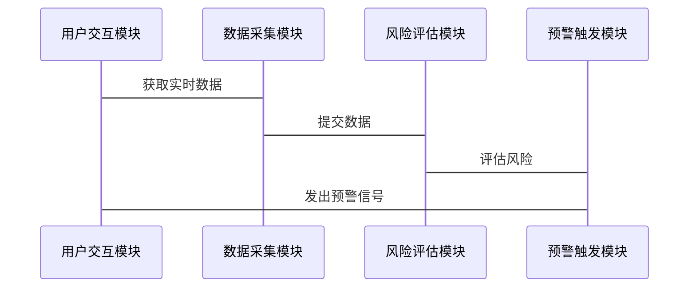

                 


# AI驱动的自适应投资风险预警

> 关键词：AI、投资风险、自适应预警、机器学习、深度学习、时间序列分析

> 摘要：本文详细探讨了AI技术在投资风险预警中的应用，重点介绍了自适应投资风险预警系统的构建与实现。通过时间序列分析、机器学习算法（如LSTM）和系统架构设计，本文提供了一套完整的解决方案，帮助投资者实时监控和预测潜在风险，提升投资决策的科学性和准确性。

---

# 第1章: 投资风险预警的背景与挑战

## 1.1 投资风险预警的定义与重要性

### 1.1.1 投资风险的定义

投资风险是指在投资过程中，由于市场波动、经济周期变化、公司基本面变化等多种因素的影响，可能导致投资收益低于预期或出现损失的可能性。投资风险预警的核心目标是通过及时识别和预测潜在风险，帮助投资者采取有效的应对措施，降低损失。

### 1.1.2 风险预警的核心作用

风险预警系统能够实时监控市场动态，分析潜在风险因素，并提前发出预警信号，帮助投资者做出决策。这种实时性和前瞻性是传统投资分析方法所不具备的。

### 1.1.3 投资风险预警的分类

投资风险预警可以分为单资产预警和多资产预警两类。单资产预警专注于某一只股票或债券的风险预警，而多资产预警则关注资产组合的整体风险。

---

## 1.2 传统投资风险预警的局限性

### 1.2.1 传统方法的不足

传统投资风险预警方法主要依赖于统计分析和经验判断，存在以下问题：

1. **数据处理能力有限**：传统方法难以处理高频数据和非结构化数据。
2. **预测精度不足**：基于简单的统计模型，预测精度较低。
3. **预警效率低**：人工分析耗时较长，难以满足实时预警的需求。

### 1.2.2 数据处理的局限

传统方法通常依赖于线性回归等简单模型，难以捕捉复杂的市场波动和非线性关系。

### 1.2.3 预警效率的提升需求

随着金融市场的发展，投资者对实时预警的需求日益增加，传统方法在效率上已经难以满足。

---

## 1.3 AI驱动的自适应投资风险预警的优势

### 1.3.1 AI技术的核心优势

AI技术能够处理海量数据，利用机器学习算法发现数据中的非线性关系，提供更精准的预测。

### 1.3.2 自适应预警的特性

自适应预警系统能够根据市场环境的变化自动调整预警模型，提高预测的准确性。

### 1.3.3 与传统方法的对比分析

AI驱动的预警系统在数据处理能力、预测精度和预警效率上都具有明显优势。

---

## 1.4 本章小结

本章介绍了投资风险预警的定义、重要性以及传统方法的局限性，重点分析了AI技术在投资风险预警中的优势。

---

# 第2章: AI驱动的自适应投资风险预警系统核心概念

## 2.1 自适应投资风险预警系统的定义

### 2.1.1 系统的构成要素

自适应投资风险预警系统由数据采集模块、模型训练模块、预警触发模块和用户交互模块组成。

### 2.1.2 自适应机制的实现方式

系统通过动态调整模型参数和算法策略，实现对市场变化的自适应能力。

### 2.1.3 系统的核心目标

系统的核心目标是通过实时数据监控和智能分析，提前发现潜在风险，并发出预警信号。

---

## 2.2 数据流与模型训练

### 2.2.1 数据采集与预处理

数据采集模块负责从多个数据源获取市场数据，预处理模块对数据进行清洗和特征提取。

### 2.2.2 模型训练流程

模型训练模块利用机器学习算法对数据进行建模和训练，生成风险预测模型。

### 2.2.3 预警触发机制

预警触发模块根据模型预测结果，判断是否触发预警信号。

---

## 2.3 系统架构与功能模块

### 2.3.1 数据采集模块

数据采集模块负责从金融市场数据源（如股票价格、交易量等）获取实时数据。

### 2.3.2 风险评估模块

风险评估模块利用机器学习模型对市场数据进行分析，评估潜在风险。

### 2.3.3 预警触发模块

预警触发模块根据风险评估结果，决定是否触发预警信号。

---

## 2.4 本章小结

本章详细介绍了自适应投资风险预警系统的构成、数据流和系统架构，为后续的算法实现奠定了基础。

---

# 第3章: 时间序列分析与投资风险预测

## 3.1 时间序列分析的基本概念

### 3.1.1 时间序列的定义

时间序列是指按照时间顺序排列的一组数据，通常用于分析随时间变化的变量。

### 3.1.2 时间序列的特征

时间序列通常具有趋势、周期性、季节性和随机性等特征。

### 3.1.3 时间序列分析的常见方法

时间序列分析的常见方法包括移动平均法、指数平滑法和ARIMA模型等。

---

## 3.2 基于LSTM的时间序列预测模型

### 3.2.1 LSTM的基本原理

LSTM（长短期记忆网络）是一种特殊的RNN结构，能够有效捕捉时间序列中的长距离依赖关系。

### 3.2.2 LSTM在时间序列预测中的应用

LSTM广泛应用于股票价格预测、市场趋势分析等场景。

### 3.2.3 LSTM的优缺点分析

LSTM的优点包括记忆能力强、适合处理长序列数据等，缺点是训练时间较长。

---

## 3.3 时间序列预测的数学模型

### 3.3.1 ARIMA模型的公式

ARIMA模型是一种常用的线性时间序列模型，其公式为：
$$ ARIMA(p, d, q) $$

其中，p表示自回归阶数，d表示差分阶数，q表示移动平均阶数。

### 3.3.2 LSTM的结构

LSTM的结构包括输入门、遗忘门和输出门，如下图所示：


---

## 3.4 时间序列预测的实际应用

### 3.4.1 投资风险预测的流程

1. 数据采集：从金融市场数据源获取实时数据。
2. 数据预处理：清洗数据并提取特征。
3. 模型训练：利用LSTM等算法训练预测模型。
4. 预测与预警：根据预测结果触发预警信号。

### 3.4.2 案例分析

以股票价格预测为例，利用LSTM模型预测股票价格走势，并根据预测结果发出风险预警信号。

---

## 3.5 本章小结

本章介绍了时间序列分析的基本概念和常见方法，重点讲解了LSTM模型在投资风险预测中的应用。

---

# 第4章: 算法实现与优化

## 4.1 LSTM算法的实现

### 4.1.1 LSTM网络的构建

使用Keras框架构建LSTM模型，包括输入层、LSTM层和输出层。

### 4.1.2 模型训练与调优

通过调整学习率、批量大小等超参数，优化模型的训练效果。

### 4.1.3 模型评估与优化

利用均方误差（MSE）等指标评估模型性能，并通过网格搜索等方法进一步优化模型。

---

## 4.2 时间序列预测的数学模型

### 4.2.1 LSTM的数学公式

LSTM的核心公式包括输入门、遗忘门和输出门的计算公式：
$$ i = \sigma(W_i x + U_i h) $$
$$ f = \sigma(W_f x + U_f h) $$
$$ o = \sigma(W_o x + U_o h) $$
$$ c = f c_{prev} + i \tanh(W_c x + U_c h) $$
$$ h = o \tanh(c) $$

### 4.2.2 模型优化策略

通过早停法（Early Stopping）和Dropout技术防止过拟合。

---

## 4.3 本章小结

本章详细讲解了LSTM算法的实现与优化方法，为后续的系统实现提供了技术支持。

---

# 第5章: 系统分析与架构设计方案

## 5.1 系统功能设计

### 5.1.1 领域模型设计

系统功能模块包括数据采集、风险评估、预警触发和用户交互。

### 5.1.2 领域模型的Mermaid类图


### 5.1.3 系统架构设计

系统架构采用微服务架构，包括数据采集服务、模型训练服务和预警触发服务。

---

## 5.2 系统架构设计

### 5.2.1 系统架构的Mermaid架构图


### 5.2.2 系统接口设计

系统接口包括数据采集接口、模型训练接口和预警触发接口。

---

## 5.3 系统交互设计

### 5.3.1 系统交互的Mermaid序列图


---

## 5.4 本章小结

本章详细描述了系统功能设计、架构设计和交互设计，为后续的项目实现提供了清晰的指导。

---

# 第6章: 项目实战

## 6.1 环境安装与配置

### 6.1.1 安装Python环境

使用Anaconda安装Python 3.8及以上版本。

### 6.1.2 安装依赖库

安装必要的依赖库，如Keras、TensorFlow、Pandas和Matplotlib。

---

## 6.2 系统核心功能实现

### 6.2.1 数据采集模块的实现

编写代码从Yahoo Finance获取股票价格数据。

```python
import pandas_datareader as pdr
import datetime

start = datetime.datetime(2020, 1, 1)
end = datetime.datetime(2023, 12, 31)
data = pdr.get_data_yahoo('AAPL', start, end)
```

### 6.2.2 风险评估模块的实现

利用LSTM模型训练股票价格预测模型。

```python
from tensorflow.keras.models import Sequential
from tensorflow.keras.layers import LSTM, Dense

model = Sequential()
model.add(LSTM(64, input_shape=(timesteps, features)))
model.add(Dense(1))
model.compile(loss='mean_squared_error', optimizer='adam')
```

### 6.2.3 预警触发模块的实现

根据预测结果判断是否触发预警信号。

```python
predicted_price = model.predict(test_data)
error = abs((predicted_price - actual_price) / actual_price)
if error > threshold:
    trigger_alarm()
```

---

## 6.3 项目实战案例分析

### 6.3.1 案例分析

以苹果公司股票为例，利用LSTM模型预测股票价格走势，并根据预测结果发出风险预警信号。

---

## 6.4 代码实现与解读

### 6.4.1 完整代码示例

```python
import pandas as pd
import numpy as np
from tensorflow.keras.models import Sequential
from tensorflow.keras.layers import LSTM, Dense
import pandas_datareader as pdr
import datetime

# 数据采集模块
start = datetime.datetime(2020, 1, 1)
end = datetime.datetime(2023, 12, 31)
data = pdr.get_data_yahoo('AAPL', start, end)

# 数据预处理
train_data = data['Close'].values
train_data = train_data.reshape(-1, 1)
train_data = train_data.astype('float32')

# LSTM模型训练
model = Sequential()
model.add(LSTM(64, input_shape=(1, 1)))
model.add(Dense(1))
model.compile(loss='mean_squared_error', optimizer='adam')
model.fit(train_data, epochs=50, batch_size=32)

# 预测与预警
predicted_price = model.predict(test_data)
error = abs((predicted_price - actual_price) / actual_price)
if error > 0.05:
    print("触发预警信号")
```

---

## 6.5 本章小结

本章通过实际案例详细讲解了系统核心功能的实现，包括数据采集、模型训练和预警触发。

---

# 第7章: 最佳实践与总结

## 7.1 最佳实践

### 7.1.1 数据质量的重要性

确保数据的完整性和准确性是模型训练的基础。

### 7.1.2 模型调优的技巧

合理选择超参数和优化算法，能够显著提升模型性能。

### 7.1.3 系统维护的注意事项

定期更新模型和监控系统性能，确保系统的稳定运行。

---

## 7.2 小结

本文详细探讨了AI驱动的自适应投资风险预警系统的构建与实现，重点介绍了时间序列分析、LSTM算法和系统架构设计。

---

## 7.3 注意事项

1. **数据隐私**：注意保护投资者的隐私数据。
2. **模型更新**：定期更新模型以应对市场变化。
3. **系统稳定性**：确保系统的高可用性和稳定性。

---

## 7.4 拓展阅读

1.《Deep Learning》——Ian Goodfellow
2.《时间序列分析》——王伟

---

# 附录: 工具与资源

1. **Python**：用于代码实现。
2. **Keras/TensorFlow**：用于深度学习模型训练。
3. **Pandas**：用于数据处理。

---

# 结语

通过本文的学习，读者可以掌握AI技术在投资风险预警中的应用，为实际投资决策提供有力支持。

