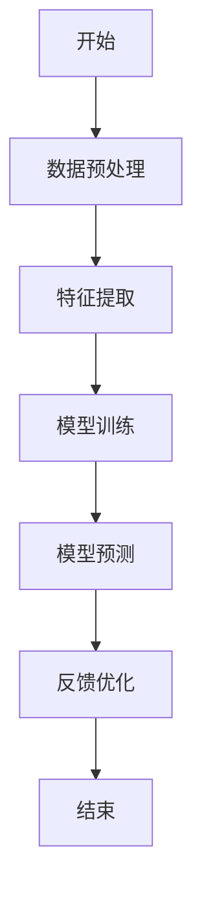
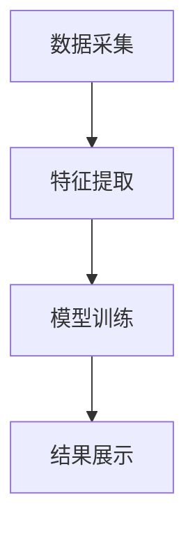

                 


# AI驱动的自适应经济周期识别器

## 关键词：AI、经济周期、自适应识别、机器学习、系统架构

## 摘要：  
本文探讨了AI在经济周期识别中的应用，提出了一个基于机器学习的自适应经济周期识别器的设计与实现。通过分析经济指标和数据特征，结合动态模型优化算法，构建了一个能够实时更新和适应市场变化的经济周期识别系统。文章详细介绍了系统的设计理念、核心算法、系统架构，并通过实际案例展示了系统的功能实现，为经济周期的智能化分析提供了新的思路。

---

# AI驱动的自适应经济周期识别器

## 第1章: 经济周期与AI驱动识别的背景

### 1.1 经济周期的基本概念
#### 1.1.1 经济周期的定义与特征
经济周期是指经济活动的波动过程，通常分为扩张、顶峰、衰退和复苏四个阶段。经济周期的识别对于政策制定、投资决策等具有重要意义。

#### 1.1.2 经济周期的分类与阶段划分
经济周期可以分为长周期和短周期，常见的阶段包括繁荣、衰退、萧条和复苏。

#### 1.1.3 经济周期研究的意义与挑战
研究经济周期有助于预测市场趋势，但传统方法依赖于专家经验，存在滞后性和主观性。

### 1.2 AI技术在经济周期分析中的应用背景
#### 1.2.1 AI技术在金融领域的应用现状
AI技术广泛应用于金融领域，如股票预测、风险评估等。

#### 1.2.2 经济周期识别的传统方法与局限性
传统方法依赖统计模型，存在计算复杂、实时性差等问题。

#### 1.2.3 AI驱动经济周期识别的优势与潜力
AI技术能够处理海量数据，实时更新模型，提高识别的准确性和效率。

### 1.3 自适应经济周期识别器的提出与目标
#### 1.3.1 自适应经济周期识别的需求背景
市场环境复杂多变，传统识别方法难以适应动态变化。

#### 1.3.2 自适应识别的核心目标与应用场景
目标是实时、准确地识别经济周期，应用场景包括投资决策、政策制定等。

#### 1.3.3 自适应识别器的技术架构与实现路径
采用动态模型优化算法，结合机器学习技术，构建自适应识别系统。

---

## 第2章: AI驱动经济周期识别的核心概念

### 2.1 经济周期识别的关键要素
#### 2.1.1 经济指标的选择与特征提取
选择GDP、失业率、通胀率等关键指标，提取时间序列特征。

#### 2.1.2 数据特征的分类与属性分析
数据特征包括均值、标准差、自相关系数等，需进行归一化处理。

#### 2.1.3 经济周期阶段的划分标准
根据指标变化趋势，将周期分为扩张、衰退、萧条、复苏四个阶段。

### 2.2 自适应识别器的核心原理
#### 2.2.1 自适应算法的基本概念与实现机制
采用动态时间序列模型，如LSTM，实时更新模型参数。

#### 2.2.2 数据流与模型更新的动态过程
数据流经预处理、特征提取、模型训练和预测，模型参数实时优化。

#### 2.2.3 自适应识别器的实时性与准确性
通过在线学习和反馈机制，提升识别的实时性和准确性。

### 2.3 核心概念对比与ER实体关系图
#### 2.3.1 数据特征与经济周期阶段的对比分析
数据特征影响模型预测的准确性和稳定性。

#### 2.3.2 ER实体关系图展示（Mermaid图）
```mermaid
erDiagram
    经济指标 <<-- 经济数据 : 包含
    经济周期阶段 <<-- 经济指标 : 影响
    数据特征 <<-- 经济指标 : 表征
```

---

## 第3章: 自适应经济周期识别器的算法原理

### 3.1 算法原理概述
#### 3.1.1 自适应识别器的基本算法框架
采用时间序列分析模型，如LSTM，进行经济周期预测。

#### 3.1.2 数据预处理与特征提取方法
数据预处理包括缺失值填充、标准化等，特征提取包括主成分分析（PCA）。

#### 3.1.3 模型训练与优化策略
使用交叉验证和网格搜索优化模型超参数。

### 3.2 算法流程图展示（Mermaid图）


### 3.3 算法实现与数学模型
#### 3.3.1 LSTM模型的数学公式
LSTM通过门控机制控制信息流动，公式如下：
$$
f_t = \sigma(W_f \cdot [h_{t-1}, x_t] + b_f)
$$
$$
i_t = \sigma(W_i \cdot [h_{t-1}, x_t] + b_i)
$$
$$
o_t = \sigma(W_o \cdot [h_{t-1}, x_t] + b_o)
$$
$$
c_t = f_t \cdot c_{t-1} + i_t \cdot tanh(W_c \cdot [h_{t-1}, x_t] + b_c)
$$
$$
h_t = o_t \cdot tanh(c_t)
$$

#### 3.3.2 模型优化与训练代码示例
```python
import numpy as np
from tensorflow.keras.models import Sequential
from tensorflow.keras.layers import LSTM, Dense, Dropout

# 数据预处理
data = ...  # 加载经济数据
X_train, y_train = preprocess(data)  # 特征提取与分割

# 模型构建
model = Sequential()
model.add(LSTM(64, input_shape=(timesteps, features)))
model.add(Dropout(0.2))
model.add(Dense(4, activation='softmax'))  # 4个经济周期阶段

# 模型训练
model.compile(loss='sparse_categorical_crossentropy', optimizer='adam', metrics=['accuracy'])
model.fit(X_train, y_train, epochs=100, batch_size=32)
```

### 3.4 模型评估与结果分析
通过准确率、召回率等指标评估模型性能，分析不同经济指标对预测结果的影响。

---

## 第4章: 自适应经济周期识别器的系统架构设计

### 4.1 系统架构概述
采用分层架构，包括数据采集层、特征提取层、模型训练层和结果展示层。

### 4.2 系统功能设计
#### 4.2.1 数据采集模块
负责采集经济指标数据，如GDP、失业率等。

#### 4.2.2 特征提取模块
对原始数据进行特征提取，如移动平均线、自相关系数等。

#### 4.2.3 模型训练模块
基于特征数据，训练LSTM模型，实时更新模型参数。

#### 4.2.4 结果展示模块
将预测结果可视化，展示经济周期阶段和趋势。

### 4.3 系统架构图展示（Mermaid图）


### 4.4 接口设计与交互流程
#### 4.4.1 数据接口
提供REST API，供外部系统调用经济周期识别结果。

#### 4.4.2 用户交互流程
用户输入经济指标数据，系统返回周期阶段和预测结果。

---

## 第5章: 项目实战与应用案例

### 5.1 项目实战
#### 5.1.1 环境安装
安装必要的库，如TensorFlow、Keras、numpy等。

#### 5.1.2 核心代码实现
实现数据预处理、模型训练和预测功能。

#### 5.1.3 代码解读与分析
详细解释代码结构和功能，分析每一步的作用。

### 5.2 实际案例分析
以2020年全球经济衰退为例，展示系统如何识别经济周期阶段。

### 5.3 案例小结
总结系统的实用性和准确性，提出改进建议。

---

## 第6章: 总结与展望

### 6.1 总结
回顾本文的主要内容，强调AI在经济周期识别中的应用价值。

### 6.2 展望
展望未来的研究方向，如多模态数据融合、强化学习应用等。

### 6.3 最佳实践 Tips
提供一些实际应用中的注意事项和优化建议。

### 6.4 小结
总结全文，重申AI驱动经济周期识别的重要性。

---

## 参考文献
列出本文引用的文献和资料，供读者进一步阅读。

