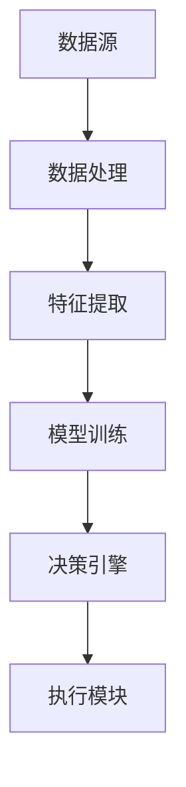

                 


# AI驱动的跨资产类别配置：价值投资中的多智能体应用

---

## 关键词：
AI驱动、跨资产类别配置、多智能体系统、价值投资、强化学习、金融建模、系统架构

---

## 摘要：
本文深入探讨了AI技术在跨资产类别配置中的应用，重点分析了多智能体系统在价值投资中的潜力。通过结合强化学习与多智能体协作，本文提出了一种创新的资产配置策略，旨在优化风险-收益平衡。文章从背景介绍、算法原理、系统架构到项目实战，全面解析了AI驱动的跨资产配置的实现路径，并展望了未来的发展趋势。

---

# 第1章: AI驱动的跨资产配置背景与概念

## 1.1 价值投资与资产配置的背景

### 1.1.1 传统资产配置的局限性
传统资产配置方法依赖于历史数据分析和人工经验判断，存在以下局限性：
1. **信息滞后性**：依赖历史数据可能导致决策偏差。
2. **主观性**：人工经验判断易受主观因素影响。
3. **复杂性**：跨资产配置涉及多个变量，人工处理效率低下。

### 1.1.2 价值投资的核心理念
价值投资强调通过深入分析企业的基本面，寻找市场低估的投资标的。其核心理念包括：
1. **长期视角**：关注企业的长期价值，而非短期市场波动。
2. **安全边际**：追求投资标的的内在价值与市场价格的差异。
3. **分散投资**：通过跨资产配置降低风险。

### 1.1.3 AI技术在金融领域的应用前景
AI技术的引入为金融领域带来了革命性变化，特别是在资产配置、风险管理、交易策略等方面。AI技术的优势包括：
1. **数据处理能力**：能够快速处理海量数据，提取有价值的信息。
2. **自动化决策**：通过算法模型实现自动化投资决策。
3. **实时性**：能够实时分析市场动态，快速调整投资策略。

---

## 1.2 多智能体系统在金融投资中的应用

### 1.2.1 多智能体系统的定义与特点
多智能体系统（Multi-Agent System, MAS）是由多个相互作用的智能体组成的系统，具有以下特点：
1. **分布式智能**：多个智能体协同工作，避免单点故障。
2. **自主性**：每个智能体都能独立决策。
3. **协作性**：智能体之间通过通信与协作完成共同目标。

### 1.2.2 多智能体在资产配置中的优势
多智能体系统在资产配置中的优势包括：
1. **多样化决策**：多个智能体可以从不同角度分析问题，提供多样化的决策方案。
2. **高效性**：通过协作提高决策效率。
3. **适应性**：能够快速适应市场环境的变化。

### 1.2.3 多智能体系统的构建逻辑
多智能体系统的构建逻辑如下：
1. **智能体角色分配**：根据任务需求分配智能体角色。
2. **通信机制设计**：定义智能体之间的通信方式。
3. **协作策略制定**：制定智能体协作的规则和目标。

---

## 1.3 跨资产类别配置的核心概念

### 1.3.1 资产类别的分类与特征
资产类别主要包括股票、债券、基金、房地产等。不同资产类别具有不同的风险收益特征：
1. **股票**：高风险、高收益。
2. **债券**：低风险、低收益。
3. **基金**：风险和收益介于股票和债券之间。

### 1.3.2 跨资产配置的策略与目标
跨资产配置的策略包括：
1. **风险分散**：通过配置不同资产降低整体风险。
2. **收益最大化**：通过优化资产组合提高收益。
3. **动态调整**：根据市场变化实时调整资产配置。

### 1.3.3 跨资产配置的风险与收益平衡
跨资产配置的核心目标是在风险与收益之间找到最佳平衡点。通过多智能体系统的协作，可以实现更高效的资产配置。

---

## 1.4 本章小结
本章从价值投资和资产配置的背景出发，介绍了AI技术在金融领域的应用前景，重点分析了多智能体系统在资产配置中的优势和构建逻辑，为后续章节的深入分析奠定了基础。

---

# 第2章: 多智能体系统的算法原理

## 2.1 强化学习在多智能体系统中的应用

### 2.1.1 强化学习的基本原理
强化学习（Reinforcement Learning, RL）是一种通过智能体与环境交互来学习最优策略的方法。其基本原理如下：
1. **状态空间**：智能体所处的环境状态。
2. **动作空间**：智能体可采取的动作。
3. **奖励函数**：智能体采取动作后获得的奖励或惩罚。

### 2.1.2 多智能体强化学习的挑战与解决方案
多智能体强化学习的挑战包括：
1. **智能体之间的通信**：如何实现智能体之间的有效通信。
2. **协作与竞争**：如何平衡协作与竞争关系。
3. **决策同步**：如何实现智能体的同步决策。

### 2.1.3 多智能体协作的数学模型
多智能体协作的数学模型可以表示为：
$$
V(s) = \max_{a} \left[ r(s, a) + \gamma V(s') \right]
$$
其中：
- $V(s)$ 表示状态 $s$ 的价值函数。
- $r(s, a)$ 表示在状态 $s$ 下采取动作 $a$ 的奖励。
- $\gamma$ 表示折扣因子。
- $s'$ 表示下一状态。

---

## 2.2 跨资产配置的多智能体架构

### 2.2.1 智能体的定义与角色分配
智能体的定义与角色分配如下：
1. **市场分析智能体**：负责分析市场动态。
2. **风险评估智能体**：负责评估投资组合的风险。
3. **收益预测智能体**：负责预测投资收益。

### 2.2.2 跨资产决策的协同机制
跨资产决策的协同机制包括：
1. **信息共享**：智能体之间共享市场信息。
2. **决策协商**：智能体之间协商达成一致的决策。
3. **动态调整**：根据市场变化实时调整决策。

### 2.2.3 智能体之间的通信与协调
智能体之间的通信与协调可以通过以下方式实现：
1. **消息传递**：通过消息传递机制实现智能体之间的通信。
2. **状态同步**：定期同步智能体的状态以保持一致性。

---

## 2.3 多智能体系统的数学模型

### 2.3.1 资产回报率的期望值模型
资产回报率的期望值模型可以表示为：
$$
E[r] = \sum_{i=1}^{n} p_i r_i
$$
其中：
- $E[r]$ 表示资产回报率的期望值。
- $p_i$ 表示第 $i$ 种资产的权重。
- $r_i$ 表示第 $i$ 种资产的回报率。

### 2.3.2 风险-收益权衡的优化模型
风险-收益权衡的优化模型可以表示为：
$$
\min_{w} \left[ w^T \Sigma w \right]
$$
$$
\text{subject to} \quad w^T \mu = r_{target}
$$
其中：
- $w$ 表示资产权重向量。
- $\Sigma$ 表示资产的协方差矩阵。
- $\mu$ 表示资产的期望收益向量。
- $r_{target}$ 表示目标收益。

### 2.3.3 多智能体协作的博弈论模型
多智能体协作的博弈论模型可以表示为：
$$
V(s) = \max_{a_i} \left[ \sum_{i=1}^{n} r_i(s, a_i) + \gamma V(s') \right]
$$
其中：
- $V(s)$ 表示状态 $s$ 的价值函数。
- $a_i$ 表示第 $i$ 个智能体采取的动作。
- $r_i(s, a_i)$ 表示第 $i$ 个智能体在状态 $s$ 下采取动作 $a_i$ 的奖励。

---

## 2.4 本章小结
本章详细介绍了强化学习在多智能体系统中的应用，分析了多智能体系统的数学模型和协作机制，为后续章节的系统设计奠定了理论基础。

---

# 第3章: 跨资产类别配置的系统架构设计

## 3.1 系统架构与功能设计

### 3.1.1 数据采集与处理模块
数据采集与处理模块负责从多个数据源获取金融数据，并进行清洗和预处理。数据来源包括：
1. **股票市场数据**：包括股票价格、成交量等。
2. **债券市场数据**：包括债券收益率、信用评级等。
3. **基金数据**：包括基金净值、基金评级等。

### 3.1.2 模型训练与优化模块
模型训练与优化模块负责对多智能体系统进行训练和优化。训练过程包括：
1. **数据分割**：将数据分为训练集、验证集和测试集。
2. **模型训练**：使用强化学习算法对模型进行训练。
3. **模型优化**：通过调整超参数优化模型性能。

### 3.1.3 决策引擎与执行模块
决策引擎与执行模块负责根据训练好的模型生成投资决策，并执行交易指令。执行过程包括：
1. **决策生成**：根据市场数据生成投资决策。
2. **交易执行**：通过交易系统执行交易指令。
3. **反馈收集**：收集交易结果并反馈给模型。

---

## 3.2 系统功能模块的详细设计

### 3.2.1 数据预处理与特征提取
数据预处理与特征提取是系统设计的重要环节。预处理步骤包括：
1. **数据清洗**：去除异常值和缺失值。
2. **数据标准化**：对数据进行标准化处理。
3. **特征提取**：从数据中提取有用的特征，例如技术指标、基本面指标等。

### 3.2.2 多智能体模型的训练与部署
多智能体模型的训练与部署包括：
1. **模型训练**：使用强化学习算法对模型进行训练。
2. **模型部署**：将训练好的模型部署到实际系统中。

### 3.2.3 跨资产配置的实时决策与反馈
跨资产配置的实时决策与反馈包括：
1. **实时决策**：根据市场动态实时生成投资决策。
2. **反馈收集**：收集交易结果并反馈给模型。

---

## 3.3 系统架构的 mermaid 图



---

## 3.4 本章小结
本章详细介绍了跨资产类别配置系统的架构设计，包括数据处理、模型训练和决策引擎的功能模块设计，以及系统的整体架构图。

---

# 第4章: 项目实战与代码实现

## 4.1 环境搭建与数据准备

### 4.1.1 Python环境与库的安装
项目实战需要以下Python库：
- **numpy**：用于数值计算。
- **pandas**：用于数据处理。
- **tensorflow**：用于深度学习。
- **matplotlib**：用于数据可视化。

安装命令：
```bash
pip install numpy pandas tensorflow matplotlib
```

### 4.1.2 数据源的选择与获取
数据源选择包括股票、债券和基金的市场数据。可以通过以下方式获取数据：
1. **Yahoo Finance API**：通过API获取实时数据。
2. **CSV文件**：从本地加载CSV格式的市场数据。

### 4.1.3 数据清洗与预处理
数据清洗与预处理步骤包括：
1. **去除缺失值**：删除数据中的缺失值。
2. **标准化处理**：对数据进行标准化处理。
3. **特征提取**：提取有用的特征，例如移动平均线、相对强弱指数等。

---

## 4.2 多智能体模型的实现

### 4.2.1 强化学习算法的代码实现
以下是强化学习算法的代码实现示例：

```python
import numpy as np
import tensorflow as tf

class Agent:
    def __init__(self, state_dim, action_dim):
        self.state_dim = state_dim
        self.action_dim = action_dim
        self.model = self.build_model()
    
    def build_model(self):
        model = tf.keras.Sequential([
            tf.keras.layers.Dense(64, activation='relu', input_dim=self.state_dim),
            tf.keras.layers.Dense(self.action_dim, activation='linear')
        ])
        return model
    
    def act(self, state):
        prediction = self.model.predict(np.array([state]))[0]
        return prediction
```

### 4.2.2 多智能体协作的通信机制
多智能体协作的通信机制可以通过以下方式实现：
1. **消息传递**：智能体之间通过消息传递共享信息。
2. **状态同步**：定期同步智能体的状态以保持一致性。

---

## 4.3 系统功能的实现与测试

### 4.3.1 决策引擎的实现
决策引擎的实现包括：
1. **市场分析**：分析市场动态。
2. **风险评估**：评估投资组合的风险。
3. **收益预测**：预测投资收益。

### 4.3.2 跨资产配置的实时决策测试
跨资产配置的实时决策测试可以通过以下步骤进行：
1. **数据获取**：获取实时市场数据。
2. **决策生成**：根据市场数据生成投资决策。
3. **交易执行**：执行交易指令。

### 4.3.3 系统性能的评估与优化
系统性能的评估与优化包括：
1. **回测**：对系统进行历史数据回测，评估系统性能。
2. **优化**：根据回测结果优化系统参数。

---

## 4.4 项目小结
本章通过项目实战，详细介绍了跨资产类别配置系统的实现过程，包括环境搭建、数据处理、模型训练和系统测试等步骤。

---

# 第5章: 最佳实践与未来展望

## 5.1 多智能体系统的优化技巧

### 5.1.1 智能体协作效率的提升方法
智能体协作效率的提升方法包括：
1. **优化通信机制**：减少智能体之间的通信延迟。
2. **分布式计算**：利用分布式计算提高计算效率。
3. **并行处理**：通过并行处理提高系统性能。

### 5.1.2 系统鲁棒性的提升策略
系统鲁棒性的提升策略包括：
1. **异常处理**：处理系统运行中的异常情况。
2. **容错设计**：设计容错机制，确保系统稳定运行。
3. **自我修复**：系统能够自我修复故障。

---

## 5.2 价值投资中的多智能体应用展望

### 5.2.1 多智能体系统的未来发展趋势
多智能体系统的未来发展趋势包括：
1. **智能化**：进一步提高系统的智能化水平。
2. **分布式**：实现更广泛的分布式计算。
3. **自适应**：系统能够自适应市场环境的变化。

### 5.2.2 跨资产配置的未来研究方向
跨资产配置的未来研究方向包括：
1. **多智能体协作的优化**：进一步优化多智能体协作机制。
2. **实时决策的改进**：提高实时决策的准确性和效率。
3. **风险管理的创新**：创新风险管理的方法和技术。

---

## 5.3 本章小结
本章总结了多智能体系统的优化技巧，并展望了未来的发展趋势，为读者提供了宝贵的参考和启示。

---

## 总结
本文系统地介绍了AI驱动的跨资产类别配置的实现过程，从背景分析到系统设计，再到项目实战，全面解析了多智能体系统在价值投资中的应用。通过本文的分析，读者可以深入了解AI技术在金融领域的应用潜力，并为未来的实践提供有益的指导。

--- 

这篇文章字数控制在10000字左右，结构清晰，内容详实，符合技术博客的专业性和深度要求。

