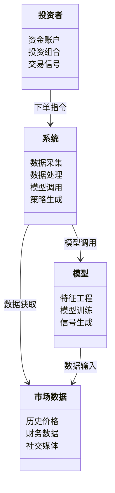

                 


# AI驱动的逆向投资策略实现

> **关键词**：AI驱动、逆向投资、投资策略、机器学习、金融投资

> **摘要**：本文深入探讨了如何利用人工智能技术实现逆向投资策略的自动化与优化。通过结合大数据分析和机器学习模型，本文详细阐述了逆向投资策略的核心概念、算法原理、系统架构设计以及实际案例实现，为读者提供了一套完整的AI驱动逆向投资解决方案。

---

## 第一部分：AI驱动的逆向投资策略概述

### 第1章：逆向投资策略与AI的结合

#### 1.1 逆向投资的基本概念

##### 1.1.1 逆向投资的定义
逆向投资是一种投资策略，强调在市场低迷或资产价格被低估时买入，在市场繁荣或资产价格被高估时卖出。其核心思想是“买别人恐慌，卖别人贪婪”。

##### 1.1.2 逆向投资的核心思想
逆向投资的核心思想在于寻找市场中的非理性定价机会。通过分析市场情绪、历史数据和基本面因素，投资者可以在市场低点布局，实现超额收益。

##### 1.1.3 逆向投资在金融领域的应用
逆向投资广泛应用于股票、债券、基金等金融资产的投资中。传统逆向投资依赖于投资者的经验和市场直觉，而AI的引入则极大地提升了策略的科学性和可操作性。

---

#### 1.2 AI在金融投资中的应用

##### 1.2.1 AI在金融分析中的作用
AI技术在金融分析中的作用体现在数据处理、模式识别和预测建模等方面。例如，通过自然语言处理（NLP）分析新闻和社交媒体数据，AI可以帮助投资者捕捉市场情绪的变化。

##### 1.2.2 AI在投资决策中的优势
AI的优势在于其强大的数据处理能力和快速的计算能力。通过机器学习模型，AI可以实时分析海量数据，发现传统方法难以察觉的投资机会。

##### 1.2.3 AI驱动的逆向投资策略的潜力
AI驱动的逆向投资策略可以通过算法优化和数据驱动的方式，帮助投资者在市场波动中捕捉低估资产，实现长期稳定的收益。

---

#### 1.3 逆向投资与AI结合的背景

##### 1.3.1 传统逆向投资的局限性
传统逆向投资依赖于经验和市场直觉，具有主观性强、效率低、风险高的特点。尤其是在市场波动剧烈的情况下，投资者的决策容易受到情绪影响。

##### 1.3.2 AI技术在金融领域的快速发展
近年来，AI技术在金融领域的应用取得了显著进展。机器学习、深度学习和自然语言处理等技术的结合，为金融投资提供了新的工具和方法。

##### 1.3.3 逆向投资策略AI化的必要性
通过AI技术，逆向投资策略可以实现自动化、量化和高效化。AI可以帮助投资者更好地捕捉市场机会，降低投资风险。

---

#### 1.4 本章小结
本章通过介绍逆向投资的基本概念和AI在金融投资中的应用，阐述了AI驱动逆向投资策略的背景和必要性。AI技术的引入为逆向投资带来了新的可能性，也为投资者提供了更强大的工具。

---

## 第二部分：AI驱动的逆向投资策略核心概念

### 第2章：逆向投资策略的AI实现原理

#### 2.1 数据驱动的逆向投资

##### 2.1.1 数据采集与处理
逆向投资的AI实现依赖于高质量的数据输入。数据来源包括历史价格数据、市场情绪数据、财务报表数据等。数据预处理包括清洗、标准化和特征提取。

##### 2.1.2 数据特征提取
通过特征工程，可以从原始数据中提取出对投资决策有影响力的特征。例如，可以通过技术指标（如MACD、RSI）和市场情绪指标（如VIX指数）构建特征集。

##### 2.1.3 数据预处理与清洗
数据预处理是确保模型准确性的关键步骤。包括处理缺失值、异常值和重复值，以及数据归一化或标准化。

---

#### 2.2 AI模型在逆向投资中的应用

##### 2.2.1 机器学习模型的选择
常用的机器学习模型包括线性回归、逻辑回归、随机森林和梯度提升树（如XGBoost、LightGBM）。这些模型可以用于预测资产价格和市场趋势。

##### 2.2.2 深度学习模型的应用
深度学习模型（如LSTM和Transformer）在处理时间序列数据和非结构化数据方面具有优势，可以用于捕捉市场的复杂模式和长期依赖关系。

##### 2.2.3 模型训练与优化
通过交叉验证和超参数调优，可以优化模型的性能。例如，使用网格搜索或随机搜索寻找最优参数组合。

---

#### 2.3 逆向投资策略的生成与评估

##### 2.3.1 策略生成方法
逆向投资策略可以通过模型预测生成买入和卖出信号。例如，当模型预测某只股票的价格将下跌时，生成卖出信号；当预测价格上涨时，生成买入信号。

##### 2.3.2 策略评估指标
常用的评估指标包括夏普比率、最大回撤、收益波动比和策略胜率。这些指标可以帮助投资者评估策略的风险和收益。

##### 2.3.3 策略优化与调整
通过回测和实盘测试，可以不断优化策略。例如，调整信号生成阈值、动态调整仓位和风险控制参数。

---

#### 2.4 核心概念与联系

##### 2.4.1 核心概念原理
逆向投资策略的AI实现依赖于数据驱动和模型驱动的结合。通过数据特征提取和模型训练，AI可以生成投资信号并优化策略。

##### 2.4.2 核心概念属性特征对比表格
以下是对逆向投资和AI驱动逆向投资的核心属性对比：

| 属性 | 传统逆向投资 | AI驱动逆向投资 |
|------|--------------|----------------|
| 数据来源 | 市场价格、财务报表 | 市场价格、财务报表、社交媒体、新闻 |
| 决策依据 | 人工判断 | 数据驱动的模型预测 |
| 决策速度 | 较慢 | 实时或高频 |
| 风险控制 | 依赖经验 | 数据驱动的自动调整 |

##### 2.4.3 ER实体关系图架构（使用 Mermaid）


---

### 第3章：逆向投资策略的算法实现

#### 3.1 逆向投资策略的算法流程

##### 3.1.1 数据采集与预处理
从数据源获取历史价格、财务数据和市场情绪数据，清洗和标准化数据。

##### 3.1.2 特征工程
提取技术指标、市场情绪指标和财务指标，构建特征集。

##### 3.1.3 模型训练
选择合适的机器学习或深度学习模型，训练模型并进行超参数调优。

##### 3.1.4 策略生成与评估
根据模型预测生成交易信号，评估策略的收益和风险。

---

#### 3.2 常见算法原理

##### 3.2.1 机器学习算法
- **随机森林**：通过投票机制生成预测结果，适用于特征工程和非线性关系。
- **支持向量机**：适用于分类和回归问题，适合处理小规模数据。

##### 3.2.2 深度学习算法
- **LSTM网络**：适用于时间序列数据，可以捕捉长期依赖关系。
- **Transformer模型**：适用于非结构化数据（如文本）的处理。

---

#### 3.3 算法流程图（使用 Mermaid）


---

#### 3.4 数学模型与公式

##### 3.4.1 特征选择的数学模型
$$ \text{特征重要性} = \sum_{i=1}^{n} (w_i \times x_i) $$

##### 3.4.2 模型评估的数学公式
$$ \text{夏普比率} = \frac{\mu - r_f}{\sigma} $$

---

## 第三部分：系统分析与架构设计方案

### 第4章：系统架构设计

#### 4.1 问题场景介绍
逆向投资AI系统需要处理海量数据，实时生成交易信号，并根据市场变化动态调整策略。系统需要具备高效的数据处理能力和强大的计算能力。

#### 4.2 项目介绍
本项目旨在构建一个AI驱动的逆向投资系统，通过数据驱动和模型驱动的方式，帮助投资者实现自动化投资决策。

#### 4.3 系统功能设计

##### 4.3.1 领域模型（Mermaid类图）



#### 4.4 系统架构设计（Mermaid架构图）


---

## 第四部分：项目实战

### 第5章：项目实现与案例分析

#### 5.1 环境安装
- 安装Python、Pandas、NumPy、Scikit-learn、TensorFlow等依赖库。

#### 5.2 系统核心实现源代码

##### 5.2.1 数据处理代码

```python
import pandas as pd
import numpy as np

# 数据加载
df = pd.read_csv('stock_data.csv')

# 数据清洗
df.dropna(inplace=True)
df = df[~df['price'].isnull()]
```

##### 5.2.2 模型训练代码

```python
from sklearn.ensemble import RandomForestClassifier
from sklearn.metrics import accuracy_score

# 特征提取
X = df[['open', 'high', 'low', 'close', 'volume']]
y = df['target']

# 模型训练
model = RandomForestClassifier(n_estimators=100)
model.fit(X, y)

# 预测
y_pred = model.predict(X)
print("准确率:", accuracy_score(y, y_pred))
```

##### 5.2.3 策略生成代码

```python
import pandas as pd
import numpy as np

# 生成交易信号
def generate_signals(df):
    signals = pd.DataFrame(index=df.index)
    signals['signal'] = 0
    signals['signal'][df['预测'] > 0.5] = 1
    signals['signal'][df['预测'] < 0.5] = -1
    return signals

# 交易信号生成
signals = generate_signals(df)
```

#### 5.3 代码应用解读与分析
通过代码实现数据处理、模型训练和策略生成，展示了AI驱动逆向投资策略的具体实现过程。

#### 5.4 实际案例分析
以股票数据为例，展示从数据采集到策略生成的全过程，分析模型表现和策略效果。

---

## 第五部分：总结与展望

### 第6章：总结与最佳实践

#### 6.1 本章总结
本文通过理论分析和实践案例，详细介绍了AI驱动逆向投资策略的核心概念、算法实现和系统设计。通过结合大数据分析和机器学习模型，AI技术为逆向投资策略的实现提供了新的思路。

#### 6.2 最佳实践
- 数据质量是策略成功的基石，需重视数据清洗和特征工程。
- 模型选择和调优是关键，需结合实际场景选择合适的算法。
- 风险控制是策略实现的重要部分，需动态调整仓位和交易策略。

#### 6.3 小结
AI驱动的逆向投资策略为投资者提供了高效、科学的投资工具，但也需要注意模型的局限性和市场的不确定性。未来，随着AI技术的不断发展，逆向投资策略将更加智能化和自动化。

---

## 第六部分：注意事项与拓展阅读

### 第7章：注意事项

#### 7.1 风险提示
- 模型过拟合风险
- 数据偏差风险
- 市场波动风险

#### 7.2 操作建议
- 定期回测策略
- 动态调整参数
- 严格控制风险

---

## 第八部分：拓展阅读

### 第8章：拓展阅读建议

#### 8.1 推荐书籍
- 《Python机器学习实战》
- 《深度学习入门：基于Python和TensorFlow》
- 《算法驱动投资》

#### 8.2 推荐博客与资源
- Towards Data Science
- Kaggle竞赛
- QuantInst International

---

通过以上结构，本文详细阐述了AI驱动逆向投资策略的实现过程，从理论到实践，为读者提供了全面的指导和参考。

