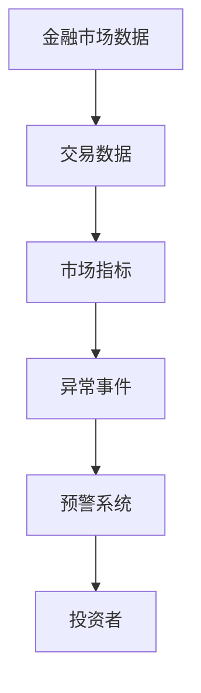
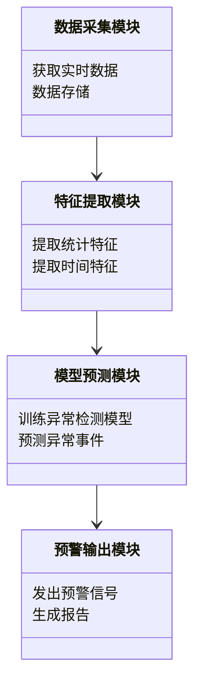
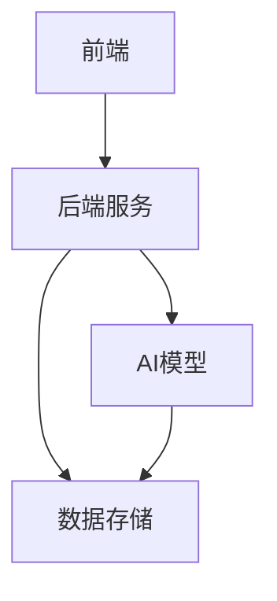
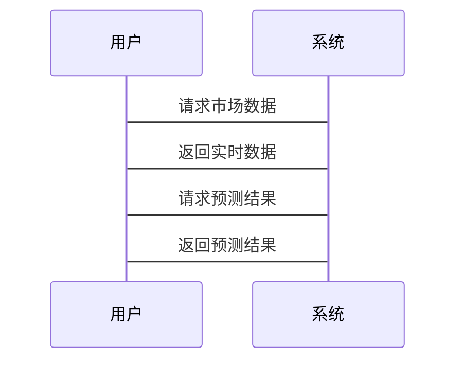

                 


# AI驱动的金融市场异常波动预警系统

## 关键词：AI，金融市场，异常波动，预警系统，时间序列分析，深度学习，金融数据分析

## 摘要：本文介绍了一种基于AI的金融市场异常波动预警系统，详细探讨了其核心概念、算法原理、系统架构、项目实战和最佳实践。通过对时间序列分析、深度学习模型和系统设计的深入讲解，展示了如何利用AI技术实现金融市场风险预警，为投资者和金融机构提供有效的决策支持。

---

# 第1章: 金融市场异常波动预警系统背景介绍

## 1.1 问题背景与描述

### 1.1.1 什么是金融市场异常波动
金融市场异常波动是指市场价格在短时间内出现极端偏离正常波动范围的情况，通常由突发事件或市场情绪变化引发。

### 1.1.2 异常波动对投资者和市场的危害
异常波动可能导致投资者损失，破坏市场稳定性，甚至引发系统性风险。

### 1.1.3 传统预警方法的局限性
传统方法依赖于经验判断和简单的统计指标，缺乏实时性和准确性。

## 1.2 AI驱动的异常波动预警系统
### 1.2.1 AI在金融市场的应用现状
AI技术在金融数据分析、风险评估等领域广泛应用。

### 1.2.2 异常波动预警的核心问题
通过实时数据分析，提前识别潜在风险。

### 1.2.3 系统的目标与边界
目标是实时监测市场数据，及时发出预警信号；边界包括数据采集、特征提取、模型训练和结果输出。

## 1.3 问题解决思路
### 1.3.1 数据驱动的预警方法
通过分析历史数据，识别异常模式。

### 1.3.2 AI算法在异常检测中的作用
利用机器学习和深度学习技术，提高预警系统的准确性和实时性。

### 1.3.3 系统的整体架构
系统由数据采集、特征提取、模型训练和预警输出四个模块组成。

---

# 第2章: 核心概念与联系

## 2.1 核心概念原理

### 2.1.1 数据特征提取
从市场数据中提取有用的特征，如波动率、交易量和市场情绪指标。

### 2.1.2 异常检测算法
采用基于统计和机器学习的方法，如Isolation Forest和One-Class SVM。

### 2.1.3 预警机制设计
通过阈值设定和多模型融合，优化预警效果。

## 2.2 核心概念属性对比

### 2.2.1 数据特征对比表
| 特征 | 描述 | 示例 |
|------|------|------|
| 波动率 | 市场价格波动程度 | 历史波动率均值 |
| 交易量 | 市场交易活跃度 | 成交量变化率 |

### 2.2.2 算法性能对比表
| 算法 | 优点 | 缺点 |
|------|------|------|
| ARIMA | 易解释 | 无法捕捉复杂模式 |
| LSTM | 长期依赖 | 训练时间长 |

### 2.2.3 系统架构对比表
| 组件 | 功能 | 依赖 |
|------|------|------|
| 数据采集 | 获取实时数据 | 数据源接口 |
| 特征提取 | 提取特征 | 数据预处理工具 |

## 2.3 ER实体关系图架构


---

# 第3章: 异常检测算法原理

## 3.1 时间序列分析

### 3.1.1 ARIMA模型
ARIMA模型用于预测时间序列数据，公式为：
$$ ARIMA(p, d, q) $$
其中，p为自回归阶数，d为差分阶数，q为移动平均阶数。

### 3.1.2 LSTM网络
LSTM通过长短期记忆单元捕捉时间依赖关系，结构包括输入门、遗忘门和输出门。

### 3.1.3 Prophet模型
Prophet模型基于分解时间序列的可加模型，适用于非平稳数据。

## 3.2 基于深度学习的异常检测

### 3.2.1 单变量时间序列检测
使用变异系数和Kolmogorov-Smirnov检验识别异常值。

### 3.2.2 多变量分析
通过主成分分析（PCA）降维，识别多变量异常模式。

### 3.2.3 异常检测流程
1. 数据预处理：标准化和缺失值填充。
2. 特征提取：提取统计特征和时间特征。
3. 模型训练：训练异常检测模型。
4. 预警输出：实时监控并发出预警信号。

---

# 第4章: 系统分析与架构设计方案

## 4.1 问题场景介绍
系统需要实时监测多个金融市场，识别潜在异常波动。

## 4.2 项目介绍
构建一个实时监控平台，集成数据采集、特征提取、模型预测和预警输出功能。

## 4.3 系统功能设计


## 4.4 系统架构设计


## 4.5 系统接口设计
定义API接口，如：
- GET /market_data 获取实时数据
- POST /predict 提交特征数据，返回预测结果

## 4.6 系统交互设计


---

# 第5章: 项目实战

## 5.1 环境安装
安装Python、TensorFlow、Pandas等库：
```bash
pip install numpy pandas tensorflow scikit-learn
```

## 5.2 核心实现

### 5.2.1 数据预处理
```python
import pandas as pd
data = pd.read_csv('market_data.csv')
data = data.dropna().reset_index(drop=True)
```

### 5.2.2 特征提取
```python
from sklearn.preprocessing import StandardScaler
scaler = StandardScaler()
features = scaler.fit_transform(data[['volatility', 'volume']])
```

### 5.2.3 模型训练
```python
from tensorflow.keras.models import Sequential
from tensorflow.keras.layers import LSTM, Dense

model = Sequential()
model.add(LSTM(64, input_shape=(1, 2)))
model.add(Dense(1, activation='sigmoid'))
model.compile(loss='binary_crossentropy', optimizer='adam')
model.fit(X_train, y_train, epochs=10, batch_size=32)
```

### 5.2.4 预警系统
```python
def predict_anomaly(model, scaler, new_data):
    new_data_scaled = scaler.transform(new_data)
    prediction = model.predict(new_data_scaled)
    return prediction > 0.5
```

## 5.3 实际案例分析
以某次市场波动为例，展示数据处理、模型预测和预警输出的全过程。

## 5.4 项目小结
项目实现了从数据采集到预警输出的完整流程，验证了AI在金融异常波动预警中的有效性。

---

# 第6章: 最佳实践与总结

## 6.1 最佳实践 tips
- 数据质量至关重要，需做好清洗和预处理。
- 模型选择需结合业务需求和数据特性。
- 系统需具备可扩展性和容错性。

## 6.2 小结
本文详细介绍了AI驱动的金融市场异常波动预警系统的构建过程，从理论到实践，全面覆盖了系统设计和实现的关键点。

## 6.3 注意事项
- 定期更新模型，避免过时。
- 优化系统性能，确保实时性。
- 注意数据隐私和安全。

## 6.4 拓展阅读
推荐相关书籍和论文，进一步学习AI在金融领域的应用。

---

# 附录: 参考文献

列出本文中引用的文献和工具，如TensorFlow官方文档、相关学术论文等。

---

# 结束语
感谢读者的耐心阅读，希望本文能为AI在金融市场异常波动预警中的应用提供有价值的参考。

