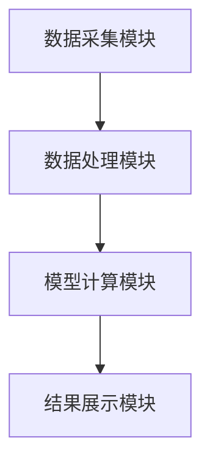

                 


# Black-Litterman模型：结合主观观点与市场均衡

**关键词**：Black-Litterman模型、资产配置、投资组合优化、贝叶斯推断、市场均衡定价、风险管理

**摘要**：本文深入探讨了Black-Litterman模型，这是一种结合主观投资观点与市场均衡定价的资产配置方法。文章首先介绍模型的背景与核心概念，然后从数学基础、实现步骤到实际应用，详细分析了模型的原理与优势。通过案例分析和系统架构设计，展示了如何将模型应用于实际投资组合优化中。最后，本文总结了模型的优缺点，并提出了进一步研究的方向。

---

# 正文

## 第一部分: Black-Litterman模型概述

### 第1章: Black-Litterman模型的背景与概念

#### 1.1 资产配置的基本概念
资产配置是投资管理中的核心任务，旨在在不同资产类别之间分配资金，以实现风险与收益的最佳平衡。传统资产配置方法（如均值-方差模型）依赖于对市场参数（如均值和方差）的估计，但这些参数往往难以准确估计，且容易受到市场波动和投资者主观观点的影响。

**有效前沿**：有效前沿是马科维茨提出的一个概念，表示在给定风险水平下，能够提供最高预期收益的投资组合的集合。然而，传统均值-方差模型的局限性在于其对市场参数的敏感性以及对市场均衡假设的依赖。

**传统方法的局限性**：传统资产配置方法通常假设市场参数是客观且固定的，忽略了投资者主观观点的重要性。此外，当市场处于均衡状态时，传统方法难以有效结合投资者的主观看法。

---

#### 1.2 Black-Litterman模型的提出背景
Black-Litterman模型于1992年由R. Black和R. Litterman提出，旨在解决传统资产配置方法的局限性。该模型结合了市场均衡定价和投资者的主观观点，为资产配置提供了一种更加灵活和实用的方法。

**传统资产定价模型的不足**：传统模型（如CAPM和APT）虽然提供了资产定价的理论框架，但难以直接应用于实际资产配置。这些模型通常假设市场参数是固定的，且难以处理投资者的主观观点。

**结合主观观点与市场均衡的需求**：投资者在实际投资决策中往往会结合自身的市场观点和市场均衡定价。Black-Litterman模型正是基于这一需求，提出了将主观观点与市场均衡定价相结合的方法。

**模型的核心思想**：Black-Litterman模型通过贝叶斯推断，将市场均衡定价（如CAPM）与投资者的主观观点相结合，生成一种更加稳健的资产配置方案。

---

#### 1.3 Black-Litterman模型的基本框架
Black-Litterman模型的核心框架包括以下几个关键要素：

1. **市场中性**：模型假设市场处于均衡状态，且市场权重反映了市场对各资产的定价。
2. **主观观点输入**：投资者可以输入对市场收益的主观看法，并通过贝叶斯推断将其与市场均衡定价相结合。
3. **风险调整**：模型通过调整资产的方差和协方差矩阵，对市场均衡定价和主观观点进行风险调整，以生成最终的资产配置方案。

---

## 第二部分: Black-Litterman模型的核心概念与原理

### 第2章: Black-Litterman模型的核心概念与原理

#### 2.1 模型的核心框架
Black-Litterman模型的核心框架可以用以下公式表示：

$$
r_i = r_f + \beta_i (R_m - r_f) + \epsilon_i
$$

其中：
- \( r_i \) 是资产 \( i \) 的预期收益；
- \( r_f \) 是无风险利率；
- \( \beta_i \) 是资产 \( i \) 的贝塔系数；
- \( R_m \) 是市场预期收益；
- \( \epsilon_i \) 是模型误差项。

该模型通过结合市场均衡定价和投资者主观观点，对资产收益进行调整。

---

#### 2.2 模型的贝叶斯推断过程
贝叶斯推断是Black-Litterman模型的核心，通过将市场均衡定价和投资者主观观点相结合，生成更加稳健的资产收益估计。

**贝叶斯推断的步骤**：
1. **先验分布**：基于市场均衡定价模型（如CAPM）生成先验收益分布。
2. **后验分布**：结合投资者的主观观点，对先验分布进行调整，生成后验收益分布。
3. **推断结果**：通过贝叶斯推断，生成最终的资产收益估计。

---

#### 2.3 模型与传统资产配置方法的对比
Black-Litterman模型与传统资产配置方法的主要区别在于其结合了主观观点和市场均衡定价。

**对比表格**：

| 对比维度              | Black-Litterman模型                      | 传统均值-方差模型                  |
|-----------------------|------------------------------------------|------------------------------------|
| 是否结合主观观点      | 是                                       | 否                                  |
| 是否依赖市场均衡定价   | 是                                       | 是                                  |
| 对市场参数的敏感性     | 较低                                     | 较高                                 |
| 应用场景               | 结合主观观点与市场均衡定价               | 客观参数估计                        |

---

## 第三部分: Black-Litterman模型的实现与应用

### 第3章: Black-Litterman模型的实现步骤

#### 3.1 数据准备
**步骤1**：收集市场数据，包括资产的收益率、市场指数收益率等。
**步骤2**：计算资产的贝塔系数和其他市场参数。

#### 3.2 模型参数设定
**步骤3**：设定无风险利率 \( r_f \) 和市场预期收益 \( R_m \)。
**步骤4**：输入投资者的主观观点，如对各资产收益的预期。

#### 3.3 模型优化
**步骤5**：使用优化算法（如二次规划）求解最优资产配置。

---

### 第4章: Black-Litterman模型的实际应用

#### 4.1 实际案例分析
以股票投资组合优化为例，展示如何将模型应用于实际投资决策。

**案例分析**：
- 假设投资者对某股票的收益预期为10%，但市场均衡定价为8%。
- 使用Black-Litterman模型结合这两者，生成最终的收益估计。

---

## 第四部分: Black-Litterman模型的系统架构与实现

### 第5章: 系统架构设计

**系统功能模块**：
1. 数据采集模块：收集市场数据和投资者观点。
2. 模型计算模块：执行贝叶斯推断和优化计算。
3. 结果展示模块：输出优化后的资产配置方案。

**系统架构图**：



---

## 第五部分: Black-Litterman模型的项目实战

### 第6章: 项目实战

#### 6.1 环境安装
**安装Python和相关库**：
```bash
pip install numpy pandas scipy
```

#### 6.2 核心实现
**Python代码示例**：

```python
import numpy as np
import pandas as pd

# 数据准备
returns = pd.DataFrame(...)
market_returns = pd.Series(...)

# 模型参数
rf = 0.05
Rm = 0.1
subjective_views = {'资产A': 0.1, '资产B': 0.08}

# Black-Litterman模型实现
def black_litterman(returns, rf, Rm, subjective_views):
    # 计算贝塔系数
    beta = ...
    # 贝叶斯推断
    posterior_returns = ...
    return posterior_returns

# 优化算法
from scipy.optimize import minimize

def optimize_portfolio(weights, returns, risk_aversion):
    def objective(weights):
        return -weights.dot(returns) + 0.5 * risk_aversion * weights.T.dot(weights)
    return minimize(objective, weights, bounds=[(0,1)]*len(weights))

# 生成最终配置
weights = optimize_portfolio(initial_weights, posterior_returns, risk_aversion=0.05)
```

---

## 第六部分: 总结与展望

### 第7章: 总结与展望

#### 7.1 总结
Black-Litterman模型通过结合主观观点和市场均衡定价，为资产配置提供了一种更加灵活和实用的方法。其核心优势在于能够将投资者的主观看法与市场数据相结合，生成更加稳健的投资组合。

#### 7.2 未来研究方向
- 更复杂的市场模型（如多因子模型）的结合。
- 动态调整模型的参数和假设。
- 更广泛的应用场景（如风险管理、机构投资）。

---

## 第七部分: 学习与实践

### 第8章: 学习建议与注意事项

- **学习建议**：建议读者结合实际案例，深入理解模型的数学推导和优化算法。
- **注意事项**：在实际应用中，需注意模型的假设条件和参数选择的敏感性。

---

**附录**：
- 详细数学公式推导
- 代码实现的详细注释
- 数据来源和处理方法

---

通过以上步骤，我们可以系统地理解和实现Black-Litterman模型，并将其应用于实际投资组合优化中。希望本文能为读者提供清晰的思路和实践指导。

