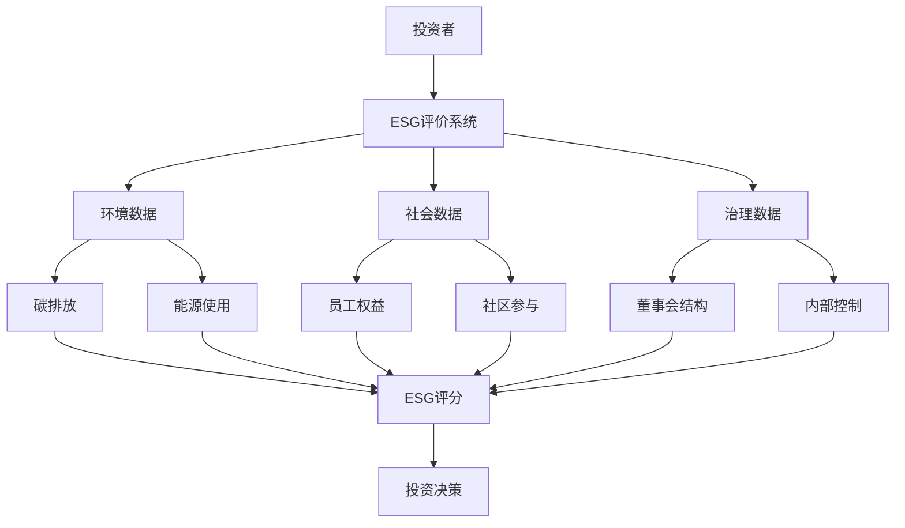
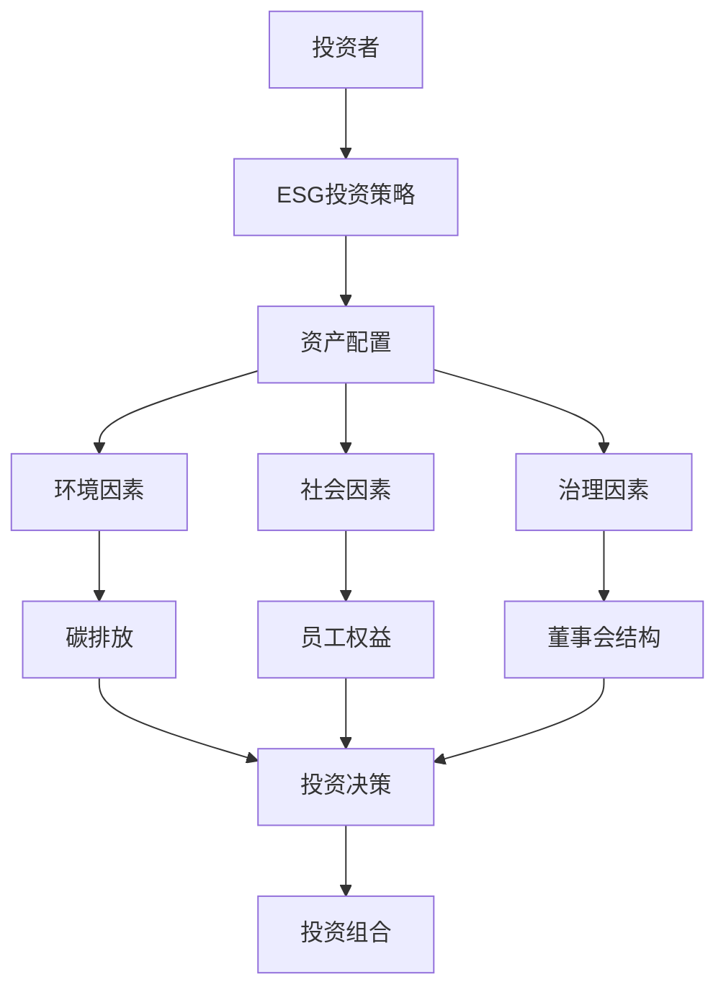
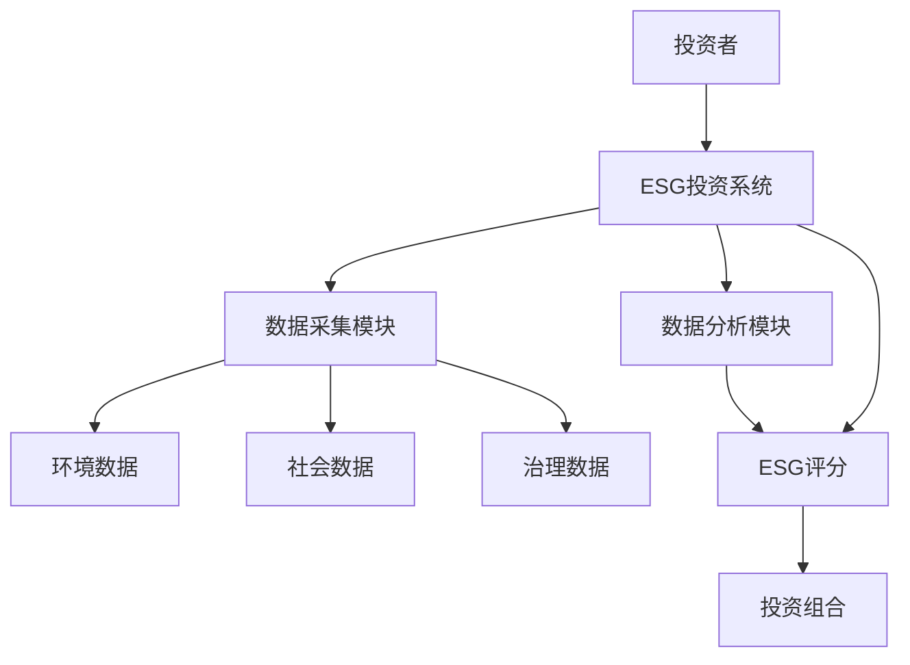

                 

# ESG投资策略：平衡社会责任和财务回报

> 关键词：ESG投资，社会责任，财务回报，可持续投资，环境、社会和治理（ESG）

> 摘要：本文探讨了ESG投资策略的核心概念、评价体系、投资策略、实际应用、绩效分析、技术应用以及未来趋势。通过详细分析环境、社会和治理因素，结合数学模型和系统架构，为投资者提供平衡社会责任和财务回报的策略。

---

# 第1章: ESG投资概述

## 1.1 ESG投资的定义与背景

### 1.1.1 什么是ESG投资
ESG投资是一种关注环境、社会和治理因素的投资策略。通过评估企业在这些方面的表现，投资者可以选择那些在可持续发展方面表现良好的企业，从而实现财务回报与社会责任的平衡。

### 1.1.2 ESG投资的起源与发展
ESG投资起源于20世纪60年代的社会责任投资（SRI），随着全球对环境保护和社会问题的重视，ESG投资逐渐成为主流策略。近年来，气候变化、社会不平等和公司治理问题推动了ESG投资的快速发展。

### 1.1.3 ESG投资的核心理念与目标
ESG投资的核心理念是通过关注企业对环境、社会和治理的贡献，筛选出具有可持续发展潜力的企业。其目标是实现长期财务回报的同时，推动社会进步和环境保护。

---

## 1.2 ESG投资的重要性

### 1.2.1 ESG投资对社会的意义
ESG投资有助于解决社会问题，如气候变化、贫富差距和社会不公。通过投资于具有社会责任感的企业，投资者可以间接推动社会进步。

### 1.2.2 ESG投资对企业的价值
企业通过遵守ESG标准，可以提升品牌形象、降低风险并增强竞争力。投资者倾向于选择那些在ESG方面表现良好的企业，这为企业提供了更多的融资机会。

### 1.2.3 ESG投资对投资者的影响
ESG投资不仅关注财务回报，还关注企业的长期可持续性。研究表明，ESG表现良好的企业往往具有更高的抗风险能力和长期盈利能力。

---

## 1.3 ESG投资的边界与外延

### 1.3.1 ESG投资的适用范围
ESG投资适用于多种资产类别，包括股票、债券、基金和房地产等。其应用范围广泛，从个人投资到机构投资均可采用。

### 1.3.2 ESG投资与其他投资策略的区别
与传统投资策略相比，ESG投资更注重非财务因素，如企业治理和环境保护。虽然传统投资关注财务回报，但ESG投资强调平衡财务回报与社会责任。

### 1.3.3 ESG投资的潜在挑战与限制
ESG投资的挑战包括数据不透明、评级标准不统一以及短期回报不稳定等问题。此外，某些行业的ESG表现可能难以量化，增加了投资难度。

---

# 第2章: ESG评价体系的核心要素

## 2.1 ESG评价指标

### 2.1.1 环境（Environmental）指标
- **碳排放**：企业温室气体排放量。
- **能源使用**：企业能源消耗情况。
- **资源利用**：企业对自然资源的依赖程度。

### 2.1.2 社会（Social）指标
- **员工权益**：员工待遇、工作条件和员工发展。
- **社区参与**：企业对社区的支持和贡献。
- **产品责任**：产品对消费者和社会的影响。

### 2.1.3 治理（Governance）指标
- **董事会结构**：董事会的独立性和多样性。
- **内部控制**：企业治理和风险管理机制。
- **透明度**：企业信息披露的充分性和及时性。

---

## 2.2 ESG评级方法

### 2.2.1 评级机构的评价标准
- **MSCI**：提供ESG评级，从AAA到CCC不等。
- **晨星（Morningstar）**：基于ESG因素对基金进行评级。
- **标普全球（S&P Global）**：提供ESG评分，从1到10分。

### 2.2.2 评级指标的权重分配
- 环境因素权重：40%
- 社会因素权重：30%
- 治理因素权重：30%

### 2.2.3 评级结果的解读与应用
- 投资者可以根据评级结果筛选企业或基金。
- 评级结果可以帮助投资者识别高风险企业，降低投资风险。

---

## 2.3 ESG评价体系的数学模型

### 2.3.1 ESG评分公式
$$ ESG\ Score = 0.4 \times E + 0.3 \times S + 0.3 \times G $$

其中，E、S、G分别为环境、社会和治理评分，取值范围为0-10。

### 2.3.2 风险调整后收益模型
$$ Risk\ Adjusted\ Return = R - ESG\ Risk $$

其中，R为投资回报，ESG Risk为因ESG问题导致的潜在风险调整。

---

## 2.4 ESG评价体系的系统架构

---

# 第3章: ESG投资策略的理论基础

## 3.1 投资组合理论与ESG整合

### 3.1.1 马科维茨投资组合理论
马科维茨的投资组合理论强调在风险可控的前提下，通过分散投资实现最大收益。ESG投资可以通过分散投资于不同ESG表现的企业，降低整体风险。

### 3.1.2 ESG因素在投资组合中的作用
- **风险分散**：ESG表现良好的企业有助于降低投资组合的整体风险。
- **收益增强**：长期来看，ESG表现良好的企业可能具有更高的回报。

### 3.1.3 如何平衡风险与收益
- **资产配置**：将ESG投资与其他资产类别结合，平衡风险与收益。
- **动态调整**：定期评估投资组合的ESG表现，及时调整。

---

## 3.2 CAPM模型与ESG溢价

### 3.2.1 CAPM模型的基本原理
CAPM（资本资产定价模型）用于计算资产的预期收益率，公式为：
$$ E(R_i) = R_f + \beta_i (R_m - R_f) $$

其中，$R_f$为无风险利率，$R_m$为市场预期收益率，$\beta_i$为资产的贝塔系数。

### 3.2.2 ESG因素对预期收益的影响
ESG因素可以通过影响贝塔系数和市场风险溢价来影响预期收益。研究表明，ESG表现良好的企业可能具有更低的贝塔系数和更高的市场风险溢价。

### 3.2.3 ESG溢价的实证分析
研究发现，ESG表现良好的企业可能具有较高的溢价，即在相同风险下，ESG企业可能具有更高的预期收益。

---

## 3.3 ESG投资策略的系统架构

---

## 3.4 ESG投资策略的数学模型

### 3.4.1 ESG投资组合优化模型
$$ Maximize\ Return = \sum_{i=1}^{n} w_i R_i $$
$$ Subject\ to: \sum_{i=1}^{n} w_i = 1 $$
$$ w_i \geq 0,\forall i $$

其中，$w_i$为第i个资产的投资权重，$R_i$为第i个资产的预期收益。

### 3.4.2 风险调整后的收益模型
$$ Risk\ Adjusted\ Return = R - ESG\ Risk $$

其中，ESG Risk为因ESG问题导致的潜在风险调整。

---

## 3.5 ESG投资策略的系统实现

### 3.5.1 系统功能设计
- 数据采集：采集企业ESG数据。
- 数据分析：分析ESG数据，生成ESG评分。
- 投资决策：基于ESG评分，生成投资组合。

### 3.5.2 系统架构设计

---

# 第4章: ESG投资策略的实施路径

## 4.1 确定投资目标与约束

### 4.1.1 投资目标的设定
- **财务目标**：预期收益、风险承受能力。
- **社会目标**：支持特定的社会事业，如环境保护或社会责任。

### 4.1.2 风险承受能力的评估
- **风险厌恶程度**：投资者对风险的容忍度。
- **投资期限**：长期投资更适合ESG投资。

### 4.1.3 投资范围的界定
- **资产类别**：股票、债券、基金等。
- **行业选择**：选择与ESG目标相关的行业。

---

## 4.2 构建ESG投资组合

### 4.2.1 资产配置
- **多样化配置**：将资金分配到不同资产类别和行业中。
- **行业配置**：选择在ESG方面表现良好的行业。

### 4.2.2 个股选择
- **ESG评分筛选**：选择ESG评分较高的企业。
- **公司治理分析**：评估企业的治理结构和透明度。

### 4.2.3 基金选择
- **ESG基金**：选择专门投资于ESG企业的基金。
- **ETF选择**：选择跟踪ESG指数的ETF。

---

## 4.3 定期评估与调整

### 4.3.1 定期评估
- **定期复查**：每季度或半年评估投资组合的ESG表现。
- **市场变化**：根据市场变化调整投资组合。

### 4.3.2 动态调整
- **资产再平衡**：根据市场变化和ESG表现，调整资产权重。
- **行业调整**：根据ESG表现，调整行业配置。

---

## 4.4 ESG投资策略的系统实现

### 4.4.1 系统功能设计
- 数据采集：采集企业ESG数据。
- 数据分析：分析ESG数据，生成ESG评分。
- 投资决策：基于ESG评分，生成投资组合。

### 4.4.2 系统架构设计

---

## 4.5 ESG投资策略的数学模型

### 4.5.1 ESG投资组合优化模型
$$ Maximize\ Return = \sum_{i=1}^{n} w_i R_i $$
$$ Subject\ to: \sum_{i=1}^{n} w_i = 1 $$
$$ w_i \geq 0,\forall i $$

其中，$w_i$为第i个资产的投资权重，$R_i$为第i个资产的预期收益。

### 4.5.2 风险调整后的收益模型
$$ Risk\ Adjusted\ Return = R - ESG\ Risk $$

其中，ESG Risk为因ESG问题导致的潜在风险调整。

---

# 总结与展望

## 5.1 总结
ESG投资是一种平衡社会责任和财务回报的投资策略。通过关注环境、社会和治理因素，投资者可以选择具有可持续发展潜力的企业，实现长期财务回报。ESG投资不仅有助于推动社会进步和环境保护，还能降低投资风险，增强投资组合的稳定性。

## 5.2 展望
未来，随着全球对可持续发展的关注不断增加，ESG投资将更加重要。技术的进步，如大数据和人工智能，将推动ESG投资的进一步发展。投资者需要不断学习和适应，抓住ESG投资带来的机遇，同时应对潜在的挑战。

---

## 5.3 最佳实践Tips

- **长期投资**：ESG投资适合长期投资者，避免短期波动的影响。
- **多样化配置**：将资金分配到不同资产类别和行业中，降低风险。
- **持续学习**：关注ESG投资的最新动态和研究成果，优化投资策略。

---

## 5.4 小结
通过本文的分析，读者可以了解到ESG投资的核心概念、评价体系、投资策略和实际应用。希望本文能为投资者提供有价值的参考，帮助他们在追求财务回报的同时，承担社会责任，推动社会进步。

---

## 5.5 注意事项

- **数据准确性**：ESG数据的准确性和透明度对投资决策至关重要。
- **评级差异**：不同评级机构的ESG评级可能存在差异，需谨慎选择。
- **短期回报**：ESG投资可能在短期内表现不佳，需耐心持有。

---

## 5.6 拓展阅读

- **书籍推荐**：
  - 《ESG Investing: Balancing Social Responsibility and Financial Return》
  - 《The Sustainable Investment Handbook》
- **报告参考**：
  - MSCI ESG评级报告
  - 晨星ESG投资报告
- **网站链接**：
  - [MSCI ESG Research](https://www.msci.com/esg)
  - [晨星ESG投资](https://www.morningstar.com/esg)

---

通过本文的详细分析，读者可以全面了解ESG投资的核心内容和实际应用，为平衡社会责任和财务回报提供有力支持。

