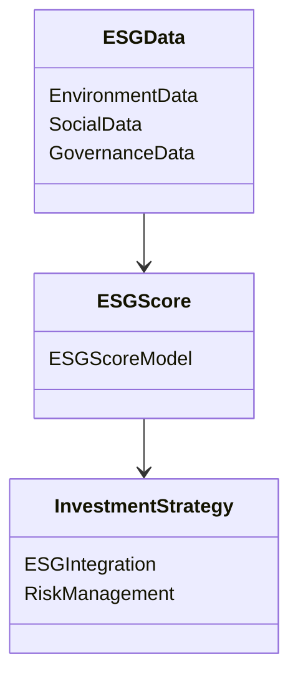
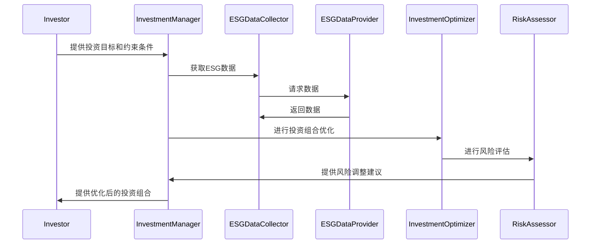

                 


# ESG整合策略：将可持续发展因素纳入投资流程

## 关键词：ESG投资、可持续发展、环境因素、社会因素、公司治理

## 摘要：  
随着全球对可持续发展的关注不断增加，将ESG（环境、社会、治理）因素纳入投资决策已成为一种趋势。本文详细探讨了ESG整合的背景、核心概念、方法论以及在投资中的实际应用。通过分析ESG整合的策略框架、行业应用和系统架构，本文为投资者提供了如何将ESG因素融入投资流程的具体指导，并通过案例分析展示了其对风险管理和投资收益的双重积极作用。

---

## 第一部分: ESG整合策略的背景与核心概念

### 第1章: ESG的基本概念与背景

#### 1.1 ESG的定义与内涵

##### 1.1.1 环境（Environmental）的定义与特征
环境因素关注企业在资源使用、碳排放、污染控制等方面的实践。例如，企业是否采取了有效的环保措施，是否符合相关环保法规，以及是否在产品生命周期中减少了对环境的负面影响。

##### 1.1.2 社会（Social）的定义与特征
社会因素关注企业在员工权益、社会责任、社区关系等方面的表现。例如，企业是否遵守劳工权益，是否积极参与社会公益事业，以及是否在供应链中确保了社会公平性。

##### 1.1.3 治理（Governance）的定义与特征
治理因素关注企业的公司治理结构、董事会构成、高管薪酬、内部控制等方面。例如，企业是否建立了有效的风险管理机制，是否透明披露信息，以及是否避免了利益冲突。

#### 1.2 ESG的历史发展与现状

##### 1.2.1 ESG概念的起源与发展
ESG概念起源于20世纪60年代的环境运动，70年代开始关注社会和治理因素。进入21世纪后，随着气候变化和企业社会责任的呼声高涨，ESG投资逐渐成为全球关注的焦点。

##### 1.2.2 全球ESG投资的现状与趋势
近年来，全球ESG投资规模快速增长，机构投资者越来越重视ESG表现。根据统计，截至2023年，全球ESG管理资产规模已超过25万亿美元，占全球管理资产的三分之一以上。

##### 1.2.3 ESG在不同地区的实践差异
不同地区的ESG实践存在差异。例如，欧洲市场更注重环境因素，北美市场更关注治理因素，而亚洲市场则在快速崛起中，注重社会和治理因素。

#### 1.3 ESG投资的重要性与意义

##### 1.3.1 ESG与可持续发展的关系
ESG是实现可持续发展的关键因素。通过关注环境、社会和治理问题，企业可以在长期发展中减少对环境的破坏，促进社会公平，并建立良好的公司治理结构。

##### 1.3.2 ESG对投资决策的影响
ESG因素可以作为投资决策的重要参考。通过评估企业的ESG表现，投资者可以更好地识别和规避风险，同时选择具有长期价值的企业。

##### 1.3.3 ESG对风险管理和收益的双重作用
ESG投资不仅有助于规避环境和社会风险，还能带来超额收益。研究表明，ESG表现良好的企业通常具有更强的抗风险能力和更高的长期回报率。

---

### 第2章: ESG整合的背景与驱动因素

#### 2.1 全球经济与金融体系的变化

##### 2.1.1 全球化与金融化的背景
全球化使得企业的影响范围不断扩大，金融化使得企业的治理结构和透明度要求不断提高。这些变化推动了ESG投资的兴起。

##### 2.1.2 环境问题的加剧与社会不平等问题的凸显
气候变化、资源枯竭、贫富差距等问题的加剧，使得企业和投资者不得不关注环境和社会因素。

##### 2.1.3 治理失效对企业与投资者的影响
公司治理失效可能导致企业陷入财务危机或声誉损失，这对投资者来说是巨大的风险。

#### 2.2 投资者需求的变化

##### 2.2.1 机构投资者的ESG投资趋势
越来越多的机构投资者将ESG因素纳入投资策略，尤其是在养老基金和保险公司中，ESG投资已成为重要的配置方向。

##### 2.2.2 个人投资者对ESG的关注
随着环保意识的增强，越来越多的个人投资者也开始关注ESG因素，希望他们的投资既能创造收益，又能对社会产生积极影响。

##### 2.2.3 ESG投资与长期价值创造的关系
ESG投资注重长期价值，而非短期收益。通过关注企业的可持续发展能力，投资者可以更好地实现长期收益目标。

#### 2.3 政策与监管环境的影响

##### 2.3.1 国际政策框架（如巴黎协定、SDGs）
国际政策如巴黎协定和联合国可持续发展目标（SDGs）为ESG投资提供了明确的方向和框架。

##### 2.3.2 各国政府对ESG投资的鼓励与规范
许多国家通过税收优惠、补贴等方式鼓励ESG投资，同时加强监管，确保ESG信息披露的真实性。

##### 2.3.3 监管机构对ESG信息披露的要求
监管机构要求企业公开ESG相关信息，这为投资者提供了更透明的投资决策依据。

---

## 第三部分: ESG整合的核心概念与方法论

### 第3章: ESG整合的策略与框架

#### 3.1 ESG整合的定义与目标

##### 3.1.1 什么是ESG整合
ESG整合是指将环境、社会和治理因素融入投资决策的全过程，包括筛选、评估和监控。

##### 3.1.2 ESG整合的目标与原则
ESG整合的目标是实现长期价值最大化，同时降低环境和社会风险。其原则包括透明性、一致性、可量化和可操作性。

##### 3.1.3 ESG整合与传统投资策略的区别
传统的投资策略主要关注财务指标，而ESG整合将非财务因素纳入考虑，更加注重企业的可持续发展能力。

#### 3.2 ESG整合的实施步骤

##### 3.2.1 确定ESG整合的目标与范围
投资者需要明确ESG整合的目标，例如减少碳足迹、支持社会公益或提高公司治理水平。

##### 3.2.2 数据收集与分析
通过收集企业的ESG数据，包括环境排放数据、社会责任报告和治理结构信息，进行分析和评估。

##### 3.2.3 ESG评分与投资决策
根据企业的ESG表现进行评分，将其作为投资决策的重要参考。

##### 3.2.4 持股策略与影响力投资
通过持股策略和影响力投资，推动企业采取更加可持续的实践。

#### 3.3 ESG整合的关键要素

##### 3.3.1 数据来源与质量
数据来源包括企业的自我披露、第三方评级机构的数据和政府公开信息。数据质量直接影响ESG评估的准确性。

##### 3.3.2 ESG评分模型与方法
常用的ESG评分模型包括加权评分法、因子分析法和情景分析法。每种方法都有其优缺点，需要根据具体情况选择。

##### 3.3.3 投资组合优化与风险调整
通过优化投资组合，将ESG因素与财务目标相结合，同时进行风险调整，确保投资组合的稳健性。

---

## 第四部分: ESG整合的实践与应用

### 第4章: ESG整合在投资组合管理中的应用

#### 4.1 投资组合管理中的ESG整合方法

##### 4.1.1 基于ESG评分的筛选与配置
通过ESG评分筛选出表现良好的企业，合理配置投资组合。

##### 4.1.2 ESG因子与投资收益的关系
研究表明，ESG因子与投资收益存在正相关关系，尤其是在长期投资中表现更为显著。

##### 4.1.3 ESG在风险管理中的作用
ESG因素可以识别和规避潜在的环境和社会风险，提高投资组合的稳定性。

#### 4.2 行业分析与ESG投资机会

##### 4.2.1 高碳行业的转型机会
高碳行业如能源和制造业可以通过技术升级和绿色转型，创造新的投资机会。

##### 4.2.2 社会责任突出行业的投资潜力
社会责任突出的行业如教育、医疗和环保科技具有较高的投资价值。

---

## 第五部分: ESG整合的系统架构与技术实现

### 第5章: ESG整合的系统架构设计

#### 5.1 系统功能设计（领域模型）



#### 5.2 系统架构设计


#### 5.3 系统接口设计与交互



---

## 第六部分: ESG整合的项目实战与最佳实践

### 第6章: 项目实战与经验分享

#### 6.1 项目背景介绍

#### 6.2 核心实现源代码

```python
import pandas as pd

def calculate_esg_score(dataframe):
    # 示例：计算ESG评分
    environment_score = dataframe['EnvironmentMetrics'].mean()
    social_score = dataframe['SocialMetrics'].mean()
    governance_score = dataframe['GovernanceMetrics'].mean()
    return {
        'Environment': environment_score,
        'Social': social_score,
        'Governance': governance_score
    }

# 示例数据
data = {
    'Company': ['A', 'B', 'C'],
    'EnvironmentMetrics': [85, 70, 90],
    'SocialMetrics': [80, 65, 85],
    'GovernanceMetrics': [75, 80, 70]
}
df = pd.DataFrame(data)
result = calculate_esg_score(df)
print(result)
```

#### 6.3 项目总结与小结

---

## 第七部分: 最佳实践与未来展望

### 第7章: 最佳实践与未来趋势

#### 7.1 最佳实践 tips
- 选择可靠的ESG数据源和评分模型。
- 定期更新和优化投资组合。
- 与利益相关方保持透明沟通。

#### 7.2 未来发展趋势
- 数字化和智能化的ESG投资工具。
- 更加严格的ESG信息披露要求。
- 全球化的ESG投资合作。

---

## 结语

通过本文的详细讲解，读者可以全面了解ESG整合的背景、方法和应用。随着可持续发展理念的深入，ESG投资必将在全球范围内发挥越来越重要的作用。

