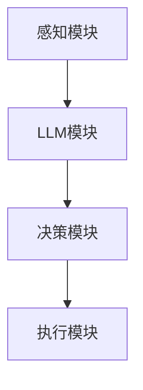
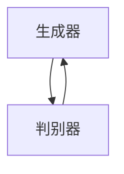

                 


# LLM在AI Agent中的文本风格融合与创新

---

## 关键词：
- AI Agent, 大语言模型（LLM）, 文本风格融合, 创新, NLP, 机器学习, 对抗训练

---

## 摘要：
本文探讨了大语言模型（LLM）在AI Agent中的文本风格融合与创新。通过分析LLM与AI Agent的核心原理，结合实际案例，详细阐述了文本风格融合的实现方法、创新策略以及系统架构设计。文章从理论到实践，深入剖析了LLM在AI Agent中的应用场景，提出了优化建议，并展望了未来的发展方向。

---

# 第1章: AI Agent与LLM的背景与概念

## 1.1 AI Agent的基本概念
### 1.1.1 AI Agent的定义与特点
AI Agent（智能体）是指能够感知环境、自主决策并执行任务的智能系统。它具有以下特点：
- **自主性**：无需外部干预，自主完成任务。
- **反应性**：能够实时感知环境并做出反应。
- **目标导向性**：基于目标进行决策和行动。

### 1.1.2 AI Agent的核心功能与应用场景
AI Agent的核心功能包括：
- **感知**：通过传感器或数据源获取信息。
- **决策**：基于感知信息做出最优决策。
- **执行**：通过执行器完成任务。

应用场景包括智能助手、自动驾驶、智能客服等。

### 1.1.3 AI Agent与传统AI的区别
传统AI注重任务解决，而AI Agent更强调自主性和实时性，能够与环境动态交互。

## 1.2 大语言模型（LLM）的基本概念
### 1.2.1 LLM的定义与技术特点
大语言模型（LLM）是指基于深度学习的大型神经网络模型，具有以下特点：
- **大规模训练**：使用海量数据进行预训练。
- **多任务能力**：能够处理多种NLP任务。
- **生成能力**：能够生成自然语言文本。

### 1.2.2 LLM与AI Agent的结合
LLM作为AI Agent的核心模块，负责文本理解和生成，提升AI Agent的自然语言处理能力。

### 1.2.3 LLM在文本风格融合中的作用
LLM能够通过上下文理解和生成，实现不同文本风格的融合与创新。

## 1.3 本章小结
本章介绍了AI Agent和LLM的基本概念及其在文本风格融合中的作用，为后续内容奠定了基础。

---

# 第2章: LLM与AI Agent的核心原理

## 2.1 LLM的工作原理
### 2.1.1 LLM的训练过程
LLM通过监督微调和无监督预训练结合，学习语言模型。

### 2.1.2 LLM的文本生成机制
基于概率分布生成文本，通过解码器生成tokens。

### 2.1.3 LLM的文本理解能力
通过编码器提取文本特征，理解上下文。

## 2.2 AI Agent的内部结构
### 2.2.1 AI Agent的目标设定
明确AI Agent的目标，如完成对话任务。

### 2.2.2 AI Agent的决策机制
基于感知信息和目标，选择最优行动。

### 2.2.3 AI Agent的执行流程
感知-决策-执行的循环流程。

## 2.3 LLM与AI Agent的结合原理
### 2.3.1 LLM作为AI Agent的核心模块
LLM负责文本生成和理解。

### 2.3.2 LLM在AI Agent中的角色与功能
LLM作为AI Agent的语言中枢，负责与用户交互。

### 2.3.3 LLM与AI Agent的交互方式
通过API或内部调用实现交互。

## 2.4 核心概念对比表
| 比较维度 | LLM | AI Agent |
|----------|-----|----------|
| 核心功能 | 文本生成与理解 | 感知、决策、执行 |
| 应用场景 | NLP任务 | 多领域智能应用 |
| 优势 | 强大的语言能力 | 自主性和目标导向性 |

## 2.5 本章小结
本章详细分析了LLM与AI Agent的核心原理，揭示了它们的结合方式和优势。

---

# 第3章: 文本风格融合的原理与方法

## 3.1 文本风格融合的基本概念
### 3.1.1 文本风格的定义与分类
文本风格包括语气、用词习惯等，可分类为正式、口语化等。

### 3.1.2 文本风格融合的目标与意义
融合不同风格文本，生成多样化的输出。

### 3.1.3 文本风格融合的挑战与解决方案
挑战包括风格一致性、语义连贯性等，解决方案包括对抗训练、多任务学习。

## 3.2 LLM在文本风格融合中的优势
### 3.2.1 LLM的多模态能力
能够处理文本、语音等多种模态数据。

### 3.2.2 LLM的上下文理解能力
能够理解上下文，保持风格一致。

### 3.2.3 LLM的生成能力与风格控制
通过调整参数，控制生成文本的风格。

## 3.3 文本风格融合的具体实现方法
### 3.3.1 基于LLM的风格迁移技术
通过预训练模型，将一种风格迁移到另一种风格。

### 3.3.2 基于LLM的风格融合算法
结合多种风格特征，生成融合后的文本。

### 3.3.3 基于LLM的风格创新方法
通过对抗训练，生成全新的风格。

## 3.4 本章小结
本章探讨了文本风格融合的实现方法，强调了LLM在其中的重要作用。

---

# 第4章: LLM在AI Agent中的创新应用

## 4.1 创新应用的背景与目标
通过创新应用，提升AI Agent的文本生成能力。

## 4.2 创新方法与实现
### 4.2.1 对抗训练
通过生成器和判别器的对抗，提升生成文本的多样性。

### 4.2.2 多模态融合
结合文本、图像等多种模态，生成更丰富的文本。

### 4.2.3 微调策略
针对特定任务，对LLM进行微调，提升效果。

## 4.3 创新案例分析
### 4.3.1 多风格对话生成
基于LLM的对话生成系统，支持多种风格切换。

### 4.3.2 多语言文本生成
LLM支持多种语言，实现跨语言的文本风格融合。

## 4.4 本章小结
本章通过具体案例，展示了LLM在AI Agent中的创新应用。

---

# 第5章: 系统架构与实现方案

## 5.1 系统架构设计
### 5.1.1 系统功能模块
- **感知模块**：获取用户输入。
- **LLM模块**：处理文本生成与理解。
- **决策模块**：基于LLM输出做出决策。
- **执行模块**：完成具体任务。

### 5.1.2 系统架构图


## 5.2 算法实现
### 5.2.1 对抗训练流程


### 5.2.2 LLM数学模型
$$P(y|x) = \text{softmax}(Wx + b)$$

## 5.3 项目实战
### 5.3.1 环境安装
```bash
pip install transformers
```

### 5.3.2 核心代码实现
```python
from transformers import AutoTokenizer, AutoModelForCausalLM
model = AutoModelForCausalLM.from_pretrained('gpt2')
tokenizer = AutoTokenizer.from_pretrained('gpt2')
```

### 5.3.3 案例分析
通过代码实现一个多风格文本生成系统，分析其优缺点。

## 5.4 本章小结
本章详细设计了系统的架构与实现方案，提供了具体的代码示例。

---

# 第6章: 总结与展望

## 6.1 总结
本文探讨了LLM在AI Agent中的文本风格融合与创新，分析了其核心原理和实现方法。

## 6.2 最佳实践Tips
- **模型选择**：根据任务选择合适的LLM模型。
- **数据预处理**：确保数据质量和多样性。
- **微调优化**：针对特定任务进行微调。

## 6.3 未来展望
未来，LLM在AI Agent中的应用将更加广泛，结合更多创新技术，如多模态和实时交互。

---

# 结语

通过本文的探讨，我们可以看到，LLM在AI Agent中的文本风格融合与创新具有广阔的应用前景。未来，随着技术的进步，AI Agent将更加智能化，能够更好地满足用户的需求。

---

