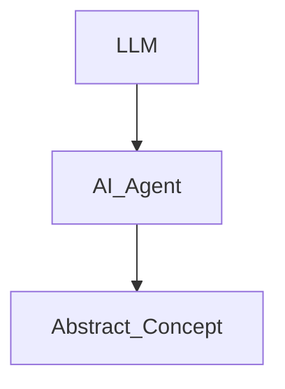
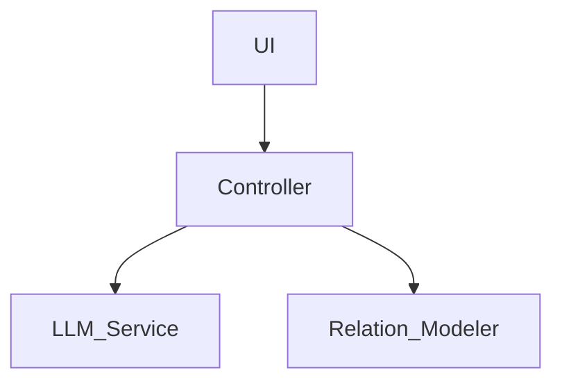

                 


# LLM在AI Agent抽象概念形成中的应用

## 关键词
- 大语言模型（LLM）
- AI Agent
- 抽象概念形成
- 语义理解
- 智能系统架构

## 摘要
本文探讨了大语言模型（LLM）在AI Agent抽象概念形成中的应用。通过分析LLM的核心原理，结合AI Agent的需求，提出了基于LLM的概念提取、关系建模和动态优化的算法。文章还详细介绍了系统架构设计和实际项目实现，为读者提供理论支持和实践指导。

---

# 第一部分: LLM与AI Agent概述

## 第1章: 问题背景与描述

### 1.1 问题背景
随着AI Agent的应用场景越来越广泛，如何让AI Agent具备理解和处理抽象概念的能力成为关键。LLM的出现为这一问题提供了新的解决方案。

### 1.2 问题描述
AI Agent需要从大量数据中提取抽象概念，这些概念需要通过语义理解和关联推理来形成。传统的基于规则的方法效率低下，而LLM的引入能够显著提升概念形成的效率和准确性。

### 1.3 解决方法
通过LLM的强大语义理解能力，AI Agent可以更高效地提取和关联抽象概念，形成更高级别的知识表示。

### 1.4 边界与外延
本文仅关注LLM在AI Agent中的具体应用，不涉及其他技术细节。

## 第2章: 核心概念与联系

### 2.1 LLM与AI Agent的关系
LLM为AI Agent提供了语义理解和知识表示的能力，AI Agent则为LLM提供了应用场景和反馈机制。

### 2.2 核心概念属性对比
| 概念 | 属性 | 描述 |
|------|-------|------|
| LLM  | 模型类型 | 基于Transformer的生成模型 |
| AI Agent | 功能 | 通过LLM实现抽象概念形成 |

### 2.3 实体关系图


---

# 第二部分: LLM与AI Agent的核心原理

## 第3章: LLM的核心原理

### 3.1 注意力机制
LLM通过注意力机制关注输入中的重要部分，从而提高语义理解的准确性。

### 3.2 Transformer架构
Transformer的自注意力机制使得LLM能够捕捉到数据中的长距离依赖关系。

## 第4章: AI Agent的抽象概念形成

### 4.1 概念提取
AI Agent从输入数据中提取关键词和短语，作为初步的概念表示。

### 4.2 概念关联
通过关系建模，AI Agent将这些概念连接起来，形成一个完整的知识图谱。

---

# 第三部分: LLM与AI Agent的算法实现

## 第5章: 算法流程

### 5.1 输入处理
将输入文本转换为模型可以处理的格式。

### 5.2 概念提取
使用预训练的LLM模型提取关键概念。

### 5.3 关系建模
通过图结构表示概念之间的关系。

### 5.4 输出生成
生成符合要求的输出结果。

## 第6章: 数学模型

### 6.1 概念提取公式
$$v_i = \sum_{j=1}^{n} w_{ij}x_j$$

### 6.2 关系建模公式
$$A_{ij} = \text{softmax}(v_i^T v_j)$$

### 6.3 输出生成公式
$$P(y|x) = \prod_{i=1}^{m} P(y_i|x_{<i})$$

---

# 第四部分: 系统架构与设计

## 第7章: 系统架构设计方案

### 7.1 应用场景
AI Agent在多个领域中的应用，如自然语言处理和知识管理。

### 7.2 系统功能设计
- 概念提取模块
- 关系建模模块
- 输出生成模块

### 7.3 系统架构图


---

# 第五部分: 项目实战

## 第8章: 项目实现

### 8.1 环境安装
安装必要的Python库和框架。

### 8.2 核心代码实现
```python
def extract_concepts(text):
    # 概念提取算法
    pass

def model_relations(concepts):
    # 关系建模算法
    pass

def generate_output(concepts, relations):
    # 输出生成算法
    pass
```

### 8.3 案例分析
通过具体案例展示项目的实现和应用效果。

### 8.4 项目总结
总结项目的成果和经验教训。

---

# 第六部分: 总结与展望

## 第9章: 总结
回顾本文的主要内容和结论。

## 第10章: 展望
探讨未来的研究方向和潜在的应用领域。

---

# 参考文献
- [1] 维基百科：大语言模型
- [2] 维基百科：AI Agent

---

通过以上目录结构，文章内容将系统地介绍LLM在AI Agent抽象概念形成中的应用，从理论到实践，为读者提供全面的指导。

