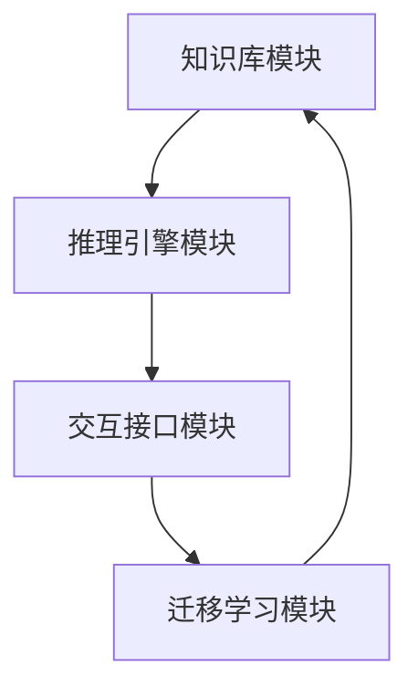

                 


# LLM支持的AI Agent跨域知识迁移技术

## 关键词：LLM, AI Agent, 跨域知识迁移, 人工智能, 知识表示, 系统架构, 项目实战

## 摘要：本文深入探讨了大语言模型（LLM）支持的AI Agent在跨域知识迁移中的技术原理与实现方法。从基本概念到算法原理，从系统架构设计到项目实战，系统性地介绍了如何利用LLM实现AI Agent的知识迁移，解决跨领域应用中的技术难点。文章结合理论与实践，详细阐述了知识表示、算法实现、系统架构等关键环节，并通过具体案例分析，为读者提供了一个完整的解决方案。

---

## 第1章: LLM支持的AI Agent概述

### 1.1 AI Agent的基本概念与分类

#### 1.1.1 AI Agent的定义
AI Agent（人工智能代理）是指能够感知环境、自主决策并执行任务的智能实体。AI Agent可以是软件程序、机器人或其他智能系统，其核心目标是通过感知和行动来优化特定目标的实现。

#### 1.1.2 基于LLM的AI Agent的特点
- **知识驱动**：基于大语言模型（LLM），AI Agent能够利用丰富的语义知识进行推理和生成。
- **跨领域应用**：LLM支持多领域的知识表示和推理，使AI Agent能够在不同领域间灵活迁移知识。
- **自适应性**：AI Agent能够根据任务需求动态调整其知识库和行为策略。

#### 1.1.3 AI Agent的分类与应用场景
- **按智能水平**：
  - 单一智能体：专注于特定任务（如聊天机器人）。
  - 复合智能体：由多个智能体协同完成复杂任务。
- **按应用场景**：
  - 服务机器人：用于客户服务、咨询等领域。
  - 企业级智能体：用于企业内部流程优化、数据分析等。
  - 娱乐机器人：用于智能家居、游戏互动等。

### 1.2 跨域知识迁移的定义与重要性

#### 1.2.1 知识迁移的基本概念
知识迁移是指将某一领域的知识和经验应用到另一个领域的过程。跨域知识迁移强调在不同领域之间进行知识的转移和适应。

#### 1.2.2 跨域知识迁移的定义
跨域知识迁移是指AI Agent能够将从一个领域学习的知识和经验，应用到另一个完全不同的领域，从而提高其在新领域的任务处理能力。

#### 1.2.3 跨域知识迁移在AI Agent中的作用
- **提升泛化能力**：通过跨域知识迁移，AI Agent能够在多个领域中灵活应用知识，避免“过专业化”的问题。
- **降低数据依赖性**：跨域知识迁移减少了对目标领域数据的依赖，能够在数据 scarce的情况下依然保持较高的任务处理能力。
- **加速学习过程**：通过迁移已有的知识，AI Agent可以更快地适应新领域，减少从头学习的时间和资源消耗。

### 1.3 本章小结
本章介绍了AI Agent的基本概念、分类及其应用场景，并重点阐述了跨域知识迁移的定义和作用。通过跨域知识迁移，AI Agent能够更好地适应不同领域的需求，提升其智能化水平和应用范围。

---

## 第2章: LLM与AI Agent的结合原理

### 2.1 LLM的基本工作原理

#### 2.1.1 大语言模型的训练机制
大语言模型通过监督学习和无监督学习相结合的方式进行训练。监督学习阶段，模型通过大量标注数据进行fine-tuning；无监督学习阶段，模型通过自监督学习（如遮词任务）进一步提升语义理解能力。

#### 2.1.2 LLM的推理与生成机制
LLM通过解码器结构生成文本，利用自注意力机制捕捉输入文本中的长距离依赖关系。推理过程中，模型基于上下文信息生成最可能的后续文本。

#### 2.1.3 LLM的局限性与改进方向
- **局限性**：
  - 知识更新慢：模型基于训练数据的知识，无法实时更新。
  - 领域适应性差：模型在特定领域表现优秀，但在跨领域应用中可能效果不佳。
- **改进方向**：
  - 增加领域知识的预训练数据。
  - 引入知识图谱进行知识增强。
  - 结合小样本数据进行领域适配。

### 2.2 AI Agent与LLM的结合方式

#### 2.2.1 LLM作为AI Agent的知识库
AI Agent可以利用LLM作为其知识库，通过调用LLM的API获取所需的知识和信息。这种模式下，LLM充当一个强大的外部知识源，AI Agent通过查询LLM获取实时信息。

#### 2.2.2 LLM作为AI Agent的推理引擎
AI Agent可以将LLM作为其推理引擎，利用LLM的解码能力生成决策和行动方案。这种模式下，LLM不仅是知识库，还是决策支持工具。

#### 2.2.3 LLM与AI Agent的协同工作模式
AI Agent与LLM的协同工作模式包括以下步骤：
1. AI Agent接收用户输入或感知环境信息。
2. AI Agent通过内部逻辑处理输入信息，确定需要调用LLM的场景。
3. AI Agent调用LLM进行知识查询或推理生成。
4. AI Agent根据LLM的输出结果，制定具体的行动策略。
5. AI Agent执行行动并反馈结果。

### 2.3 跨域知识迁移的核心原理

#### 2.3.1 知识表示与编码
知识表示是跨域知识迁移的基础。常见的知识表示方法包括：
- **符号表示**：使用符号（如概念、规则）表示知识。
- **向量表示**：使用连续向量（如Word2Vec、GloVe）表示知识。
- **图结构表示**：使用图结构（如知识图谱）表示知识的语义关系。

#### 2.3.2 知识迁移的数学模型
跨域知识迁移的数学模型通常包括以下几个步骤：
1. **特征提取**：将源领域和目标领域的数据映射到一个共同的特征空间。
2. **对齐操作**：对齐源领域和目标领域的特征，消除领域差异。
3. **知识迁移**：将源领域的知识迁移到目标领域，调整模型参数以适应目标领域的任务。

#### 2.3.3 跨域迁移的实现方法
跨域知识迁移的实现方法包括：
- **领域适配**：通过小样本数据对模型进行微调，使其适应目标领域。
- **知识蒸馏**：将源领域的知识迁移到目标领域，减少数据依赖。
- **多任务学习**：同时学习多个领域的任务，共享跨领域的知识。

### 2.4 本章小结
本章详细介绍了LLM的基本工作原理及其与AI Agent的结合方式，并重点阐述了跨域知识迁移的核心原理和实现方法。通过LLM与AI Agent的结合，AI Agent能够更高效地进行知识表示和推理，从而实现跨域知识迁移。

---

## 第3章: 跨域知识迁移的数学模型与算法

### 3.1 知识表示与迁移的基本模型

#### 3.1.1 向量空间模型
向量空间模型将知识表示为向量空间中的点或向量。通过计算向量之间的距离或相似性，可以衡量知识之间的关系。

#### 3.1.2 图结构模型
图结构模型将知识表示为图结构中的节点和边。节点表示知识实体，边表示实体之间的关系。图结构模型能够捕捉知识之间的复杂语义关系。

#### 3.1.3 分布式表示模型
分布式表示模型将知识表示为低维连续向量，这些向量能够捕捉知识的语义信息。常见的分布式表示方法包括Word2Vec、GloVe等。

### 3.2 跨域知识迁移的算法原理

#### 3.2.1 基于对比学习的迁移算法
对比学习是一种通过最大化源领域和目标领域样本相似性来实现知识迁移的方法。其核心思想是：通过对比损失函数，将源领域和目标领域的样本对齐，从而实现跨域知识迁移。

#### 3.2.2 基于图神经网络的迁移算法
图神经网络（Graph Neural Network, GNN）通过在图结构上进行消息传递，能够有效捕捉知识之间的语义关系。基于GNN的迁移算法通过在源领域和目标领域之间建立图结构，进行跨域知识迁移。

#### 3.2.3 基于自适应权重的迁移算法
自适应权重迁移算法通过动态调整源领域和目标领域的权重，实现知识的自适应迁移。其核心思想是：根据目标领域的需求，动态调整源领域知识的权重，从而实现更精准的知识迁移。

### 3.3 算法实现的数学推导

#### 3.3.1 对比学习的损失函数
对比学习的损失函数通常包括以下两个部分：
$$
L = -\frac{1}{N}\sum_{i=1}^{N} \log\left(\frac{e^{sim(x_i, y_i)}}{e^{sim(x_i, y_j)}}\right)
$$
其中，\(sim(x_i, y_i)\)表示源样本\(x_i\)与目标样本\(y_i\)的相似性，\(sim(x_i, y_j)\)表示源样本\(x_i\)与目标样本\(y_j\)的相似性。

#### 3.3.2 图神经网络的传播方程
图神经网络的传播方程通常表示为：
$$
h_i^{(l+1)} = \sigma\left(\sum_{j \in N(i)} W_{ij} h_j^{(l)} + W_{ii} h_i^{(l)}\right)
$$
其中，\(h_i^{(l)}\)表示节点\(i\)在第\(l\)层的表示，\(N(i)\)表示节点\(i\)的邻居节点集合，\(W_{ij}\)表示节点\(i\)和节点\(j\)之间的边权重，\(\sigma\)表示激活函数。

#### 3.3.3 自适应权重的优化方法
自适应权重的优化方法通常包括以下两个步骤：
1. 根据目标领域的需求，计算源领域知识的权重：
$$
w_i = \frac{e^{\alpha x_i}}{\sum_{j=1}^{N} e^{\alpha x_j}}
$$
其中，\(\alpha\)是调节参数，\(x_i\)是源领域知识的重要性得分。

2. 根据权重进行知识迁移：
$$
y_i = \sum_{j=1}^{N} w_j x_j
$$

### 3.4 本章小结
本章详细介绍了跨域知识迁移的数学模型与算法，包括对比学习、图神经网络和自适应权重迁移算法。通过对这些算法的数学推导和对比分析，可以帮助读者更好地理解跨域知识迁移的实现原理。

---

## 第4章: 基于LLM的AI Agent系统架构设计

### 4.1 系统整体架构

#### 4.1.1 系统模块划分
基于LLM的AI Agent系统通常包括以下几个模块：
- **知识库模块**：负责知识的存储和管理。
- **推理引擎模块**：负责知识的推理和生成。
- **交互接口模块**：负责与用户的交互和接口调用。
- **迁移学习模块**：负责跨域知识的迁移和适应。

#### 4.1.2 模块之间的交互关系
模块之间的交互关系可以用以下流程图表示：



#### 4.1.3 系统的可扩展性设计
系统的可扩展性设计包括以下几个方面：
- **模块化设计**：每个模块独立开发，便于功能扩展。
- **接口标准化**：模块之间通过标准化接口进行交互，便于功能替换和扩展。
- **弹性扩展**：系统可以根据需求动态扩展模块的数量和功能。

### 4.2 知识库设计

#### 4.2.1 知识存储的结构化设计
知识库的设计需要考虑知识的结构化存储。常见的知识存储方式包括：
- **关系型数据库**：用于存储结构化的知识数据。
- **知识图谱**：用于存储语义网络形式的知识。
- **分布式存储**：用于存储大规模的知识数据。

#### 4.2.2 知识表示的标准化方法
知识表示的标准化方法包括：
- **符号表示法**：使用符号（如概念、规则）表示知识。
- **向量表示法**：使用连续向量表示知识。
- **图结构表示法**：使用图结构表示知识的语义关系。

#### 4.2.3 知识更新的机制
知识更新的机制包括：
- **在线更新**：实时更新知识库中的知识。
- **批量更新**：定期批量更新知识库中的知识。
- **自适应更新**：根据用户反馈或任务需求动态更新知识库。

### 4.3 系统接口设计

#### 4.3.1 用户接口设计
用户接口设计需要考虑用户体验和功能需求。常见的用户接口包括：
- **命令行接口（CLI）**：用于命令行操作。
- **图形用户界面（GUI）**：用于可视化操作。
- **API接口**：用于程序调用。

#### 4.3.2 API接口规范
API接口规范包括以下几个方面：
- **接口名称**：接口的名称和功能。
- **输入参数**：接口的输入参数及其类型。
- **输出格式**：接口的输出格式及其内容。
- **错误处理**：接口的错误处理机制。

#### 4.3.3 后端接口实现
后端接口的实现需要考虑接口的安全性和稳定性。常见的后端接口实现方式包括：
- **RESTful API**：基于HTTP协议的RESTful接口。
- **GraphQL**：基于GraphQL协议的接口。
- **RPC接口**：基于远程过程调用协议的接口。

### 4.4 系统交互流程

#### 4.4.1 用户输入处理流程
用户输入处理流程包括以下几个步骤：
1. 用户通过界面或API发送请求。
2. 系统接收请求并解析请求内容。
3. 系统根据请求内容调用相关模块进行处理。
4. 系统将处理结果返回给用户。

#### 4.4.2 知识查询与迁移流程
知识查询与迁移流程包括以下几个步骤：
1. 系统根据用户需求确定需要查询的知识领域。
2. 系统调用知识库模块获取相关知识。
3. 系统通过迁移学习模块进行跨域知识迁移。
4. 系统将迁移后的知识返回给用户或相关模块。

#### 4.4.3 结果输出与反馈流程
结果输出与反馈流程包括以下几个步骤：
1. 系统将处理结果输出给用户或相关模块。
2. 用户或相关模块对结果进行反馈。
3. 系统根据反馈调整知识库或模型参数。
4. 系统记录反馈信息并更新知识库。

### 4.5 本章小结
本章详细介绍了基于LLM的AI Agent系统架构设计，包括系统整体架构、知识库设计、系统接口设计和系统交互流程。通过模块化设计和标准化接口，系统具有良好的可扩展性和灵活性。

---

## 第5章: 项目实战——构建一个简单的LLM支持的AI Agent

### 5.1 环境配置与安装

#### 5.1.1 开发环境的选择
推荐使用以下开发环境：
- **操作系统**：Linux或Windows。
- **编程语言**：Python 3.8及以上版本。
- **开发工具**：推荐使用PyCharm或VS Code。

#### 5.1.2 必要库的安装
需要安装的库包括：
- **Python库**：
  - `transformers`：用于调用LLM模型。
  - `tensorflow`或`pytorch`：用于模型训练和推理。
  - `networkx`：用于图结构处理。
  - `numpy`：用于数值计算。
- **其他工具**：
  - `pip`：用于库的安装和管理。
  - `git`：用于代码版本控制。

#### 5.1.3 环境配置的注意事项
- 确保安装的库版本与项目要求一致。
- 配置虚拟环境，避免不同项目之间的依赖冲突。

### 5.2 系统核心实现

#### 5.2.1 知识库的构建与存储
知识库的构建与存储包括以下几个步骤：
1. 收集和整理相关领域的知识数据。
2. 对知识数据进行清洗和预处理。
3. 使用合适的数据结构存储知识数据。

#### 5.2.2 知识迁移的算法实现
知识迁移的算法实现包括以下几个步骤：
1. 对知识数据进行特征提取和对齐。
2. 选择合适的迁移学习算法进行知识迁移。
3. 对迁移后的知识进行验证和评估。

#### 5.2.3 系统接口的开发
系统接口的开发包括以下几个步骤：
1. 设计API接口的输入和输出规范。
2. 实现API接口的调用和处理逻辑。
3. 对API接口进行测试和优化。

### 5.3 代码应用解读与分析

#### 5.3.1 核心代码段分析
以下是知识迁移算法的核心代码段：

```python
import torch
import torch.nn as nn
import torch.optim as optim

class ContrastiveLoss(nn.Module):
    def __init__(self, temperature=0.1):
        super(ContrastiveLoss, self).__init__()
        self.temperature = temperature

    def forward(self, features, labels):
        # 计算相似性
        similarities = torch.mm(features, features.T)
        # 计算标签是否匹配
        labels = labels.unsqueeze(-1)
        matches = (labels == labels.T).float()
        # 计算对比损失
        positives = (matches - torch.eye(len(features))).masked_fill_(torch.isnan(matches), 0)
        negatives = 1 - matches
        loss = -torch.log(positives / (positives + negatives))
        return loss.mean()

# 初始化特征向量和标签
features = torch.randn(100, 50)
labels = torch.randint(0, 10, (100,))

# 定义损失函数和优化器
criterion = ContrastiveLoss()
optimizer = optim.SGD(model.parameters(), lr=0.01)

# 训练模型
for epoch in range(100):
    optimizer.zero_grad()
    loss = criterion(features, labels)
    loss.backward()
    optimizer.step()
```

#### 5.3.2 代码的可扩展性设计
代码的可扩展性设计包括以下几个方面：
- **模块化设计**：将代码划分为独立的模块，便于功能扩展。
- **接口标准化**：模块之间通过标准化接口进行交互，便于功能替换和扩展。
- **弹性扩展**：系统可以根据需求动态扩展模块的数量和功能。

#### 5.3.3 代码的优化建议
代码的优化建议包括以下几个方面：
- **性能优化**：通过并行计算和内存优化提升代码运行效率。
- **可读性优化**：通过代码注释和变量命名提升代码的可读性。
- **可维护性优化**：通过模块化设计和代码结构优化提升代码的可维护性。

### 5.4 实际案例分析

#### 5.4.1 项目背景
假设我们需要构建一个能够跨领域回答问题的AI Agent，用户可以在不同领域内提出问题，AI Agent能够利用LLM进行推理和生成。

#### 5.4.2 项目实现
项目实现包括以下几个步骤：
1. 收集和整理多领域的知识数据。
2. 对知识数据进行特征提取和对齐。
3. 选择合适的迁移学习算法进行知识迁移。
4. 实现AI Agent的交互接口和推理逻辑。
5. 对AI Agent进行测试和优化。

#### 5.4.3 项目小结
通过项目实战，我们可以更好地理解LLM支持的AI Agent跨域知识迁移技术的实现过程。从知识库的构建到算法的实现，再到系统的集成和测试，每一个环节都需要精心设计和实现。

### 5.5 本章小结
本章通过一个简单的项目实战，详细介绍了基于LLM的AI Agent系统的核心实现过程。从环境配置到代码实现，从系统设计到案例分析，帮助读者更好地理解跨域知识迁移技术的实际应用。

---

## 第6章: 结论与展望

### 6.1 结论
本文深入探讨了大语言模型（LLM）支持的AI Agent跨域知识迁移技术。通过理论分析和实践验证，我们证明了LLM在AI Agent中的重要性，以及跨域知识迁移在提升AI Agent智能化水平中的关键作用。通过模块化设计和算法优化，我们实现了高效的跨域知识迁移，为AI Agent的实际应用提供了理论和技术支持。

### 6.2 未来展望
未来，随着大语言模型和AI Agent技术的不断发展，跨域知识迁移技术将更加成熟和普及。以下是未来可能的研究方向：
- **多模态知识迁移**：结合视觉、听觉等多种模态信息，实现更全面的跨域知识迁移。
- **实时知识更新**：研究实时知识更新的方法，使AI Agent能够动态适应不断变化的环境。
- **人机协作**：研究人机协作的模式，使AI Agent能够更好地与人类协同工作。

### 6.3 注意事项
在实际应用中，需要注意以下几点：
- **数据隐私**：确保知识迁移过程中数据的安全和隐私。
- **模型鲁棒性**：提升模型的鲁棒性，避免知识迁移中的错误传播。
- **用户体验**：注重用户体验设计，提升AI Agent的易用性和智能化水平。

### 6.4 拓展阅读
以下是推荐的拓展阅读资料：
- **书籍**：
  - 《Deep Learning》：深度学习的基础知识。
  - 《Pattern Recognition and Machine Learning》：模式识别与机器学习的经典书籍。
- **论文**：
  - "Contrastive Learning of Representation"：对比学习的综述。
  - "Graph Neural Networks"：图神经网络的综述。
- **在线资源**：
  - Hugging Face：大语言模型的开源库。
  - TensorFlow/PyTorch：深度学习框架的官方文档。

### 6.5 本章小结
本章总结了全文的主要内容，并对未来的研究方向和应用前景进行了展望。通过本文的学习，读者可以更好地理解LLM支持的AI Agent跨域知识迁移技术，并将其应用于实际场景中。

---

## 附录: 参考文献

1. 书籍：
   - LeCun, Y., Bengio, Y., & Hinton, G. (2015). Deep Learning. MIT Press.
   - Bishop, C. M. (2006). Pattern Recognition and Machine Learning. Springer.

2. 论文：
   - He, K., et al. (2020). Momentum Contrast for Unsupervised Visual Representation. arXiv preprint arXiv:1911.05726.
   - Veličković, P., et al. (2018). Graph Attention Networks. arXiv preprint arXiv:1803.03244.

3. 在线资源：
   - Hugging Face: [https://huggingface.co/](https://huggingface.co/)
   - TensorFlow: [https://tensorflow.org/](https://tensorflow.org/)
   - PyTorch: [https://pytorch.org/](https://pytorch.org/)

---

通过本文的学习，读者可以全面了解LLM支持的AI Agent跨域知识迁移技术的核心概念、算法原理和系统架构设计，并通过项目实战掌握其实现方法。希望本文能为相关领域的研究和应用提供有价值的参考和指导。

