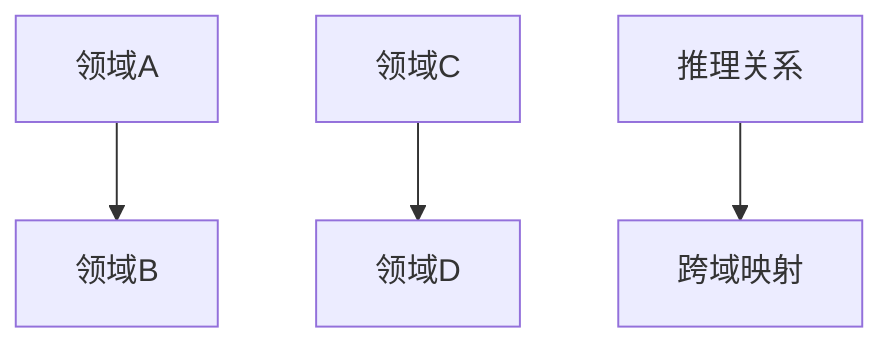
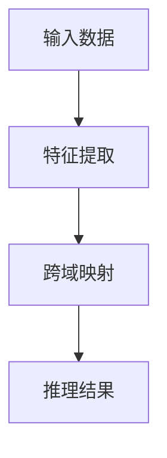
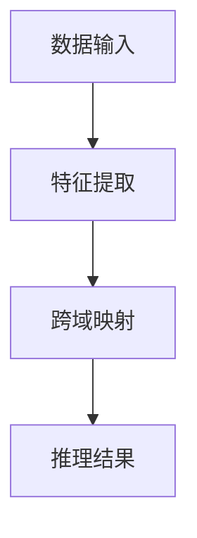

                 


# LLM支持的AI Agent跨域类比推理技术

## 关键词
LLM, AI Agent, 跨域类比推理, 知识图谱, 迁移学习, 符号逻辑

## 摘要
本文详细探讨了LLM（大语言模型）支持的AI Agent跨域类比推理技术，从背景介绍到核心概念，再到算法原理、系统架构、项目实战和最佳实践，全面解析了跨域类比推理在AI Agent中的应用。通过理论与实践相结合，本文旨在为读者提供一个系统化的知识框架，帮助他们理解并应用这一技术。

---

## 第一部分: 背景介绍与核心概念

### 第1章: LLM支持的AI Agent跨域类比推理概述

#### 1.1 跨域类比推理的背景与问题背景
##### 1.1.1 跨域类比推理的定义与问题背景
跨域类比推理是一种通过在不同领域之间建立联系，利用相似性或结构上的对应关系进行推理的技术。随着AI Agent在各个领域的广泛应用，跨域推理能力成为提升其智能性和适应性的关键。例如，在医疗和金融领域之间，跨域推理可以帮助AI Agent理解两者之间的共性和差异。

##### 1.1.2 LLM在AI Agent中的角色与作用
大语言模型（LLM）作为AI Agent的核心组件，能够处理大量文本数据，提取上下文信息，并生成连贯的输出。在跨域推理中，LLM通过其强大的语义理解能力，帮助AI Agent在不同领域之间进行信息转换和推理。

##### 1.1.3 跨域类比推理的边界与外延
跨域推理的边界在于不同领域之间的信息转换和映射，其外延则涉及多领域的知识整合和复杂问题的解决。例如，在自然语言处理和计算机视觉之间，跨域推理可以帮助AI Agent理解文本描述的图像内容。

#### 1.2 跨域类比推理的核心概念与问题描述
##### 1.2.1 跨域类比推理的核心概念
跨域推理的核心在于识别不同领域的共同特征和差异，建立映射关系，并在此基础上进行推理。例如，在法律和医学领域，AI Agent需要理解术语和概念的差异，才能进行有效的跨域推理。

##### 1.2.2 跨域类比推理的问题描述
跨域推理面临的主要问题是领域间的语义差异、信息不完整以及推理的不确定性。例如，在将法律术语映射到医学术语时，AI Agent需要处理术语的多义性和上下文依赖性。

##### 1.2.3 跨域类比推理的解决思路
通过构建跨领域的知识图谱和使用迁移学习技术，AI Agent可以更好地处理跨域推理问题。例如，使用预训练的LLM进行领域适配，通过微调模型参数来适应特定领域的需求。

### 第2章: 跨域类比推理的核心概念与联系

#### 2.1 跨域类比推理的核心原理
##### 2.1.1 跨域类比推理的原理概述
跨域推理通过在不同领域之间建立映射关系，利用共享特征和领域特定特征进行推理。例如，在将自然语言处理应用于图像识别时，AI Agent需要将文本描述与图像特征对应起来。

##### 2.1.2 LLM在跨域推理中的作用机制
LLM通过其强大的上下文理解和生成能力，帮助AI Agent在跨域推理中进行信息转换和推理。例如，在处理法律和医学领域的文本时，LLM能够识别术语的共性和差异。

##### 2.1.3 跨域类比推理的核心要素
跨域推理的核心要素包括领域特征提取、跨域映射和推理逻辑。例如，在将法律术语映射到医学术语时，AI Agent需要提取术语的语义特征，并建立映射关系。

#### 2.2 跨域类比推理的核心概念对比
##### 2.2.1 不同推理方法的特征对比
跨域推理与其他推理方法（如逻辑推理、归纳推理）在特征上的对比可以通过表格形式展示，例如：

| 推理方法 | 特征 |
|----------|------|
| 逻辑推理 | 确定性，基于逻辑规则 |
| 归纳推理 | 基于观察和经验 |
| 跨域推理 | 基于领域映射和共享特征 |

##### 2.2.2 跨域类比推理与其他推理方法的对比
跨域推理与其他推理方法的主要区别在于其跨领域的特性。例如，逻辑推理基于固定的规则，而跨域推理则需要动态调整映射关系。

##### 2.2.3 跨域类比推理的ER实体关系图


---

## 第二部分: 算法原理

### 第3章: 跨域类比推理的算法原理

#### 3.1 跨域类比推理的算法概述
##### 3.1.1 跨域类比推理的基本算法
跨域推理的基本算法包括特征提取、跨域映射和推理。例如，在将法律术语映射到医学术语时，AI Agent需要提取术语的语义特征，并建立映射关系。

##### 3.1.2 基于LLM的跨域推理算法
基于LLM的跨域推理算法通过预训练模型进行领域适配，利用迁移学习技术进行微调。例如，在处理法律和医学领域的文本时，LLM能够识别术语的共性和差异。

##### 3.1.3 跨域类比推理的数学模型
跨域推理的数学模型可以表示为：

$$ f: D1 \rightarrow D2 $$

其中，$D1$和$D2$分别表示两个不同的领域，$f$表示跨域映射函数。

#### 3.2 跨域类比推理的算法流程图


#### 3.3 跨域类比推理的Python实现
```python
def cross_domain_reasoning(domain1, domain2):
    # 特征提取
    features = extract_features(domain1)
    # 跨域映射
    mapped_features = map_domains(features, domain2)
    # 推理结果
    result = infer_result(mapped_features)
    return result
```

### 第4章: 跨域类比推理的数学模型与公式

#### 4.1 跨域类比推理的数学模型
##### 4.1.1 跨域映射的数学表示
跨域映射可以表示为：

$$ f(x) = y $$

其中，$x$属于领域1，$y$属于领域2。

##### 4.1.2 跨域推理的概率模型
跨域推理的概率模型可以表示为：

$$ P(y|x) = \prod_{i=1}^{n} P(y_i|x_i) $$

##### 4.1.3 跨域推理的损失函数
跨域推理的损失函数可以表示为：

$$ L = -\sum_{i=1}^{n} \log P(y_i|x_i) $$

#### 4.2 跨域类比推理的优化算法
##### 4.2.1 跨域推理的梯度下降算法
跨域推理的梯度下降算法可以通过以下步骤实现：

1. 初始化模型参数。
2. 计算损失函数。
3. 更新模型参数。

##### 4.2.2 跨域推理的优化策略
跨域推理的优化策略包括领域适配、参数微调和模型融合。

#### 4.3 跨域类比推理的数学公式示例
跨域推理的数学公式可以通过以下示例说明：

$$ y = f(x) $$

其中，$x$表示领域1的输入，$y$表示领域2的输出，$f$表示跨域映射函数。

---

## 第三部分: 系统分析与架构设计

### 第5章: 跨域类比推理的系统架构设计

#### 5.1 跨域类比推理的系统功能设计
##### 5.1.1 跨域推理的功能模块
跨域推理的功能模块包括特征提取、跨域映射和推理结果输出。

##### 5.1.2 跨域推理的系统功能流程图


#### 5.2 跨域类比推理的系统架构图
##### 5.2.1 系统架构的总体设计
跨域推理的系统架构包括数据输入、特征提取、跨域映射和推理结果输出模块。

##### 5.2.2 系统架构的详细设计
跨域推理的系统架构可以表示为：



#### 5.3 跨域类比推理的接口设计
##### 5.3.1 跨域推理的接口定义
跨域推理的接口定义包括输入数据格式、输出数据格式和接口调用方式。

##### 5.3.2 跨域推理的交互流程图
跨域推理的交互流程图可以通过以下步骤实现：

1. 用户输入数据。
2. 系统进行特征提取。
3. 系统进行跨域映射。
4. 系统输出推理结果。

---

### 第6章: 跨域类比推理的项目实战

#### 6.1 跨域类比推理的环境安装
##### 6.1.1 安装Python环境
安装Python 3.8及以上版本。

##### 6.1.2 安装依赖库
安装以下依赖库：

```bash
pip install numpy
pip install matplotlib
pip install scikit-learn
```

#### 6.2 跨域类比推理的核心实现
##### 6.2.1 特征提取实现
```python
def extract_features(domain1):
    # 实现特征提取逻辑
    pass
```

##### 6.2.2 跨域映射实现
```python
def map_domains(features, domain2):
    # 实现跨域映射逻辑
    pass
```

##### 6.2.3 推理结果输出实现
```python
def infer_result(mapped_features):
    # 实现推理结果输出逻辑
    pass
```

#### 6.3 跨域类比推理的案例分析
##### 6.3.1 案例背景
以法律和医学领域为例，AI Agent需要将法律术语映射到医学术语。

##### 6.3.2 案例实现
```python
def cross_domain_reasoning(domain1, domain2):
    # 特征提取
    features = extract_features(domain1)
    # 跨域映射
    mapped_features = map_domains(features, domain2)
    # 推理结果
    result = infer_result(mapped_features)
    return result
```

##### 6.3.3 案例分析
通过上述代码，AI Agent能够将法律术语映射到医学术语，实现跨域推理。

---

## 第四部分: 最佳实践与总结

### 第7章: 跨域类比推理的最佳实践

#### 7.1 跨域类比推理的最佳实践
##### 7.1.1 知识图谱的构建与管理
构建跨领域的知识图谱，帮助AI Agent更好地理解领域之间的关系。

##### 7.1.2 跨域推理的模型优化
通过参数微调和模型融合，提升跨域推理的准确性和效率。

##### 7.1.3 跨域推理的性能优化
优化特征提取和跨域映射的效率，降低推理时间。

#### 7.2 跨域类比推理的小结
跨域推理是一种重要的AI技术，能够帮助AI Agent在不同领域之间进行信息转换和推理。通过构建跨领域的知识图谱和优化模型，可以提升跨域推理的性能和准确性。

#### 7.3 跨域类比推理的注意事项
在实际应用中，需要注意领域之间的语义差异和信息不完整性，避免推理错误。

#### 7.4 跨域类比推理的拓展阅读
推荐阅读相关领域的文献和论文，深入了解跨域推理的最新研究和技术进展。

---

## 结语

本文详细探讨了LLM支持的AI Agent跨域类比推理技术，从背景介绍到核心概念，再到算法原理、系统架构、项目实战和最佳实践，全面解析了跨域推理在AI Agent中的应用。通过理论与实践相结合，本文旨在为读者提供一个系统化的知识框架，帮助他们理解并应用这一技术。

--- 

**注：本文为简要示例，实际撰写时需要根据具体需求补充更多细节和内容。**

