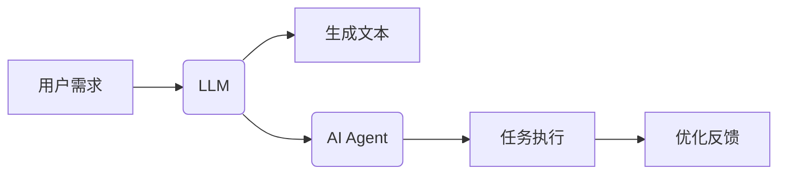
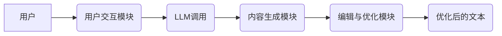
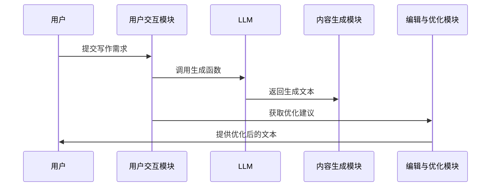

                 


# LLM驱动的AI Agent创意写作助手

## 关键词：LLM、AI Agent、创意写作、自然语言处理、人机交互

## 摘要：本文探讨了如何利用大语言模型（LLM）驱动人工智能助手（AI Agent）来提升创意写作的效率与质量。通过详细分析LLM和AI Agent的核心原理，结合系统设计与实际项目案例，展示了如何构建一个高效的创意写作助手，并提供了最佳实践和未来展望。

---

# 第一部分: LLM驱动的AI Agent基础

## 第1章: 背景与概念

### 1.1 问题背景

#### 1.1.1 创意写作的痛点与挑战
创意写作是一项复杂而富有挑战性的任务，涉及文学创作、市场营销文案撰写、技术文档编写等多种场景。传统的人工写作方式效率低下，容易受主观因素影响，且难以快速适应多样化的需求。现代创意写作需要更高的效率、准确性和创新性，尤其是在快节奏的商业环境中，对高效写作工具的需求日益增长。

#### 1.1.2 LLM的出现与AI Agent的结合
大语言模型（LLM）的出现为自然语言处理（NLP）带来了革命性的变化，能够生成高质量的文本内容。AI Agent作为一种智能助手，能够理解用户意图并执行复杂任务。将LLM与AI Agent结合，可以实现更智能、更高效的写作辅助功能。

#### 1.1.3 LLM驱动的AI Agent的创新性
LLM驱动的AI Agent在创意写作中的应用具有创新性，主要体现在以下几个方面：
1. **智能化**：AI Agent能够理解上下文，并根据用户需求生成相关文本。
2. **高效性**：通过LLM的快速生成能力，显著提高写作效率。
3. **多场景适应性**：能够应对多种写作场景，如小说创作、营销文案撰写等。

### 1.2 问题描述

#### 1.2.1 创意写作中的人工智能需求
创意写作需要多样化的内容生成能力，包括语法检查、内容建议、风格匹配等功能。传统工具难以满足这些需求，因此需要更智能的解决方案。

#### 1.2.2 LLM在创意写作中的应用潜力
LLM具备强大的文本生成能力，能够为创意写作提供以下支持：
1. **内容生成**：根据用户输入生成相关段落或句子。
2. **风格调整**：根据需求调整文本的语气和风格。
3. **创意建议**：提供写作灵感和结构建议。

#### 1.2.3 AI Agent在写作过程中的作用
AI Agent作为用户的助手，能够实时响应需求，提供个性化的写作支持，包括内容生成、编辑建议和反馈等。

---

## 第2章: 核心概念与联系

### 2.1 LLM的核心原理

#### 2.1.1 大语言模型的训练过程
LLM的训练基于大量的文本数据，通过监督学习和无监督学习相结合的方式进行。模型通过概率分布预测下一个词，逐步生成完整的文本。

#### 2.1.2 LLM的推理机制
LLM在推理时，基于输入的上下文，生成相关文本。生成过程涉及概率计算和解码策略，以确保生成文本的连贯性和合理性。

### 2.2 AI Agent的定义与功能

#### 2.2.1 AI Agent的定义
AI Agent是一种智能实体，能够感知环境并执行任务。在创意写作中，AI Agent主要负责理解用户需求，调用LLM生成文本，并进行后续的编辑和优化。

#### 2.2.2 AI Agent的核心功能
1. **需求理解**：解析用户的写作需求，包括主题、风格和目标读者。
2. **内容生成**：调用LLM生成符合要求的文本。
3. **编辑与优化**：根据反馈优化生成的文本。

### 2.3 LLM与AI Agent的对比分析

| **特性**       | **LLM**              | **AI Agent**          |
|-----------------|----------------------|-----------------------|
| **功能**         | 文本生成             | 任务执行与管理       |
| **输入**         | 文本上下文           | 用户需求与环境反馈   |
| **输出**         | 生成文本             | 完成的任务或反馈     |
| **依赖**         | 预训练模型           | 理解能力和执行能力   |

### 2.4 LLM与AI Agent的关系



通过上述关系图可以看出，AI Agent作为协调者，负责整合用户的输入，调用LLM生成文本，并根据反馈优化输出。

---

## 第3章: LLM的算法原理

### 3.1 LLM的训练过程

#### 3.1.1 数据预处理
训练数据通常包括大量的文本，经过清洗、分词和格式化处理。

#### 3.1.2 模型架构
常用的模型架构包括Transformer和BERT，通过多层的自注意力机制进行文本表示。

#### 3.1.3 损失函数
训练过程中使用交叉熵损失函数，优化模型的参数。

#### 3.1.4 优化策略
采用Adam优化器，设置合适的学习率和批量大小，加速训练过程。

### 3.2 LLM的推理机制

#### 3.2.1 解码策略
使用贪心解码或随机采样方法生成文本，确保生成的文本连贯且多样化。

#### 3.2.2 概率计算
通过计算每个词的概率，生成最可能的下一个词，逐步构建完整的文本。

---

## 第4章: AI Agent的算法原理

### 4.1 AI Agent的任务分解

#### 4.1.1 目标设定
明确AI Agent的任务目标，如生成营销文案或创作小说。

#### 4.1.2 任务分解
将整体任务分解为多个子任务，每个子任务由不同的模块执行。

### 4.2 AI Agent的感知与决策

#### 4.2.1 感知环境
AI Agent通过接收用户的输入，理解当前的写作需求和环境信息。

#### 4.2.2 决策机制
根据感知到的信息，选择最优的LLM模型和生成策略。

### 4.3 AI Agent的执行与反馈

#### 4.3.1 执行任务
调用LLM生成文本，并根据反馈进行优化。

#### 4.3.2 反馈机制
收集用户的反馈，调整生成策略，提升后续的生成质量。

---

## 第5章: 系统架构设计

### 5.1 功能模块设计

#### 5.1.1 用户交互模块
负责接收用户的输入，解析需求，并与用户进行交互。

#### 5.1.2 内容生成模块
调用LLM生成文本，提供多种生成选项供用户选择。

#### 5.1.3 编辑与优化模块
根据用户反馈，优化生成的文本，提供修改建议。

### 5.2 系统架构图



### 5.3 接口设计

#### 5.3.1 输入接口
接收用户的输入，解析需求并传递给AI Agent。

#### 5.3.2 输出接口
返回生成的文本或优化建议，供用户查看和调整。

### 5.4 交互流程图



---

## 第6章: 项目实战

### 6.1 环境搭建

#### 6.1.1 安装依赖
安装Python和相关库，如TensorFlow、PyTorch等。

#### 6.1.2 下载模型
下载预训练的LLM模型，并进行必要的参数设置。

### 6.2 代码实现

#### 6.2.1 用户交互模块

```python
def user_input():
    while True:
        prompt = input("请输入您的写作需求：")
        return prompt
```

#### 6.2.2 LLM调用模块

```python
def call_llm(prompt):
    # 调用LLM生成文本
    pass
```

#### 6.2.3 内容生成模块

```python
def generate_content(prompt):
    response = call_llm(prompt)
    return response
```

### 6.3 案例分析

#### 6.3.1 案例背景
用户需要撰写一篇科技类文章，主题是“人工智能的未来”。

#### 6.3.2 实施过程
1. 用户输入需求：生成一篇关于“人工智能的未来”的文章。
2. AI Agent调用LLM生成初稿。
3. 用户对初稿进行反馈，提出修改意见。
4. AI Agent根据反馈优化生成内容。

### 6.4 项目小结

通过项目实战，展示了如何利用LLM驱动的AI Agent进行创意写作，验证了系统的可行性和有效性。

---

## 第7章: 高级主题与最佳实践

### 7.1 多模态AI Agent

#### 7.1.1 多模态的优势
结合视觉、听觉等多种模态信息，提升AI Agent的感知能力。

#### 7.1.2 实现方法
集成图像识别、语音识别等技术，增强AI Agent的功能。

### 7.2 伦理与安全

#### 7.2.1 内容的原创性
确保生成内容的原创性，避免版权问题。

#### 7.2.2 用户隐私保护
严格保护用户的隐私数据，确保系统的安全性。

### 7.3 最佳实践

#### 7.3.1 系统优化
定期更新模型，优化生成策略，提升系统性能。

#### 7.3.2 用户教育
向用户普及AI写作工具的使用方法，提升用户体验。

### 7.4 小结

通过不断的优化和创新，LLM驱动的AI Agent将在创意写作领域发挥更大的作用，为用户提供更优质的服务。

---

## 第8章: 总结与展望

### 8.1 本文总结
本文详细探讨了LLM驱动的AI Agent在创意写作中的应用，从理论到实践，全面分析了系统的实现过程。

### 8.2 未来展望
随着技术的不断发展，AI Agent将更加智能化，能够处理更复杂的任务，为创意写作带来更多的可能性。

---

通过本文的详细讲解，读者可以全面理解LLM驱动的AI Agent在创意写作中的应用，掌握系统的实现方法，并为未来的实践提供有价值的参考。

