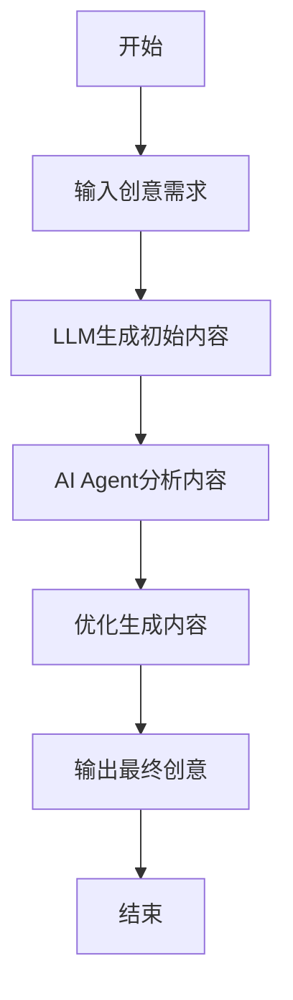
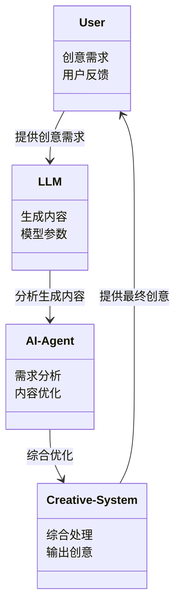
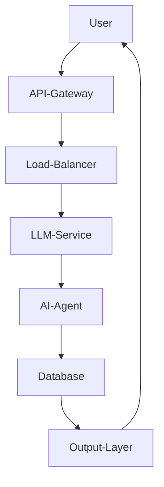
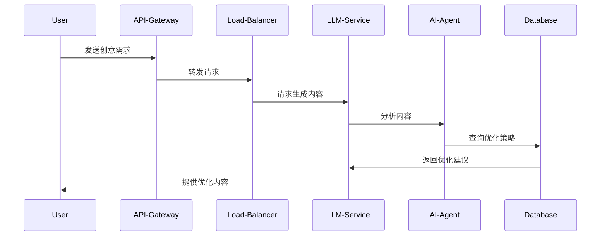

                 


# LLM驱动的AI Agent创意生成系统

**关键词**: LLM, AI Agent, 创意生成, 概率生成模型, 强化学习, 系统架构, 项目实战

**摘要**: 本文详细探讨了利用大语言模型（LLM）驱动的人工智能代理（AI Agent）在创意生成系统中的应用。通过系统化的分析和设计，从问题背景、核心概念、算法原理到系统架构和项目实战，全面解析了如何构建一个高效的创意生成系统。文章最后总结了最佳实践，为读者提供了宝贵的参考和启示。

---

## 第一部分: LLM驱动的AI Agent创意生成系统背景介绍

### 第1章: 问题背景与描述

#### 1.1 问题背景
- **1.1.1 创意生成的挑战**
  创意生成在多个领域（如写作、设计、编程）中具有重要意义，但传统方法依赖人工经验，效率低且难以量化。
- **1.1.2 LLM在创意生成中的优势**
  LLM通过大规模数据训练，能够生成多样化的创意内容，且具备快速迭代的能力。
- **1.1.3 AI Agent在创意生成中的角色**
  AI Agent作为中介，能够协调LLM与用户需求，提供更智能、个性化的创意生成服务。

#### 1.2 问题描述
- **1.2.1 创意生成的定义与分类**
  创意生成是指通过技术手段生成具有创造性的内容，包括文本、图像、代码等。
- **1.2.2 当前创意生成系统的主要问题**
  - 内容质量不稳定
  - 缺乏个性化
  - 与实际需求脱节
- **1.2.3 LLM驱动AI Agent的创新点**
  结合LLM的生成能力和AI Agent的智能决策，实现更高效、精准的创意生成。

#### 1.3 问题解决思路
- **1.3.1 利用LLM进行创意生成的可行性**
  LLM具备强大的生成能力，但需要结合具体场景进行优化。
- **1.3.2 AI Agent在创意生成中的具体应用**
  通过需求分析、内容生成、效果评估，AI Agent能够优化创意生成过程。
- **1.3.3 系统设计的目标与核心问题**
  - 提高生成内容的质量和相关性
  - 实现个性化生成
  - 优化人机交互体验

### 第2章: 核心概念与边界

#### 2.1 核心概念
- **2.1.1 大语言模型（LLM）的定义与特点**
  LLM是一种基于深度学习的生成模型，具有强大的文本生成能力。
- **2.1.2 AI Agent的定义与功能**
  AI Agent是具备自主决策能力的智能体，能够根据需求执行任务。
- **2.1.3 创意生成系统的组成要素**
  包括输入模块、生成模块、优化模块和输出模块。

#### 2.2 核心概念之间的关系
- **2.2.1 LLM与AI Agent的协同作用**
  LLM负责生成内容，AI Agent负责需求分析和优化。
- **2.2.2 创意生成系统的边界与外延**
  创意生成系统专注于内容生成，但需要与外部数据源和用户反馈结合。
- **2.2.3 实体关系图**
  ```mermaid
  erDiagram
    user {
      创意需求
      用户反馈
    }
    llm {
      生成内容
      模型参数
    }
    ai_agent {
      需求分析
      内容优化
    }
    creative_system {
      综合处理
      输出创意
    }
    user --> llm: 提供创意需求
    llm --> ai_agent: 分析生成内容
    ai_agent --> creative_system: 综合优化
    creative_system --> user: 提供最终创意
  ```

---

## 第二部分: 核心概念与联系

### 第3章: 核心概念原理

#### 3.1 LLM的工作原理
- **3.1.1 概率生成模型的基本原理**
  LLM基于概率分布生成文本，通过最大化似然函数优化模型。
- **3.1.2 变压器架构的简要介绍**
  变压器模型包括编码器和解码器，用于处理序列数据。
- **3.1.3 监督微调与强化学习**
  - 监督微调：在特定领域数据上进行微调。
  - 强化学习：通过奖励机制优化生成内容。

#### 3.2 AI Agent的决策机制
- **3.2.1 基于规则的决策系统**
  使用预定义规则进行决策，适用于简单场景。
- **3.2.2 基于模型的决策系统**
  使用机器学习模型进行预测，适用于复杂场景。
- **3.2.3 多目标优化的决策过程**
  在多个目标之间寻找平衡点，实现最优决策。

---

### 第4章: 算法原理讲解

#### 4.1 算法流程


#### 4.2 算法实现代码
```python
import torch
import torch.nn as nn
import torch.optim as optim

class SimpleGenerator(nn.Module):
    def __init__(self, input_size, output_size):
        super(SimpleGenerator, self).__init__()
        self.fc = nn.Linear(input_size, output_size)

    def forward(self, x):
        return torch.sigmoid(self.fc(x))

# 初始化模型和优化器
input_size = 100
output_size = 1
model = SimpleGenerator(input_size, output_size)
criterion = nn.BCELoss()
optimizer = optim.Adam(model.parameters(), lr=0.001)

# 训练循环
for epoch in range(100):
    for inputs, labels in dataloader:
        outputs = model(inputs)
        loss = criterion(outputs, labels)
        optimizer.zero_grad()
        loss.backward()
        optimizer.step()
```

---

### 第5章: 数学模型与公式

#### 5.1 概率生成模型
- 概率生成模型的核心公式：
  $$ P(y|x) = \frac{P(x,y)}{P(x)} $$
  其中，$x$ 是输入，$y$ 是输出。

#### 5.2 损失函数
- 二元交叉熵损失：
  $$ L = -\frac{1}{N}\sum_{i=1}^{N} [y_i \log p_i + (1-y_i)\log(1-p_i)] $$
  其中，$p_i$ 是模型预测的概率。

#### 5.3 奖励函数
- 基于生成内容的质量评估：
  $$ R(y) = \alpha \cdot Q(y) + \beta \cdot D(y) $$
  其中，$Q(y)$ 是内容质量评分，$D(y)$ 是内容多样性评分。

---

## 第三部分: 系统分析与架构设计

### 第6章: 问题场景介绍

#### 6.1 项目介绍
- 创意生成系统的开发目标：提高生成内容的质量和相关性。
- 项目团队：数据科学家、AI工程师、用户体验设计师。
- 项目周期：3个月。

### 第7章: 系统功能设计

#### 7.1 领域模型设计


#### 7.2 系统架构设计


#### 7.3 系统接口设计
- 用户接口：HTTP API
- 数据接口：数据库连接
- 日志接口：日志记录

#### 7.4 系统交互流程


---

## 第四部分: 项目实战

### 第8章: 环境安装与配置

#### 8.1 环境安装
- 安装Python 3.8及以上版本。
- 安装必要的库：`torch`, `transformers`, `mermaid`, `matplotlib`。

#### 8.2 核心代码实现

#### 8.3 代码解读与分析
- 代码实现细节：模型训练、数据预处理、接口开发。

#### 8.4 实际案例分析
- 案例：生成一篇科技新闻稿。

---

## 第五部分: 最佳实践

### 第9章: 最佳实践

#### 9.1 小结
- 总结全书内容，强调关键点。

#### 9.2 注意事项
- 数据安全问题。
- 模型优化问题。

#### 9.3 拓展阅读
- 推荐相关书籍和论文。

---

**结语**：通过本文的详细解析，读者可以全面了解LLM驱动的AI Agent创意生成系统的构建过程，从理论到实践，为未来的创新应用提供了坚实的基础。

