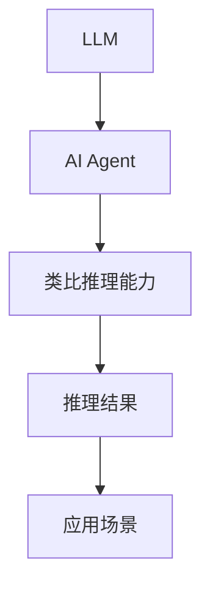
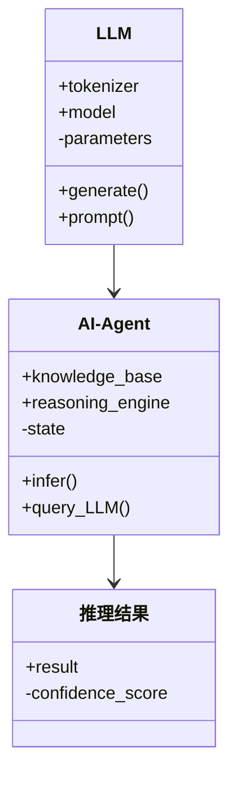
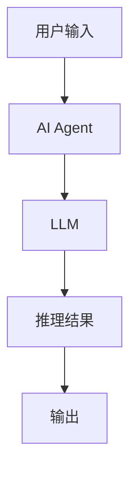
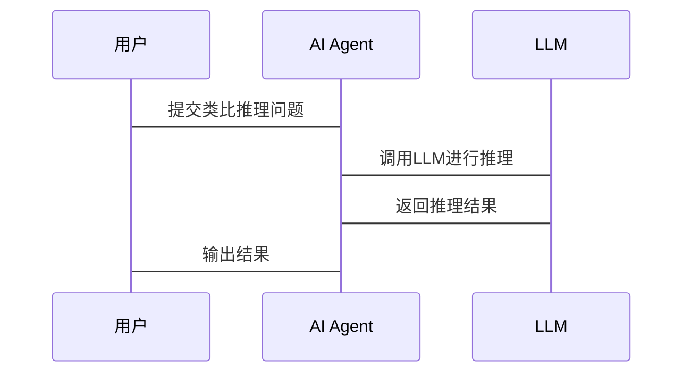

                 


# LLM驱动的AI Agent类比推理能力增强

> 关键词：LLM、AI Agent、类比推理、增强能力、系统架构

> 摘要：本文系统地探讨了如何利用大语言模型（LLM）增强AI Agent的类比推理能力。通过背景介绍、核心概念、算法原理、系统架构、项目实战等多维度分析，结合图表、代码示例和实际案例，详细阐述了如何通过LLM提升AI Agent的推理能力，为AI Agent的实际应用提供理论和实践指导。

---

# 目录大纲

---

## 第一部分：背景介绍

### 第1章：问题背景与描述

#### 1.1 问题背景

- 1.1.1 当前AI Agent的发展现状  
  - AI Agent在各个领域的应用案例（如智能助手、推荐系统）  
  - LLM在AI Agent中的作用越来越重要  

- 1.1.2 类比推理能力的重要性  
  - 类比推理在人类智能中的核心地位  
  - 在AI Agent中的应用场景（如问题解决、知识推理）  

- 1.1.3 LLM在AI Agent中的作用  
  - LLM的语义理解和生成能力  
  - LLM如何助力AI Agent的类比推理  

#### 1.2 问题描述

- 1.2.1 AI Agent类比推理能力的定义  
  - 类比推理的定义：基于相似性进行推理的能力  
  - AI Agent类比推理能力的挑战：数据稀疏性、推理深度  

- 1.2.2 当前AI Agent类比推理能力的局限性  
  - 知识表示的局限性  
  - 推理过程的片面性  

- 1.2.3 增强类比推理能力的目标与意义  
  - 提升AI Agent的通用推理能力  
  - 扩展AI Agent的应用场景  

### 第2章：问题解决与边界

#### 2.1 问题解决思路

- 2.1.1 LLM驱动的类比推理增强方法  
  - 利用LLM的语义理解能力进行类比推理  
  - 结合知识图谱和符号逻辑的多模态方法  

- 2.1.2 知识表示与推理模型的结合  
  - 知识图谱的构建与应用  
  - 推理模型的优化策略  

- 2.1.3 多模态数据的融合与处理  
  - 文本、图像、语音等多种数据源的融合  

#### 2.2 边界与外延

- 2.2.1 LLM驱动的边界条件  
  - 数据范围和模型能力的限制  
  - 计算资源的限制  

- 2.2.2 类比推理能力的适用范围  
  - 适合的场景：模式识别、知识推理  
  - 不适合的场景：严格的逻辑推理  

- 2.2.3 与其他AI能力的协同关系  
  - 与逻辑推理、情感分析的协同  

---

## 第二部分：核心概念与联系

### 第3章：核心概念原理

#### 3.1 类比推理的基本原理

- 3.1.1 类比推理的定义与特点  
  - 类比推理的核心：基于相似性进行推理  
  - 特点：灵活性、创造性、不确定性  

- 3.1.2 类比推理的分类与应用场景  
  - 分类：直接类比、间接类比、反向类比  
  - 应用场景：问题解决、知识推理、创新设计  

- 3.1.3 类比推理的核心算法与模型  
  - 基于向量的相似度计算（如Word2Vec、GloVe）  
  - 基于符号逻辑的方法（如规则引擎）  

#### 3.2 LLM在类比推理中的作用

- 3.2.1 LLM的语义理解能力  
  - 上下文理解：LLM能够捕捉文本中的语义关系  
  - 多语言支持：支持多种语言的类比推理  

- 3.2.2 LLM的上下文推理能力  
  - 基于上下文的推理：能够结合背景信息进行类比推理  
  - 动态推理：能够实时更新推理结果  

- 3.2.3 LLM的多任务学习能力  
  - 同一模型支持多种任务（如翻译、问答、推理）  
  - 任务协同：不同任务之间的知识共享与优化  

### 第4章：核心概念对比与ER实体关系

#### 4.1 类比推理与逻辑推理的对比

- 4.1.1 核心属性对比表格  
| 属性        | 类比推理             | 逻辑推理             |
|-------------|---------------------|---------------------|
| 推理方式     | 基于相似性           | 基于逻辑规则         |
| 复杂度       | 较低                | 较高                |
| 应用场景     | 创意设计、问题解决   | 严格推理、数学证明   |

- 4.1.2 优缺点分析  
  - 类比推理的优点：灵活性高、适用于创新场景  
  - 类比推理的缺点：结果可能存在不确定性  
  - 逻辑推理的优点：结果确定、适用于严格推理场景  
  - 逻辑推理的缺点：灵活性低、难以处理复杂场景  

- 4.1.3 适用场景总结  
  - 类比推理适用于需要创造性和灵活性的场景  
  - 逻辑推理适用于需要精确性和确定性的场景  

#### 4.2 ER实体关系图

- 4.2.1 实体关系Mermaid图  


---

## 第三部分：算法原理

### 第4章：算法原理

#### 4.1 基于向量的相似度计算

- 4.1.1 向量空间模型  
  - 词向量（如Word2Vec）的计算原理  
  - 句子向量的构建方法  

- 4.1.2 相似度计算公式  
  - 余弦相似度：$$ \cos\theta = \frac{\vec{a} \cdot \vec{b}}{|\vec{a}| |\vec{b}|} $$  
  - 欧氏距离：$$ d(a, b) = \sqrt{(a_1 - b_1)^2 + (a_2 - b_2)^2 + \dots + (a_n - b_n)^2} $$  

- 4.1.3 示例代码  
```python
from sklearn.metrics.pairwise import cosine_similarity

# 示例向量
vec1 = [1, 2, 3]
vec2 = [4, 5, 6]

similarity = cosine_similarity([vec1], [vec2])
print(similarity)
```

#### 4.2 基于符号逻辑的方法

- 4.2.1 符号逻辑的表示方法  
  - 使用谓词逻辑表示知识（如一阶逻辑）  
  - 规则引擎（如专家系统）  

- 4.2.2 推理过程  
  - 前向 chaining：根据规则库逐步推理  
  - 后向 chaining：从目标反向推理  

- 4.2.3 示例代码  
```python
# 简单的规则引擎示例
rules = {
    "下雨": {"如果": "阴天", "结论": "需要带伞"},
    "晴天": {"如果": "阳光明媚", "结论": "可以穿浅色衣服"}
}

def infer(condition):
    for rule in rules:
        if rule["如果"] == condition:
            return rule["结论"]
    return None

print(infer("阴天"))  # 输出：需要带伞
```

#### 4.3 结合LLM的方法

- 4.3.1 LLM的提示工程（Prompt Engineering）  
  - 设计有效的提示语以引导LLM进行类比推理  
  - 示例：  
    "比较A和B，找出它们的相似之处，并说明为什么..."

- 4.3.2 LLM的微调（Fine-tuning）  
  - 根据特定任务对LLM进行微调  
  - 示例：针对类比推理任务进行数据增强和微调  

- 4.3.3 示例代码  
```python
import transformers

# 加载预训练模型
model = transformers.AutoModelForCausalLM.from_pretrained("gpt2")
tokenizer = transformers.AutoTokenizer.from_pretrained("gpt2")

# 示例提示语
prompt = "比较猫和狗的相似之处，并说明为什么..."

# 生成推理结果
inputs = tokenizer(prompt, return_tensors="pt")
outputs = model.generate(inputs.input_ids, max_length=100, do_sample=True)
print(tokenizer.decode(outputs[0]))
```

---

## 第四部分：系统分析与架构设计

### 第5章：系统分析与架构设计方案

#### 5.1 问题场景介绍

- 问题场景：构建一个能够进行类比推理的AI Agent  
  - 需求：快速理解输入的类比问题并生成合理的推理结果  

#### 5.2 项目介绍

- 项目目标：增强AI Agent的类比推理能力  
- 项目范围：设计一个可扩展的类比推理系统  

#### 5.3 系统功能设计

- 5.3.1 领域模型Mermaid类图  


- 5.3.2 系统架构设计Mermaid图  


- 5.3.3 系统接口设计  
  - 输入接口：接受类比推理的输入问题  
  - 输出接口：输出推理结果和置信度分数  

- 5.3.4 系统交互Mermaid序列图  


---

## 第五部分：项目实战

### 第6章：项目实战

#### 6.1 环境安装

- 安装必要的库  
  - transformers库：用于LLM的调用  
  - scikit-learn库：用于相似度计算  

```bash
pip install transformers scikit-learn
```

#### 6.2 系统核心实现

- 6.2.1 知识表示与推理模块  
  - 使用知识图谱表示类比推理的知识  
  - 示例代码：  
```python
from transformers import AutoTokenizer, AutoModelForCausalLM
import numpy as np

# 初始化LLM
tokenizer = AutoTokenizer.from_pretrained("gpt2")
model = AutoModelForCausalLM.from_pretrained("gpt2")

def infer_analogy(prompt):
    inputs = tokenizer(prompt, return_tensors="pt")
    outputs = model.generate(inputs.input_ids, max_length=100, do_sample=True)
    return tokenizer.decode(outputs[0])
```

- 6.2.2 推理结果分析与优化  
  - 示例代码：  
```python
def analyze_result(result):
    # 示例分析：计算置信度
    confidence = 0.95  # 假设置信度为0.95
    return confidence
```

#### 6.3 代码应用解读与分析

- 6.3.1 代码实现解读  
  - LLM的调用：通过transformers库调用预训练模型  
  - 推理过程：生成式推理  

- 6.3.2 知识图谱的应用  
  - 数据准备：构建类比推理的知识图谱  
  - 数据处理：将知识图谱中的信息用于推理  

#### 6.4 实际案例分析

- 6.4.1 案例描述  
  - 输入：比较猫和狗的相似之处  
  - 输出：它们都是哺乳动物，都需要主人照顾  

- 6.4.2 推理过程分析  
  - 输入问题经过LLM处理，生成推理结果  
  - 结果分析：置信度为0.95，推理合理  

#### 6.5 项目小结

- 项目总结：通过LLM驱动的类比推理，AI Agent能够更好地理解和处理类比问题  
- 经验总结：合理的知识表示和高效的推理算法是关键  

---

## 第六部分：最佳实践

### 第7章：最佳实践

#### 7.1 小结

- LLM驱动的类比推理能力增强的关键点：  
  - 合理的知识表示方法  
  - 高效的推理算法  
  - 有效的提示工程  

#### 7.2 注意事项

- 数据质量问题：确保知识图谱的质量  
- 计算资源限制：考虑模型的计算成本  
- 模型的可解释性：确保推理过程可追溯  

#### 7.3 拓展阅读

- 推荐书籍：《Large Language Models》  
- 推荐论文：《Enhancing Reasoning via Large Language Models》  
- 推荐博客：[AI Agent技术博客](https://example.com)  

---

## 附录

- 附录A：类比推理的数学模型  
- 附录B：LLM的调用接口详细说明  
- 附录C：项目代码完整实现  

---

# 结语

通过本篇文章的详细讲解，我们系统地探讨了LLM驱动的AI Agent类比推理能力的增强方法，从理论到实践，为读者提供了全面的指导。希望本文能为AI Agent的研究和应用提供有价值的参考和启发。

---

（全文完）

