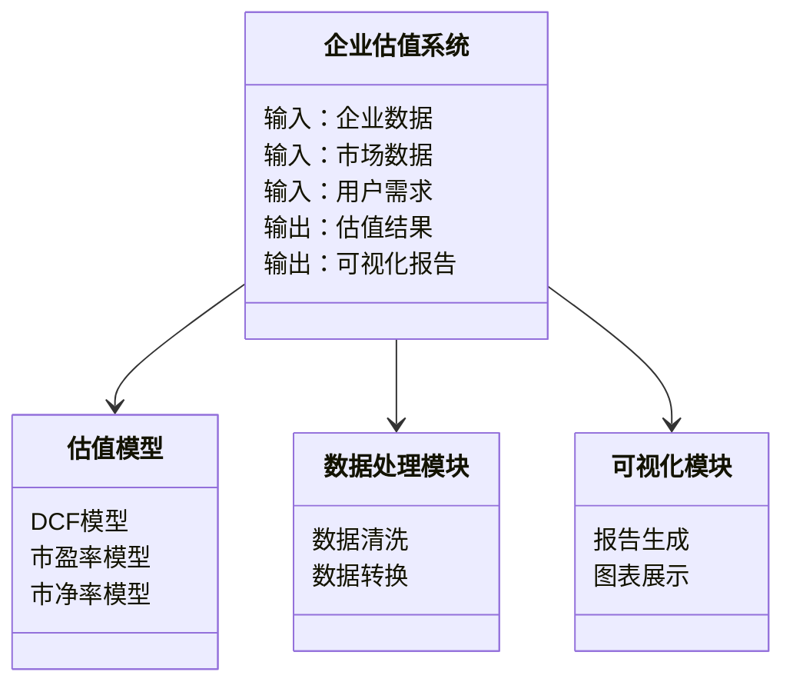
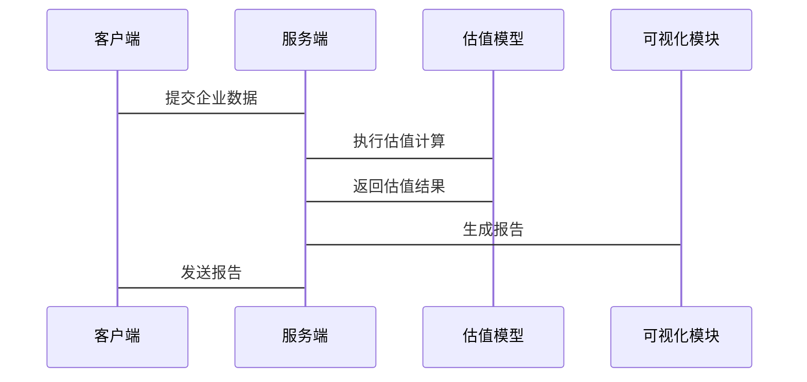

                 


# 不同发展阶段企业的估值策略

## 关键词：企业估值、生命周期、DCF模型、市盈率、市净率、战略目标

## 摘要：  
本文详细探讨了企业在不同发展阶段的估值策略，从初创期到衰退期，分析了每个阶段的特点及适用的估值方法。通过介绍股权自由现金流模型（DCF）、市盈率和市净率等核心工具，结合实际案例和系统架构设计，为读者提供全面的估值策略指南。

---

## 第1章：企业估值的核心概念与背景

### 1.1 企业估值的定义与意义

企业估值是评估企业价值的过程，旨在确定其市场价值或内在价值。这种评估对于企业融资、并购、投资决策等具有重要意义。  

#### 1.1.1 什么是企业估值  
企业估值是通过分析企业的财务状况、市场地位、未来盈利能力等因素，计算其整体价值的过程。  

#### 1.1.2 企业估值的重要性  
- **融资需求**：帮助企业确定合理的融资价格。  
- **投资决策**：为投资者提供决策依据。  
- **并购活动**：评估目标企业的价值。  

#### 1.1.3 企业估值的边界与外延  
企业估值不仅关注财务指标，还需考虑市场环境、行业趋势和企业战略等外部因素。  

### 1.2 企业生命周期与估值阶段

企业生命周期分为初创期、成长期、成熟期和衰退期，每个阶段的估值特点不同。  

#### 1.2.1 企业生命周期的定义  
企业从创立到衰退的过程，分为四个阶段：初创期、成长期、成熟期、衰退期。  

#### 1.2.2 不同阶段企业的估值特点  
- **初创期**：高风险，依赖未来盈利能力。  
- **成长期**：高增长，注重市场份额扩展。  
- **成熟期**：稳定增长，注重成本控制。  
- **衰退期**：低增长，注重资产变现。  

#### 1.2.3 企业估值阶段的划分  
根据企业所处的生命周期阶段，选择不同的估值方法和策略。

### 1.3 企业估值的核心要素

#### 1.3.1 财务指标分析  
- **收入与利润**：评估企业的盈利能力。  
- **现金流**：衡量企业的流动性。  
- **资产负债表**：分析企业的资产结构。  

#### 1.3.2 市场环境影响  
- **行业趋势**：影响企业的成长空间。  
- **竞争格局**：影响企业的市场地位。  
- **宏观经济**：影响企业的经营环境。  

#### 1.3.3 企业战略目标  
- **短期目标**：如市场份额提升。  
- **长期目标**：如品牌建设与全球化扩张。  

---

## 第2章：不同阶段企业的估值策略

### 2.1 初创期企业的估值策略

#### 2.1.1 初创期企业的特点  
- 资源有限，风险高。  
- 业务模式尚未成熟。  

#### 2.1.2 初创期估值的核心方法  
- **相对估值法**：使用可比公司法，基于行业平均市盈率或市净率进行估值。  
- **情景分析法**：假设不同业务发展路径，计算对应价值。  

#### 2.1.3 初创期估值的挑战与解决方案  
- **数据不足**：依赖假设和市场对标。  
- **高风险**：需考虑退出机制和风险溢价。  

### 2.2 成长期企业的估值策略

#### 2.2.1 成长期企业的特点  
- 快速扩张，收入增长显著。  
- 市场份额逐步扩大。  

#### 2.2.2 成长期估值的核心方法  
- **DCF模型**：基于未来现金流的折现值计算企业价值。  
- **EV/EBITDA倍数法**：衡量企业价值与息税折旧及摊销前利润的比例。  

#### 2.2.3 成长期估值的优化建议  
- 结合行业平均倍数，调整DCF模型中的假设参数。  

### 2.3 成熟期企业的估值策略

#### 2.3.1 成熟期企业的特点  
- 收入增长稳定，利润进入成熟期。  
- 市场份额稳定，竞争格局清晰。  

#### 2.3.2 成熟期估值的核心方法  
- **DCF模型**：基于稳定的现金流预测。  
- **股息贴现模型**：评估股息分配对企业价值的影响。  

#### 2.3.3 成熟期估值的风险管理  
- 降低对高增长假设的依赖，注重现金流的可持续性。  

### 2.4 衰退期企业的估值策略

#### 2.4.1 衰退期企业的特点  
- 收入下降，利润减少。  
- 市场份额逐步被蚕食。  

#### 2.4.2 衰退期估值的核心方法  
- **资产变现法**：基于资产净值进行估值。  
- **清算价值法**：评估企业清算后的剩余价值。  

#### 2.4.3 衰退期估值的退出策略  
- 优先考虑出售资产或业务，实现价值最大化。  

---

## 第3章：企业估值的核心方法与工具

### 3.1 股权自由现金流模型（DCF）

#### 3.1.1 DCF模型的定义与原理  
DCF模型通过预测未来现金流，折现到现值，计算企业整体价值。  

#### 3.1.2 DCF模型的计算步骤  

1. **预测现金流**：基于企业历史数据和未来预期，预测未来现金流。  
2. **确定折现率**：使用加权平均资本成本（WACC）作为折现率。  
3. **计算现值**：将未来现金流折现，计算总现值。  
4. **调整终值**：考虑终值的永续增长假设。  

#### 3.1.3 DCF模型的优缺点  

- **优点**：能够准确反映企业未来现金流的情况。  
- **缺点**：假设未来现金流预测的准确性较高，实际中可能存在较大偏差。  

#### 3.1.4 DCF模型的数学公式  

$$ 企业价值 = \sum_{t=1}^{n} \frac{CF_t}{(1 + r)^t} + \frac{TV}{(1 + r)^n} $$  

其中，$CF_t$ 是第 t 年的现金流，$r$ 是折现率，$TV$ 是终值。  

---

## 第4章：企业估值的系统架构设计

### 4.1 系统功能设计

#### 4.1.1 问题场景介绍  
设计一个企业估值系统，支持不同阶段的企业估值需求。  

#### 4.1.2 领域模型设计  



### 4.2 系统架构设计

#### 4.2.1 系统架构图  


#### 4.2.2 接口设计  

- **API接口**：提供 RESTful API，供客户端调用估值功能。  
- **数据接口**：支持 CSV 或 Excel 格式的数据导入。  

#### 4.2.3 交互设计  



---

## 第5章：项目实战

### 5.1 环境安装

```bash
pip install numpy pandas matplotlib
```

### 5.2 核心实现代码

```python
import numpy as np
import pandas as pd

def calculate_wacc(asset_beta, market_beta, market_return, tax_rate, cost_of_debt, debt_equity_ratio):
    # 计算WACC
    cost_equity = (asset_beta) * market_beta * market_return + market_return
    wacc = (cost_of_debt * debt_equity_ratio) + (cost_equity * (1 - debt_equity_ratio)) * (1 - tax_rate)
    return wacc

def dcf_valuation(fcf, wacc, terminal_value, horizon):
    # 计算DCF估值
    discount_factor = (1 + wacc) ** horizon
    terminal_value_present = terminal_value / discount_factor
    dcf_value = fcf * (1 - (1 / (1 + wacc) ** horizon))
    total_value = dcf_value + terminal_value_present
    return total_value
```

---

## 第6章：结论与展望

### 6.1 总结

企业在不同发展阶段的估值策略需要结合其生命周期特点和市场环境，选择合适的估值方法。DCF模型、市盈率和市净率等工具在不同阶段各有优劣，需灵活运用。

### 6.2 最佳实践

- **数据质量**：确保输入数据的准确性和完整性。  
- **模型调整**：根据企业实际情况调整估值模型的参数。  
- **定期复盘**：定期评估估值结果，及时调整策略。  

### 6.3 未来展望

随着人工智能和大数据技术的发展，企业估值将更加精准和高效。未来的估值工具将更加智能化，能够实时动态调整模型参数，提供更精确的估值结果。

---

通过以上内容，读者可以系统地了解企业在不同发展阶段的估值策略，并掌握具体的估值方法和工具，为实际应用提供参考。

