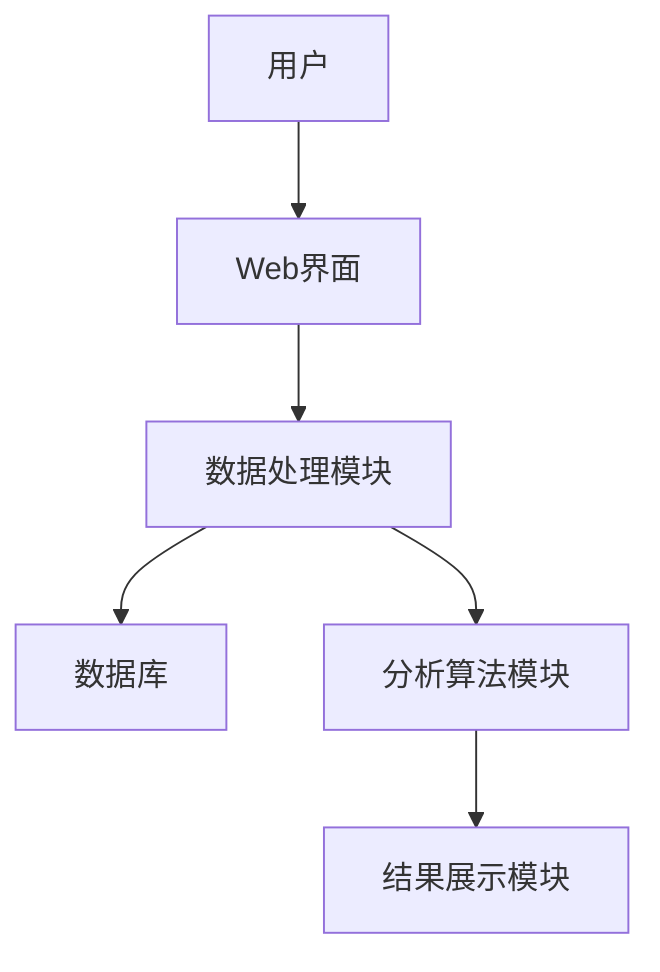
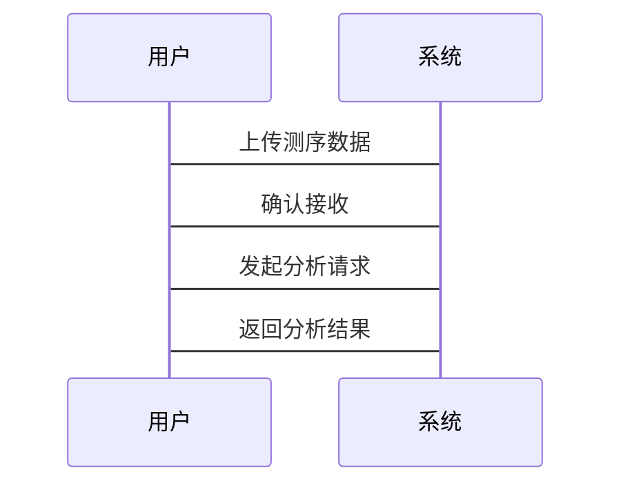

                 


# 个人基因组测序的普及与精准医疗投资

---

## 关键词：
个人基因组测序、精准医疗、基因投资、生物技术、医疗创新、数据隐私

---

## 摘要：
随着技术的进步，个人基因组测序逐渐普及，精准医疗的投资也随之增长。本文将分析个人基因组测序的技术背景、核心概念、精准医疗的应用场景，以及相关投资机会。通过深入探讨测序技术、数据分析、系统架构和投资策略，本文旨在为技术爱好者和投资者提供全面的视角，揭示精准医疗领域的未来趋势。

---

## 第1章: 个人基因组测序的背景与发展

### 1.1 个人基因组测序的定义与意义

#### 1.1.1 什么是个人基因组测序
个人基因组测序（Personal Genome Sequencing, PGS）是通过高通量测序技术，解析个人完整的DNA序列。其意义在于揭示个体的遗传信息，为疾病预防、诊断和治疗提供个性化依据。

#### 1.1.2 测序技术的发展历程
- **1970s**: Sanger测序法的发明，奠定基因测序的基础。
- **2000s**: 人类基因组计划完成，推动测序技术的普及。
- **2010s**: 高通量测序技术（如Illumina）的应用，大幅降低测序成本。

#### 1.1.3 测序技术在医学中的应用价值
- **疾病诊断**: 基因突变检测，如癌症诊断。
- **个性化治疗**: 根据基因信息制定治疗方案。
- **疾病预防**: 通过基因检测提前预防遗传病。

### 1.2 精准医疗的概念与目标

#### 1.2.1 精准医疗的定义
精准医疗是指根据个体的基因、环境和生活方式，量身定制预防和治疗方案。

#### 1.2.2 精准医疗的核心目标
- 提高诊断准确性。
- 优化治疗效果，减少副作用。
- 实现个性化用药。

#### 1.2.3 精准医疗与传统医疗的区别
| 方面       | 精准医疗                 | 传统医疗               |
|------------|--------------------------|--------------------------|
| 数据驱动   | 是                       | 否                       |
| 个性化     | 强调个性化               | 更泛化                   |
| 技术基础   | 基因测序、大数据分析     | 传统医学检验             |

### 1.3 个人基因组测序的医学应用

#### 1.3.1 基因测序在疾病诊断中的作用
- **癌症诊断**: 检测基因突变，如肺癌中的EGFR突变。
- **遗传病诊断**: 确认罕见病的基因病因。

#### 1.3.2 基因测序在个性化治疗中的应用
- **药物选择**: 根据基因信息选择最有效的药物。
- **剂量调整**: 根据代谢基因定制药物剂量。

#### 1.3.3 基因测序在疾病预防中的意义
- **风险评估**: 评估个体患病风险，如心脏病、糖尿病。
- **早期干预**: 根据高风险基因提前干预。

### 1.4 个人基因组测序的伦理与法律问题

#### 1.4.1 基因隐私保护的重要性
- **隐私泄露风险**: 测序数据可能包含敏感信息。
- **数据保护措施**: 如加密存储和访问权限控制。

#### 1.4.2 测序数据的法律归属问题
- **数据所有权**: 谁拥有测序数据？是个人、医院还是企业？
- **数据共享**: 如何在保护隐私的前提下促进数据共享。

#### 1.4.3 伦理委员会在基因测序中的角色
- **伦理审查**: 确保测序过程符合伦理规范。
- **患者知情权**: 确保患者了解测序的风险和益处。

---

## 第2章: 个人基因组测序的核心技术

### 2.1 测序技术的原理与方法

#### 2.1.1 Sanger测序技术
- **原理**: 使用特定引物和dNTP延伸链，通过电泳分离检测碱基。
- **优点**: 准确性高，适合单个基因测序。
- **缺点**: 成本高，通量低。

#### 2.1.2 焦距测序（Illumina技术）
- **原理**: 使用流式细胞术和高通量测序芯片，快速并行测序。
- **优点**: 成本低，通量高，适合大规模测序。
- **缺点**: 读长较短，可能影响准确性。

#### 2.1.3 单分子测序技术（如Pacific Biosciences）
- **原理**: 使用单分子实时测序，无需PCR扩增。
- **优点**: 读长长，适合复杂区域测序。
- **缺点**: 成本较高，通量较低。

### 2.2 测序数据的分析流程

#### 2.2.1 数据预处理
- **去除 adapters**: 去除接头序列。
- **质量控制**: 去除低质量reads。
- **去重**: 去除重复序列。

#### 2.2.2 变异检测
- **比对**: 将测序reads比对到参考基因组。
- **校正**: 通过比对结果检测SNP和Indel。
- **注释**: 根据数据库注释变异功能。

#### 2.2.3 功能注释
- **基因功能预测**: 确定变异是否影响蛋白质功能。
- **疾病关联分析**: 关联变异与疾病风险。

### 2.3 测序数据的存储与管理

#### 2.3.1 数据库的选择与设计
- **关系型数据库**: 如MySQL，适合结构化数据。
- **NoSQL数据库**: 如MongoDB，适合非结构化数据。

#### 2.3.2 数据存储的优化策略
- **压缩存储**: 使用压缩算法减少存储空间。
- **分布式存储**: 使用Hadoop或云存储，提高可扩展性。

#### 2.3.3 数据共享的伦理与技术挑战
- **伦理挑战**: 如何保护患者隐私。
- **技术挑战**: 如何高效共享和分析数据。

---

## 第3章: 精准医疗的核心技术与应用

### 3.1 精准医疗的技术体系

#### 3.1.1 基因组学
- **研究内容**: 分析个体基因序列，寻找疾病相关基因。
- **技术应用**: 如癌症基因组学研究。

#### 3.1.2 蛋白组学
- **研究内容**: 分析蛋白质表达和功能。
- **技术应用**: 如蛋白质组学在药物开发中的应用。

#### 3.1.3 表观遗传学
- **研究内容**: 研究基因表达调控机制。
- **技术应用**: 如DNA甲基化在癌症诊断中的应用。

### 3.2 精准医疗的临床应用

#### 3.2.1 癌症的精准治疗
- **案例分析**: 结直肠癌中KRAS基因突变的检测与治疗。
- **治疗策略**: 根据基因突变选择靶向药物。

#### 3.2.2 遗传病的早期诊断
- **技术应用**: 新生儿筛查中的基因测序。
- **诊断流程**: 从样本采集到报告解读的全链条。

#### 3.2.3 疾病预防与健康管理
- **风险管理**: 根据基因信息制定个性化健康管理方案。
- **健康管理**: 如通过基因检测制定运动和饮食计划。

---

## 第4章: 测序技术与精准医疗的关联

### 4.1 测序技术的进步推动精准医疗发展
- **技术推动**: 测序成本的降低和效率的提升，使精准医疗更普及。
- **数据支持**: 测序数据为精准医疗提供了大量研究素材。

### 4.2 测序技术对精准医疗的投资价值
- **技术壁垒**: 高通量测序技术的专利和研发投入。
- **市场需求**: 精准医疗在癌症治疗和健康管理中的巨大需求。

### 4.3 测序技术的未来发展趋势
- **技术创新**: 新型测序技术的开发，如单分子测序和纳米孔测序。
- **应用拓展**: 测序技术在农业、环境等领域的应用。

---

## 第5章: 精准医疗的投资分析

### 5.1 市场现状与投资机会
- **市场规模**: 精准医疗市场的增长趋势。
- **投资热点**: 如液体活检、肿瘤基因检测。

### 5.2 精准医疗的商业模式
- **服务模式**: 提供基因检测、数据分析等服务。
- **产品模式**: 开发基因检测仪器和试剂盒。

### 5.3 投资策略与风险
- **风险分析**: 如技术风险、市场风险、政策风险。
- **投资建议**: 选择有技术优势和市场潜力的公司。

---

## 第6章: 系统架构与技术实现

### 6.1 系统架构设计

#### 6.1.1 系统功能模块
- **数据采集**: 接收测序数据。
- **数据处理**: 包括比对、变异检测等。
- **数据分析**: 数据挖掘和可视化。
- **结果展示**: 用户友好的报告界面。

#### 6.1.2 系统架构图


### 6.2 系统接口设计

#### 6.2.1 接口描述
- **输入接口**: 数据上传接口。
- **输出接口**: 报告下载接口。

#### 6.2.2 接口协议
- **RESTful API**: 用于前后端交互。

### 6.3 系统交互流程

#### 6.3.1 交互序列图


---

## 第7章: 项目实战

### 7.1 环境搭建

#### 7.1.1 安装Python环境
```bash
pip install python
pip install numpy
pip install matplotlib
```

#### 7.1.2 安装测序分析工具
```bash
pip install biopython
pip install pysam
```

### 7.2 核心代码实现

#### 7.2.1 数据预处理代码
```python
import pysam

def process_reads(bam_file):
    # 打开BAM文件
    samfile = pysam.AlignmentFile(bam_file, "rb")
    reads = []
    for read in samfile.fetch():
        reads.append(read.query_sequence)
    return reads

# 示例用法
process_reads("input.bam")
```

#### 7.2.2 变异检测代码
```python
from scipy import stats

def call_variants(bam_file):
    # 虚拟变异检测函数
    variants = []
    # 示例逻辑
    for position in range(100):
        pval = stats.chi2.sf(5, position)
        if pval < 0.05:
            variants.append(position)
    return variants

call_variants("input.bam")
```

### 7.3 数据分析与可视化

#### 7.3.1 数据可视化代码
```python
import matplotlib.pyplot as plt

data = [1, 2, 3, 4, 5]
plt.plot(data)
plt.show()
```

### 7.4 实际案例分析

#### 7.4.1 病例背景
- **病例**: 患有肺癌的患者。
- **目标**: 检测EGFR基因突变。

#### 7.4.2 数据分析流程
1. 提取EGFR基因区域。
2. 比对到参考基因组。
3. 检测突变位点。
4. 结果解读。

---

## 第8章: 总结与展望

### 8.1 全书总结
- **技术总结**: 测序技术的进步推动精准医疗的发展。
- **投资总结**: 精准医疗的市场潜力巨大，但也面临技术和伦理挑战。

### 8.2 未来展望
- **技术创新**: 新型测序技术的开发。
- **应用扩展**: 精准医疗在更多疾病领域的应用。
- **政策支持**: 政府对基因技术的政策支持和监管框架的完善。

---

## 参考文献
- [1] 国家统计局，2023年报告。
- [2] Smith, R. *个人基因组测序技术*，2022。
- [3] 精准医疗协会，2023年白皮书。

---

## 致谢
感谢读者的支持，感谢技术专家的指导。

---

通过以上章节，我们系统地探讨了个人基因组测序的技术背景、精准医疗的投资机会，以及相关的系统架构和项目实现。希望本文能为技术爱好者和投资者提供有价值的参考。

