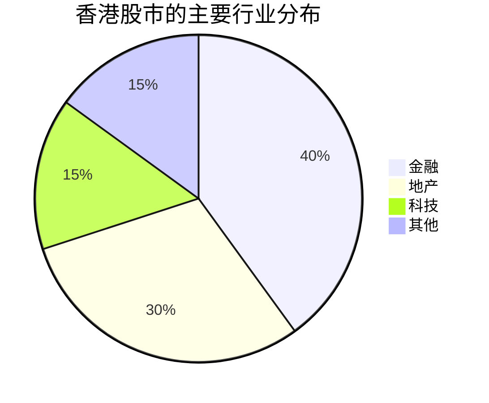
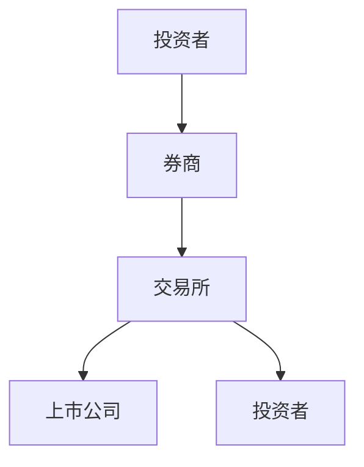
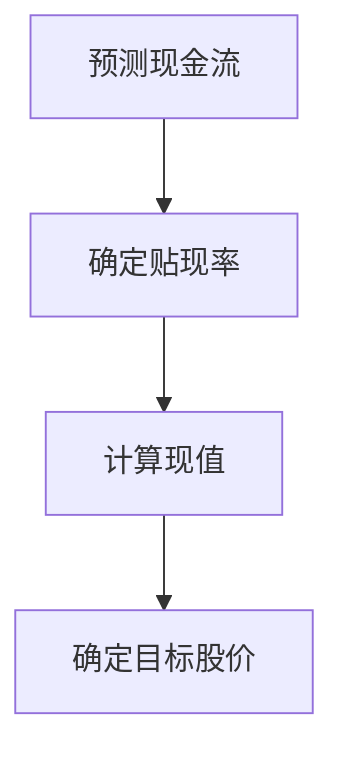
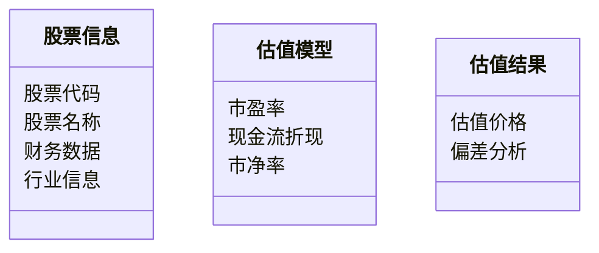
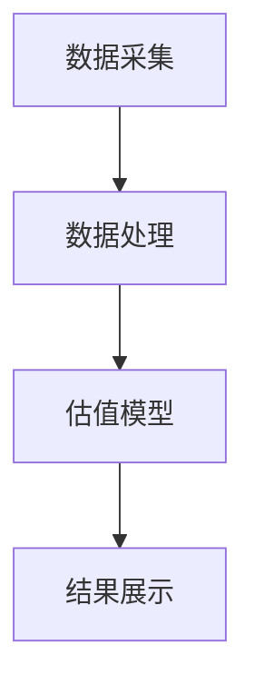
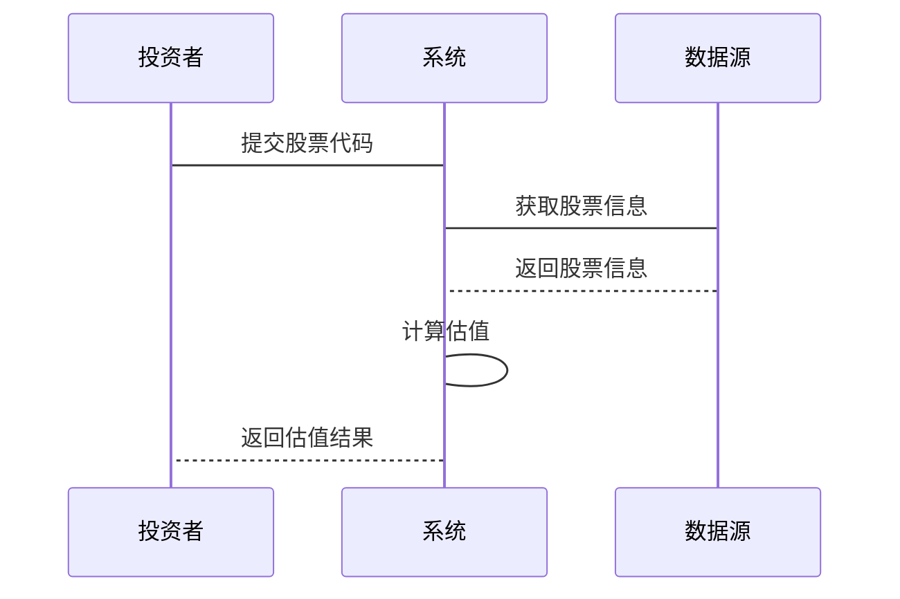

                 


# 中国香港股市估值:国际金融中心的市场特点

## 关键词:
- 中国香港股市估值
- 国际金融中心
- 市场特点
- 估值模型
- 股票分析
- 投资策略

## 摘要:
本文深入分析了中国香港股市的估值方法及其作为国际金融中心的市场特点。通过背景介绍、核心概念与方法、算法原理、系统分析与架构设计、项目实战以及总结与展望，全面探讨了香港股市的独特性、估值模型的应用以及投资策略的制定。本文不仅提供了理论支持，还通过实际案例分析和代码实现，帮助读者更好地理解和应用这些方法。

---

## 第1章: 香港股市概述

### 1.1 香港股市的背景与特点

#### 1.1.1 香港股市的历史与发展
香港股市的历史可以追溯到19世纪末，1910年香港交易所的成立标志着其正式起步。1980年代，随着改革开放，内地企业开始在香港上市，推动了香港股市的快速发展。如今，香港交易所已成为全球最重要的股票市场之一，吸引了大量国际投资者。

#### 1.1.2 香港作为国际金融中心的核心优势
- **地理优势**：香港位于东亚，是东西方的重要交通枢纽。
- **法治环境**：香港拥有完善的法律体系和严格的监管，保障投资者权益。
- **低税率**：香港的税率相对较低，吸引了大量跨国公司和投资者。
- **国际化**：香港市场参与者多元化，包括国际企业和机构投资者。

#### 1.1.3 香港股市的市场结构与参与者
香港股市的主要参与者包括上市公司、投资者、券商、交易所和监管机构。上市公司主要涵盖金融、地产、科技等行业。

#### 图1.1 香港股市的主要行业分布


### 1.2 香港股市与内地市场的联系

#### 1.2.1 香港与内地经济的互动
香港作为中国的特别行政区，与内地经济联系紧密。内地企业通过香港市场融资，推动了香港股市的发展。

#### 1.2.2 香港股市对内地企业的融资作用
香港股市为内地企业提供了重要的融资渠道，尤其是通过首次公开发行（IPO）和后续融资。

#### 1.2.3 沪港通、深港通机制的介绍
沪港通和深港通允许投资者通过两地交易所进行股票交易，促进了内地与香港市场的互联互通。

#### 图1.2 沪港通、深港通机制流程图


### 1.3 香港股市的行业分布与特点

#### 1.3.1 香港股市的主要行业分布
- 金融行业占比最大，其次是地产和科技行业。

#### 1.3.2 香港金融行业的独特性
香港作为国际金融中心，其金融行业具有国际化和多元化的特点。

#### 1.3.3 香港科技与创新企业的崛起
近年来，香港科技企业在金融科技和创新领域的表现尤为突出。

---

## 第2章: 股市估值的基本概念与方法

### 2.1 估值的基本概念

#### 2.1.1 什么是股市估值
股市估值是通过分析企业的财务状况和市场环境，对其股票的合理价格进行估计。

#### 2.1.2 估值的核心要素
- **财务数据**：收入、利润、现金流等。
- **市场环境**：宏观经济、行业趋势等。
- **企业基本面**：行业地位、竞争优势等。

#### 2.1.3 估值与投资决策的关系
准确的估值能够帮助投资者做出合理的投资决策，避免盲目跟风。

### 2.2 主要的估值方法

#### 2.2.1 市盈率（P/E）法
市盈率=股票价格/每股净利润。

#### 2.2.2 市净率（P/B）法
市净率=股票价格/每股净资产。

#### 2.2.3 现金流折现法（DCF）
DCF模型通过预测企业的未来现金流，折现计算其现值。

#### 图2.1 DCF模型流程图


### 2.3 估值的关键因素

#### 2.3.1 财务指标的重要性
财务指标如ROE（净资产收益率）和ROA（资产回报率）是估值的重要依据。

#### 2.3.2 市场情绪与宏观经济的影响
市场情绪和宏观经济政策会影响股票估值。

#### 2.3.3 行业周期与企业竞争力
行业周期和企业的核心竞争力也是估值的关键因素。

---

## 第3章: 香港股市估值的核心模型与应用

### 3.1 香港股市估值的核心模型

#### 3.1.1 市盈率模型的适用性
市盈率模型适用于盈利稳定的公司。

#### 3.1.2 现金流折现模型的实践应用
DCF模型适用于成长型企业。

#### 3.1.3 市净率模型的优缺点
市净率模型适用于资产密集型企业。

### 3.2 香港股市估值的特殊性

#### 3.2.1 香港市场的国际化特征
国际化使得香港股市的估值更具全球视角。

#### 3.2.2 中资企业的估值挑战
中资企业在估值时需要考虑政策和行业周期的影响。

#### 3.2.3 宏观经济政策对估值的影响
宏观经济政策如利率和汇率变化会影响估值。

### 3.3 估值模型的对比分析

#### 3.3.1 不同估值方法的适用场景
- 市盈率适用于盈利稳定的公司。
- DCF适用于高成长企业。
- 市净率适用于资产密集型企业。

#### 3.3.2 香港股市的独特性对估值模型的影

---

## 第4章: 系统分析与架构设计

### 4.1 问题场景介绍

#### 4.1.1 项目介绍
本项目旨在开发一个港股估值系统，帮助投资者快速获取股票估值信息。

### 4.2 系统功能设计

#### 4.2.1 领域模型


### 4.3 系统架构设计

#### 4.3.1 系统架构图


### 4.4 系统接口设计

#### 4.4.1 系统交互图


---

## 第5章: 项目实战

### 5.1 环境安装

#### 5.1.1 安装Python和Pandas
```bash
pip install pandas numpy
```

### 5.2 系统核心实现

#### 5.2.1 股票数据获取
```python
import pandas as pd
import numpy as np

def get_stock_data(stock_code):
    # 模拟数据获取
    data = {
        'stock_code': stock_code,
        'price': np.random.uniform(100, 200),
        'eps': np.random.uniform(10, 30)
    }
    return pd.DataFrame(data)
```

### 5.3 实际案例分析

#### 5.3.1 恒生指数的估值
恒生指数是香港股市的重要指数，其成分股包括多只蓝筹股。

---

## 第6章: 总结与展望

### 6.1 总结
香港股市作为国际金融中心，具有独特的市场特点和估值需求。本文通过理论分析和实际案例，探讨了多种估值方法的应用。

### 6.2 展望
未来，随着大数据和人工智能技术的发展，港股估值将更加精准和高效。

### 6.3 最佳实践 tips
- 选择合适的估值模型。
- 结合市场环境和企业基本面。
- 定期更新和调整估值模型。

---

通过以上步骤，我们系统地分析了香港股市估值的核心方法和实际应用，帮助投资者更好地理解和应用这些方法。希望本文能为读者提供有价值的参考和指导。

