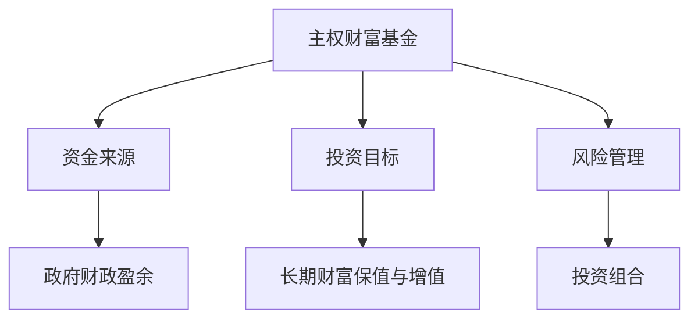

                 

# 主权财富基金策略：国家层面的长期投资视角

> **关键词**：主权财富基金，长期投资，风险管理，国家经济战略，投资策略

> **摘要**：主权财富基金（SWF）作为国家层面的长期投资工具，通过优化资产配置、分散风险和实现财富保值增值，为国家经济发展提供战略支持。本文从主权财富基金的背景、运作机制、战略选择、风险管理、案例分析及未来趋势等方面进行深入探讨，结合实际案例和理论分析，揭示主权财富基金在国家经济发展中的重要作用。

---

## 第1章: 主权财富基金概述

### 1.1 主权财富基金的定义与核心概念

#### 1.1.1 主权财富基金的定义
主权财富基金（Sovereign Wealth Fund, SWF）是指由主权国家或其授权机构设立和管理，以实现国家财富保值增值为目标，通过投资国内外金融资产或其他长期资产的专项资金。其本质是一个国家的“储蓄账户”，用于管理因资源禀赋、贸易顺差、外汇储备积累或其他财政盈余而形成的超额财富。

#### 1.1.2 主权财富基金的核心要素
主权财富基金的核心要素包括：
1. **资金来源**：主要来源于财政盈余、外汇储备、资源收入等。
2. **投资目标**：实现长期财富保值与增值，支持国家经济发展。
3. **管理机构**：通常由独立的机构或政府相关部门负责管理。
4. **投资范围**：涵盖股票、债券、房地产、基础设施等多种资产类别。
5. **风险管理**：通过分散投资、严格内控制度等手段降低风险。

#### 1.1.3 主权财富基金的属性与特征对比
以下是主权财富基金与其他机构投资者的对比分析：

| **属性**       | **主权财富基金**                     | **其他机构投资者**                 |
|----------------|--------------------------------------|-----------------------------------|
| 资金来源       | 财政盈余、外汇储备、资源收入等       | 企业利润、个人储蓄等             |
| 投资目标       | 长期财富保值与增值，支持国家经济    | 为投资者创造收益                 |
| 管理结构       | 独立的主权财富基金公司或政府机构     | 各类资产管理公司、基金公司         |
| 投资策略       | 长期投资、多元化配置                 | 短期与长期结合                    |
| 风险承受能力   | 较高，具备较强的战略耐心             | 较低，追求短期收益                |

#### 1.1.4 主权财富基金的实体关系图

### 1.2 主权财富基金的起源与发展

#### 1.2.1 主权财富基金的起源
主权财富基金的概念可以追溯到20世纪70年代，随着石油价格的上涨，一些石油出口国积累了大量外汇储备，但由于当时美元贬值，这些国家需要将外汇储备投资于更稳定的资产，从而形成了主权财富基金的雏形。

#### 1.2.2 主权财富基金的发展历程
1. **萌芽阶段（20世纪70年代-80年代）**：主要由石油出口国设立，用于管理石油收入。
2. **发展阶段（20世纪90年代-21世纪初）**：随着全球化的深入，越来越多的国家开始设立主权财富基金，用于管理外汇储备和实现财富保值。
3. **成熟阶段（21世纪以来）**：主权财富基金逐渐成为国家经济发展的重要工具，投资范围不断扩大，管理日益专业化。

#### 1.2.3 主权财富基金的现状分析
截至2023年，全球已设立的主权财富基金资产规模超过8万亿美元，主要分布在中东、东亚、欧洲和北美等地。这些基金的投资策略日益多元化，涵盖股票、债券、房地产、基础设施等多种资产类别。

### 1.3 主权财富基金与国家经济战略

#### 1.3.1 主权财富基金与国家经济战略的关系
主权财富基金是国家经济战略的重要组成部分，其目标是通过长期投资实现财富保值与增值，支持国家经济发展。它不仅是国家财政的“缓冲器”，也是实现经济 diversification（多元化）的重要工具。

#### 1.3.2 主权财富基金在国家经济发展中的作用
1. **财富保值与增值**：通过多元化投资，实现财富的长期保值与增值。
2. **支持经济发展**：通过投资关键产业，推动国家经济发展。
3. **维护金融稳定**：在金融市场动荡时，主权财富基金可以起到稳定市场的积极作用。

#### 1.3.3 主权财富基金的国际比较
以下是一些典型主权财富基金的比较：

| **国家**         | **主权财富基金名称** | **资产规模（亿美元）** | **投资策略**                     |
|------------------|-----------------------|--------------------------|---------------------------------|
| 挪威             | Government Pension Fund Global（GPFG） | 1.3万亿美元                    | 股票、债券、房地产等             |
| 新加坡           | Singapore Government Investment Corporation（GIC） | 1,000亿美元                   | 长期投资，注重风险控制           |
| 中国             | China Investment Corporation（CIC）      | 1,700亿美元                   | 多元化投资，注重战略利益         |

---

## 第2章: 主权财富基金的运作机制

### 2.1 主权财富基金的资金来源

#### 2.1.1 财政盈余
主权财富基金的主要资金来源之一是国家财政盈余。通过税收、政府支出等财政手段积累的盈余资金可以注入主权财富基金。

#### 2.1.2 外汇储备
外汇储备是主权财富基金的另一个重要资金来源。许多国家通过外汇储备的积累，将其部分资金注入主权财富基金，以实现资产的多元化配置。

#### 2.1.3 其他来源
除了财政盈余和外汇储备，主权财富基金还可以通过出售国有资产、资源收入等方式获得资金。

### 2.2 主权财富基金的投资策略

#### 2.2.1 长期投资与短期投资
主权财富基金的投资策略通常以长期投资为主，注重资产的长期增值。然而，在特殊情况下，基金也可以进行短期投资，以应对市场波动。

#### 2.2.2 多元化配置
为了分散风险，主权财富基金通常会将资金分散投资于不同的资产类别，如股票、债券、房地产、基础设施等。

#### 2.2.3 风险管理
主权财富基金的风险管理是其运作的核心内容之一。通过建立严格的风险控制机制、分散投资、定期评估投资组合等方式，基金可以有效降低投资风险。

### 2.3 主权财富基金的风险管理框架

#### 2.3.1 风险类型
主权财富基金面临的主要风险包括市场风险、流动性风险、信用风险、主权风险等。

#### 2.3.2 风险管理策略
1. **分散投资**：通过投资多种资产类别降低风险。
2. **严格监控**：定期评估投资组合的风险敞口。
3. **建立应急机制**：在市场波动时，及时采取措施应对风险。

### 2.4 主权财富基金的治理结构

#### 2.4.1 管理机构
主权财富基金的管理机构通常是一个独立的法人实体，由政府授权负责基金的运作。

#### 2.4.2 董事会职责
董事会负责制定基金的战略目标、监督投资决策、评估基金的绩效等。

#### 2.4.3 内部控制
主权财富基金需要建立严格的内部控制机制，确保基金的安全和高效运作。

---

## 第3章: 主权财富基金的战略选择

### 3.1 主权财富基金的战略资产配置

#### 3.1.1 长期目标
主权财富基金的长期目标是实现财富的长期保值与增值，支持国家经济发展。

#### 3.1.2 资产类别选择
基金通常会将资金分配到股票、债券、房地产、基础设施等多种资产类别，以实现多元化配置。

#### 3.1.3 地域配置
主权财富基金通常会将资金分散投资于不同国家和地区的市场，以降低地域风险。

### 3.2 主权财富基金的ESG投资策略

#### 3.2.1 ESG投资的定义
ESG投资是指在投资决策中考虑环境（Environmental）、社会（Social）和公司治理（Governance）三个维度的因素。

#### 3.2.2 ESG投资的重要性
随着全球对可持续发展的关注增加，ESG投资逐渐成为主权财富基金的重要策略之一。

#### 3.2.3 ESG投资的实施
主权财富基金可以通过筛选符合ESG标准的企业，投资于环保项目、社会责任项目等，实现可持续发展目标。

---

## 第4章: 主权财富基金的风险管理与治理

### 4.1 主权财富基金的主要风险

#### 4.1.1 市场风险
市场波动可能导致基金资产价值的下降。

#### 4.1.2 流动性风险
在市场低迷时，基金可能难以以合理价格出售资产。

#### 4.1.3 主权风险
主权风险是指由于国家政策变化、政治动荡等因素导致的投资风险。

### 4.2 主权财富基金的治理结构

#### 4.2.1 治理框架
主权财富基金的治理框架通常包括董事会、投资委员会、风险管理团队等。

#### 4.2.2 董事会职责
董事会负责制定基金的战略目标、监督投资决策、评估基金绩效等。

#### 4.2.3 风险管理团队
风险管理团队负责监控和评估投资组合的风险，制定风险管理策略。

---

## 第5章: 主权财富基金的案例分析

### 5.1 挪威的Government Pension Fund Global（GPFG）

#### 5.1.1 挪威GPFG的概况
挪威的GPFG是全球最大的主权财富基金之一，资产规模超过1.3万亿美元。

#### 5.1.2 投资策略
GPFG的投资策略以长期投资为主，注重多元化配置，涵盖股票、债券、房地产等多种资产类别。

#### 5.1.3 成功经验
挪威GPFG的成功经验在于其严格的治理结构、长期的投资策略和有效的风险管理。

### 5.2 新加坡的GIC

#### 5.2.1 GIC的概况
新加坡的GIC是亚洲最大的主权财富基金之一，资产规模超过1,000亿美元。

#### 5.2.2 投资策略
GIC的投资策略注重风险控制，通过多元化配置和长期投资实现财富保值与增值。

#### 5.2.3 成功经验
GIC的成功经验在于其稳健的投资策略、严格的内部管理和高效的风险管理。

### 5.3 中国的中投公司

#### 5.3.1 中投公司的概况
中国投资公司（CIC）是全球最大的主权财富基金之一，资产规模超过1,700亿美元。

#### 5.3.2 投资策略
中投公司的投资策略注重多元化配置，涵盖股票、债券、房地产、基础设施等多种资产类别。

#### 5.3.3 成功经验
中投公司的成功经验在于其多元化投资策略、高效的管理团队和严格的风险控制。

---

## 第6章: 主权财富基金的未来趋势

### 6.1 全球经济形势对主权财富基金的影响

#### 6.1.1 经济全球化与主权财富基金
随着经济全球化的深入，主权财富基金的投资范围将进一步扩大，资产配置将更加多元化。

#### 6.1.2 经济区域化与主权财富基金
经济区域化趋势可能导致主权财富基金的投资策略更加注重区域市场的配置。

### 6.2 技术驱动的投资创新

#### 6.2.1 人工智能与投资决策
人工智能技术的应用将提升主权财富基金的投资决策效率和准确性。

#### 6.2.2 区块链技术与资产托管
区块链技术的应用将提高资产托管的安全性和透明度。

### 6.3 ESG投资的未来发展方向

#### 6.3.1 ESG投资的普及
随着全球对可持续发展的关注增加，ESG投资将成为主权财富基金的重要策略之一。

#### 6.3.2 ESG投资的标准制定
国际社会将推动制定统一的ESG投资标准，以规范主权财富基金的ESG投资行为。

---

## 第7章: 结论与展望

### 7.1 结论

主权财富基金作为国家层面的长期投资工具，通过优化资产配置、分散风险和实现财富保值增值，为国家经济发展提供了重要支持。其运作机制、投资策略和风险管理框架的成功经验为其他国家提供了宝贵借鉴。

### 7.2 展望

随着全球经济形势的变化和技术的进步，主权财富基金的投资策略和管理模式将不断优化。未来，主权财富基金将在国家经济发展中发挥更加重要的作用，同时也需要在风险管理、资产配置和技术创新等方面进行更多的探索和实践。

---

通过本文的分析，我们可以看到，主权财富基金不仅是国家财富管理的重要工具，也是实现国家经济发展战略的重要手段。随着全球经济的不断发展和变化，主权财富基金的运作机制和投资策略也将不断创新和优化，为国家经济发展提供更加有力的支持。

