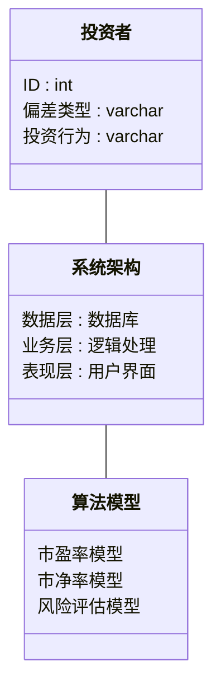
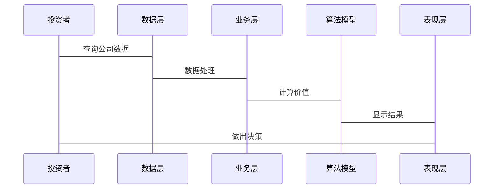

                 


# 乔尔·提林加斯特的价值投资心理学

---

## 关键词：
- 价值投资
- 心理学
- 乔尔·提林加斯特
- 数学模型
- 系统架构

---

## 摘要：
本文系统地探讨了价值投资中的心理学因素，结合数学模型和系统架构分析，深入剖析了乔尔·提林加斯特的投资哲学和决策方法。通过分析心理偏差、行为模式和数学模型，结合实际案例，为投资者提供心理层面的指导和系统化的投资策略。

---

# 目录大纲

## 第一章：价值投资与心理学的交集

### 1.1 价值投资的基本概念
- 价值投资的定义与历史发展
- 核心理念：寻找市场低估的价值
- 心理学在投资中的重要性

### 1.2 乔尔·提林加斯特的贡献
- 乔尔·提林加斯特的背景介绍
- 他的投资哲学与心理学结合
- 心理学分析方法的独特性

## 第二章：价值投资中的心理偏差

### 2.1 常见心理偏差概述
- 过度自信偏差
- 沉没成本谬误
- 羊群效应

### 2.2 心理偏差对投资决策的影响
- 案例分析：偏差如何影响投资判断
- 克服偏差的策略

## 第三章：价值投资的心理学原理

### 3.1 理性与感性决策
- 理性决策的定义与局限
- 情感决策的定义与影响
- 理性与感性的相互作用

### 3.2 投资者心理与市场行为
- 市场情绪周期的分析
- 个体行为对市场的影响

## 第四章：价值投资中的行为模式

### 4.1 投资者的行为分类
- 肾脏投资者与肠投资者的定义
- 不同类型投资者的行为特征对比

### 4.2 行为模式与投资策略
- 不同策略下的行为差异
- 行为模式对投资结果的影响

## 第五章：数学模型与算法在价值投资中的应用

### 5.1 常用数学模型
- 市盈率模型：$市盈率 = \frac{股价}{每股收益}$
- 市净率模型：$市净率 = \frac{股价}{每股净资产}$
- 股息率模型：$股息率 = \frac{股息}{股价}$

### 5.2 风险调整后的收益模型
- 夏普比率：$\text{夏普比率} = \frac{E[R_i - R_f]}{\sigma_i}$
- 特雷诺比率：$\text{特雷诺比率} = \frac{E[R_i - R_f]}{\sqrt{\text{Var}(R_i - R_f)}}$
- 风险溢价模型：$E[ R_p ] = R_f + \beta (E[ R_m ] - R_f)$

### 5.3 算法与投资策略
- 简单过滤器策略：根据价格和均线关系发出买卖信号
- 动态资产配置算法：根据市场变化调整资产比例
- 风险平价算法：基于风险的资产配置方法

## 第六章：系统架构与投资策略

### 6.1 系统架构设计
- 系统整体架构：数据采集、分析、决策、执行和反馈
- 系统功能设计：数据处理、模型计算、策略生成、风险评估
- 系统架构图：使用Mermaid绘制系统架构图

### 6.2 系统接口与交互
- 数据接口设计：API调用和数据格式
- 用户界面设计：操作界面和用户交互流程
- 交互流程图：使用Mermaid绘制系统交互序列图

## 第七章：项目实战与案例分析

### 7.1 环境安装与数据准备
- 安装必要的工具和库
- 数据采集与预处理

### 7.2 核心算法实现
- 价值评估算法：计算内在价值
- 风险评估算法：评估投资风险

### 7.3 案例分析
- 某公司财务状况分析：计算市盈率、市净率、股息率
- 应用乔尔的投资策略进行评估
- 投资决策过程与结果分析

## 第八章：结论与展望

### 8.1 结论
- 心理学因素在价值投资中的重要性
- 数学模型和系统架构的作用
- 乔尔·提林加斯特方法的独特价值

### 8.2 未来研究方向
- 更复杂的心理模型研究
- 人工智能在价值投资中的应用

### 8.3 投资建议
- 提高自我认知，避免心理偏差
- 合理运用数学模型，辅助决策
- 结合系统架构，优化投资流程

---

## 图表说明

### 1. ER图：投资者行为与心理偏差关系

```mermaid
erDiagram
    投资者 {
        <属性>
        ID : int
        心理类型 : varchar
        投资行为 : varchar
        偏差类型 : varchar
    }
    偏差类型 {
        <属性>
        ID : int
        偏差名称 : varchar
        影响程度 : int
    }
    投资者 <---N--> 偏差类型
```

### 2. 类图：价值投资系统组件



### 3. 序列图：投资决策流程



---

## 总结

通过以上目录大纲，我们可以系统地探讨乔尔·提林加斯特的价值投资心理学，从理论到实践，从心理分析到系统设计，为投资者提供全面的指导和深入的分析。

