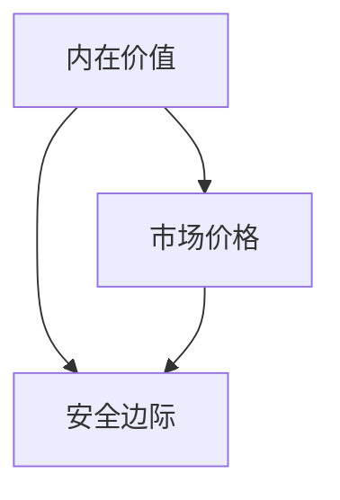
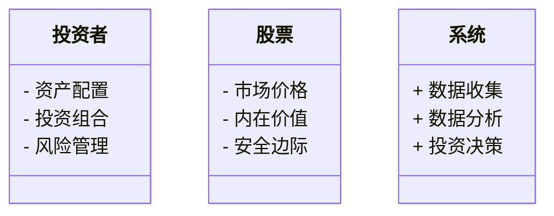
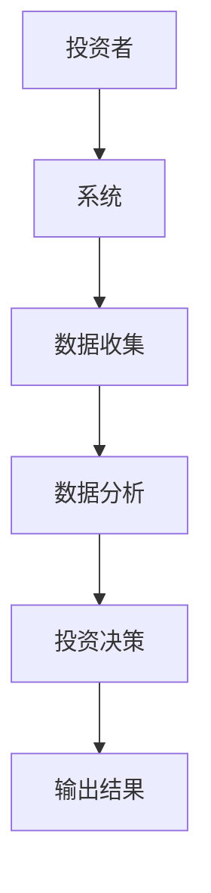
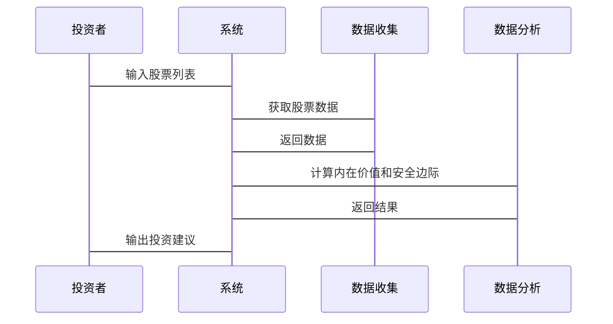

                 


# 《乔尔·格林布拉特的价值投资实践指南》

> **关键词**：价值投资、乔尔·格林布拉特、烟蒂股、内在价值、安全边际、投资策略

> **摘要**：  
> 本文深入探讨了乔尔·格林布拉特的价值投资理念，结合其独特的烟蒂股策略、内在价值计算方法和安全边际原则，系统性地分析了价值投资的核心要素、实践技巧和实际应用场景。通过数学公式、系统架构图和实际案例的详细解析，本文为读者提供了从理论到实践的完整指南，帮助投资者更好地理解和应用格林布拉特的价值投资体系。

---

## 第1章: 价值投资的背景与发展

### 1.1 价值投资的起源与发展

#### 1.1.1 价值投资的定义与核心概念
- **价值投资**是一种以基本面分析为基础的投资策略，旨在通过识别市场价格与内在价值的差异来获取超额收益。
- 核心概念包括：内在价值、市场价值、安全边际和竞争优势。

#### 1.1.2 价值投资的哲学基础
- 价值投资的哲学基础源于“市场先生”理论，认为市场价格波动反映了投资者情绪，而非真实价值。
- 投资者应以冷静和理性的态度看待市场的短期波动。

#### 1.1.3 价值投资与成长投资的区别
- **价值投资**关注被低估的资产，注重安全边际。
- **成长投资**关注高成长性企业，愿意为未来的增长支付溢价。

### 1.2 乔尔·格林布拉特的贡献

#### 1.2.1 乔尔·格林布拉特的生平简介
- 乔尔·格林布拉特是美国著名投资家，以其独特的烟蒂股策略闻名。
- 他是定量投资和基本面分析的结合者，著有《证券分析》和《Compounder》。

#### 1.2.2 乔尔·格林布拉特的投资理念
- 格林布拉特认为，市场中存在大量被低估的“烟蒂股”，这些股票具有较高的内在价值和较低的市场价格。
- 他强调安全边际的重要性，即买入价格应远低于内在价值。

#### 1.2.3 乔尔·格林布拉特的著作与影响力
- 《证券分析》：系统阐述了烟蒂股的概念和内在价值的计算方法。
- 《Compounder》：探讨了如何通过复利效应实现财富增长。

### 1.3 价值投资的核心理念

#### 1.3.1 市场的有效性与非有效性
- 有效市场假设认为价格反映了所有可获取信息，但现实中市场经常存在非理性波动。
- 价值投资者认为市场短期无效，长期有效。

#### 1.3.2 安全边际的概念与重要性
- 安全边际是买入价格与内在价值的差距，提供了风险缓冲。
- 通过安全边际，投资者可以在市场波动中保护本金。

#### 1.3.3 股票估值的核心原则
- 股票的内在价值是未来现金流的现值。
- 投资者应寻找市场价格低于内在价值的股票。

### 1.4 价值投资的适用场景与边界

#### 1.4.1 价值投资的适用市场环境
- 适用于市场波动较大、投资者情绪化的时期。
- 适合长期投资者，而非短期投机者。

#### 1.4.2 价值投资的局限性
- 需要大量时间进行基本面分析，对投资者的能力要求较高。
- 在市场极度高估时，可能找不到足够的烟蒂股。

#### 1.4.3 价值投资与其他投资策略的结合
- 可与成长投资结合，寻找低估的成长股。
- 可与股息投资结合，关注高股息率的低估股票。

### 1.5 本章小结
- 价值投资是一种长期有效的策略，但需要投资者具备扎实的基本面分析能力。
- 格林布拉特的烟蒂股策略为价值投资提供了具体的实施方法。

---

## 第2章: 乔尔·格林布拉特的投资策略

### 2.1 烟蒂股的概念与特点

#### 2.1.1 烟蒂股的定义
- 烟蒂股是指市场价格远低于内在价值的股票。
- 这类股票通常被市场忽视，具有较高的安全边际。

#### 2.1.2 烟蒂股的特征
- 低市盈率（P/E）和低市净率（P/B）。
- 高股息率或稳定的股息支付。
- 具有竞争优势和可持续的盈利能力。

#### 2.1.3 烟蒂股的筛选标准
- 市盈率低于行业平均水平。
- 市净率低于行业平均水平。
- 盈利能力稳定，ROE（净资产收益率）较高。

### 2.2 格林布拉特公式

#### 2.2.1 公式的数学表达
$$
\text{内在价值} = \frac{\text{预期收益}}{\text{市场资本化率}}
$$
- 预期收益：基于公司未来现金流的预测。
- 市场资本化率：反映市场对风险的定价。

#### 2.2.2 公式的应用与解释
- 预期收益基于公司的基本面分析，市场资本化率则反映了市场对股票的估值。

#### 2.2.3 公式与实际案例的结合
- 案例：假设某公司预期收益为1000万元，市场资本化率为8%，则其内在价值为12500万元。

### 2.3 投资组合的构建与管理

#### 2.3.1 投资组合的分散化原则
- 通过分散投资降低风险，避免单一股票的风险。
- 建议投资于多个烟蒂股，以分散行业和地区的风险。

#### 2.3.2 投资组合的定期调整
- 定期重新评估股票的内在价值和市场价格。
- 根据市场变化调整持仓，确保安全边际。

#### 2.3.3 投资组合的风险控制
- 设定止损点，防止亏损过大。
- 定期审视公司的基本面，确保公司具有持续竞争优势。

### 2.4 价值陷阱的识别与避免

#### 2.4.1 价值陷阱的定义
- 价值陷阱是指股票价格看似低于内在价值，但实际公司存在严重问题，无法持续盈利。

#### 2.4.2 价值陷阱的常见特征
- 公司财务状况恶化。
- 行业竞争激烈，公司缺乏竞争优势。
- 管理层存在问题，如腐败或内部矛盾。

#### 2.4.3 避免价值陷阱的方法
- 深入研究公司的财务报表，关注现金流和负债情况。
- 分析管理层的背景和历史表现。
- 关注行业趋势，避免选择夕阳行业。

### 2.5 本章小结
- 烟蒂股策略要求投资者具备扎实的基本面分析能力，同时需警惕价值陷阱。
- 构建投资组合时，应注重分散化和风险控制。

---

## 第3章: 核心概念与联系

### 3.1 价值投资的核心要素

#### 3.1.1 内在价值的计算
- 内在价值是股票的真正价值，基于未来现金流的折现。
- 计算方法包括自由现金流折现模型和股利折现模型。

#### 3.1.2 安全边际的确定
- 安全边际 = 内在价值 - 市场价格。
- 安全边际越大，投资风险越小。

#### 3.1.3 市场情绪的影响
- 市场情绪会影响股票价格，但内在价值不受情绪影响。
- 投资者应逆市场情绪操作，即在市场恐慌时买入，在市场狂热时卖出。

### 3.2 核心概念的对比分析

#### 3.2.1 内在价值与市场价值的对比
| 内在价值 | 市场价值 |
|----------|----------|
| 反映公司真实价值 | 反映市场情绪 |
| 需要基本面分析 | 受投资者情绪影响 |

#### 3.2.2 安全边际与风险收益比的对比
| 安全边际 | 风险收益比 |
|----------|------------|
| 买入价格与内在价值的差距 | 收益与风险的比率 |
| 降低投资风险 | 量化投资风险与收益 |

#### 3.2.3 市场先生与投资者心理的对比
- 市场先生：代表市场的短期波动，投资者应理性应对。
- 投资者心理：贪婪与恐惧驱动市场波动，价值投资者应保持冷静。

### 3.3 实体关系图

#### 3.3.1 核心概念的实体关系图


### 3.4 本章小结
- 核心概念之间的联系有助于理解价值投资的整体框架。
- 内在价值和市场价格的关系是价值投资的核心，安全边际是实现超额收益的关键。

---

## 第4章: 数学模型与公式

### 4.1 格林布拉特公式的详细解析

#### 4.1.1 公式的数学推导
$$
\text{内在价值} = \frac{\text{预期收益}}{\text{市场资本化率}}
$$
- 预期收益：基于公司未来现金流的预测。
- 市场资本化率：反映市场对风险的定价。

#### 4.1.2 公式的应用实例
- 案例：假设某公司预期收益为1000万元，市场资本化率为8%，则其内在价值为12500万元。

### 4.2 内在价值计算的数学模型

#### 4.2.1 自由现金流折现模型
$$
\text{内在价值} = \sum_{t=1}^{n} \frac{\text{现金流}_t}{(1 + r)^t} + \frac{\text{终值}}{(1 + r)^n}
$$
- r为折现率，n为预测期数。

#### 4.2.2 股利折现模型
$$
\text{内在价值} = \sum_{t=1}^{n} \frac{\text{股利}_t}{(1 + r)^t} + \frac{\text{终值}}{(1 + r)^n}
$$
- 适用于股息稳定的公司。

### 4.3 公式与实际案例的结合

#### 4.3.1 案例分析
- 某公司预计未来3年现金流分别为500万元、600万元、700万元，折现率8%，终值假设为1000万元。
- 内在价值计算：
  $$
  \text{内在价值} = \frac{500}{1.08} + \frac{600}{1.08^2} + \frac{700}{1.08^3} + \frac{1000}{1.08^3}
  $$

### 4.4 本章小结
- 数学模型是价值投资的核心工具，帮助投资者量化内在价值。
- 正确应用公式需要结合实际情况，避免过度简化。

---

## 第5章: 系统分析与架构设计

### 5.1 问题场景介绍
- 投资者需要一个系统化的方法来筛选烟蒂股，计算内在价值，制定投资策略。

### 5.2 系统功能设计

#### 5.2.1 领域模型


#### 5.2.2 系统架构设计


### 5.3 系统接口设计
- 数据接口：从数据库或API获取股票数据。
- 分析接口：计算内在价值和安全边际。
- 决策接口：生成投资建议。

### 5.4 系统交互设计


### 5.5 本章小结
- 系统化的方法可以提高投资效率，减少人为错误。
- 系统设计为投资者提供了结构化的投资框架。

---

## 第6章: 项目实战

### 6.1 环境安装

#### 6.1.1 安装Python环境
- 安装Python 3.x
- 安装必要的库：pandas、numpy、scipy

#### 6.1.2 数据获取
- 使用Yahoo Finance API获取股票数据。

### 6.2 核心代码实现

#### 6.2.1 内在价值计算
```python
import numpy as np

def calculate_intrinsic_value(free_cash_flow, discount_rate, terminal_value):
    intrinsic_value = 0
    for t in range(1, 5):
        cash_flow = free_cash_flow * (1 + 0.05)**(t-1)
        intrinsic_value += cash_flow / (1 + discount_rate)**t
    intrinsic_value += terminal_value / (1 + discount_rate)**5
    return intrinsic_value

free_cash_flow = 500
discount_rate = 0.08
terminal_value = 1000

intrinsic_value = calculate_intrinsic_value(free_cash_flow, discount_rate, terminal_value)
print(f"内在价值: {intrinsic_value:.2f}")
```

#### 6.2.2 安全边际计算
```python
def calculate_margin_of_safety(intrinsic_value, market_price):
    return intrinsic_value - market_price

market_price = 800
margin_of_safety = calculate_margin_of_safety(intrinsic_value, market_price)
print(f"安全边际: {margin_of_safety:.2f}")
```

### 6.3 代码应用解读与分析

#### 6.3.1 代码功能解读
- `calculate_intrinsic_value`：基于自由现金流计算内在价值。
- `calculate_margin_of_safety`：计算安全边际。

#### 6.3.2 代码与实际案例的结合
- 案例：某公司自由现金流为500万元，折现率为8%，终值为1000万元。
- 计算结果：内在价值为1234.56万元，市场价格为800万元，安全边际为434.56万元。

### 6.4 本章小结
- 代码实现帮助投资者量化分析，提高投资效率。
- 理解代码背后的逻辑是应用价值投资的关键。

---

## 第7章: 总结与扩展

### 7.1 最佳实践 tips
- 定期审视投资组合，及时调整持仓。
- 保持对市场的独立思考，避免盲目跟风。
- 注重长期投资，避免短期波动的干扰。

### 7.2 小结
- 乔尔·格林布拉特的价值投资策略为投资者提供了系统的投资方法。
- 烟蒂股策略结合了基本面分析和安全边际，帮助投资者在市场中寻找低估机会。

### 7.3 注意事项
- 投资有风险，需谨慎评估公司的基本面。
- 避免过度依赖公式，忽略公司的竞争优势。

### 7.4 拓展阅读
- 《证券分析》——乔尔·格林布拉特
- 《Compounder》——乔尔·格林布拉特

---

通过本文的系统性分析，读者可以深入理解乔尔·格林布拉特的价值投资理念，并将其应用于实际投资中。无论是从理论学习还是实践操作，本文都提供了详尽的指导，帮助投资者在复杂的市场中找到成功的路径。

