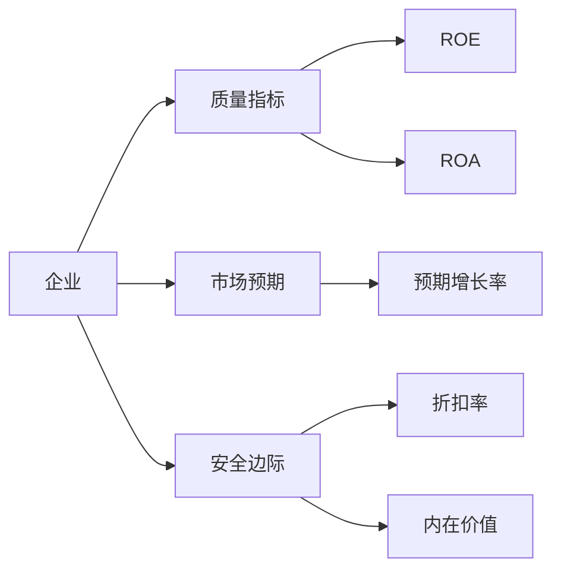
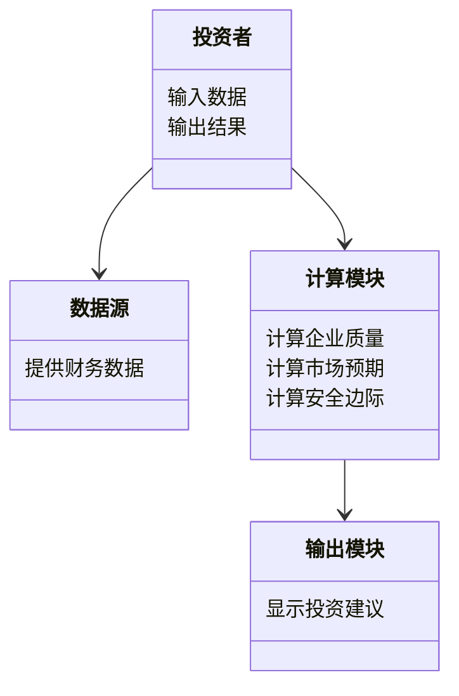

                 


# 乔尔·格林布拉特的价值投资量化模型

## 关键词：价值投资，量化模型，格林布拉特，投资策略，企业质量，市场预期，安全边际

## 摘要：  
本文深入探讨了乔尔·格林布拉特的价值投资量化模型，从模型的背景、核心概念、算法原理、系统架构到项目实战，全面解析了该模型的理论基础与实际应用。通过详细分析模型中的关键指标（如企业质量、市场预期、安全边际）及其相互关系，结合具体的数学公式和代码实现，展示了如何将价值投资理念转化为可量化的投资策略。本文还通过实际案例分析，验证了模型的有效性，并提出了优化建议。

---

# 第1章: 价值投资与量化模型概述

## 1.1 价值投资的起源与发展

### 1.1.1 价值投资的核心理念  
价值投资是一种长期投资策略，强调以低于内在价值的价格买入优质资产。其核心理念包括：  
1. **安全边际**：买入价格应显著低于内在价值，以降低风险。  
2. **长期视角**：关注企业的长期盈利能力，而非短期市场波动。  
3. **基本面分析**：通过财务数据和行业分析，识别具有持续竞争优势的企业。  

### 1.1.2 价值投资的演变历程  
价值投资的起源可以追溯到本杰明·格雷厄姆和戴维·多德的学生，包括沃伦·巴菲特、彼得·林奇等。格林布拉特在其著作《stocks for the long run》中，将价值投资的理念进一步量化，提出了基于企业质量、市场预期和安全边际的量化模型。  

### 1.1.3 量化模型在价值投资中的作用  
量化模型将传统的价值投资理念转化为可操作的数学公式，帮助投资者更高效地筛选出具有投资价值的股票。通过量化模型，投资者可以快速识别出符合价值投资标准的标的，降低主观判断的偏差。  

## 1.2 乔尔·格林布拉特的贡献  

### 1.2.1 乔尔·格林布拉特的背景介绍  
乔尔·格林布拉特是美国著名投资专家，以其量化模型闻名。他在《stocks for the long run》中提出了一套基于企业质量、市场预期和安全边际的价值投资量化方法。  

### 1.2.2 《stocks for the long run》的核心思想  
格林布拉特在书中强调，投资的成功取决于对企业内在价值的准确评估，以及对市场价格波动的合理判断。他提出了一套量化指标，帮助投资者识别出具有长期增长潜力的优质企业。  

### 1.2.3 格林布拉特模型的创新点  
格林布拉特模型的创新在于将传统价值投资理念与现代量化方法相结合，通过数学公式将企业质量、市场预期和安全边际转化为可量化的指标，为投资者提供了更科学的投资决策依据。  

## 1.3 价值投资量化模型的基本框架  

### 1.3.1 模型的输入变量  
1. **企业质量**：衡量企业的盈利能力、成长性和抗风险能力。  
2. **市场预期**：基于市场对企业的未来表现的预期。  
3. **安全边际**：买入价格与内在价值的折扣率。  

### 1.3.2 模型的输出结果  
1. **企业质量评分**：量化企业的综合质量。  
2. **市场价格预期**：预测股票的合理估值区间。  
3. **投资建议**：基于模型结果给出买入、持有或卖出的建议。  

### 1.3.3 模型的适用场景  
格林布拉特模型适用于长期价值投资，特别适合于筛选具有稳定盈利能力、良好成长性和合理估值的优质企业。  

## 1.4 价值投资与传统投资的区别  

### 1.4.1 传统投资方法的局限性  
1. **主观性过强**：依赖投资者的个人判断，容易受情绪影响。  
2. **缺乏量化标准**：难以系统化、可复制。  
3. **效率低下**：筛选标的耗时且效率低。  

### 1.4.2 量化模型的优势  
1. **客观性**：基于数学公式和数据，减少主观判断。  
2. **可复制性**：模型可以系统化，便于大规模应用。  
3. **效率高**：通过量化指标快速筛选出优质标的。  

### 1.4.3 模型的边界与外延  
格林布拉特模型适用于长期价值投资，但其结果应结合市场环境和宏观经济因素进行动态调整。  

## 1.5 本章小结  
本章介绍了价值投资的起源与发展，分析了格林布拉特模型的创新点及其在投资中的作用。通过对比传统投资与量化模型的优劣，为后续章节的深入分析奠定了基础。

---

# 第2章: 核心概念与联系  

## 2.1 核心概念原理  

### 2.1.1 企业质量的定义与计算  
企业质量是衡量企业盈利能力、成长性和抗风险能力的综合指标。格林布拉特模型中，企业质量主要通过以下公式计算：  

$$ \text{企业质量} = \frac{\text{ROE}}{\text{ROA}} $$  

其中，ROE（净资产收益率）和ROA（资产净利率）是衡量企业盈利能力的重要指标。  

### 2.1.2 市场预期的量化方法  
市场预期是基于市场对企业的未来表现的预期。格林布拉特模型中，市场预期的量化方法如下：  

$$ \text{市场预期} = \text{当前股价} \times \text{预期增长率} $$  

### 2.1.3 安全边际的计算公式  
安全边际是买入价格与内在价值的折扣率。其计算公式为：  

$$ \text{安全边际} = \text{内在价值} \times (1 - \text{折扣率}) $$  

## 2.2 核心概念属性特征对比  

### 2.2.1 企业质量与市场预期的对比表格  

| 指标 | 企业质量 | 市场预期 |
|------|----------|----------|
| 定义 | 盈利能力、成长性、抗风险能力 | 市场对企业的未来表现的预期 |
| 计算方式 | $$\frac{\text{ROE}}{\text{ROA}}$$ | $$\text{当前股价} \times \text{预期增长率}$$ |
| 作用 | 评估企业质量 | 判断市场价格是否合理 |

### 2.2.2 安全边际与其他风险控制指标的对比  

| 指标 | 安全边际 | 风险价值 |
|------|----------|----------|
| 定义 | 买入价格与内在价值的折扣率 | 资产在极端情况下的价值 |
| 计算方式 | $$\text{内在价值} \times (1 - \text{折扣率})$$ | $$\text{资产价值} \times \text{风险系数}$$ |
| 作用 | 减少投资风险 | 控制投资组合风险 |

## 2.3 ER实体关系图架构  



---

# 第3章: 算法原理与实现  

## 3.1 算法原理  

### 3.1.1 模型的输入变量  
1. **企业质量**：$$ \text{企业质量} = \frac{\text{ROE}}{\text{ROA}} $$  
2. **市场预期**：$$ \text{市场预期} = \text{当前股价} \times \text{预期增长率} $$  
3. **安全边际**：$$ \text{安全边际} = \text{内在价值} \times (1 - \text{折扣率}) $$  

### 3.1.2 模型的计算流程  


### 3.1.3 算法实现  

```python
def calculate_quality(roe, roa):
    return roe / roa

def calculate_market_expectation(current_price, growth_rate):
    return current_price * growth_rate

def calculate_margin_of_safety(intrinsic_value, discount_rate):
    return intrinsic_value * (1 - discount_rate)

# 示例代码
roe = 15%  # 净资产收益率
roa = 10%  # 资产净利率
current_price = 50  # 当前股价
growth_rate = 10%  # 预期增长率
discount_rate = 10%  # 折扣率

quality = calculate_quality(roe, roa)
market_expectation = calculate_market_expectation(current_price, growth_rate)
intrinsic_value = current_price * (1 + growth_rate)  # 简单估算内在价值
margin_of_safety = calculate_margin_of_safety(intrinsic_value, discount_rate)

print(f"企业质量：{quality}")
print(f"市场预期：{market_expectation}")
print(f"安全边际：{margin_of_safety}")
```

---

## 3.2 算法优化与实现细节  

### 3.2.1 算法优化  
1. 引入更多财务指标，如市盈率（P/E）和市净率（P/B）。  
2. 增加宏观经济因素的考量，如经济增长率和通货膨胀率。  

### 3.2.2 实现细节  
1. 数据来源：使用可靠的财务数据源，如Yahoo Finance或Morningstar。  
2. 计算频率：定期更新数据，如每月或每季度。  

---

# 第4章: 系统架构与实现  

## 4.1 系统架构设计  

### 4.1.1 系统功能设计  



### 4.1.2 系统架构图  


### 4.1.3 系统接口设计  
1. 数据输入接口：接收企业财务数据和市场数据。  
2. 计算接口：调用算法模块进行计算。  
3. 输出接口：显示投资建议。  

---

## 4.2 项目实战  

### 4.2.1 环境安装  
需要安装Python和相关库，如Pandas、NumPy、Matplotlib。  

### 4.2.2 核心代码实现  

```python
import pandas as pd
import numpy as np

def calculate_quality(roe, roa):
    return roe / roa

def calculate_market_expectation(current_price, growth_rate):
    return current_price * growth_rate

def calculate_margin_of_safety(intrinsic_value, discount_rate):
    return intrinsic_value * (1 - discount_rate)

# 示例数据
data = {
    '企业': ['A', 'B', 'C'],
    'ROE': [15, 20, 10],
    'ROA': [10, 15, 5],
    '当前股价': [50, 60, 30],
    '预期增长率': [10, 8, 12],
    '折扣率': [10, 15, 5]
}

df = pd.DataFrame(data)

# 计算企业质量、市场预期和安全边际
df['企业质量'] = df.apply(lambda x: calculate_quality(x['ROE'], x['ROA']), axis=1)
df['市场预期'] = df.apply(lambda x: calculate_market_expectation(x['当前股价'], x['预期增长率']), axis=1)
df['内在价值'] = df['当前股价'] * (1 + df['预期增长率'])
df['安全边际'] = df.apply(lambda x: calculate_margin_of_safety(x['内在价值'], x['折扣率']), axis=1)

print(df)
```

---

## 4.3 案例分析与结果解读  

### 4.3.1 案例分析  
以企业A为例，计算结果如下：  
- 企业质量：1.5  
- 市场预期：50 * 10% = 5  
- 内在价值：50 * 1.1 = 55  
- 安全边际：55 * (1 - 10%) = 49.5  

### 4.3.2 结果解读  
企业A的质量较高，市场预期合理，但安全边际较低，建议谨慎买入。  

---

## 4.4 本章小结  
本章通过系统架构设计和项目实战，详细展示了如何将格林布拉特模型应用于实际投资中。通过Python代码实现，读者可以快速上手，并根据实际数据进行调整和优化。

---

# 第5章: 总结与展望  

## 5.1 总结  
格林布拉特的价值投资量化模型通过将企业质量、市场预期和安全边际量化，为投资者提供了科学的投资决策依据。模型的优势在于其简单性、可操作性和高效性。  

## 5.2 展望  
未来，随着大数据和人工智能技术的发展，价值投资量化模型将更加精准和复杂。建议进一步优化模型，引入更多财务指标和宏观经济因素，以提升模型的预测能力。  

## 5.3 投资策略建议  
1. **长期持有**：价值投资的本质是长期持有优质资产。  
2. **分散投资**：通过分散投资降低风险。  
3. **动态调整**：根据市场变化和企业情况，动态调整投资组合。  

---

# 结语  
格林布拉特的价值投资量化模型为投资者提供了一种科学、可量化的方法，帮助他们在复杂多变的市场中找到优质标的。通过本文的深入分析，读者可以更好地理解该模型的原理和应用，并将其应用于实际投资中。

