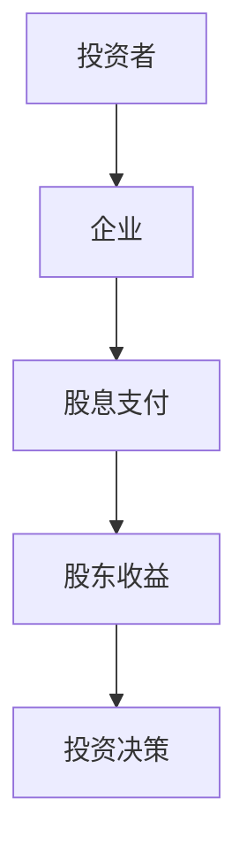
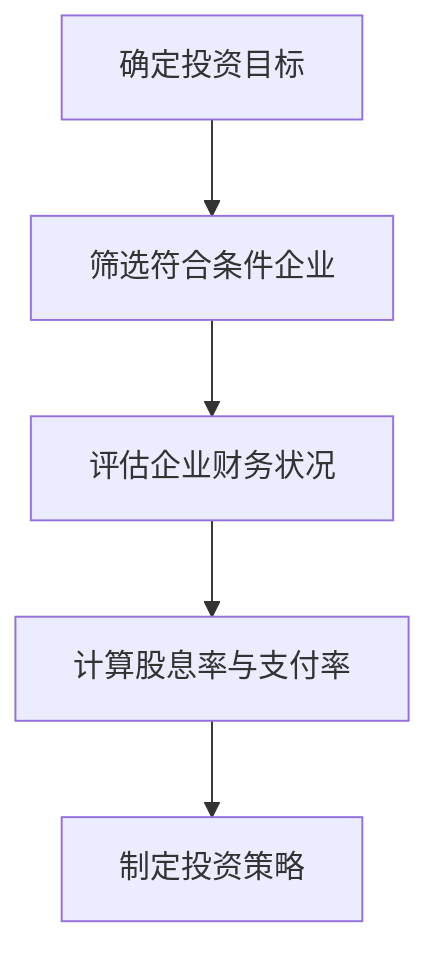
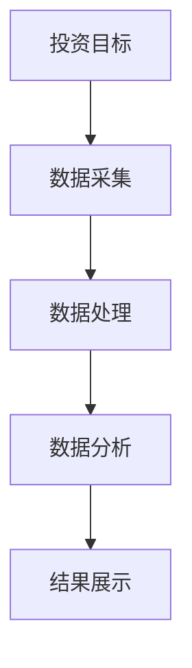

                 


# 乔尔·格林布拉特的股息价值投资：收益与增长的平衡

> 关键词：股息价值投资，收益与增长，股息率，股息支付率，价值投资，乔尔·格林布拉特

> 摘要：本文深入探讨了乔尔·格林布拉特的股息价值投资理念，分析了股息在投资决策中的重要性，并结合数学模型和系统架构设计，详细讲解了如何通过股息率和股息支付率等关键指标实现收益与增长的平衡。文章内容涵盖理论基础、数学模型、系统架构设计、项目实战等多个方面，旨在帮助读者全面理解和应用股息价值投资策略。

---

## 第一部分: 股息价值投资的背景与基础

### 第1章: 价值投资与股息投资概述

#### 1.1 价值投资的基本概念

投资是指通过将资金投入到能够产生收益的资产中，以实现财富增值的过程。在众多投资策略中，价值投资是一种以基本面分析为核心，寻找被市场低估的优质资产进行投资的策略。价值投资者认为，市场的短期波动并不影响资产的内在价值，长期来看，价格终将回归其内在价值。

**1.1.1 投资的定义与分类**

- **定义**：投资是通过购买资产（如股票、债券、房地产等）来获取未来收益的行为。
- **分类**：
  - **权益投资**：购买公司股票，成为股东，分享企业盈利。
  - **固定收益投资**：购买债券、定期存款等，获得固定利息收入。
  - **另类投资**：包括房地产、私募股权、艺术品等非传统资产。

**1.1.2 价值投资的起源与发展**

价值投资的理念起源于20世纪初，本杰明·格雷厄姆和戴维·多德是这一投资理念的奠基人。他们提出，市场价格往往偏离资产的内在价值，通过深入分析企业的财务状况和行业地位，识别出被市场低估的资产进行投资，能够在长期实现超额收益。

**1.1.3 股息在价值投资中的重要性**

股息是企业在分配利润时向股东支付的金额，通常以每股的形式计算。股息收入是投资者的重要收益来源之一，尤其是在市场波动较大的情况下，股息收入能够为投资者提供稳定的现金流。

---

#### 1.2 乔尔·格林布拉特的投资理念

**1.2.1 乔尔·格林布拉特的生平简介**

乔尔·格林布拉特（Joel Greenblatt）是美国著名的投资家和作家，以其在价值投资领域的卓越表现而闻名。他在职业生涯中管理过多个对冲基金，取得了显著的超额收益。格林布拉特的投资理念简单而有效，他通过筛选具有高股息率和合理估值的股票，构建了一个既能产生稳定收益又能实现长期增长的投资组合。

**1.2.2 股息价值投资的核心思想**

格林布拉特的价值投资策略强调股息的重要性。他认为，股息是企业盈利能力的直接体现，同时也是企业价值的重要组成部分。通过关注股息率和股息支付率，投资者可以更好地识别出那些既有稳定收益又具备增长潜力的企业。

**1.2.3 收益与增长的平衡策略**

格林布拉特的策略并非单纯追求股息收入，而是通过股息率和股息支付率的平衡，寻找那些既能提供稳定股息收入又具有增长潜力的企业。这种平衡策略使得投资者能够在市场波动中保持稳定的收益，同时分享企业成长的成果。

---

#### 1.3 股息价值投资的理论基础

**1.3.1 股息支付率的定义与计算**

股息支付率是指企业实际支付的股息与净利润的比率。它反映了企业将利润用于分红的比例。计算公式为：

$$ \text{股息支付率} = \frac{\text{股息总额}}{\text{净利润}} $$

**1.3.2 股息率的定义与意义**

股息率是指每股股息与股价的比率，反映了投资的股息回报率。计算公式为：

$$ \text{股息率} = \frac{\text{每股股息}}{\text{股价}} $$

**1.3.3 股息贴现模型（DDM）的介绍**

股息贴现模型（DDM）是一种用于评估股票内在价值的模型，其核心假设是股票的未来股息现金流可以折现为当前价值。基本公式如下：

$$ \text{股价} = \frac{\text{股息}}{\text{贴现率}} $$

---

## 第二部分: 股息价值投资的核心概念与联系

### 第2章: 股息价值投资的核心概念与联系

#### 2.1 核心概念原理

**2.1.1 股息支付率与企业盈利能力的关系**

股息支付率越高，通常意味着企业盈利能力越强，且愿意将利润分配给股东。然而，过高的股息支付率可能意味着企业缺乏足够的资金进行再投资，从而影响长期增长。

**2.1.2 股息率与市场估值的关系**

股息率较高的股票通常具有较高的估值，但过高的股息率可能意味着股价被高估。因此，投资者需要结合股息支付率和市盈率等指标，综合评估股票的估值水平。

**2.1.3 收益与增长的平衡机制**

收益与增长的平衡机制是指企业在追求当前收益的同时，也要注重未来增长潜力。股息价值投资者通过股息率和股息支付率的分析，找到那些既能提供稳定股息收入又具有增长潜力的企业。

---

#### 2.2 核心概念属性特征对比表格

| 概念       | 定义                                                                 | 特性               |
|------------|----------------------------------------------------------------------|--------------------|
| 股息支付率 | 每股股息与每股收益的比率                                             | 衡量企业分红能力   |
| 股息率     | 每股股息与股价的比率                                                 | 衡量投资回报率     |
| 收益与增长 | 企业的盈利能力和业务扩展能力                                         | 决定企业长期价值   |

---

#### 2.3 ER实体关系图（Mermaid流程图）



---

## 第三部分: 股息价值投资的数学模型与公式

### 第3章: 股息价值投资的数学模型与公式

#### 3.1 股息贴现模型（DDM）

股息贴现模型（DDM）是评估股票内在价值的重要工具。其基本公式如下：

$$ \text{股价} = \frac{\text{股息}}{\text{贴现率}} $$

---

#### 3.2 股息支付率计算

股息支付率的计算公式为：

$$ \text{股息支付率} = \frac{\text{每股股息}}{\text{每股收益}} $$

---

#### 3.3 股息率计算

股息率的计算公式为：

$$ \text{股息率} = \frac{\text{每股股息}}{\text{股价}} $$

---

#### 3.4 实际案例分析

**案例1：某公司股息支付率为5%，股息率为3%，计算其股价合理性。**

根据股息贴现模型：

$$ \text{股价} = \frac{\text{股息}}{\text{贴现率}} $$

假设股息为$3，贴现率为10%，则股价为：

$$ \text{股价} = \frac{3}{0.10} = 30 $$

---

## 第四部分: 股息价值投资的系统分析与架构设计

### 第4章: 股息价值投资的系统分析与架构设计

#### 4.1 投资决策流程



---

#### 4.2 系统架构设计



---

## 第五部分: 股息价值投资的项目实战

### 第5章: 股息价值投资的项目实战

#### 5.1 项目介绍

本项目旨在通过股息价值投资策略，筛选出具有高股息率和合理估值的股票，构建一个投资组合。

---

#### 5.2 系统实现

**5.2.1 环境安装**

- Python 3.8+
- Pandas、NumPy、Matplotlib库

---

#### 5.2.2 核心实现代码

```python
import pandas as pd

# 假设我们有一个包含股票数据的DataFrame
df = pd.DataFrame({
    '股票代码': ['AAPL', 'MSFT', 'GOOGL'],
    '股价': [150, 300, 200],
    '每股股息': [0.5, 1.0, 1.5]
})

# 计算股息率
df['股息率'] = df['每股股息'] / df['股价']

# 找出股息率大于3%的股票
high_dividend_stocks = df[df['股息率'] > 0.03]
```

---

#### 5.3 代码应用解读与分析

上述代码首先加载必要的库，然后创建一个包含股票数据的DataFrame。通过计算股息率，筛选出股息率大于3%的股票，这些股票可能具有较高的股息收益。

---

#### 5.4 实际案例分析

以苹果公司为例：

- 股价：$150
- 每股股息：$0.5
- 股息率：$0.5 / $150 = 0.33%（低于3%，不符合条件）

因此，苹果公司不符合高股息率的筛选标准。

---

## 第六部分: 总结与展望

### 第6章: 总结与展望

#### 6.1 总结

本文深入探讨了乔尔·格林布拉特的股息价值投资理念，分析了股息在投资决策中的重要性，并结合数学模型和系统架构设计，详细讲解了如何通过股息率和股息支付率等关键指标实现收益与增长的平衡。

---

#### 6.2 展望

未来，随着市场环境的变化，股息价值投资策略也需要不断优化和调整。投资者可以通过持续学习和实践，进一步完善自己的投资策略，以应对市场的挑战。

---

## 附录

### 附录A: 术语表

- **股息支付率**：股息总额与净利润的比率。
- **股息率**：每股股息与股价的比率。
- **股息贴现模型（DDM）**：用于评估股票内在价值的模型。

---

### 附录B: 参考文献

1. 格林布拉特，乔尔. 《股息价值投资》.
2. 格雷厄姆，本杰明. 《聪明的投资者》.

--- 

以上是文章的完整内容，希望对您有所帮助！

