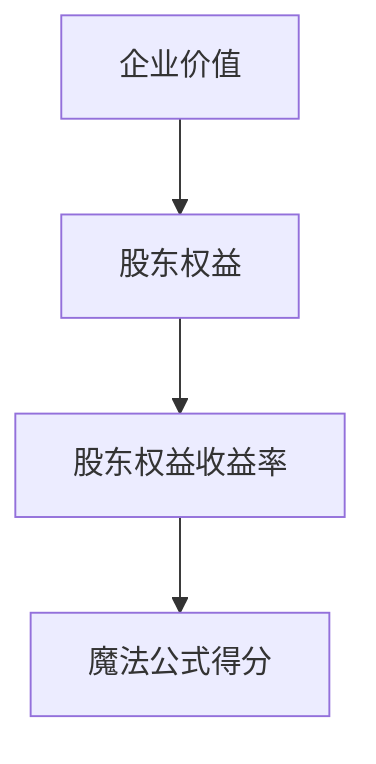
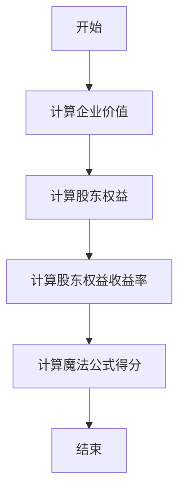
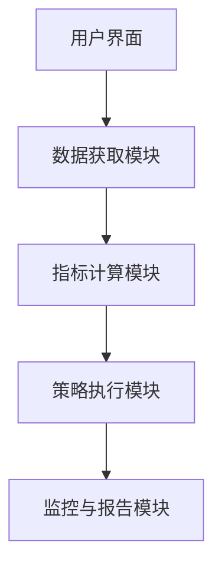
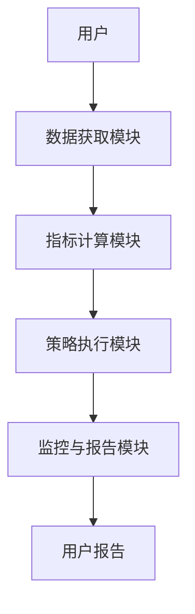

                 


# 《乔尔·格林布拉特的魔法公式投资策略》

## 关键词：投资策略，魔法公式，乔尔·格林布拉特，价值投资，成长投资，股票分析

## 摘要：  
乔尔·格林布拉特的魔法公式投资策略是一种结合了价值投资和成长投资的独特方法，通过对企业基本面的深入分析和量化指标的计算，帮助投资者找到具有高投资价值的股票。本文将从魔法公式的背景、核心概念、算法原理、系统设计、项目实战等多方面进行详细分析，帮助读者全面理解这一投资策略的精髓。

---

## 第一部分: 魔法公式投资策略概述

### 第1章: 魔法公式投资策略的背景与核心理念

#### 1.1 投资的两大核心要素
##### 1.1.1 价值投资的核心理念
价值投资的核心理念是寻找市场价格低于内在价值的股票，长期持有，等待市场回归理性。这种方法强调对企业基本面的深入研究，关注企业的盈利能力、财务状况和竞争优势。

##### 1.1.2 成长投资的核心理念
成长投资的核心理念是寻找那些营业收入和利润能够持续快速增长的企业，这些企业通常处于高增长行业，具有强大的竞争优势和市场前景。成长投资者愿意为这些企业的未来增长潜力支付较高的溢价。

##### 1.1.3 价值与成长投资的结合点
乔尔·格林布拉特的魔法公式正是在价值投资和成长投资之间找到了一个平衡点。它通过对企业基本面的量化分析，寻找那些价格被低估但又具有较高成长潜力的企业。

#### 1.2 魔法公式投资策略的起源
##### 1.2.1 乔尔·格林布拉特的背景介绍
乔尔·格林布拉特是一位成功的投资者和作家，他通过长期实践总结出了一套独特的投资策略，即魔法公式。这种方法结合了他对价值投资和成长投资的理解，强调对企业基本面的深入分析。

##### 1.2.2 魔法公式的基本思想
魔法公式的基本思想是：通过对企业基本面的量化分析，找到那些具有高投资价值的股票。具体来说，它关注企业的盈利能力、股东权益收益率（ROE）以及市场价格与内在价值的差异。

##### 1.2.3 魔法公式的核心目标
魔法公式的核心目标是帮助投资者在股票市场中找到那些被市场低估但具有较高成长潜力的企业，从而实现长期稳定的超额收益。

#### 1.3 魔法公式投资策略的基本框架
##### 1.3.1 魔法公式的基本公式
$$ \text{Magic Formula} = \frac{E}{V} \times \text{ROE} $$
其中：
- \( E \) 表示企业价值
- \( V \) 表示企业市值
- \( \text{ROE} \) 表示股东权益收益率

##### 1.3.2 魔法公式的核心指标
- 企业价值（E）：企业价值是指企业所有权益的市场价值，包括普通股、优先股、债券等。
- 企业市值（V）：企业市值是指企业股票在市场上的总价值。
- 股东权益收益率（ROE）：股东权益收益率是衡量企业盈利能力的重要指标，表示每单位股东权益能创造多少净利润。

##### 1.3.3 魔法公式的适用范围
魔法公式适用于那些具有稳定盈利能力和良好财务状况的企业，尤其适合那些处于成长期的中型企业。

---

### 第2章: 魔法公式投资策略的核心概念与联系

#### 2.1 魔法公式的核心概念
##### 2.1.1 企业价值的定义与计算
企业价值（E）是衡量企业整体价值的重要指标，通常包括企业的资产、负债、股东权益等。计算企业价值时，通常需要考虑企业的净利润、增长率和资本成本等因素。

##### 2.1.2 股东权益的定义与计算
股东权益（Equity）是指企业净资产的价值，即资产减去负债。计算股东权益时，通常需要考虑企业的资产、负债和所有者权益等。

##### 2.1.3 股东权益收益率的定义与计算
股东权益收益率（ROE）是衡量企业盈利能力的重要指标，表示每单位股东权益能创造多少净利润。计算公式为：
$$ \text{ROE} = \frac{\text{净利润}}{\text{股东权益}} $$

#### 2.2 核心概念的对比分析
##### 2.2.1 企业价值与市场价值的对比
企业价值是企业整体的价值，而市场价值是企业股票在市场上的总价值。企业价值通常高于市场价值，因为市场价值只考虑了企业的股权部分，而企业价值还包括了企业的债权部分。

##### 2.2.2 股东权益收益率与净利润率的对比
股东权益收益率关注的是股东权益的回报率，而净利润率关注的是净利润与营业收入的比率。两者都是衡量企业盈利能力的重要指标，但侧重点不同。

##### 2.2.3 魔法公式与其他投资策略的对比
魔法公式结合了价值投资和成长投资的理念，而其他投资策略可能更倾向于单一的投资理念，如纯价值投资或纯成长投资。

#### 2.3 魔法公式的核心概念关系图
##### 2.3.1 ER实体关系图


---

### 第3章: 魔法公式投资策略的算法原理

#### 3.1 魔法公式的核心算法
##### 3.1.1 魔法公式的基本公式
$$ \text{Magic Formula} = \frac{E}{V} \times \text{ROE} $$
其中：
- \( E \) 表示企业价值
- \( V \) 表示企业市值
- \( \text{ROE} \) 表示股东权益收益率

##### 3.1.2 魔法公式的核心指标计算
企业价值（E）的计算公式为：
$$ E = \text{净利润} \times (1 + g) $$
其中 \( g \) 是企业的净利润增长率。

股东权益收益率（ROE）的计算公式为：
$$ \text{ROE} = \frac{\text{净利润}}{\text{股东权益}} $$

#### 3.2 魔法公式算法的流程图


#### 3.3 魔法公式算法的Python实现
```python
def calculate_magic_formula(e, v, roe):
    magic_formula = (e / v) * roe
    return magic_formula

# 示例数据
e = 1000000000  # 企业价值（美元）
v = 500000000    # 企业市值（美元）
roe = 0.15       # 股东权益收益率

# 计算魔法公式得分
magic_formula_score = calculate_magic_formula(e, v, roe)
print(f"魔法公式得分: {magic_formula_score}")
```

---

## 第二部分: 魔法公式投资策略的系统分析与架构设计

### 第4章: 魔法公式投资策略的系统分析

#### 4.1 项目介绍
魔法公式投资策略的系统设计旨在通过对企业基本面数据的分析，计算魔法公式得分，并根据得分筛选出具有高投资价值的股票。

#### 4.2 系统功能设计
##### 4.2.1 数据获取模块
- 数据来源：股票市场数据（如Yahoo Finance）
- 数据类型：企业价值、企业市值、股东权益、净利润等

##### 4.2.2 指标计算模块
- 计算企业价值（E）
- 计算企业市值（V）
- 计算股东权益收益率（ROE）
- 计算魔法公式得分

##### 4.2.3 策略执行模块
- 根据魔法公式得分筛选出高得分股票
- 生成投资组合
- 监控投资组合的表现

##### 4.2.4 监控与报告模块
- 实时监控投资组合的表现
- 生成投资报告

#### 4.3 系统架构设计
##### 4.3.1 系统架构图


##### 4.3.2 系统交互流程图


---

## 第三部分: 项目实战与最佳实践

### 第5章: 项目实战

#### 5.1 环境安装
- Python 3.8+

#### 5.2 核心实现源代码
```python
import yfinance as yf

def calculate_magic_formula(e, v, roe):
    return (e / v) * roe

# 下载股票数据
stock = yf.Ticker("AAPL")
data = stock.info

# 示例计算
e = data['enterpriseValue']
v = data['marketCap']
roe = data['netProfitMargin']

magic_formula_score = calculate_magic_formula(e, v, roe)
print(f"{stock.info['longName']}的魔法公式得分为: {magic_formula_score}")
```

#### 5.3 实际案例分析
以苹果公司为例，计算其魔法公式得分：
```python
# 下载苹果公司数据
stock = yf.Ticker("AAPL")
data = stock.info

e = data['enterpriseValue']
v = data['marketCap']
roe = data['netProfitMargin']

magic_formula_score = (e / v) * roe
print(f"苹果公司的魔法公式得分为: {magic_formula_score}")
```

---

### 第6章: 总结与最佳实践

#### 6.1 总结
乔尔·格林布拉特的魔法公式投资策略是一种结合了价值投资和成长投资的独特方法，通过对企业基本面的量化分析，帮助投资者找到具有高投资价值的股票。

#### 6.2 最佳实践
- 定期更新股票数据
- 结合其他投资策略进行综合分析
- 风险管理：分散投资，控制仓位

#### 6.3 小结
魔法公式投资策略的核心在于对企业基本面的深入分析和量化指标的计算，投资者可以通过这种方法找到具有高投资价值的股票，实现长期稳定的超额收益。

#### 6.4 注意事项
- 魔法公式只是一个筛选工具，需要结合市场环境和企业具体情况进行综合判断
- 需要定期更新和调整投资策略
- 风险管理是投资成功的关键

#### 6.5 拓展阅读
- 《魔法公式投资策略》
- 《价值投资实战》
- 《股票技术分析》

---

通过以上详细分析和实践，读者可以全面理解乔尔·格林布拉特的魔法公式投资策略，并在实际投资中加以应用。

