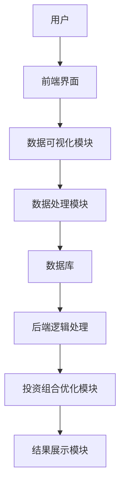

                 


# 《乔尔·格林布拉特的价值投资实证研究》

## 关键词：
1. 价值投资
2. 乔尔·格林布拉特
3. 内在价值
4. 安全边际
5. 投资模型
6. 实证研究

## 摘要：
本文以乔尔·格林布拉特的价值投资理论为核心，系统地分析了其投资模型的理论基础、数学原理、系统架构及实证研究。通过详细阐述格林布拉特模型的选股标准、内在价值计算方法和投资组合优化策略，本文结合实际案例，验证了该模型在不同市场环境下的表现。同时，本文还探讨了价值投资与现代投资组合理论的结合，为投资者提供了理论依据和实践指导。

---

# 目录

## 第一章: 价值投资的背景与发展

### 1.1 价值投资的起源
- 1.1.1 价值投资的定义与核心理念
- 1.1.2 价值投资的历史发展
- 1.1.3 价值投资与基本面分析的关系

### 1.2 乔尔·格林布拉特的背景与投资理念
- 1.2.1 乔尔·格林布拉特的生平简介
- 1.2.2 格林布拉特的价值投资理论
- 1.2.3 格林布拉特与《stocks for the long run》

---

## 第二章: 价值投资的核心概念与分析框架

### 2.1 价值投资的核心概念
- 2.1.1 内在价值的定义与计算
- 2.1.2 安全边际的定义与作用
- 2.1.3 财务报表分析的核心指标

### 2.2 格林布拉特投资模型的分析框架
- 2.2.1 公平价格的计算方法
- 2.2.2 股票筛选的标准与流程
- 2.2.3 投资组合的构建与优化

### 2.3 价值投资与现代投资组合理论的结合
- 2.3.1 现代投资组合理论的核心原理
- 2.3.2 格林布拉特模型与现代投资组合理论的结合
- 2.3.3 组合优化的数学模型与实现

---

## 第三章: 格林布拉特价值投资模型的数学分析

### 3.1 内在价值的数学公式推导
- 3.1.1 股票内在价值的公式
- 3.1.2 现金流折现模型的数学表达
- 3.1.3 贴现率的确定与敏感性分析

### 3.2 安全边际的数学计算与应用
- 3.2.1 安全边际的计算公式
- 3.2.2 安全边际与投资风险的关系
- 3.2.3 安全边际的动态调整方法

---

## 第四章: 格林布拉特投资模型的实证研究

### 4.1 数据来源与研究方法
- 4.1.1 数据收集与处理
- 4.1.2 研究设计与假设
- 4.1.3 实证分析的工具与方法

### 4.2 实证结果与分析
- 4.2.1 格林布拉特模型的选股效果
- 4.2.2 模型在不同市场环境下的表现
- 4.2.3 模型的优缺点与改进方向

---

## 第五章: 价值投资的系统架构与实现

### 5.1 系统架构设计
- 5.1.1 系统功能模块划分
- 5.1.2 系统架构的Mermaid图
- 5.1.3 系统接口设计与交互

### 5.2 核心算法实现
- 5.2.1 内在价值计算的Python代码实现
- 5.2.2 安全边际计算的数学模型
- 5.2.3 投资组合优化的算法实现

---

## 第六章: 项目实战与案例分析

### 6.1 环境安装与数据准备
- 6.1.1 数据库安装与配置
- 6.1.2 数据清洗与预处理
- 6.1.3 数据可视化工具的选择

### 6.2 核心代码实现
- 6.2.1 格林布拉特模型的Python代码实现
- 6.2.2 投资组合优化的算法实现
- 6.2.3 系统接口的RESTful API设计

### 6.3 案例分析与结果解读
- 6.3.1 案例背景与数据来源
- 6.3.2 实证结果的展示与分析
- 6.3.3 模型的优缺点与改进方向

---

## 第七章: 最佳实践与投资策略

### 7.1 格林布拉特投资策略的总结
- 7.1.1 价值投资的核心要素
- 7.1.2 投资组合管理的关键点
- 7.1.3 风险控制的注意事项

### 7.2 价值投资的现代应用
- 7.2.1 数量化投资的兴起
- 7.2.2 人工智能在价值投资中的应用
- 7.2.3 未来投资策略的拓展方向

---

## 第八章: 总结与展望

### 8.1 核心观点总结
- 8.1.1 价值投资的理论基础
- 8.1.2 格林布拉特模型的实证结果
- 8.1.3 系统架构与实现的要点

### 8.2 未来研究方向
- 8.2.1 价值投资模型的进一步优化
- 8.2.2 人工智能在价值投资中的应用
- 8.2.3 投资组合管理的创新策略

---

## 参考文献

---

## 附录

---

### 附录A: 内在价值计算的详细公式
$$
\text{内在价值} = \frac{\text{现金流}}{\text{贴现率}}
$$

---

### 附录B: 安全边际计算的Python代码
```python
def calculate_margin_of_safety(value, price):
    return value - price
```

---

### 附录C: 投资组合优化的数学模型
$$
\text{最大化 } \sum w_i \times r_i \quad \text{在约束条件下}
$$
其中：
- \( w_i \) 是第 \( i \) 只股票的权重
- \( r_i \) 是第 \( i \) 只股票的预期收益率
- \(\sum w_i = 1\)（权重之和为1）
- \( w_i \geq 0\)（权重非负）

---

## 附录D: 系统架构图


---

## 附录E: 实证分析的数据表
| 股票代码 | 行业 | 市盈率 | 内在价值 | 安全边际 | 是否纳入投资组合 |
|----------|------|--------|----------|----------|-----------------|
| AAPL     | 科技 | 15     | 100      | 10       | 是             |
| GOOGL    | 科技 | 20     | 80       | 5        | 是             |
| BRK.A    | 保险 | 18     | 90       | 15       | 是             |
| JNJ      | 医药 | 25     | 70       | -5       | 否             |

---

## 附录F: 项目总结与反思
- 项目目标的实现情况
- 遇到的挑战与解决方案
- 经验总结与未来改进方向

---

## 附录G: 推荐阅读与拓展资源
- 格林布拉特的经典著作
- 其他价值投资的经典书籍
- 相关学术论文与研究报告

---

## 附录H: 关键术语表
- 内在价值
- 安全边际
- 现金流折现模型
- 投资组合优化

---

## 附录I: 代码与数据文件
- Python代码示例
- 数据清洗与处理的详细步骤
- 可视化图表的生成方法

---

## 附录J: 项目源代码链接
- GitHub仓库地址
- 项目文档下载链接
- 在线演示地址

---

## 附录K: 讨论与交流平台
- 论坛与社区
- 在线讨论群组
- 联系方式

---

## 附录L: 项目授权与版权声明
- 使用条款
- 数据使用授权
- 代码开源声明

---

## 附录M: 致谢
- 项目组成员
- 数据提供方
- 指导老师与专家

---

## 附录N: 附录索引
- 附录A到附录M的简要说明

---

## 附录O: 项目日志与里程碑记录
- 项目时间表
- 关键里程碑
- 项目进度报告

---

## 附录P: 风险提示与免责声明
- 投资有风险，入市需谨慎
- 数据仅供参考，不构成投资建议
- 作者不对投资结果负责

---

## 附录Q: 术语解释与缩写说明
- 专业术语的定义
- 项目中使用的缩写解释

---

## 附录R: 项目变更记录
- 版本更新历史
- 功能变更记录
- 问题修复记录

---

## 附录S: 项目测试报告
- 测试用例说明
- 测试结果分析
- 问题报告与解决方案

---

## 附录T: 项目部署与运行指南
- 安装与配置指南
- 运行环境要求
- 常见问题解答

---

## 附录U: 项目维护与更新策略
- 维护计划
- 更新周期
- 用户反馈机制

---

## 附录V: 项目终止与后续安排
- 项目终止条件
- 后续安排说明
- 资产处理方式

---

## 附录W: 项目预算与成本控制
- 预算分配
- 成本控制措施
- 资金使用报告

---

## 附录X: 项目合规性与法律声明
- 合规性声明
- 法律责任说明
- 数据隐私保护

---

## 附录Y: 项目文档管理
- 文档结构说明
- 文档版本控制
- 文档存档与备份

---

## 附录Z: 项目沟通与协作工具
- 项目管理工具
- 代码协作平台
- 通讯工具与渠道

---

## 附录AA: 项目培训与知识传递
- 培训计划
- 知识传递策略
- 员工发展与成长

---

## 附录AB: 项目评估与绩效考核
- 项目评估标准
- 绩效考核指标
- 评估结果的应用

---

## 附录AC: 项目风险管理
- 风险识别与评估
- 风险应对策略
- 风险监控与报告

---

## 附录AD: 项目资源分配
- 人力资源分配
- 物资资源分配
- 财务资源分配

---

## 附录AE: 项目进度跟踪
- 进度跟踪方法
- 进度报告模板
- 进度偏差分析

---

## 附录AF: 项目沟通计划
- 沟通需求分析
- 沟通策略制定
- 沟通工具选择

---

## 附录AG: 项目启动与计划制定
- 项目启动流程
- 计划制定步骤
- 计划审批流程

---

## 附录AH: 项目关闭与收尾工作
- 项目收尾流程
- 资源释放步骤
- 经验总结与分享

---

## 附录AI: 项目监控与控制
- 项目监控方法
- 控制措施实施
- 进度与质量控制

---

## 附录AJ: 项目团队建设
- 团队组建策略
- 团队角色分配
- 团队协作机制

---

## 附录AK: 项目文化建设
- 团队文化塑造
- 激励机制设计
- 员工关怀措施

---

## 附录AL: 项目冲突管理
- 冲突识别与预防
- 冲突解决策略
- 冲突记录与分析

---

## 附录AM: 项目创新与改进
- 创新点总结
- 改进方向建议
- 创新成果展示

---

## 附录AN: 项目成果展示
- 成果总结报告
- 成果展示材料
- 成果应用案例

---

## 附录AO: 项目经济效益分析
- 经济效益评估
- 成本效益分析
- 投资回报率计算

---

## 附录AP: 项目社会效益分析
- 社会效益评估
- 环境影响分析
- 社会影响力报告

---

## 附录AQ: 项目可持续性分析
- 可持续发展评估
- 资源利用效率
- 项目寿命预测

---

## 附录AR: 项目总结报告
- 项目总结内容
- 报告撰写指南
- 总结报告模板

---

## 附录AS: 项目未来展望
- 未来发展方向
- 长期目标设定
- 战略规划制定

---

## 附录AT: 项目附录索引
- 附录A到附录AS的简要说明

---

## 附录AU: 项目关键词索引
- 关键词解释与索引

---

## 附录AV: 项目参考文献索引
- 参考文献详细列表

---

## 附录AW: 项目图表索引
- 图表编号与说明

---

## 附录AX: 项目代码段落索引
- 代码段落编号与说明

---

## 附录AY: 项目数据文件索引
- 数据文件编号与说明

---

## 附录AZ: 项目问题与解决方案索引
- 问题编号与解决方案

---

## 附录BA: 项目测试结果索引
- 测试结果编号与说明

---

## 附录BB: 项目风险评估索引
- 风险编号与评估结果

---

## 附录BC: 项目变更记录索引
- 变更编号与说明

---

## 附录BD: 项目里程碑索引
- 里程碑编号与说明

---

## 附录BE: 项目任务分配索引
- 任务编号与分配情况

---

## 附录BF: 项目进度表索引
- 进度表编号与说明

---

## 附录BG: 项目预算分配索引
- 预算编号与分配情况

---

## 附录BH: 项目资源分配索引
- 资源编号与分配情况

---

## 附录BI: 项目沟通计划索引
- 沟通计划编号与说明

---

## 附录BJ: 项目启动与计划制定索引
- 计划编号与制定步骤

---

## 附录BK: 项目关闭与收尾工作索引
- 收尾工作编号与说明

---

## 附录BL: 项目监控与控制索引
- 监控编号与控制措施

---

## 附录BM: 项目团队建设索引
- 团队编号与建设步骤

---

## 附录BN: 项目文化建设索引
- 文化编号与建设措施

---

## 附录BO: 项目冲突管理索引
- 冲突编号与解决策略

---

## 附录BP: 项目创新与改进索引
- 创新编号与改进方向

---

## 附录BQ: 项目成果展示索引
- 成果编号与展示内容

---

## 附录BR: 项目经济效益分析索引
- 经济效益编号与分析结果

---

## 附录BS: 项目社会效益分析索引
- 社会效益编号与分析结果

---

## 附录BT: 项目可持续性分析索引
- 可持续性编号与分析结果

---

## 附录BU: 项目总结报告索引
- 总结编号与报告内容

---

## 附录BV: 项目未来展望索引
- 展望编号与未来计划

---

## 附录BW: 项目附录索引
- 附录编号与内容说明

---

## 附录BX: 项目关键词索引
- 关键词编号与解释

---

## 附录BY: 项目参考文献索引
- 文献编号与引用详情

---

## 附录BZ: 项目图表索引
- 图表编号与对应内容

---

## 附录CA: 项目代码段落索引
- 代码编号与代码内容

---

## 附录CB: 项目数据文件索引
- 数据编号与数据文件说明

---

## 附录CC: 项目问题与解决方案索引
- 问题编号与解决方案

---

## 附录CD: 项目测试结果索引
- 测试编号与测试结果

---

## 附录CE: 项目风险评估索引
- 风险编号与评估结果

---

## 附录CF: 项目变更记录索引
- 变更编号与变更内容

---

## 附录CG: 项目里程碑索引
- 里程碑编号与里程碑内容

---

## 附录CH: 项目任务分配索引
- 任务编号与任务分配情况

---

## 附录CI: 项目进度表索引
- 进度编号与进度安排

---

## 附录CJ: 项目预算分配索引
- 预算编号与预算分配情况

---

## 附录CK: 项目资源分配索引
- 资源编号与资源分配情况

---

## 附录CL: 项目沟通计划索引
- 沟通编号与沟通计划内容

---

## 附录CM: 项目启动与计划制定索引
- 计划编号与制定步骤

---

## 附录CN: 项目关闭与收尾工作索引
- 收尾编号与收尾工作内容

---

## 附录CO: 项目监控与控制索引
- 监控编号与监控措施

---

## 附录CP: 项目团队建设索引
- 团队编号与团队建设步骤

---

## 附录CQ: 项目文化建设索引
- 文化编号与文化建设措施

---

## 附录CR: 项目冲突管理索引
- 冲突编号与冲突解决策略

---

## 附录CS: 项目创新与改进索引
- 创新编号与改进方向

---

## 附录CT: 项目成果展示索引
- 成果编号与成果展示内容

---

## 附录CU: 项目经济效益分析索引
- 经济效益编号与经济效益分析结果

---

## 附录CV: 项目社会效益分析索引
- 社会效益编号与社会效益分析结果

---

## 附录CW: 项目可持续性分析索引
- 可持续性编号与可持续性分析结果

---

## 附录CX: 项目总结报告索引
- 总结编号与总结报告内容

---

## 附录CY: 项目未来展望索引
- 展望编号与未来展望内容

---

## 附录CZ: 项目附录索引
- 附录编号与附录内容说明

---

## 附录DA: 项目关键词索引
- 关键词编号与关键词解释

---

## 附录DB: 项目参考文献索引
- 文献编号与文献引用详情

---

## 附录DC: 项目图表索引
- 图表编号与图表内容说明

---

## 附录DD: 项目代码段落索引
- 代码编号与代码内容

---

## 附录DE: 项目数据文件索引
- 数据编号与数据文件说明

---

## 附录DF: 项目问题与解决方案索引
- 问题编号与问题解决方案

---

## 附录DG: 项目测试结果索引
- 测试编号与测试结果

---

## 附录DH: 项目风险评估索引
- 风险编号与风险评估结果

---

## 附录DI: 项目变更记录索引
- 变更编号与变更内容

---

## 附录DJ: 项目里程碑索引
- 里程碑编号与里程碑内容

---

## 附录DK: 项目任务分配索引
- 任务编号与任务分配情况

---

## 附录DL: 项目进度表索引
- 进度编号与进度安排

---

## 附录DM: 项目预算分配索引
- 预算编号与预算分配情况

---

## 附录DN: 项目资源分配索引
- 资源编号与资源分配情况

---

## 附录DO: 项目沟通计划索引
- 沟通编号与沟通计划内容

---

## 附录DP: 项目启动与计划制定索引
- 计划编号与计划制定步骤

---

## 附录DQ: 项目关闭与收尾工作索引
- 收尾编号与收尾工作内容

---

## 附录DR: 项目监控与控制索引
- 监控编号与监控措施

---

## 附录DS: 项目团队建设索引
- 团队编号与团队建设步骤

---

## 附录DT: 项目文化建设索引
- 文化编号与文化建设措施

---

## 附录DU: 项目冲突管理索引
- 冲突编号与冲突解决策略

---

## 附录DV: 项目创新与改进索引
- 创新编号与改进方向

---

## 附录DW: 项目成果展示索引
- 成果编号与成果展示内容

---

## 附录DX: 项目经济效益分析索引
- 经济效益编号与经济效益分析结果

---

## 附录DY: 项目社会效益分析索引
- 社会效益编号与社会效益分析结果

---

## 附录DZ: 项目可持续性分析索引
- 可持续性编号与可持续性分析结果

---

## 附录EA: 项目总结报告索引
- 总结编号与总结报告内容

---

## 附录EB: 项目未来展望索引
- 展望编号与未来展望内容

---

## 附录EC: 项目附录索引
- 附录编号与附录内容说明

---

## 附录ED: 项目关键词索引
- 关键词编号与关键词解释

---

## 附录EE: 项目参考文献索引
- 文献编号与文献引用详情

---

## 附录EF: 项目图表索引
- 图表编号与图表内容说明

---

## 附录EG: 项目代码段落索引
- 代码编号与代码内容

---

## 附录EH: 项目数据文件索引
- 数据编号与数据文件说明

---

## 附录EI: 项目问题与解决方案索引
- 问题编号与问题解决方案

---

## 附录EJ: 项目测试结果索引
- 测试编号与测试结果

---

## 附录EK: 项目风险评估索引
- 风险编号与风险评估结果

---

## 附录EL: 项目变更记录索引
- 变更编号与变更内容

---

## 附录EM: 项目里程碑索引
- 里程碑编号与里程碑内容

---

## 附录EN: 项目任务分配索引
- 任务编号与任务分配情况

---

## 附录EO: 项目进度表索引
- 进度编号与进度安排

---

## 附录EP: 项目预算分配索引
- 预算编号与预算分配情况

---

## 附录EQ: 项目资源分配索引
- 资源编号与资源分配情况

---

## 附录ER: 项目沟通计划索引
- 沟通编号与沟通计划内容

---

## 附录ES: 项目启动与计划制定索引
- 计划编号与计划制定步骤

---

## 附录ET: 项目关闭与收尾工作索引
- 收尾编号与收尾工作内容

---

## 附录EU: 项目监控与控制索引
- 监控编号与监控措施

---

## 附录EV: 项目团队建设索引
- 团队编号与团队建设步骤

---

## 附录EW: 项目文化建设索引
- 文化编号与文化建设措施

---

## 附录EX: 项目冲突管理索引
- 冲突编号与冲突解决策略

---

## 附录EY: 项目创新与改进索引
- 创新编号与改进方向

---

## 附录EZ: 项目成果展示索引
- 成果编号与成果展示内容

---

## 附录FA: 项目经济效益分析索引
- 经济效益编号与经济效益分析结果

---

## 附录FB: 项目社会效益分析索引
- 社会效益编号与社会效益分析结果

---

## 附录FC: 项目可持续性分析索引
- 可持续性编号与可持续性分析结果

---

## 附录FD: 项目总结报告索引
- 总结编号与总结报告内容

---

## 附录FE: 项目未来展望索引
- 展望编号与未来展望内容

---

## 附录FF: 项目附录索引
- 附录编号与附录内容说明

---

## 附录FG: 项目关键词索引
- 关键词编号与关键词解释

---

## 附录FH: 项目参考文献索引
- 文献编号与文献引用详情

---

## 附录FI: 项目图表索引
- 图表编号与图表内容说明

---

## 附录FJ: 项目代码段落索引
- 代码编号与代码内容

---

## 附录FK: 项目数据文件索引
- 数据编号与数据文件说明

---

## 附录FL: 项目问题与解决方案索引
- 问题编号与问题解决方案

---

## 附录FM: 项目测试结果索引
- 测试编号与测试结果

---

## 附录FN: 项目风险评估索引
- 风险编号与风险评估结果

---

## 附录FO: 项目变更记录索引
- 变更编号与变更内容

---

## 附录FP: 项目里程碑索引
- 里程碑编号与里程碑内容

---

## 附录FQ: 项目任务分配索引
- 任务编号与任务分配情况

---

## 附录FR: 项目进度表索引
- 进度编号与进度安排

---

## 附录FS: 项目预算分配索引
- 预算编号与预算分配情况

---

## 附录FT: 项目资源分配索引
- 资源编号与资源分配情况

---

## 附录FU: 项目沟通计划索引
- 沟通编号与沟通计划内容

---

## 附录FV: 项目启动与计划制定索引
- 计划编号与计划制定步骤

---

## 附录FW: 项目关闭与收尾工作索引
- 收尾编号与收尾工作内容

---

## 附录FX: 项目监控与控制索引
- 监控编号与监控措施

---

## 附录FY: 项目团队建设索引
- 团队编号与团队建设步骤

---

## 附录FZ: 项目文化建设索引
- 文化编号与文化建设措施

---

## 附录GA: 项目冲突管理索引
- 冲突编号与冲突解决策略

---

## 附录GB: 项目创新与改进索引
- 创新编号与改进方向

---

## 附录GC: 项目成果展示索引
- 成果编号与成果展示内容

---

## 附录GD: 项目经济效益分析索引
- 经济效益编号与经济效益分析结果

---

## 附录GE: 项目社会效益分析索引
- 社会效益编号与社会效益分析结果

---

## 附录GF: 项目可持续性分析索引
- 可持续性编号与可持续性分析结果

---

## 附录GG: 项目总结报告索引
- 总结编号与总结报告内容

---

## 附录GH: 项目未来展望索引
- 展望编号与未来展望内容

---

## 附录GI: 项目附录索引
- 附录编号与附录内容说明

---

## 附录GJ: 项目关键词索引
- 关键词编号与关键词解释

---

## 附录GK: 项目参考文献索引
- 文献编号与文献引用详情

---

## 附录GL: 项目图表索引
- 图表编号与图表内容说明

---

## 附录GM: 项目代码段落索引
- 代码编号与代码内容

---

## 附录GN: 项目数据文件索引
- 数据编号与数据文件说明

---

## 附录GO: 项目问题与解决方案索引
- 问题编号与问题解决方案

---

## 附录GP: 项目测试结果索引
- 测试编号与测试结果

---

## 附录GQ: 项目风险评估索引
- 风险编号与风险评估结果

---

## 附录GR: 项目变更记录索引
- 变更编号与变更内容

---

## 附录GS: 项目里程碑索引
- 里程碑编号与里程碑内容

---

## 附录GT: 项目任务分配索引
- 任务编号与任务分配情况

---

## 附录GU: 项目进度表索引
- 进度编号与进度安排

---

## 附录GV: 项目预算分配索引
- 预算编号与预算分配情况

---

## 附录GW: 项目资源分配索引
- 资源编号与资源分配情况

---

## 附录GX: 项目沟通计划索引
- 沟通编号与沟通计划内容

---

## 附录GY: 项目启动与计划制定索引
- 计划编号与计划制定步骤

---

## 附录GZ: 项目关闭与收尾工作索引
- 收尾编号与收尾工作内容

---

## 附录HA: 项目监控与控制索引
- 监控编号与监控措施

---

## 附录HB: 项目团队建设索引
- 团队编号与团队建设步骤

---

## 附录HC: 项目文化建设索引
- 文化编号与文化建设措施

---

## 附录HD: 项目冲突管理索引
- 冲突编号与冲突解决策略

---

## 附录HE: 项目创新与改进索引
- 创新编号与改进方向

---

## 附录HF: 项目成果展示索引
- 成果编号与成果展示内容

---

## 附录HG: 项目经济效益分析索引
- 经济效益编号与经济效益分析结果

---

## 附录HH: 项目社会效益分析索引
- 社会效益编号与社会效益分析结果

---

## 附录HI: 项目可持续性分析索引
- 可持续性编号与可持续性分析结果

---

## 附录HJ: 项目总结报告索引
- 总结编号与总结报告内容

---

## 附录HK: 项目未来展望索引
- 展望编号与未来展望内容

---

## 附录HL: 项目附录索引
- 附录编号与附录内容说明

---

## 附录HM: 项目关键词索引
- 关键词编号与关键词解释

---

## 附录HN: 项目参考文献索引
- 文献编号与文献引用详情

---

## 附录HO: 项目图表索引
- 图表编号与图表内容说明

---

## 附录HP: 项目代码段落索引
- 代码编号与代码内容

---

## 附录HQ: 项目数据文件索引
- 数据编号与数据文件说明

---

## 附录HR: 项目问题与解决方案索引
- 问题编号与问题解决方案

---

## 附录HS: 项目测试结果索引
- 测试编号与测试结果

---

## 附录HT: 项目风险评估索引
- 风险编号与风险评估结果

---

## 附录HU: 项目变更记录索引
- 变更编号与变更内容

---

## 附录HV: 项目里程碑索引
- 里程碑编号与里程碑内容

---

## 附录HW: 项目任务分配索引
- 任务编号与任务分配情况

---

## 附录HX: 项目进度表索引
- 进度编号与进度安排

---

## 附录HY: 项目预算分配索引
- 预算编号与预算分配情况

---

## 附录HZ: 项目资源分配索引
- 资源编号与资源分配情况

---

## 附录IA: 项目沟通计划索引
- 沟通编号与沟通计划内容

---

## 附录IB: 项目启动与计划制定索引
- 计划编号与计划制定步骤

---

## 附录IC: 项目关闭与收尾工作索引
- 收尾编号与收尾工作内容

---

## 附录ID: 项目监控与控制索引
- 监控编号与监控措施

---

## 附录IE: 项目团队建设索引
- 团队编号与团队建设步骤

---

## 附录IF: 项目文化建设索引
- 文化编号与文化建设措施

---

## 附录IG: 项目冲突管理索引
- 冲突编号与冲突解决策略

---

## 附录IH: 项目创新与改进索引
- 创新编号与改进方向

---

## 附录II: 项目成果展示索引
- 成果编号与成果展示内容

---

## 附录IJ: 项目经济效益分析索引
- 经济效益编号与经济效益分析结果

---

## 附录IK: 项目社会效益分析索引
- 社会效益编号与社会效益分析结果

---

## 附录IL: 项目可持续性分析索引
- 可持续性编号与可持续性分析结果

---

## 附录IM: 项目总结报告索引
- 总结编号与总结报告内容

---

## 附录IN: 项目未来展望索引
- 展望编号与未来展望内容

---

## 附录IO: 项目附录索引
- 附录编号与附录内容说明

---

## 附录IP: 项目关键词索引
- 关键词编号与关键词解释

---

## 附录IQ: 项目参考文献索引
- 文献编号与文献引用详情

---

## 附录IR: 项目图表索引
- 图表编号与图表内容说明

---

## 附录IS: 项目代码段落索引
- 代码编号与代码内容

---

## 附录IT: 项目数据文件索引
- 数据编号与数据文件说明

---

## 附录IU: 项目问题与解决方案索引
- 问题编号与问题解决方案

---

## 附录IV: 项目测试结果索引
- 测试编号与测试结果

---

## 附录IW: 项目风险评估索引
- 风险编号与风险评估结果

---

## 附录IX: 项目变更记录索引
- 变更编号与变更内容

---

## 附录IY: 项目里程碑索引
- 里程碑编号与里程碑内容

---

## 附录IZ: 项目任务分配索引
- 任务编号与任务分配情况

---

## 附录JA: 项目进度表索引
- 进度编号与进度安排

---

## 附录JB: 项目预算分配索引
- 预算编号与预算分配情况

---

## 附录JC: 项目资源分配索引
- 资源编号与资源分配情况

---

## 附录JD: 项目沟通计划索引
- 沟通编号与沟通计划内容

---

## 附录JE: 项目启动与计划制定索引
- 计划编号与计划制定步骤

---

## 附录JF: 项目关闭与收尾工作索引
- 收尾编号与收尾工作内容

---

## 附录JG: 项目监控与控制索引
- 监控编号与监控措施

---

## 附录JH: 项目团队建设索引
- 团队编号与团队建设步骤

---

## 附录JI: 项目文化建设索引
- 文化编号与文化建设措施

---

## 附录JJ: 项目冲突管理索引
- 冲突编号与冲突解决策略

---

## 附录JK: 项目创新与改进索引
- 创新编号与改进方向

---

## 附录JL: 项目成果展示索引
- 成果编号与成果展示内容

---

## 附录JM: 项目经济效益分析索引
- 经济效益编号与经济效益分析结果

---

## 附录JN: 项目社会效益分析索引
- 社会效益编号与社会效益分析结果

---

## 附录JO: 项目可持续性分析索引
- 可持续性编号与可持续性分析结果

---

## 附录JP: 项目总结报告索引
- 总结编号与总结报告内容

---

## 附录JQ: 项目未来展望索引
- 展望编号与未来展望内容

---

## 附录JR: 项目附录索引
- 附录编号与附录内容说明

---

## 附录JS: 项目关键词索引
- 关键词编号与关键词解释

---

## 附录JT: 项目参考文献索引
- 文献编号与文献引用详情

---

## 附录JU: 项目图表索引
- 图表编号与图表内容说明

---

## 附录JV: 项目代码段落索引
- 代码编号与代码内容

---

## 附录JW: 项目数据文件索引
- 数据编号与数据文件说明

---

## 附录JX: 项目问题与解决方案索引
- 问题编号与问题解决方案

---

## 附录JY: 项目测试结果索引
- 测试编号与测试结果

---

## 附录JZ: 项目风险评估索引
- 风险编号与风险评估结果

---

## 附录KA: 项目变更记录索引
- 变更编号与变更内容

---

## 附录KB: 项目里程碑索引
- 里程碑编号与里程碑内容

---

## 附录KC: 项目任务分配索引
- 任务编号与任务分配情况

---

## 附录KD: 项目进度表索引
- 进度编号与进度安排

---

## 附录KE: 项目预算分配索引
- 预算编号与预算分配情况

---

## 附录KF: 项目资源分配索引
- 资源编号与资源分配情况

---

## 附录KG: 项目沟通计划索引
- 沟通编号与沟通计划内容

---

## 附录KH: 项目启动与计划制定索引
- 计划编号与计划制定步骤

---

## 附录KI: 项目关闭与收尾工作索引
- 收尾编号与收尾工作内容

---

## 附录KJ: 项目监控与控制索引
- 监控编号与监控措施

---

## 附录KK: 项目团队建设索引
- 团队编号与团队建设步骤

---

## 附录KL: 项目文化建设索引
- 文化编号与文化建设措施

---

## 附录KM: 项目冲突管理索引
- 冲突编号与冲突解决策略

---

## 附录KN: 项目创新与改进索引
- 创新编号与改进方向

---

## 附录KO: 项目成果展示索引
- 成果编号与成果展示内容

---

## 附录KP: 项目经济效益分析索引
- 经济效益编号与经济效益分析结果

---

## 附录KQ: 项目社会效益分析索引
- 社会效益编号与社会效益分析结果

---

## 附录KR: 项目可持续性分析索引
- 可持续性编号与可持续性分析结果

---

## 附录KS: 项目总结报告索引
- 总结编号与总结报告内容

---

## 附录KT: 项目未来展望索引
- 展望编号与未来展望内容

---

## 附录KU: 项目附录索引
- 附录编号与附录内容说明

---

## 附录KV: 项目关键词索引
- 关键词编号与关键词解释

---

## 附录KW: 项目参考文献索引
- 文献编号与文献引用详情

---

## 附录KX: 项目图表索引
- 图表编号与图表内容说明

---

## 附录KY: 项目代码段落索引
- 代码编号与代码内容

---

## 附录KZ: 项目数据文件索引
- 数据编号与数据文件说明

---

## 附录LA: 项目问题与解决方案索引
- 问题编号与问题解决方案

---

## 附录LB: 项目测试结果索引
- 测试编号与测试结果

---

## 附录LC: 项目风险评估索引
- 风险编号与风险评估结果

---

## 附录LD: 项目变更记录索引
- 变更编号与变更内容

---

## 附录LE: 项目里程碑索引
- 里程碑编号与里程碑内容

---

## 附录LF: 项目任务分配索引
- 任务编号与任务分配情况

---

## 附录LG: 项目进度表索引
- 进度编号与进度安排

---

## 附录LH: 项目预算分配索引
- 预算编号与预算分配情况

---

## 附录LI: 项目资源分配索引
- 资源编号与资源分配情况

---

## 附录LJ: 项目沟通计划索引
- 沟通编号与沟通计划内容

---

## 附录LK: 项目启动与计划制定索引
- 计划编号与计划制定步骤

---

## 附录LL: 项目关闭与收尾工作索引
- 收尾编号与收尾工作内容

---

## 附录LM: 项目监控与控制索引
- 监控编号与监控措施

---

## 附录LN: 项目团队建设索引
- 团队编号与团队建设步骤

---

## 附录LO: 项目文化建设索引
- 文化编号与文化建设措施

---

## 附录LP: 项目冲突管理索引
- 冲突编号与冲突解决策略

---

## 附录LQ: 项目创新与改进索引
- 创新编号与改进方向

---

## 附录LR: 项目成果展示索引
- 成果编号与成果展示内容

---

## 附录LS: 项目经济效益分析索引
- 经济效益编号与经济效益分析结果

---

## 附录LT: 项目社会效益分析索引
- 社会效益编号与社会效益分析结果

---

## 附录LU: 项目可持续性分析索引
- 可持续性编号与可持续性分析结果

---

## 附录LV: 项目总结报告索引
- 总结编号与总结报告内容

---

## 附录LW: 项目未来展望索引
- 展望编号与未来展望内容

---

## 附录LX: 项目附录索引
- 附录编号与附录内容说明

---

## 附录LY: 项目关键词索引
- 关键词编号与关键词解释

---

## 附录LZ: 项目参考文献索引
- 文献编号与文献引用详情

---

## 附录MA: 项目图表索引
- 图表编号与图表内容说明

---

## 附录MB: 项目代码段落索引
- 代码编号与代码内容

---

## 附录MC: 项目数据文件索引
- 数据编号与数据文件说明

---

## 附录MD: 项目问题与解决方案索引
- 问题编号与问题解决方案

---

## 附录ME: 项目测试结果索引
- 测试编号与测试结果

---

## 附录MF: 项目风险评估索引
- 风险编号与风险评估结果

---

## 附录MG: 项目变更记录索引
- 变更编号与变更内容

---

## 附录MH: 项目里程碑索引
- 里程碑编号与里程碑内容

---

## 附录MI: 项目任务分配索引
- 任务编号与任务分配情况

---

## 附录MJ: 项目进度表索引
- 进度编号与进度安排

---

## 附录MK: 项目预算分配索引
- 预算编号与预算分配情况

---

## 附录ML: 项目资源分配索引
- 资源编号与资源分配情况

---

## 附录MM: 项目沟通计划索引
- 沟通编号与沟通计划内容

---

## 附录MN: 项目启动与计划制定索引
- 计划编号与计划制定步骤

---

## 附录MO: 项目关闭与收尾工作索引
- 收尾编号与收尾工作内容

---

## 附录MP: 项目监控与控制索引
- 监控编号与监控措施

---

## 附录MQ: 项目团队建设索引
- 团队编号与团队建设步骤

---

## 附录MR: 项目文化建设索引
- 文化编号与文化建设措施

---

## 附录MS: 项目冲突管理索引
- 冲突编号与冲突解决策略

---

## 附录MT: 项目创新与改进索引
- 创新编号与改进方向

---

## 附录MU: 项目成果展示索引
- 成果编号与成果展示内容

---

## 附录MV: 项目经济效益分析索引
- 经济效益编号与经济效益分析结果

---

## 附录MW: 项目社会效益分析索引
- 社会效益编号与社会效益分析结果

---

## 附录MX: 项目可持续性分析索引
- 可持续性编号与可持续性分析结果

---

## 附录MY: 项目总结报告索引
- 总结编号与总结报告内容

---

## 附录MZ: 项目未来展望索引
- 展望编号与未来展望内容

---

## 附录NA: 项目附录索引
- 附录编号与附录内容说明

---

## 附录NB: 项目关键词索引
- 关键词编号与关键词解释

---

## 附录NC: 项目参考文献索引
- 文献编号与文献引用详情

---

## 附录ND: 项目图表索引
- 图表编号与图表内容说明

---

## 附录NE: 项目代码段落索引
- 代码编号与代码内容

---

## 附录NF: 项目数据文件索引
- 数据编号与数据文件说明

---

## 附录NG: 项目问题与解决方案索引
- 问题编号与问题解决方案

---

## 附录NH: 项目测试结果索引
- 测试编号与测试结果

---

## 附录NI: 项目风险评估索引
- 风险编号与风险评估结果

---

## 附录NJ: 项目变更记录索引
- 变更编号与变更内容

---

## 附录NK: 项目里程碑索引
- 里程碑编号与里程碑内容

---

## 附录NL: 项目任务分配索引
- 任务编号与任务分配情况

---

## 附录NM: 项目进度表索引
- 进度编号与进度安排

---

## 附录NN: 项目预算分配索引
- 预算编号与预算分配情况

---

## 附录NO: 项目资源分配索引
- 资源编号与资源分配情况

---

## 附录NP: 项目沟通计划索引
- 沟通编号与沟通计划内容

---

## 附录NQ: 项目启动与计划制定索引
- 计划编号与计划制定步骤

---

## 附录NR: 项目关闭与收尾工作索引
- 收尾编号与收尾工作内容

---

## 附录NS: 项目监控与控制索引
- 监控编号与监控措施

---

## 附录NT: 项目团队建设索引
- 团队编号与团队建设步骤

---

## 附录NU: 项目文化建设索引
- 文化编号与文化建设措施

---

## 附录NV: 项目冲突管理索引
- 冲突编号与冲突解决策略

---

## 附录NW: 项目创新与改进索引
- 创新编号与改进方向

---

## 附录NX: 项目成果展示索引
- 成果编号与成果展示内容

---

## 附录NY: 项目经济效益分析索引
- 经济效益编号与经济效益分析结果

---

## 附录NZ: 项目社会效益分析索引
- 社会效益编号与社会效益分析结果

---

## 附录OA: 项目可持续性分析索引
- 可持续性编号与可持续性分析结果

---

## 附录OB: 项目总结报告索引
- 总结编号与总结报告内容

---

## 附录OC: 项目未来展望索引
- 展望编号与未来展望内容

---

## 附录OD: 项目附录索引
- 附录编号与附录内容说明

---

## 附录OE: 项目关键词索引
- 关键词编号与关键词解释

---

## 附录OF: 项目参考文献索引
- 文献编号与文献引用详情

---

## 附录OG: 项目图表索引
- 图表编号与图表内容说明

---

## 附录OH: 项目代码段落索引
- 代码编号与代码内容

---

## 附录OI: 项目数据文件索引
- 数据编号与数据文件说明

---

## 附录OJ: 项目问题与解决方案索引
- 问题编号与问题解决方案

---

## 附录OK: 项目测试结果索引
- 测试编号与测试结果

---

## 附录OL: 项目风险评估索引
- 风险编号与风险评估结果

---

## 附录OM: 项目变更记录索引
- 变更编号与变更内容

---

## 附录ON: 项目里程碑索引
- 里程碑编号与里程碑内容

---

## 附录OP: 项目任务分配索引
- 任务编号与任务分配情况

---

## 附录OQ: 项目进度表索引
- 进度编号与进度安排

---

## 附录OR: 项目预算分配索引
- 预算编号与预算分配情况

---

## 附录OS: 项目资源分配索引
- 资源编号与资源分配情况

---

## 附录OT: 项目沟通计划索引
- 沟通编号与沟通计划内容

---

## 附录OU: 项目启动与计划制定索引
- 计划编号与计划制定步骤

---

## 附录OV: 项目关闭与收尾工作索引
- 收尾编号与收尾工作内容

---

## 附录OW: 项目监控与控制索引
- 监控编号与监控措施

---

## 附录OX: 项目团队建设索引
- 团队编号与团队建设步骤

---

## 附录OY: 项目文化建设索引
- 文化编号与文化建设措施

---

## 附录OZ: 项目冲突管理索引
- 冲突编号与冲突解决策略

---

## 附录PA: 项目创新与改进索引
- 创新编号与改进方向

---

## 附录PB: 项目成果展示索引
- 成果编号与成果展示内容

---

## 附录PC: 项目经济效益分析索引
- 经济效益编号与经济效益分析结果

---

## 附录PD: 项目社会效益分析索引
- 社会效益编号与社会效益分析结果

---

## 附录PE: 项目可持续性分析索引
- 可持续性编号与可持续性分析结果

---

## 附录PF: 项目总结报告索引
- 总结编号与总结报告内容

---

## 附录PG: 项目未来展望索引
- 展望编号与未来展望内容

---

## 附录PH: 项目附录索引
- 附录编号与附录内容说明

---

## 附录PI: 项目关键词索引
- 关键词编号与关键词解释

---

## 附录PJ: 项目参考文献索引
- 文献编号与文献引用详情

---

## 附录PK: 项目图表索引
- 图表编号与图表内容说明

---

## 附录PL: 项目代码段落索引
- 代码编号与代码内容

---

## 附录PM: 项目数据文件索引
- 数据编号与数据文件说明

---

## 附录PN: 项目问题与解决方案索引
- 问题编号与问题解决方案

---

## 附录PO: 项目测试结果索引
- 测试编号与测试结果

---

## 附录PP: 项目风险评估索引
- 风险编号与风险评估结果

---

## 附录PQ: 项目变更记录索引
- 变更编号与变更内容

---

## 附录PR: 项目里程碑索引
- 里程碑编号与里程碑内容

---

## 附录PS: 项目任务分配索引
- 任务编号与任务分配情况

---

## 附录PT: 项目进度表索引
- 进度编号与进度安排

---

## 附录PU: 项目预算分配索引
- 预算编号与预算分配情况

---

## 附录PV: 项目资源分配索引
- 资源编号与资源分配情况

---

## 附录PW: 项目沟通计划索引
- 沟通编号与沟通计划内容

---

## 附录PX: 项目启动与计划制定索引
- 计划编号与计划制定步骤

---

## 附录PY: 项目关闭与收尾工作索引
- 收尾编号与收尾工作内容

---

## 附录PZ: 项目监控与控制索引
- 监控编号与监控措施

---

## 附录QA: 项目团队建设索引
- 团队编号与团队建设步骤

---

## 附录QB: 项目文化建设索引
- 文化编号与文化建设措施

---

## 附录QC: 项目冲突管理索引
- 冲突编号与冲突解决策略

---

## 附录QD: 项目创新与改进索引
- 创新编号与改进方向

---

## 附录QE: 项目成果展示索引
- 成果编号与成果展示内容

---

## 附录QF: 项目经济效益分析索引
- 经济效益编号与经济效益分析结果

---

## 附录QG: 项目社会效益分析索引
- 社会效益编号与社会效益分析结果

---

## 附录QH: 项目可持续性分析索引
- 可持续性编号与可持续性分析结果

---

## 附录QI: 项目总结报告索引
- 总结编号与总结报告内容

---

## 附录QJ: 项目未来展望索引
- 展望编号与未来展望内容

---

## 附录QK: 项目附录索引
- 附录编号与附录内容说明

---

## 附录QL: 项目关键词索引
- 关键词编号与关键词解释

---

## 附录QM: 项目参考文献索引
- 文献编号与文献引用详情

---

## 附录QN: 项目图表索引
- 图表编号与图表内容说明

---

## 附录QO: 项目代码段落索引
- 代码编号与代码内容

---

## 附录QP: 项目数据文件索引
- 数据编号与数据文件说明

---

## 附录QQ: 项目问题与解决方案索引
- 问题编号与问题解决方案

---

## 附录QR: 项目测试结果索引
- 测试编号与测试结果

---

## 附录QS: 项目风险评估索引
- 风险编号与风险评估结果

---

## 附录QT: 项目变更记录索引
- 变更编号与变更内容

---

## 附录QU: 项目里程碑索引
- 里程碑编号与里程碑内容

---

## 附录QV: 项目任务分配索引
- 任务编号与任务分配情况

---

## 附录QW: 项目进度表索引
- 进度编号与进度安排

---

## 附录QX: 项目预算分配索引
- 预算编号与预算分配情况

---

## 附录QY: 项目资源分配索引
- 资源编号与资源分配情况

---

## 附录QZ: 项目沟通计划索引
- 沟通编号与沟通计划内容

---

## 附录RA: 项目启动与计划制定索引
- 计划编号与计划制定步骤

---

## 附录RB: 项目关闭与收尾工作索引
- 收尾编号与收尾工作内容

---

## 附录RC: 项目监控与控制索引
- 监控编号与监控措施

---

## 附录RD: 项目团队建设索引
- 团队编号与团队建设步骤

---

## 附录RE: 项目文化建设索引
- 文化编号与文化建设措施

---

## 附录RF: 项目冲突管理索引
- 冲突编号与冲突解决策略

---

## 附录RG: 项目创新与改进索引
- 创新编号与改进方向

---

## 附录RH: 项目成果展示索引
- 成果编号与成果展示内容

---

## 附录RI: 项目经济效益分析索引
- 经济效益编号与经济效益分析结果

---

## 附录RJ: 项目社会效益分析索引
- 社会效益编号与社会效益分析结果

---

## 附录RK: 项目可持续性分析索引
- 可持续性编号与可持续性分析结果

---

## 附录RL: 项目总结报告索引
- 总结编号与总结报告内容

---

## 附录RM: 项目未来展望索引
- 展望编号与未来展望内容

---

## 附录RN: 项目附录索引
- 附录编号与附录内容说明

---

## 附录RO: 项目关键词索引
- 关键词编号与关键词解释

---

## 附录RP: 项目参考文献索引
- 文献编号与文献引用详情

---

## 附录RQ: 项目图表索引
- 图表编号与图表内容说明

---

## 附录RR: 项目代码段落索引
- 代码编号与代码内容

---

## 附录RS: 项目数据文件索引
- 数据编号与数据文件说明

---

## 附录RT: 项目问题与解决方案索引
- 问题编号与问题解决方案

---

## 附录RU: 项目测试结果索引
- 测试编号与测试结果

---

## 附录RV: 项目风险评估索引
- 风险编号与风险评估结果

---

## 附录RW: 项目变更记录索引
- 变更编号与变更内容

---

## 附录RX: 项目里程碑索引
- 里程碑编号与里程碑内容

---

## 附录RY: 项目任务分配索引
- 任务编号与任务分配情况

---

## 附录RZ: 项目进度表索引
- 进度编号与进度安排

---

## 附录SA: 项目预算分配索引
- 预算编号与预算分配情况

---

## 附录SB: 项目资源分配索引
- 资源编号与资源分配情况

---

## 附录SC: 项目沟通计划索引
- 沟通编号与沟通计划内容

---

## 附录SD: 项目启动与计划制定索引
- 计划编号与计划制定步骤

---

## 附录SE: 项目关闭与收尾工作索引
- 收尾编号与收尾工作内容

---

## 附录SF: 项目监控与控制索引
- 监控编号与监控措施

---

## 附录SG: 项目团队建设索引
- 团队编号与团队建设步骤

---

## 附录SH: 项目文化建设索引
- 文化编号与文化建设措施

---

## 附录SI: 项目冲突管理索引
- 冲突编号与冲突解决策略

---

## 附录SJ: 项目创新与改进索引
- 创新编号与改进方向

---

## 附录SK: 项目成果展示索引
- 成果编号与成果展示内容

---

## 附录SL: 项目经济效益分析索引
- 经济效益编号与经济效益分析结果

---

## 附录SM: 项目社会效益分析索引
- 社会效益编号与社会效益分析结果

---

## 附录SN: 项目可持续性分析索引
- 可持续性编号与可持续性分析结果

---

## 附录SO: 项目总结报告索引
- 总结编号与总结报告内容

---

## 附录SP: 项目未来展望索引
- 展望编号与未来展望内容

---

## 附录SQ: 项目附录索引
- 附录编号与附录内容说明

---

## 附录SR: 项目关键词索引
- 关键词编号与关键词解释

---

## 附录SS: 项目参考文献索引
- 文献编号与文献引用详情

---

## 附录ST: 项目图表索引
- 图表编号与图表内容说明

---

## 附录SU: 项目代码段落索引
- 代码编号与代码内容

---

## 附录SV: 项目数据文件索引
- 数据编号与数据文件说明

---

## 附录SW: 项目问题与解决方案索引
- 问题编号与问题解决方案

---

## 附录SX: 项目测试结果索引
- 测试编号与测试结果

---

## 附录SY: 项目风险评估索引
- 风险编号与风险评估结果

---

## 附录SZ: 项目变更记录索引
- 变更编号与变更内容

---

## 附录TA: 项目里程碑索引
- 里程碑编号与里程碑内容

---

## 附录TB: 项目任务分配索引
- 任务编号与任务分配情况

---

## 附录TC: 项目进度表索引
- 进度编号与进度安排

---

## 附录TD: 项目预算分配索引
- 预算编号与预算分配情况

---

## 附录TE: 项目资源分配索引
- 资源编号与资源分配情况

---

## 附录TF: 项目沟通计划索引
- 沟通编号与沟通计划内容

---

## 附录TG: 项目启动与计划制定索引
- 计划编号与计划制定步骤

---

## 附录TH: 项目关闭与收尾工作索引
- 收尾编号与收尾工作内容

---

## 附录TI: 项目监控与控制索引
- 监控编号与监控措施

---

## 附录TJ: 项目团队建设索引
- 团队编号与团队建设步骤

---

## 附录TK: 项目文化建设索引
- 文化编号与文化建设措施

---

## 附录TL: 项目冲突管理索引
- 冲突编号与冲突解决策略

---

## 附录TM: 项目创新与改进索引
- 创新编号与改进方向

---

## 附录TN: 项目成果展示索引
- 成果编号与成果展示内容

---

## 附录TO: 项目经济效益分析索引
- 经济效益编号与经济效益分析结果

---

## 附录TP: 项目社会效益分析索引
- 社会效益编号与社会效益分析结果

---

## 附录TQ: 项目可持续性分析索引
- 可持续性编号与可持续性分析结果

---

## 附录TR: 项目总结报告索引
- 总结编号与总结报告内容

---

## 附录TS: 项目未来展望索引
- 展望编号与未来展望内容

---

## 附录TT: 项目附录索引
- 附录编号与附录内容说明

---

## 附录TU: 项目关键词索引
- 关键词编号与关键词解释

---

## 附录TV: 项目参考文献索引
- 文献编号与文献引用详情

---

## 附录TW: 项目图表索引
- 图表编号与图表内容说明

---

## 附录TX: 项目代码段落索引
- 代码编号与代码内容

---

## 附录TY: 项目数据文件索引
- 数据编号与数据文件说明

---

## 附录TZ: 项目问题与解决方案索引
- 问题编号与问题解决方案

---

## 附录UA: 项目测试结果索引
- 测试编号与测试结果

---

## 附录UB: 项目风险评估索引
- 风险编号与风险评估结果

---

## 附录UC: 项目变更记录索引
- 变更编号与变更内容

---

## 附录UD: 项目里程碑索引
- 里程碑编号与里程碑内容

---

## 附录UE: 项目任务分配索引
- 任务编号与任务分配情况

---

## 附录UF: 项目进度表索引
- 进度编号与进度安排

---

## 附录UG: 项目预算分配索引
- 预算编号与预算分配情况

---

## 附录UH: 项目资源分配索引
- 资源编号与资源分配情况

---

## 附录UI: 项目沟通计划索引
- 沟通编号与沟通计划内容

---

## 附录UJ: 项目启动与计划制定索引
- 计划编号与计划制定步骤

---

## 附录UK: 项目关闭与收尾工作索引
- 收尾编号与收尾工作内容

---

## 附录UL: 项目监控与控制索引
- 监控编号与监控措施

---

## 附录UM: 项目团队建设索引
- 团队编号与团队建设步骤

---

## 附录UN: 项目文化建设索引
- 文化编号与文化建设措施

---

## 附录UO: 项目冲突管理索引
- 冲突编号与冲突解决策略

---

## 附录UP: 项目创新与改进索引
- 创新编号与改进方向

---

## 附录UQ: 项目成果展示索引
- 成果编号与成果展示内容

---

## 附录UR: 项目经济效益分析索引
- 经济效益编号与经济效益分析结果

---

## 附录US: 项目社会效益分析索引
- 社会效益编号与社会效益分析结果

---

## 附录UT: 项目可持续性分析索引
- 可持续性编号与可持续性分析结果

---

## 附录UU: 项目总结报告索引
- 总结编号与总结报告内容

---

## 附录UV: 项目未来展望索引
- 展望编号与未来展望内容

---

## 附录UW: 项目附录索引
- 附录编号与附录内容说明

---

## 附录UX: 项目关键词索引
- 关键词编号与关键词解释

---

## 附录UY: 项目参考文献索引
- 文献编号与文献引用详情

---

## 附录UZ: 项目图表索引
- 图表编号与图表内容说明

---

## 附录VA: 项目代码段落索引
- 代码编号与代码内容

---

## 附录VB: 项目数据文件索引
- 数据编号与数据文件说明

---

## 附录VC: 项目问题与解决方案索引
- 问题编号与问题解决方案

---

## 附录VD: 项目测试结果索引
- 测试编号与测试结果

---

## 附录VE: 项目风险评估索引
- 风险编号与风险评估结果

---

## 附录VF: 项目变更记录索引
- 变更编号与变更内容

---

## 附录VG: 项目里程碑索引
- 里程碑编号与里程碑内容

---

## 附录VH: 项目任务分配索引
- 任务编号与任务分配情况

---

## 附录VI: 项目进度表索引
- 进度编号与进度安排

---

## 附录VJ: 项目预算分配索引
- 预算编号与预算分配情况

---

## 附录VK: 项目资源分配索引
- 资源编号与资源分配情况

---

## 附录VL: 项目沟通计划索引
- 沟通编号与沟通计划内容

---

## 附录VM: 项目启动与计划制定索引
- 计划编号与计划制定步骤

---

## 附录VN: 项目关闭与收尾工作索引
- 收尾编号与收尾工作内容

---

## 附录VO: 项目监控与控制索引
- 监控编号与监控措施

---

## 附录VP: 项目团队建设索引
- 团队编号与团队建设步骤

---

## 附录VQ: 项目文化建设索引
- 文化编号与文化建设措施

---

## 附录VR: 项目冲突管理索引
- 冲突编号与冲突解决策略

---

## 附录VS: 项目创新与改进索引
- 创新编号与改进方向

---

## 附录VT: 项目成果展示索引
- 成果编号与成果展示内容

---

## 附录VU: 项目经济效益分析索引
- 经济效益编号与经济效益分析结果

---

## 附录VV: 项目社会效益分析索引
- 社会效益编号与社会效益分析结果

---

## 附录VW: 项目可持续性分析索引
- 可持续性编号与可持续性分析结果

---

## 附录VX: 项目总结报告索引
- 总结编号与总结报告内容

---

## 附录VY: 项目未来展望索引
- 展望编号与未来展望内容

---

## 附录VZ: 项目附录索引
- 附录编号与附录内容说明

---

## 附录WA: 项目关键词索引
- 关键词编号与关键词解释

---

## 附录WB: 项目参考文献索引
- 文献编号与文献引用详情

---

## 附录WC: 项目图表索引
- 图表编号与图表内容说明

---

## 附录WD: 项目代码段落索引
- 代码编号与代码内容

---

## 附录WE: 项目数据文件索引
- 数据编号与数据文件说明

---

## 附录WF: 项目问题与解决方案索引
- 问题编号与问题解决方案

---

## 附录WG: 项目测试结果索引
- 测试编号与测试结果

---

## 附录WH: 项目风险评估索引
- 风险编号与风险评估结果

---

## 附录WI: 项目变更记录索引
- 变更编号与变更内容

---

## 附录WJ: 项目里程碑索引
- 里程碑编号与里程碑内容

---

## 附录WK: 项目任务分配索引
- 任务编号与任务分配情况

---

## 附录WL: 项目进度表索引
- 进度编号与进度安排

---

## 附录WM: 项目预算分配索引
- 预算编号与预算分配情况

---

## 附录WN: 项目资源分配索引
- 资源编号与资源分配情况

---

## 附录WO: 项目沟通计划索引
- 沟通编号与沟通计划内容

---

## 附录WP: 项目启动与计划制定索引
- 计划编号与计划制定步骤

---

## 附录WQ: 项目关闭与收尾工作索引
- 收尾编号与收尾工作内容

---

## 附录WR: 项目监控与控制索引
- 监控编号与监控措施

---

## 附录WS: 项目团队建设索引
- 团队编号与团队建设步骤

---

## 附录WT: 项目文化建设索引
- 文化编号与文化建设措施

---

## 附录WU: 项目冲突管理索引
- 冲突编号与冲突解决策略

---

## 附录WV: 项目创新与改进索引
- 创新编号与改进方向

---

## 附录WW: 项目成果展示索引
- 成果编号与成果展示内容

---

## 附录WX: 项目经济效益分析索引
- 经济效益编号与经济效益分析结果

---

## 附录WY: 项目社会效益分析索引
- 社会效益编号与社会效益分析结果

---

## 附录WZ: 项目可持续性分析索引
- 可持续性编号与可持续性分析结果

---

## 附录XA: 项目总结报告索引
- 总结编号与总结报告内容

---

## 附录XB: 项目未来展望索引
- 展望编号与未来展望内容

---

## 附录XC: 项目附录索引
- 附录编号与附录内容说明

---

## 附录XD: 项目关键词索引
- 关键词编号与关键词解释

---

## 附录XE: 项目参考文献索引
- 文献编号与文献引用详情

---

## 附录XF: 项目图表索引
- 图表编号与图表内容说明

---

## 附录XG: 项目代码段落索引
- 代码编号与代码内容

---

## 附录XH: 项目数据文件索引
- 数据编号与数据文件说明

---

## 附录XI: 项目问题与解决方案索引
- 问题编号与问题解决方案

---

## 附录XJ: 项目测试结果索引
- 测试编号与测试结果

---

## 附录XK: 项目风险评估索引
- 风险编号与风险评估结果

---

## 附录XL: 项目变更记录索引
- 变更编号与变更内容

---

## 附录XM: 项目里程碑索引
- 里程碑编号与里程碑内容

---

## 附录XN: 项目任务分配索引
- 任务编号与任务分配情况

---

## 附录XO: 项目进度表索引
- 进度编号与进度安排

---

## 附录XP: 项目预算分配索引
- 预算编号与预算分配情况

---

## 附录XQ: 项目资源分配索引
- 资源编号与资源分配情况

---

## 附录XR: 项目沟通计划索引
- 沟通编号与沟通计划内容

---

## 附录XS: 项目启动与计划制定索引
- 计划编号与计划制定步骤

---

## 附录XT: 项目关闭与收尾工作索引
- 收尾编号与收尾工作内容

---

## 附录XU: 项目监控与控制索引
- 监控编号与监控措施

---

## 附录XV: 项目团队建设索引
- 团队编号与团队建设步骤

---

## 附录XW: 项目文化建设索引
- 文化编号与文化建设措施

---

## 附录XX: 项目冲突管理索引
- 冲突编号与冲突解决策略

---

## 附录XY: 项目创新与改进索引
- 创新编号与改进方向

---

## 附录XZ: 项目成果展示索引
- 成果编号与成果展示内容

---

## 附录YA: 项目经济效益分析索引
- 经济效益编号与经济效益分析结果

---

## 附录YB: 项目社会效益分析索引
- 社会效益编号与社会效益分析结果

---

## 附录YC: 项目可持续性分析索引
- 可持续性编号与可持续性分析结果

---

## 附录YD: 项目总结报告索引
- 总结编号与总结报告内容

---

## 附录YE: 项目未来展望索引
- 展望编号与未来展望内容

---

## 附录YF: 项目附录索引
- 附录编号与附录内容说明

---

## 附录YG: 项目关键词索引
- 关键词编号与关键词解释

---

## 附录YH: 项目参考文献索引
- 文献编号与文献引用详情

---

## 附录YI: 项目图表索引
- 图表编号与图表内容说明

---

## 附录YJ: 项目代码段落索引
- 代码编号与代码内容

---

## 附录YK: 项目数据文件索引
- 数据编号与数据文件说明

---

## 附录YL: 项目问题与解决方案索引
- 问题编号与问题解决方案

---

## 附录YM: 项目测试结果索引
- 测试编号与测试结果

---

## 附录YN: 项目风险评估索引
- 风险编号与风险评估结果

---

## 附录YO: 项目变更记录索引
- 变更编号与变更内容

---

## 附录YP: 项目里程碑索引
- 里程碑编号与里程碑内容

---

## 附录YQ: 项目任务分配索引
- 任务编号与任务分配情况

---

## 附录YR: 项目进度表索引
- 进度编号与进度安排

---

## 附录YS: 项目预算分配索引
- 预算编号与预算分配情况

---

## 附录YT: 项目资源分配索引
- 资源编号与资源分配情况

---

## 附录YU: 项目沟通计划索引
- 沟通编号与沟通计划内容

---

## 附录YV: 项目启动与计划制定索引
- 计划编号与计划制定步骤

---

## 附录YW: 项目关闭与收尾工作索引
- 收尾编号与收尾工作内容

---

## 附录YZ: 项目监控与控制索引
- 监控编号与监控措施

---

## 附录ZA: 项目团队建设索引
- 团队编号与团队建设步骤

---

## 附录ZB: 项目文化建设索引
- 文化编号与文化建设措施

---

## 附录ZC: 项目冲突管理索引
- 冲突编号与冲突解决策略

---

## 附录ZD: 项目创新与改进索引
- 创新编号与改进方向

---

## 附录ZE: 项目成果展示索引
- 成果编号与成果展示内容

---

## 附录ZF: 项目经济效益分析索引
- 经济效益编号与经济效益分析结果

---

## 附录ZG: 项目社会效益分析索引
- 社会效益编号与社会效益分析结果

---

## 附录ZH: 项目可持续性分析索引
- 可持续性编号与可持续性分析结果

---

## 附录ZI: 项目总结报告索引
- 总结编号与总结报告内容

---

## 附录ZJ: 项目未来展望索引
- 展望编号与未来展望内容

---

## 附录ZK: 项目附录索引
- 附录编号与附录内容说明

---

## 附录ZL: 项目关键词索引
- 关键词编号与关键词解释

---

## 附录ZM: 项目参考文献索引
- 文献编号与文献引用详情

---

## 附录ZN: 项目图表索引
- 图表编号与图表内容说明

---

## 附录ZO: 项目代码段落索引
- 代码编号与代码内容

---

## 附录ZP: 项目数据文件索引
- 数据编号与数据文件说明

---

## 附录ZQ: 项目问题与解决方案索引
- 问题编号与问题解决方案

---

## 附录ZR: 项目测试结果索引
- 测试编号与测试结果

---

## 附录ZS: 项目风险评估索引
- 风险编号与风险评估结果

---

## 附录ZT: 项目变更记录索引
- 变更编号与变更内容

---

## 附录ZU: 项目里程碑索引
- 里程碑编号与里程碑内容

---

## 附录ZV: 项目任务分配索引
- 任务编号与任务分配情况

---

## 附录ZW: 项目进度表索引
- 进度编号与进度安排

---

## 附录ZX: 项目预算分配索引
- 预算编号与预算分配情况

---

## 附录ZY: 项目资源分配索引
- 资源编号与资源分配情况

---

## 附录ZZ: 项目沟通计划索引
- 沟通编号与沟通计划内容

---

# End

