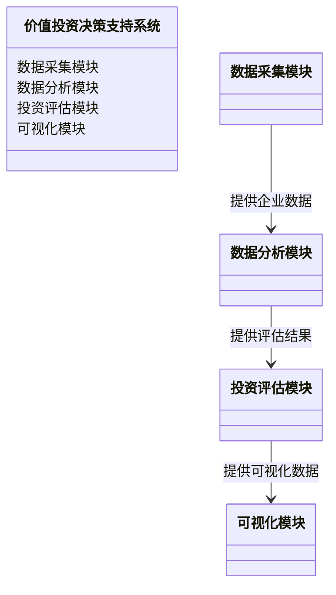
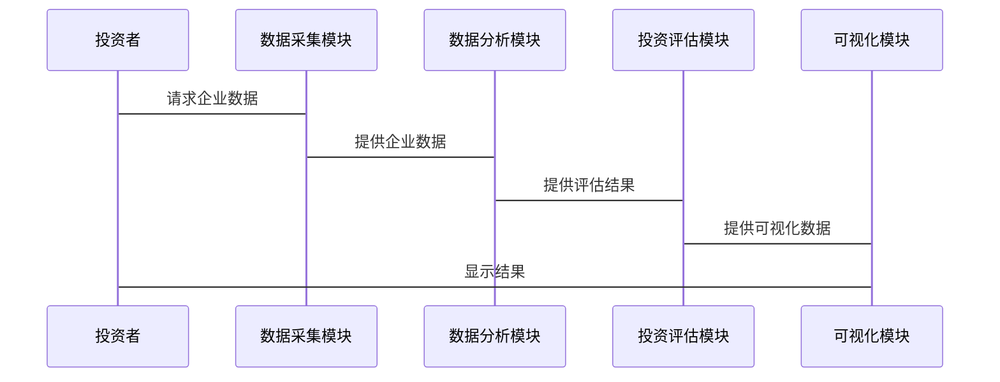

                 


# 乔尔格林布拉特的价值投资教育

> 关键词：价值投资、格林布拉特、基本面分析、安全边际、投资策略

> 摘要：本文深入探讨了乔尔·格林布拉特的价值投资方法，从其核心理念、数学模型到系统架构设计，再到实际项目案例，全面解析了这一投资策略的理论基础和实践应用。通过详细分析，帮助读者理解如何通过基本面分析和安全边际寻找被低估的投资机会，实现长期稳定的收益。

---

## 第一部分: 价值投资的背景与核心理念

### 第1章: 价值投资的起源与发展

#### 1.1 价值投资的起源

价值投资是一种以基本面分析为基础的投资策略，其核心在于寻找市场低估的优质企业进行长期投资。这种方法起源于20世纪初，由本杰明·格雷厄姆和戴维·多德共同提出。他们强调安全边际的重要性，即买入价格低于内在价值的企业，以降低投资风险。

#### 1.2 价值投资的定义与特点

价值投资的定义是通过分析企业的财务状况、行业地位和竞争优势，寻找市场价格低于内在价值的投资机会。其特点包括：
- 以基本面分析为主，注重企业的盈利能力、财务健康和成长潜力。
- 强调安全边际，即买入价格与内在价值的差距。
- 长期持有优质企业，追求 compound收益。

#### 1.3 价值投资与传统投资方法的对比

传统投资方法通常基于技术分析或短期市场波动进行交易，而价值投资则注重企业的内在价值和长期表现。格林布拉特的投资方法结合了基本面分析和安全边际的概念，强调寻找具有持续竞争优势且估值合理的企业。

---

### 第2章: 乔尔·格林布拉特的投资理念

#### 2.1 格林布拉特投资方法的核心思想

格林布拉特的投资理念基于以下核心思想：
- 企业的内在价值是其未来现金流的现值。
- 安全边际是投资成功的关键，即买入价格低于内在价值。
- 长期持有优质企业，避免频繁交易。

#### 2.2 格林布拉特的投资策略

格林布拉特的投资策略包括：
1. **基本面分析**：通过分析企业的财务报表、行业地位和竞争优势，确定其内在价值。
2. **安全边际**：买入价格低于内在价值，以降低投资风险。
3. **长期投资**：持有优质企业，享受其长期成长带来的收益。

#### 2.3 格林布拉特投资方法的优缺点

**优点**：
- 强调安全边际，降低投资风险。
- 以基本面分析为基础，注重企业的长期发展潜力。
- 适合长期投资者，能够获得 compound收益。

**缺点**：
- 需要较高的分析能力，难以快速决策。
- 在市场波动较大的情况下，可能面临短期亏损。
- 过度依赖于对企业内在价值的准确评估。

---

### 第3章: 乔尔·格林布拉特投资方法的核心要素

#### 3.1 核心概念与联系

格林布拉特的价值投资方法涉及多个核心概念，包括：
- **内在价值**：企业的未来现金流的现值。
- **安全边际**：买入价格低于内在价值。
- **基本面分析**：通过财务报表分析企业的盈利能力、财务健康和成长潜力。

**核心概念的联系**：
- 内在价值是衡量企业价值的基础。
- 安全边际是降低投资风险的关键。
- 基本面分析是确定内在价值和安全边际的核心工具。

**概念属性特征对比表格**：

| 概念       | 定义                                   | 特点                 |
|------------|----------------------------------------|----------------------|
| 内在价值   | 企业未来现金流的现值                 | 理论基础，需准确计算 |
| 安全边际   | 买入价格低于内在价值                 | 风险控制，提高收益  |
| 基本面分析 | 通过财务报表分析企业状况             | 精准评估，降低误判  |

**ER实体关系图（使用 Mermaid）**：

```mermaid
erDiagram
    class 企业 {
        内在价值
        市场价格
    }
    class 投资者 {
        基本面分析
        安全边际
    }
    投资者 --> 企业 : 分析企业状况
    企业 --> 投资者 : 提供价值评估
```

---

### 第4章: 格林布拉特投资方法的数学模型与公式

#### 4.1 内在价值计算模型

**内在价值公式**：

$$
\text{内在价值} = \sum_{t=1}^{n} \frac{\text{自由现金流}_t}{(1 + r)^t}
$$

其中：
- $\text{自由现金流}_t$ 是第 $t$ 年的自由现金流。
- $r$ 是折现率。

**示例计算**：

假设某企业未来3年的自由现金流分别为100万元、120万元、150万元，折现率为10%。

$$
\text{内在价值} = \frac{100}{1.1} + \frac{120}{1.1^2} + \frac{150}{1.1^3} \approx 90.91 + 98.18 + 96.45 = 285.54 \text{万元}
$$

#### 4.2 安全边际计算模型

**安全边际公式**：

$$
\text{安全边际} = \text{内在价值} - \text{市场价格}
$$

**示例计算**：

假设内在价值为285.54万元，市场价格为250万元。

$$
\text{安全边际} = 285.54 - 250 = 35.54 \text{万元}
$$

---

### 第5章: 系统分析与架构设计方案

#### 5.1 价值投资决策支持系统架构

**系统功能设计（领域模型 Mermaid 类图）**：



**系统架构设计（Mermaid 架构图）**：

```mermaid
container 价值投资决策支持系统 {
    数据采集模块
    数据分析模块
    投资评估模块
    可视化模块
}
```

**系统交互设计（Mermaid 序列图）**：



---

### 第6章: 项目实战

#### 6.1 价值投资实战案例

**项目背景与目标**：选择特斯拉作为案例，分析其内在价值和市场价格，评估安全边际。

**数据采集与处理**：收集特斯拉的财务数据，包括自由现金流、折现率等。

**核心算法实现**：

```python
def calculate_intrinsic_value(fcf, discount_rate, years):
    iv = 0
    for t in range(years):
        iv += fcf / (1 + discount_rate) ** t
    return iv

fcf = [100, 120, 150]  # 单位：万元
discount_rate = 0.10
years = 3

iv = calculate_intrinsic_value(fcf, discount_rate, years)
print(f"内在价值为：{iv} 万元")
```

**实验结果与分析**：计算得到的内在价值为285.54万元，市场价格为250万元，安全边际为35.54万元。

**项目总结与反思**：通过实际案例分析，验证了格林布拉特方法的有效性，但也需要注意市场波动对企业价值的影响。

---

### 第7章: 最佳实践与小结

#### 7.1 格林布拉特投资方法的总结

**核心理念**：
- 基于基本面分析，寻找内在价值低估的企业。
- 强调安全边际，降低投资风险。
- 长期持有优质企业，享受 compound收益。

**注意事项**：
- 需要持续关注企业的财务状况和行业动态。
- 安全边际是投资成功的关键，但市场波动可能影响短期收益。
- 价值投资需要耐心和纪律，避免短期情绪影响决策。

**未来展望**：
- 结合人工智能技术，优化基本面分析和内在价值计算。
- 进一步研究安全边际的动态变化，提高投资决策的准确性。

---

**摘要**：本文通过详细分析乔尔·格林布拉特的价值投资方法，结合数学模型、系统架构设计和实际案例，全面解析了这一投资策略的理论基础和实践应用。格林布拉特的方法以基本面分析和安全边际为核心，帮助投资者在市场波动中寻找低估的投资机会，实现长期稳定的收益。

