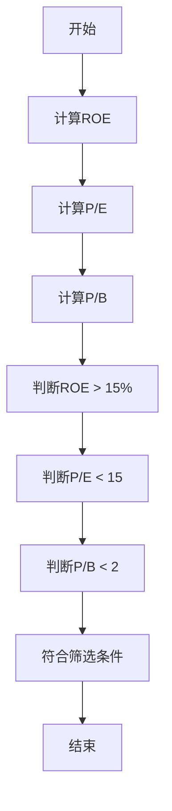
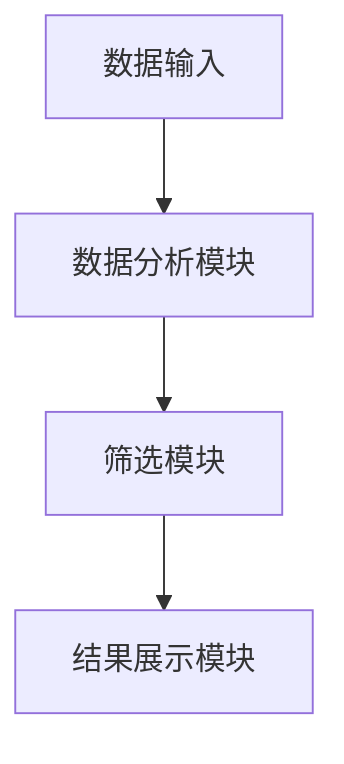

                 


# 乔尔格林布拉特的价值投资筛选

> 关键词：价值投资，格林布拉特，投资筛选，股票分析，投资策略

> 摘要：本文将深入探讨乔尔·格林布拉特的价值投资筛选方法，从其核心理念到具体筛选指标，从数学模型到实际案例，逐步解析其价值投资体系的精髓。通过本文，读者将能够掌握如何通过基本面分析、市场指标分析和财务指标分析，筛选出具有长期投资价值的优质股票。

---

# 第一部分: 价值投资筛选的背景与基础

## 第1章: 价值投资的定义与核心理念

### 1.1 价值投资的定义

#### 1.1.1 价值投资的起源与发展

价值投资是一种投资策略，起源于20世纪初，由本杰明·格雷厄姆和戴维·多德共同提出。该方法强调从基本面分析入手，寻找市场价格低于其内在价值的股票。乔尔·格林布拉特（Joel Greenblatt）是该领域的重要实践者和推广者，他将格雷厄姆的价值投资理论进一步量化和系统化。

#### 1.1.2 价值投资的核心理念

价值投资的核心理念是寻找市场价格低于其内在价值的股票。具体来说，价值投资者关注企业的基本面，包括盈利能力、财务状况、行业地位等，并结合市场估值指标（如市盈率、市净率等）来判断股票是否被低估。格林布拉特的筛选方法正是基于这一理念，通过量化指标来识别优质投资标的。

#### 1.1.3 价值投资与成长投资的区别

价值投资与成长投资的主要区别在于侧重点。价值投资注重低估的股票，关注当前的盈利能力、资产质量等基本面指标；而成长投资则注重未来增长潜力，关注收入增长率、净利润增长率等指标。格林布拉特的方法是两者的结合，既关注当前的盈利能力，又关注估值的合理性。

### 1.2 乔尔·格林布拉特投资方法的简介

#### 1.2.1 乔尔·格林布拉特的生平简介

乔尔·格林布拉特是一位著名的价值投资者，以开发量化投资模型闻名。他是对冲基金Greenblatt Capital Management的创始人，同时也是《股票作手回忆录》的作者。格林布拉特的投资方法结合了基本面分析和量化筛选，被认为是现代价值投资的代表之一。

#### 1.2.2 乔尔·格林布拉特的投资理念

格林布拉特的投资理念可以总结为：寻找具有高回报率（ROE）和低估值（如低市盈率、低市净率）的公司。他认为，市场先生（Mr. Market）往往会在短期波动中提供廉价买入的机会，而价值投资者的任务就是识别这些机会并长期持有。

#### 1.2.3 乔尔·格林布拉特的著作与影响力

格林布拉特的著作《The Quantitative Edge》和《Stocks for the Long Run》详细介绍了他的投资方法。他的理论不仅影响了无数投资者，还为量化投资领域的发展提供了重要参考。

---

## 第2章: 价值投资的核心概念与框架

### 2.1 核心概念

#### 2.1.1 市场有效性的探讨

价值投资者认为市场并非总是有效的，股票价格常常会偏离其内在价值。格林布拉特认为，市场短期波动为投资者提供了以低于内在价值买入股票的机会。

#### 2.1.2 价值与价格的区分

价值是股票的内在价值，通常基于公司的盈利能力、资产质量等因素；价格是市场参与者交易的结果。格林布拉特强调，价格波动为投资者提供了买入低估资产的机会。

#### 2.1.3 股东权益与企业价值的关系

股东权益（Equity）是公司净资产的价值，等于资产减去负债。格林布拉特的筛选方法中，ROE（股东权益回报率）是一个关键指标，因为它衡量了公司使用股东资金的效率。

### 2.2 核心框架

#### 2.2.1 格林布拉特的选股标准

格林布拉特的选股标准包括以下几点：
1. 高ROE（股东权益回报率）：通常要求ROE在15%以上。
2. 低市盈率（P/E）：通常要求P/E小于15。
3. 低市净率（P/B）：通常要求P/B小于2。
4. 高股息率（可选）：高股息率的股票通常具有较高的分红能力，表明公司盈利稳定。

#### 2.2.2 格林布拉特的估值方法

格林布拉特的估值方法主要基于基本面分析，结合市盈率、市净率等指标。他认为，股票的内在价值可以通过对公司未来现金流的折现来计算，但实际操作中更倾向于使用简单易行的估值指标。

#### 2.2.3 格林布拉特的组合管理策略

格林布拉特建议投资者分散投资，将资金分配到多个符合筛选标准的股票中。他强调长期持有，避免频繁交易，以减少交易成本并捕捉长期价值增长。

---

# 第二部分: 价值投资筛选的核心指标与分析

## 第3章: 基本面分析的核心指标

### 3.1 财务指标分析

#### 3.1.1 资产负债表分析

资产负债表是公司财务状况的静态反映，主要包括资产、负债和股东权益。格林布拉特关注的重点是股东权益回报率（ROE）和资产负债率。

- ROE（股东权益回报率）= 净利润 / 股东权益
- 资产负债率 = 负债总额 / 资产总额

#### 3.1.2 利润表分析

利润表反映公司在一定时期内的收入和支出情况。格林布拉特关注的主要指标包括净利润、毛利率和净利润率。

- 净利润 = 收入 - 成本 - 费用
- 毛利率 = 毛利润 / 收入
- 净利润率 = 净利润 / 收入

#### 3.1.3 现金流量表分析

现金流量表反映公司在一定时期内的现金流入和流出情况。格林布拉特关注现金流是否健康，尤其是经营活动现金流是否为正。

- 经营活动现金流 = 净利润 + 非现金支出 ± 折旧和摊销

### 3.2 市场指标分析

#### 3.2.1 市盈率（P/E）

市盈率是股票价格与每股收益的比率，反映了投资者对股票盈利能力的估值。

$$ P/E = \frac{股票价格}{每股收益} $$

#### 3.2.2 市净率（P/B）

市净率是股票价格与每股净资产的比率，反映了投资者对股票资产质量的估值。

$$ P/B = \frac{股票价格}{每股净资产} $$

#### 3.2.3 市销率（P/S）

市销率是股票价格与每股收入的比率，反映了投资者对股票收入能力的估值。

$$ P/S = \frac{股票价格}{每股收入} $$

---

## 第4章: 格林布拉特筛选模型的数学模型与公式

### 4.1 筛选模型的数学公式

格林布拉特的筛选模型可以通过以下步骤实现：

1. 计算ROE：ROE = 净利润 / 股东权益
2. 计算P/E：P/E = 股票价格 / 每股收益
3. 计算P/B：P/B = 股票价格 / 每股净资产
4. 筛选标准：
   - ROE > 15%
   - P/E < 15
   - P/B < 2

### 4.2 算法流程图



### 4.3 算法实现代码

```python
def greenblatt_screen(stock_data):
    # 计算ROE
    roe = stock_data['净利润'] / stock_data['股东权益']
    # 计算P/E
    pe = stock_data['股价'] / stock_data['每股收益']
    # 计算P/B
    pb = stock_data['股价'] / stock_data['每股净资产']
    # 筛选条件
    screening = (roe > 0.15) & (pe < 15) & (pb < 2)
    return screening
```

---

## 第5章: 系统分析与架构设计

### 5.1 系统功能设计

#### 5.1.1 系统功能模块

1. 数据输入模块：输入股票的基本面数据和市场数据。
2. 数据分析模块：计算ROE、P/E、P/B等指标。
3. 筛选模块：根据格林布拉特的筛选标准，筛选出符合条件的股票。
4. 结果展示模块：将筛选结果以表格或图表形式展示。

#### 5.1.2 系统架构设计



---

## 第6章: 项目实战

### 6.1 环境安装

#### 6.1.1 安装Python

安装Python 3.x 版本，确保环境满足后续代码运行需求。

#### 6.1.2 安装依赖库

安装pandas、numpy等数据分析库：

```bash
pip install pandas numpy
```

### 6.2 核心代码实现

#### 6.2.1 数据清洗与预处理

```python
import pandas as pd

# 假设我们有一个包含股票数据的Excel文件
stock_data = pd.read_excel('stock_data.xlsx')

# 数据清洗
stock_data = stock_data.dropna()
stock_data = stock_data[stock_data['净利润'] > 0]
```

#### 6.2.2 筛选模型实现

```python
def greenblatt_screen(stock_data):
    roe = stock_data['净利润'] / stock_data['股东权益']
    pe = stock_data['股价'] / stock_data['每股收益']
    pb = stock_data['股价'] / stock_data['每股净资产']
    screening = (roe > 0.15) & (pe < 15) & (pb < 2)
    return stock_data[screening]

# 应用筛选模型
screened_stocks = greenblatt_screen(stock_data)
```

---

## 第7章: 总结与展望

### 7.1 总结

通过本文的分析，我们可以看到，乔尔·格林布拉特的价值投资筛选方法是一种简单而有效的策略，它结合了基本面分析和量化筛选，帮助投资者在市场中找到低估的股票。这种方法的关键在于长期持有优质资产，避免短期市场的波动干扰。

### 7.2 展望

未来，价值投资筛选方法将更加依赖于大数据和人工智能技术。投资者可以通过机器学习算法，进一步优化筛选模型，提高筛选的准确性和效率。此外，随着市场的变化，价值投资的筛选标准也需要不断调整和优化，以适应新的市场环境。

---

通过本文的详细讲解，读者可以掌握乔尔·格林布拉特的价值投资筛选方法，并在实际投资中应用这一策略。无论是对于个人投资者还是机构投资者，这种方法都具有重要的参考价值。

