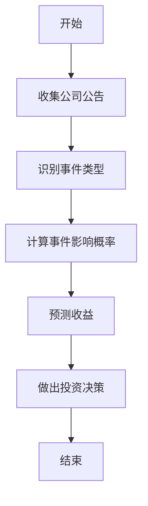
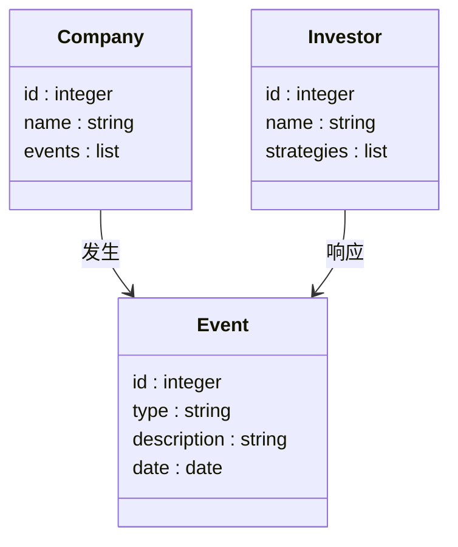
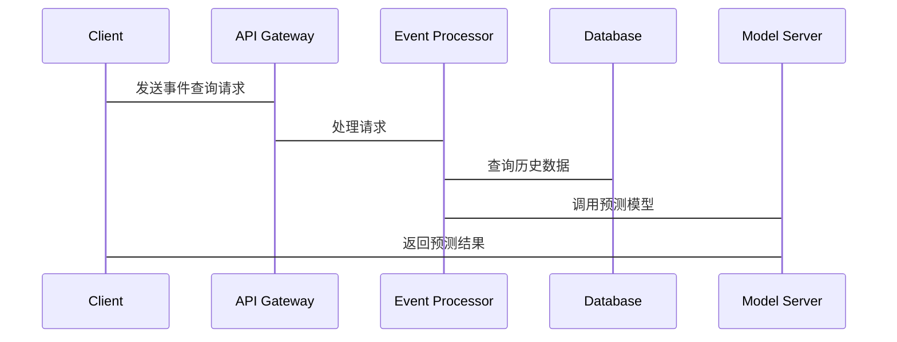

                 


# 事件驱动投资：从公司行为中获取超额收益

## 关键词：事件驱动投资，公司行为，超额收益，投资策略，金融算法

## 摘要：事件驱动投资是一种基于公司特定事件进行的投资策略，旨在通过分析这些事件对股价的影响，捕捉超额收益。本文将详细探讨事件驱动投资的背景、核心概念、算法原理、系统架构及实战案例，帮助投资者理解并应用这一策略。

---

## 第一部分: 事件驱动投资的背景与基础

### 第1章: 事件驱动投资的背景与概述

#### 1.1 事件驱动投资的定义与核心概念

##### 1.1.1 事件驱动投资的定义
事件驱动投资是一种通过识别和分析公司特定事件（如并购、重组、破产等）来预测股价波动的投资策略。投资者利用这些事件带来的短期市场反应，捕捉超额收益。

##### 1.1.2 事件驱动投资的核心要素
- **事件类型**：并购、重组、破产、诉讼等。
- **时间窗口**：通常关注短期（如1周到3个月）的股价变化。
- **市场反应**：事件公布后，股价可能因信息不对称而出现异常波动。

##### 1.1.3 事件驱动投资的边界与外延
- **边界**：主要关注可预测的公司行为事件，排除不可预测的市场波动。
- **外延**：涉及多个金融领域，如公司财务、市场微观结构等。

#### 1.2 事件驱动投资的背景与现状

##### 1.2.1 传统投资策略的局限性
传统策略如价值投资和趋势投资在市场波动大时表现不稳定，事件驱动投资提供了另一种选择。

##### 1.2.2 事件驱动投资的兴起
随着公司信息披露的增加和大数据技术的发展，投资者更容易捕捉事件信息。

##### 1.2.3 当前事件驱动投资的市场环境
量化交易和高频交易的兴起使事件驱动投资更加精准和高效。

#### 1.3 事件驱动投资的类型与分类

##### 1.3.1 并购重组事件
- 并购事件：公司被收购或收购其他公司。
- 重组事件：公司内部结构调整，如分拆、合并等。

##### 1.3.2 破产与债务重组
- 破产事件：公司申请破产保护。
- 债务重组：通过调整债务结构降低财务风险。

##### 1.3.3 股权变动与控制权变更
- 股权变动：大股东增持或减持。
- 控制权变更：公司控制权转移。

##### 1.3.4 重大诉讼与法律纠纷
- 诉讼事件：公司面临重大法律诉讼。
- 法律纠纷：涉及知识产权、合同违约等。

##### 1.3.5 其他公司行为事件
- 股票回购：公司回购自身股票。
- 股息调整：公司调整股息政策。

#### 1.4 事件驱动投资的优势与劣势

##### 1.4.1 优势：短期超额收益的可能性
事件驱动投资通常关注短期股价波动，投资者可能在短时间内获得超额收益。

##### 1.4.2 劣势：高风险与不确定性
事件的发生和市场反应具有不确定性，可能导致投资损失。

##### 1.4.3 事件驱动投资与传统投资策略的对比
- **传统投资策略**：长期价值导向，关注宏观经济和行业趋势。
- **事件驱动投资**：短期事件导向，关注公司特定行为。

#### 1.5 本章小结
事件驱动投资通过分析公司行为事件，捕捉短期股价波动，是一种有效的投资策略，但也面临高风险和不确定性。

---

### 第2章: 事件驱动投资的核心概念与联系

#### 2.1 事件驱动投资的核心原理

##### 2.1.1 事件的定义与分类
事件是公司层面的具体行为，可分为并购、重组、破产等类型。

##### 2.1.2 事件对股价的影响机制
事件公布后，市场参与者基于信息重新评估公司价值，导致股价短期波动。

##### 2.1.3 事件驱动投资的逻辑框架
1. 识别事件。
2. 分析事件对股价的影响。
3. 投资决策，捕捉超额收益。

#### 2.2 事件驱动投资的核心概念对比

##### 2.2.1 不同事件类型对股价的影响差异
| 事件类型       | 对股价的影响 |
|----------------|--------------|
| 并购重组       | 通常利好股价 |
| 破产与债务重组 | 可能利空股价 |
| 股权变动       | 可能利好或利空 |

##### 2.2.2 事件驱动投资与其他投资策略的对比
| 投资策略         | 关注点       | 时间框架 |
|------------------|--------------|-----------|
| 价值投资         | 公司基本面   | 长期      |
| 趋势投资         | 市场趋势     | 中期      |
| 事件驱动投资     | 公司事件     | 短期      |

##### 2.2.3 事件驱动投资的数学模型与公式
事件影响概率 \( P \) 可以通过历史数据计算，公式为：
\[ P = \frac{\text{事件发生后股价上涨次数}}{\text{总事件次数}} \]

#### 2.3 事件驱动投资的ER实体关系图
```mermaid
erDiagram
    company {
        key id : integer
        name : string
        event_type : string
        event_date : date
    }
    event {
        id : integer
        type : string
        description : string
        company_id : integer
    }
    investor {
        id : integer
        name : string
        strategy : string
    }
    company --> event : 发生
    investor --> event : 响应
```

#### 2.4 本章小结
事件驱动投资通过分析公司行为事件，利用事件对股价的影响机制，制定投资策略，实现超额收益。

---

### 第3章: 事件驱动投资的算法原理与数学模型

#### 3.1 事件驱动投资的算法原理

##### 3.1.1 事件识别与分类算法
使用自然语言处理（NLP）和关键词匹配识别公司公告中的事件类型。

##### 3.1.2 事件影响概率预测算法
基于历史数据，使用统计模型预测事件对股价的影响概率。

##### 3.1.3 基于事件的收益预测模型
使用回归模型预测事件发生后的预期收益。

#### 3.2 事件驱动投资的数学模型与公式

##### 3.2.1 事件影响概率计算
\[ P = \frac{\sum_{i=1}^{n} I(\text{事件i发生后股价上涨})}{n} \]

##### 3.2.2 收益预测模型
\[ R = \beta \times P + \epsilon \]
其中，\( \beta \) 是回归系数，\( \epsilon \) 是误差项。

#### 3.3 事件驱动投资的算法流程图


#### 3.4 事件驱动投资的Python实现示例

```python
import pandas as pd
from sklearn.linear_model import LogisticRegression

# 数据预处理
data = pd.read_csv('event_data.csv')
X = data[['event_type', 'market_cap']]
y = data['price_increase']

# 建立模型
model = LogisticRegression()
model.fit(X, y)

# 预测事件影响概率
new_event = [[1, 500000000]]
probability = model.predict_proba(new_event)[:, 1]
print(f"事件影响概率：{probability[0]:.2f}")
```

#### 3.5 本章小结
通过算法和数学模型，事件驱动投资可以量化事件的影响，帮助投资者做出科学决策。

---

## 第四部分: 事件驱动投资的系统分析与架构设计方案

### 第4章: 事件驱动投资的系统分析与架构设计

#### 4.1 问题场景介绍
设计一个基于事件驱动投资的分析系统，帮助投资者快速识别和分析公司事件，预测股价波动。

#### 4.2 系统功能设计

##### 4.2.1 领域模型设计


##### 4.2.2 系统架构设计


#### 4.3 系统接口设计
- **API接口**：提供事件识别和预测的REST API。
- **数据接口**：连接金融数据库，获取公司公告和股价数据。

#### 4.4 系统交互设计


#### 4.5 本章小结
通过系统架构设计，事件驱动投资分析系统能够高效处理大量数据，提供实时分析和预测。

---

## 第五部分: 事件驱动投资的项目实战

### 第5章: 事件驱动投资的项目实战

#### 5.1 项目背景与目标
分析一起并购事件，预测其对股价的影响，制定投资策略。

#### 5.2 环境安装与数据准备

##### 5.2.1 环境安装
安装Python、Pandas、Scikit-learn等工具。

##### 5.2.2 数据准备
收集目标公司并购事件的历史数据和股价数据。

#### 5.3 系统核心实现

##### 5.3.1 事件识别
使用NLP技术识别并购事件。

##### 5.3.2 数据预处理
清洗和整理数据，提取特征变量。

##### 5.3.3 模型训练
使用逻辑回归模型训练事件影响概率。

#### 5.4 代码实现与解读

##### 5.4.1 数据收集与预处理
```python
import pandas as pd

# 数据加载
data = pd.read_csv('merger_and_acquisition.csv')

# 数据清洗
data.dropna(inplace=True)
data['price_increase'] = data['close'].diff().fillna(0)
```

##### 5.4.2 模型训练与预测
```python
from sklearn.linear_model import LogisticRegression
from sklearn.metrics import accuracy_score

# 划分训练集和测试集
X_train = data.drop('price_increase', axis=1)
y_train = data['price_increase']

model = LogisticRegression()
model.fit(X_train, y_train)

# 预测测试集
X_test = next_data
y_pred = model.predict(X_test)
print(f"预测准确率：{accuracy_score(y_test, y_pred)}")
```

#### 5.5 实际案例分析与详细解读
以某公司并购事件为例，分析事件发生前后的股价变化，验证模型预测的准确性。

#### 5.6 项目小结
通过实战项目，展示了事件驱动投资的可行性，验证了模型的有效性。

---

## 第六部分: 事件驱动投资的总结与展望

### 第6章: 总结与展望

#### 6.1 本章小结
事件驱动投资通过分析公司行为事件，捕捉短期股价波动，是一种有效的投资策略。

#### 6.2 投资者注意事项
- **风险控制**：设置止损点，避免重大损失。
- **数据质量**：确保数据来源可靠，避免错误分析。
- **模型更新**：定期更新模型，适应市场变化。

#### 6.3 未来展望
随着人工智能和大数据技术的发展，事件驱动投资将更加精准和高效，成为未来投资的重要方向。

---

## 附录

### 附录A: 事件驱动投资相关术语表
- 事件驱动投资：基于公司行为事件的投资策略。
- 事件类型：并购、重组、破产等。

### 附录B: 常用工具与资源
- 数据来源：Yahoo Finance、Google Finance。
- 工具：Python、Pandas、Scikit-learn。

### 附录C: 进一步阅读推荐
- 书籍：《Algorithmic and High-Frequency Trading》
- 网站：QuantInsti blog

---

## 结语
事件驱动投资通过分析公司行为事件，帮助投资者捕捉短期超额收益。然而，投资者需注意风险控制和数据质量，未来随着技术进步，事件驱动投资将更具潜力。

