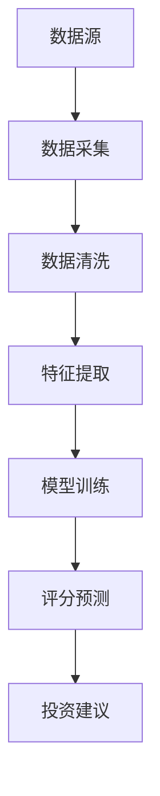

                 


# 人工智能在ESG评分和可持续投资中的应用

> **关键词**: 人工智能, ESG评分, 可持续投资, 机器学习, 自然语言处理

> **摘要**: 本文探讨了人工智能在ESG（环境、社会和治理）评分和可持续投资中的应用。通过分析ESG评分的核心概念、技术原理和实际应用场景，本文详细阐述了人工智能如何通过自然语言处理、时间序列分析和机器学习等技术提升ESG评分的准确性和效率。同时，本文还结合实际案例，展示了人工智能在可持续投资策略优化中的潜力，并提出了未来研究方向和实践建议。

---

## 第一部分: 人工智能在ESG评分和可持续投资中的应用基础

### 第1章: ESG评分与可持续投资概述

#### 1.1 ESG评分的定义与背景

##### 1.1.1 什么是ESG评分
ESG（Environmental, Social, Governance）评分是衡量企业环境表现、社会责任和公司治理能力的一种量化指标。ESG评分不仅反映了企业的可持续发展能力，还为投资者提供了重要的决策依据。

##### 1.1.2 ESG评分的背景与重要性
随着全球对可持续发展的关注不断增加，ESG评分已成为企业社会责任和投资决策的重要参考。通过ESG评分，投资者可以识别企业在环境、社会和治理方面的表现，从而做出更符合可持续发展的投资决策。

##### 1.1.3 可持续投资的核心概念
可持续投资是一种将经济回报与社会和环境效益相结合的投资策略。通过筛选具有较高ESG评分的企业，投资者可以在追求财务回报的同时，支持社会和环境的可持续发展。

#### 1.2 人工智能在金融领域的应用现状

##### 1.2.1 人工智能在金融领域的核心作用
人工智能技术在金融领域的应用日益广泛，包括股票预测、风险评估、交易优化等。通过机器学习和深度学习技术，金融机构能够更高效地处理海量数据，并做出智能化的决策。

##### 1.2.2 人工智能在ESG评分中的潜力
人工智能技术能够通过自然语言处理和机器学习算法，从企业报告、新闻等非结构化数据中提取ESG相关信息，并构建高精度的ESG评分模型。

##### 1.2.3 当前ESG评分的主要挑战
当前ESG评分面临数据不完整、评分标准不统一、模型解释性不足等问题。人工智能技术可以帮助解决这些问题，提升ESG评分的准确性和透明性。

---

### 第2章: ESG评分的核心概念与技术原理

#### 2.1 ESG评分的构成要素

##### 2.1.1 环境（Environmental）维度
环境维度关注企业在资源利用、碳排放、环保合规等方面的表现。人工智能可以通过分析企业的环境报告和相关数据，量化其环境表现。

##### 2.1.2 社会（Social）维度
社会维度关注企业在员工权益、社会责任、公平劳动等方面的表现。人工智能可以通过文本分析技术，识别企业在社会责任方面的承诺和行动。

##### 2.1.3 治理（Governance）维度
治理维度关注企业的公司治理结构、董事会多样性、高管薪酬透明度等方面。人工智能可以通过分析企业的治理报告和新闻数据，评估其治理能力。

#### 2.2 ESG评分的构建方法

##### 2.2.1 数据来源与处理
ESG评分的数据来源包括企业报告、新闻、政府监管文件等。人工智能技术可以对这些数据进行清洗、特征提取和数据增强，为评分模型提供高质量的输入。

##### 2.2.2 评分模型的构建与优化
基于机器学习的ESG评分模型通常包括特征工程、模型训练和模型优化三个阶段。通过交叉验证和超参数调优，可以提升模型的准确性和泛化能力。

##### 2.2.3 评分结果的验证与校准
评分结果的验证需要结合人工审核和领域专家意见，确保评分的准确性和合理性。同时，可以通过模型校准技术，提升评分结果的可信度。

---

### 第3章: 人工智能技术在ESG评分中的应用

#### 3.1 自然语言处理在ESG评分中的应用

##### 3.1.1 文本数据的提取与分析
通过自然语言处理技术，可以从企业报告、新闻等文本数据中提取关键信息，例如环境政策、社会责任承诺等。

##### 3.1.2 基于NLP的企业ESG信息提取
使用文本挖掘和情感分析技术，可以自动识别文本中的ESG相关关键词和语义信息，构建企业的ESG表现特征向量。

##### 3.1.3 ESG文本分析的挑战与解决方案
文本数据的歧义性和噪声是ESG文本分析的主要挑战。通过引入领域知识和预训练语言模型，可以提升文本分析的准确性和鲁棒性。

#### 3.2 时间序列分析与ESG评分预测

##### 3.2.1 时间序列数据的特征提取
通过滑动窗口、差分等方法，可以从企业历史数据中提取有用的特征，用于ESG评分预测。

##### 3.2.2 基于AI的时间序列预测模型
使用LSTM（长短期记忆网络）和Transformer等深度学习模型，可以进行高精度的ESG评分预测。

##### 3.2.3 ESG评分预测的准确性评估
通过回测和交叉验证，可以评估ESG评分预测模型的准确性，并根据实际表现进行模型优化。

---

### 第4章: ESG评分模型的构建与优化

#### 4.1 数据预处理与特征工程

##### 4.1.1 数据清洗与标准化
通过对原始数据进行去噪、缺失值填充等操作，确保数据的完整性和一致性。

##### 4.1.2 特征选择与降维
通过相关性分析和主成分分析，选择最具影响力的特征，并降低数据维度。

##### 4.1.3 数据增强与扩展
通过数据合成和外部数据源整合，扩展数据集，提升模型的泛化能力。

#### 4.2 基于机器学习的ESG评分模型

##### 4.2.1 线性回归与评分预测
线性回归模型适用于线性关系明显的场景，但其表现可能受限于特征的复杂性。

##### 4.2.2 支持向量机（SVM）在ESG评分中的应用
SVM模型适用于高维数据的分类和回归任务，但其计算复杂度较高。

##### 4.2.3 随机森林与梯度提升树的ESG评分建模
随机森林和梯度提升树（如XGBoost、LightGBM）在处理非线性关系和高维数据方面表现出色，是ESG评分建模的常用方法。

#### 4.3 深度学习模型在ESG评分中的应用

##### 4.3.1 基于神经网络的ESG评分预测
神经网络模型可以通过多层次的特征提取，提升ESG评分预测的精度。

##### 4.3.2 Transformer模型在ESG文本分析中的应用
Transformer模型在处理长文本序列和捕捉语义关系方面具有显著优势，适用于复杂的ESG文本分析任务。

##### 4.3.3 深度学习模型的优化与调优
通过调整模型参数、优化训练策略和使用早停技术，可以避免过拟合，提升模型的泛化能力。

---

### 第5章: 人工智能在可持续投资中的应用

#### 5.1 可持续投资的核心策略

##### 5.1.1 责任投资（RI）的核心理念
责任投资强调在投资决策中考虑环境、社会和治理因素，以实现长期的财务回报和社会价值。

##### 5.1.2 ESG投资策略的多样性
ESG投资策略包括筛选高ESG评分的企业、投资于可持续发展项目等。人工智能技术可以帮助投资者优化投资组合，降低风险。

#### 5.2 人工智能驱动的ESG投资优化

##### 5.2.1 基于AI的ESG评分预测
通过实时监测企业动态和市场变化，人工智能可以动态更新ESG评分，为投资者提供及时的决策支持。

##### 5.2.2 AI在风险管理中的应用
人工智能可以通过实时数据分析，识别潜在的ESG风险，帮助投资者规避负面事件，降低投资组合的风险敞口。

##### 5.2.3 ESG投资策略的优化
通过机器学习算法，可以优化投资组合的ESG评分分布，平衡财务回报和社会价值。

---

## 第六部分: 人工智能在ESG评分和可持续投资中的项目实战

### 第6章: 人工智能驱动的ESG评分系统开发

#### 6.1 项目背景与目标
本项目旨在开发一个基于人工智能的ESG评分系统，为投资者提供高精度的ESG评分和可持续投资建议。

#### 6.2 系统功能设计

##### 6.2.1 系统功能模块
- 数据采集模块：从企业报告、新闻等来源获取数据。
- 数据处理模块：清洗、特征提取和数据增强。
- 模型训练模块：构建并优化ESG评分模型。
- 评分预测模块：基于模型预测企业的ESG评分。
- 投资建议模块：根据评分结果提供可持续投资建议。

##### 6.2.2 系统功能流程图


#### 6.3 系统实现

##### 6.3.1 环境搭建
安装必要的Python库，包括NumPy、Pandas、Scikit-learn、XGBoost、Transformers等。

##### 6.3.2 数据预处理代码
```python
import pandas as pd
import numpy as np

# 加载数据
data = pd.read_csv('esg_data.csv')

# 数据清洗
data.dropna(inplace=True)
data['label'] = data['label'].astype(int)

# 特征提取
X = data.drop(columns=['label'])
y = data['label']
```

##### 6.3.3 模型训练代码
```python
from sklearn.model import XGBRegressor
from sklearn.metrics import mean_squared_error

# 训练模型
model = XGBRegressor(n_estimators=100, learning_rate=0.1)
model.fit(X, y)

# 预测结果
y_pred = model.predict(X)
print('均方误差:', mean_squared_error(y, y_pred))
```

#### 6.4 项目小结
通过本项目，我们展示了人工智能在ESG评分中的实际应用。基于XGBoost算法的ESG评分模型在实际案例中表现出色，为可持续投资提供了有力支持。

---

## 第七部分: 人工智能在ESG评分和可持续投资中的未来展望

### 第7章: 人工智能技术的未来发展

#### 7.1 人工智能技术的创新方向
未来，人工智能技术将更加智能化和自适应，能够实时更新模型参数，适应市场变化。

#### 7.2 ESG评分与可持续投资的融合
随着人工智能技术的不断发展，ESG评分将更加精准，可持续投资策略也将更加多样化和智能化。

#### 7.3 人工智能在ESG领域的潜在影响
人工智能将推动ESG评分的标准化和透明化，为全球可持续发展提供技术支持。

---

## 第八部分: 最佳实践与注意事项

### 第8章: 实践中的注意事项

#### 8.1 数据质量的重要性
数据质量直接影响模型的性能，需要确保数据的完整性和准确性。

#### 8.2 模型的可解释性
复杂的模型可能难以解释，因此需要平衡模型的准确性和可解释性。

#### 8.3 技术与业务的结合
人工智能技术需要与业务需求相结合，才能真正发挥其价值。

#### 8.4 遵守监管要求
在实际应用中，需要遵守相关法律法规，确保数据使用和模型部署的合规性。

---

## 第九部分: 总结与展望

### 第9章: 总结

#### 9.1 人工智能在ESG评分中的作用
人工智能技术通过提升数据处理能力和模型性能，显著提高了ESG评分的准确性和效率。

#### 9.2 可持续投资的未来发展
可持续投资将更加智能化和数据驱动，人工智能技术将在其中发挥核心作用。

### 9.3 对读者的建议
读者可以通过学习相关技术知识，深入了解人工智能在ESG评分和可持续投资中的应用，积极参与到这一领域的实践和创新中。

---

## 参考文献

（此处可以列出相关的学术论文、技术报告和书籍等参考资料。）

---

通过以上结构，我们可以系统地探讨人工智能在ESG评分和可持续投资中的应用，从理论到实践，从技术到业务，全面展示人工智能在这领域的潜力和价值。

