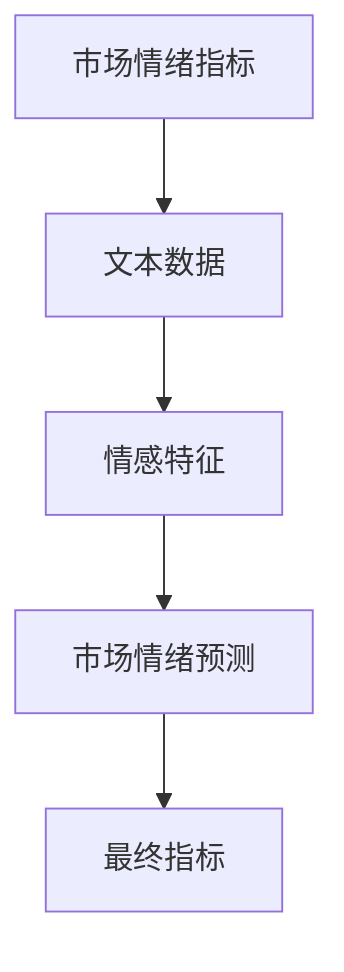
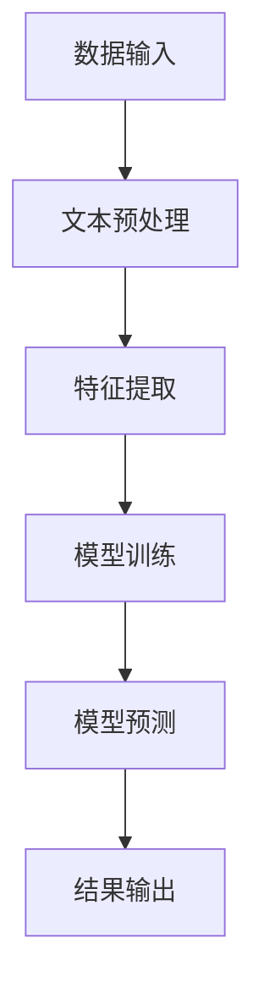
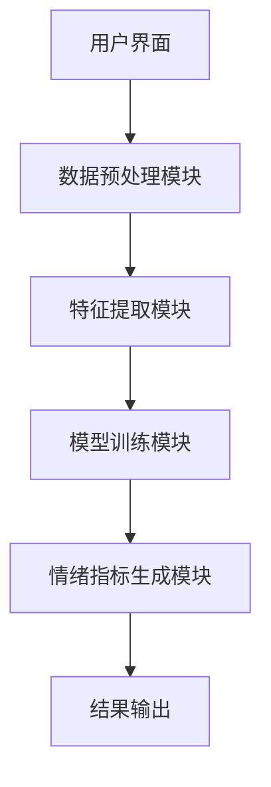

                 


# 人工智能在市场情绪指标构建中的应用

> 关键词：人工智能、市场情绪指标、情感分析、深度学习、时间序列分析

> 摘要：本文详细探讨了人工智能在市场情绪指标构建中的应用，从理论基础到算法实现，再到系统设计和项目实战，全面解析了如何利用人工智能技术来分析和预测市场情绪。文章通过具体案例和代码实现，帮助读者深入理解市场情绪指标的构建过程。

---

# 第一部分: 市场情绪指标构建的背景与基础

## 第1章: 市场情绪指标概述

### 1.1 市场情绪指标的定义与作用

#### 1.1.1 市场情绪指标的定义
市场情绪指标（Market Sentiment Index）是用来量化市场参与者情绪的指标，反映了投资者对市场的乐观或悲观程度。它是金融分析中的重要工具，能够帮助投资者做出更明智的决策。

#### 1.1.2 市场情绪指标在金融分析中的作用
市场情绪指标可以帮助投资者预测市场趋势，评估投资风险，优化投资组合。它在高频交易、风险管理等领域具有广泛应用。

#### 1.1.3 市场情绪指标的分类与特点
市场情绪指标可以分为基于文本的情绪指标、基于价格的情绪指标和混合型情绪指标。文本型指标通常基于新闻、社交媒体等文本数据；价格型指标基于市场交易数据；混合型指标结合了文本和价格数据。

### 1.2 人工智能在市场情绪分析中的应用背景

#### 1.2.1 传统市场情绪分析的局限性
传统市场情绪分析主要依赖于人工分析，效率低且主观性强。此外，传统方法难以处理海量数据，无法捕捉市场的实时动态。

#### 1.2.2 人工智能技术的优势
人工智能技术能够快速处理海量数据，提取有用的特征，并通过深度学习模型进行预测。它能够实时更新市场情绪指标，提高分析的准确性和效率。

#### 1.2.3 人工智能在市场情绪指标构建中的应用前景
随着自然语言处理和深度学习技术的不断进步，人工智能在市场情绪分析中的应用前景广阔。未来，市场情绪指标将更加智能化和自动化。

## 1.3 本章小结
本章介绍了市场情绪指标的定义、作用和分类，并分析了人工智能在市场情绪分析中的优势和应用前景。

---

# 第二部分: 市场情绪指标构建的核心概念与联系

## 第2章: 市场情绪指标的核心要素

### 2.1 数据来源与特征提取

#### 2.1.1 文本数据的获取与预处理
文本数据的来源包括新闻网站、社交媒体（如Twitter、Reddit）、论坛等。预处理步骤包括分词、去除停用词、词干提取等。

#### 2.1.2 市场情绪特征的提取方法
常用的情感特征包括情感倾向（积极、消极、中性）、情感强度、情感分布等。特征提取方法包括词袋模型、TF-IDF、Word2Vec等。

#### 2.1.3 数据特征的属性对比分析（表格）
以下是一个对比表格，展示了不同特征的属性：

| 特征属性 | 情感倾向 | 情感强度 | 情感分布 |
|----------|----------|----------|----------|
| 描述     | 判断文本是积极、消极还是中性 | 判断情感的强烈程度 | 判断情感在文本中的分布情况 |
| 示例     | 这是一个好消息。 | 这是一个非常糟糕的消息。 | 消息开头是积极的，结尾是消极的。 |

### 2.2 市场情绪指标的构建模型

#### 2.2.1 基于文本的情感分析模型
情感分析模型用于判断文本的情感倾向。常用的模型包括支持向量机（SVM）、随机森林（RF）、长短期记忆网络（LSTM）等。

#### 2.2.2 基于时间序列的市场情绪预测模型
时间序列模型用于预测市场情绪的变化趋势。常用的模型包括ARIMA、LSTM、Transformer等。

#### 2.2.3 市场情绪指标的综合评价方法
综合评价方法结合了多种特征和模型，提高了市场情绪指标的准确性和鲁棒性。常用的方法包括加权平均、投票法等。

### 2.3 实体关系架构（Mermaid流程图）



## 2.4 本章小结
本章详细介绍了市场情绪指标的核心要素，包括数据来源、特征提取和构建模型，并通过表格和流程图展示了各部分的关系。

---

# 第三部分: 市场情绪指标构建的算法原理

## 第3章: 基于深度学习的市场情绪分析算法

### 3.1 基于LSTM的情感分析模型

#### 3.1.1 LSTM网络的基本原理
LSTM（长短期记忆网络）是一种特殊的RNN，通过门控机制来解决梯度消失问题。它由输入门、遗忘门和输出门组成。

#### 3.1.2 LSTM在时间序列数据中的应用
LSTM适用于处理时间序列数据，能够捕捉数据中的长期依赖关系。在市场情绪分析中，LSTM可以用于预测市场的短期和长期趋势。

#### 3.1.3 LSTM模型的构建与训练
以下是基于LSTM的情感分析模型的代码示例：

```python
import tensorflow as tf
from tensorflow.keras.layers import LSTM, Dense, Embedding
from tensorflow.keras.models import Sequential

# 模型构建
model = Sequential()
model.add(Embedding(input_dim=10000, output_dim=64, input_length=100))
model.add(LSTM(units=64, dropout=0.2, recurrent_dropout=0.2))
model.add(Dense(3, activation='softmax'))

# 模型编译
model.compile(optimizer='adam', loss='sparse_categorical_crossentropy', metrics=['accuracy'])

# 模型训练
model.fit(X_train, y_train, epochs=10, batch_size=32)
```

### 3.2 基于Transformer的市场情绪预测模型

#### 3.2.1 Transformer模型的基本原理
Transformer模型由编码器和解码器组成，通过自注意力机制捕捉文本中的长距离依赖关系。

#### 3.2.2 Transformer在市场情绪分析中的应用
Transformer适用于处理文本数据，能够捕捉市场情绪的变化趋势。在市场情绪预测中，Transformer可以用于分析新闻标题和社交媒体帖子。

#### 3.2.3 Transformer模型的优化与改进
为了提高预测精度，可以对Transformer模型进行优化，如引入位置编码、调整模型参数等。

### 3.3 算法实现与流程图（Mermaid流程图）



## 3.4 本章小结
本章介绍了基于深度学习的市场情绪分析算法，包括LSTM和Transformer模型的原理、实现和优化方法。

---

# 第四部分: 市场情绪指标构建的系统分析与架构设计

## 第4章: 系统功能设计与架构

### 4.1 项目介绍
本项目旨在构建一个基于人工智能的市场情绪指标系统，能够实时分析市场情绪，并生成情绪指标报告。

### 4.2 系统功能设计

#### 4.2.1 数据预处理模块
数据预处理模块负责清洗和转换数据，包括文本清洗、分词、去停用词等。

#### 4.2.2 特征提取模块
特征提取模块从文本数据中提取情感特征，包括情感倾向、情感强度等。

#### 4.2.3 模型训练模块
模型训练模块负责训练情感分析模型和市场情绪预测模型。

#### 4.2.4 情绪指标生成模块
情绪指标生成模块根据模型预测结果生成市场情绪指标报告。

### 4.3 系统架构设计（Mermaid架构图）



## 4.4 本章小结
本章介绍了系统的功能设计和架构设计，展示了各模块之间的关系和交互过程。

---

# 第五部分: 市场情绪指标构建的项目实战

## 第5章: 项目实战

### 5.1 环境配置
项目需要以下环境和工具：
- Python 3.6+
- TensorFlow 2.0+
- Keras 2.2.5+
- Jupyter Notebook

### 5.2 数据来源与处理

#### 5.2.1 数据获取
从社交媒体（如Twitter）获取文本数据，并进行清洗和预处理。

#### 5.2.2 数据特征提取
使用Word2Vec模型提取文本特征，并构建特征向量。

### 5.3 模型实现与训练

#### 5.3.1 情感分析模型实现
以下是情感分析模型的代码示例：

```python
import numpy as np
from tensorflow.keras.preprocessing.text import Tokenizer
from tensorflow.keras.preprocessing.sequence import pad_sequences

# 数据预处理
tokenizer = Tokenizer(num_words=10000)
tokenizer.fit_on_texts(texts)
sequences = tokenizer.texts_to_sequences(texts)
X = pad_sequences(sequences, maxlen=100)

# 模型训练
model.fit(X, y, epochs=10, batch_size=32)
```

#### 5.3.2 市场情绪预测模型实现
以下是市场情绪预测模型的代码示例：

```python
import numpy as np
from tensorflow.keras.models import load_model

# 加载模型
model = load_model('sentiment_model.h5')

# 预测市场情绪
predictions = model.predict(X_test)
```

### 5.4 实际案例分析与详细讲解

#### 5.4.1 案例分析
以某次市场波动为例，分析模型的预测结果，并与实际市场情绪进行对比。

#### 5.4.2 模型评估
评估模型的准确率、召回率和F1分数，分析模型的优缺点。

### 5.5 项目小结
本章通过具体案例展示了市场情绪指标构建的全过程，从数据获取到模型训练，再到结果输出，帮助读者理解项目的实现过程。

---

# 第六部分: 总结与展望

## 第6章: 总结与展望

### 6.1 项目总结
本项目通过人工智能技术，成功构建了市场情绪指标系统，能够实时分析市场情绪，并生成情绪指标报告。

### 6.2 项目展望
未来，市场情绪指标将更加智能化和自动化。可以尝试引入更复杂的模型（如GPT-3、BERT）和多模态数据（如图像、视频）来进一步提高预测精度。

### 6.3 最佳实践 tips
- 数据预处理是关键，确保数据质量和完整性。
- 模型选择要根据具体任务需求，合理选择模型参数。
- 结合实际业务需求，不断优化模型和系统架构。

### 6.4 小结
本章总结了项目的成果，并展望了未来的发展方向，同时给出了实际应用中的注意事项和建议。

---

# 结语

人工智能在市场情绪指标构建中的应用前景广阔，通过不断的技术创新和实践积累，市场情绪指标将为金融分析提供更强大的工具和更精准的预测。

