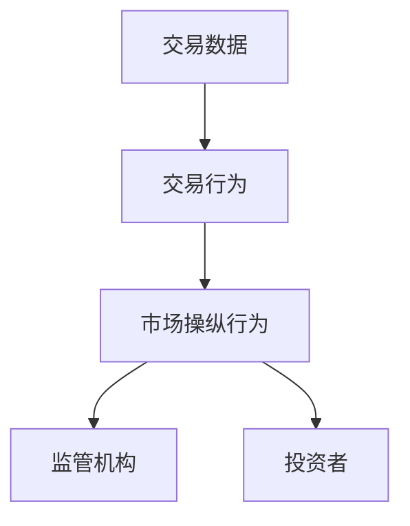
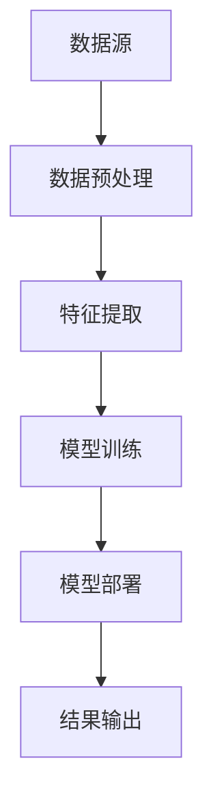
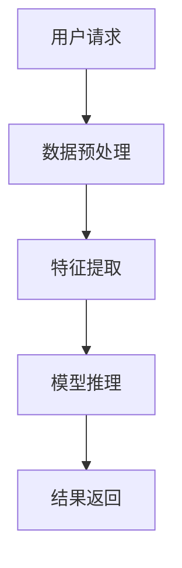

                 


# 人工智能在市场操纵行为检测中的应用

> 关键词：人工智能，市场操纵，金融监管，时间序列分析，深度学习，异常检测

> 摘要：随着金融市场的发展，市场操纵行为日益复杂化和隐蔽化，传统的监管手段逐渐暴露出局限性。人工智能技术的快速发展为市场操纵行为的检测提供了新的可能性。本文从背景、核心概念、算法原理、系统设计、项目实战等多个方面展开，详细探讨人工智能在市场操纵行为检测中的应用，并通过实际案例分析，展示人工智能技术的优势与挑战。

---

# 第一部分：市场操纵行为检测的背景与挑战

## 第1章：市场操纵行为检测的背景与挑战

### 1.1 市场操纵行为的定义与特征

市场操纵行为是指通过虚假的交易行为或信息传播，人为地影响市场价格走势，以谋取不正当利益的行为。其主要特征包括：

- **非正常交易频率**：短时间内出现异常的交易量或交易频率。
- **价格操纵**：通过拉高或打压价格，制造虚假的市场行情。
- **关联账户交易**：多个账户之间协同交易，掩盖操纵行为。
- **信息误导**：利用内部信息或虚假信息影响市场参与者决策。

### 1.2 传统市场操纵检测方法的局限性

传统检测方法主要包括基于规则的分析和统计分析法，但存在以下问题：

- **规则覆盖不全**：市场操纵手段多样化，单纯依赖规则难以覆盖所有可能的情况。
- **计算效率低**：面对海量数据，传统方法的处理效率难以满足实时性要求。
- **缺乏深度学习能力**：无法有效识别复杂模式和隐含关系。

### 1.3 人工智能技术的应用优势

人工智能技术在金融领域的应用优势显著：

- **数据处理能力**：能够快速处理海量金融数据，提取潜在特征。
- **模式识别能力**：通过深度学习模型，识别复杂的市场操纵模式。
- **实时性**：能够实现高频交易数据的实时分析，满足监管需求。

### 1.4 本章小结

本章通过介绍市场操纵行为的定义与特征，分析了传统检测方法的局限性，并探讨了人工智能技术在市场操纵检测中的优势。

---

# 第二部分：人工智能在市场操纵检测中的核心概念与联系

## 第2章：核心概念与联系

### 2.1 数据特征与市场操纵行为的关系

市场操纵行为往往伴随着数据特征的异常变化，例如：

- **交易量突增**：短时间内交易量激增，可能是市场操纵的信号。
- **价格波动异常**：价格走势偏离正常市场规律。
- **交易行为关联性**：多个账户之间存在协同交易的特征。

### 2.2 算法模型与市场操纵行为的关联

不同算法模型在市场操纵检测中的作用：

- **时间序列分析**：适用于捕捉价格走势的异常变化。
- **异常检测**：能够识别偏离正常模式的交易行为。
- **深度学习模型**：能够提取复杂的市场特征，识别隐藏的操纵模式。

### 2.3 实体关系图与市场操纵行为的关联

通过实体关系图（ER图），我们可以清晰地展示市场操纵行为涉及的主要实体及其关系：



### 2.4 本章小结

本章通过分析数据特征、算法模型与市场操纵行为之间的关系，构建了实体关系图，为后续算法设计奠定了基础。

---

# 第三部分：人工智能算法在市场操纵检测中的原理

## 第3章：人工智能算法原理

### 3.1 时间序列分析算法

时间序列分析是市场操纵检测的重要手段，常用的算法包括：

#### 3.1.1 ARIMA模型

ARIMA（自回归积分滑动平均模型）适用于捕捉时间序列的线性特征：

$$ ARIMA(p, d, q) $$

其中：
- $p$：自回归阶数
- $d$：差分阶数
- $q$：移动平均阶数

#### 3.1.2 LSTM模型

LSTM（长短期记忆网络）能够有效捕捉时间序列的非线性特征：

$$ f(x_t) = \sigma(w_{f}x_t + b_f) $$

其中：
- $x_t$：输入数据
- $w_f$：权重
- $b_f$：偏置

#### 3.1.3 异常检测算法

基于Isolation Forest的异常检测算法：

$$ score = \text{决策树深度} $$

### 3.2 基于监督学习的分类算法

#### 3.2.1 支持向量机（SVM）

SVM适用于高维数据分类：

$$ \text{目标函数} = \sum_{i=1}^n \lambda \xi_i + C \sum_{i=1}^n \xi_i $$

其中：
- $\lambda$：正则化参数
- $C$：惩罚系数

#### 3.2.2 随机森林（RF）

随机森林通过集成学习提高分类性能：

$$ \text{分类概率} = \sum_{i=1}^n \frac{1}{N} \cdot I(y_i = y) $$

其中：
- $N$：树的数量
- $y_i$：第$i$棵树的预测类别
- $y$：目标类别

#### 3.2.3 XGBoost算法

XGBoost通过梯度提升算法优化分类效果：

$$ \text{目标函数} = \sum_{i=1}^n \left( y_i - \hat{y}_i \right)^2 $$

其中：
- $y_i$：真实标签
- $\hat{y}_i$：预测标签

### 3.3 基于深度学习的模式识别算法

#### 3.3.1 卷积神经网络（CNN）

CNN适用于时间序列数据的特征提取：

$$ f(x) = \text{ReLU}(Wx + b) $$

其中：
- $W$：权重矩阵
- $x$：输入数据
- $b$：偏置

#### 3.3.2 Transformer模型

Transformer模型通过自注意力机制捕捉序列关系：

$$ \text{注意力权重} = \frac{\exp(\text{相似度})}{\sum \exp(\text{相似度})} $$

#### 3.3.3 图神经网络（GNN）

GNN适用于交易网络中的关联分析：

$$ f(x) = \text{GNN}(A, X) $$

其中：
- $A$：邻接矩阵
- $X$：特征矩阵

---

# 第四部分：系统设计与实现

## 第4章：系统设计与实现

### 4.1 项目介绍

本项目旨在构建一个基于人工智能的市场操纵行为检测系统，通过分析高频交易数据，识别异常交易行为。

### 4.2 系统架构设计

系统架构图：



### 4.3 系统功能设计

#### 4.3.1 数据预处理

- 数据清洗
- 标准化处理

#### 4.3.2 特征提取

- 时间特征
- 频率特征
- 关联特征

#### 4.3.3 模型训练

- 选择合适算法
- 调参优化

### 4.4 系统接口设计

- 数据输入接口
- 模型调用接口
- 结果输出接口

### 4.5 系统交互流程



---

# 第五部分：项目实战

## 第5章：项目实战

### 5.1 环境安装

```bash
pip install numpy pandas scikit-learn tensorflow
```

### 5.2 核心实现代码

```python
import numpy as np
import pandas as pd
from sklearn.svm import SVC
from sklearn.ensemble import RandomForestClassifier
from tensorflow.keras.models import Sequential
from tensorflow.keras.layers import LSTM, Dense

# 数据加载
data = pd.read_csv('market_data.csv')

# 特征提取
X = data[['volume', 'price_diff', '交易频率']]
y = data['label']

# 模型训练
model = Sequential()
model.add(LSTM(64, input_shape=(None, 3)))
model.add(Dense(1, activation='sigmoid'))
model.compile(loss='binary_crossentropy', optimizer='adam', metrics=['accuracy'])
model.fit(X, y, epochs=10, batch_size=32)
```

### 5.3 案例分析

通过实际案例分析，验证模型的检测效果：

```python
# 模型预测
predictions = model.predict_classes(X)
# 结果分析
accuracy = np.mean(predictions == y)
print(f'模型准确率：{accuracy}')
```

### 5.4 本章小结

本章通过实际案例展示了人工智能技术在市场操纵检测中的应用，验证了算法的有效性。

---

# 第六部分：总结与展望

## 第6章：总结与展望

### 6.1 本章小结

本文详细探讨了人工智能在市场操纵检测中的应用，从算法原理到系统设计，再到项目实战，全面展示了人工智能技术的优势。

### 6.2 未来展望

- 更加复杂的深度学习模型
- 多模态数据融合
- 实时性优化

### 6.3 注意事项

- 数据隐私保护
- 模型解释性
- 算法鲁棒性

---

通过以上思考步骤，我们可以清晰地看到人工智能在市场操纵行为检测中的巨大潜力，同时也为未来的研究方向提供了重要启示。

