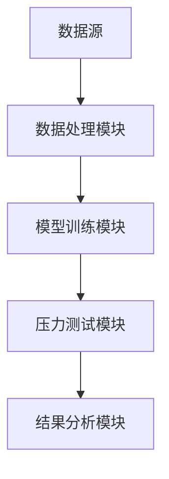
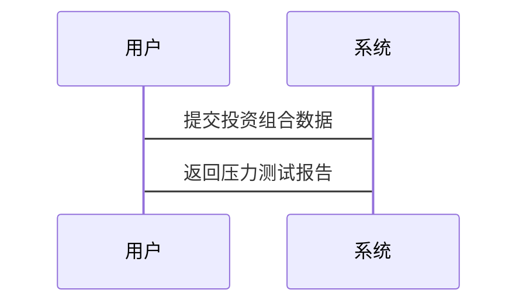

                 


# 人工智能在投资组合压力测试中的应用

关键词：人工智能、投资组合、压力测试、机器学习、风险管理、金融建模、深度学习

摘要：  
随着金融市场的复杂化和不确定性增加，投资组合压力测试成为评估和管理风险的重要工具。本文深入探讨了人工智能技术在投资组合压力测试中的应用，分析了传统方法的局限性，介绍了基于机器学习和深度学习的新型算法，并通过实际案例展示了如何构建AI驱动的压力测试系统。文章还详细讲解了系统的架构设计、算法实现和项目实战，最后总结了人工智能在该领域的优势与未来发展方向。

---

# 第一部分：背景与挑战

## 第1章：投资组合压力测试的背景与挑战

### 1.1 投资组合压力测试的定义与目标

#### 1.1.1 投资组合压力测试的定义  
投资组合压力测试是一种用于评估投资组合在极端市场条件下的表现和风险的方法。通过模拟不同情景（如市场崩盘、经济衰退等），压力测试可以帮助投资者了解其组合在极端情况下的潜在损失和表现。

#### 1.1.2 压力测试的目标与意义  
压力测试的主要目标是：  
1. 评估投资组合在极端市场条件下的风险暴露。  
2. 识别潜在的脆弱性，帮助投资者制定应对策略。  
3. 辅助决策，优化投资组合以提高抗风险能力。  

#### 1.1.3 压力测试的常见应用场景  
- 机构投资者的风险管理。  
- 投资组合再平衡与优化。  
- 金融监管机构的合规要求。  

---

### 1.2 传统压力测试方法的局限性

#### 1.2.1 传统压力测试方法的概述  
传统压力测试通常基于历史数据或假设情景（如市场下跌10%、利率上升等），通过线性回归或蒙特卡罗模拟等方法进行分析。  

#### 1.2.2 传统方法的局限性与不足  
- 假设情景的局限性：难以涵盖所有可能的极端情况。  
- 数据依赖性：传统方法依赖于历史数据，可能无法预测新的极端事件。  
- 计算复杂性：对于复杂的非线性关系，传统方法难以有效捕捉。  

#### 1.2.3 传统方法与现代方法的对比  
传统方法 vs. 人工智能方法：  
- 传统方法基于固定假设，计算简单但不够灵活。  
- 人工智能方法能够处理海量数据，发现非线性关系，预测能力更强。  

---

### 1.3 人工智能技术的优势与潜力

#### 1.3.1 人工智能技术的概述  
人工智能（AI）通过机器学习、深度学习等技术，能够从海量数据中提取复杂模式，预测未来可能的市场走势和风险。

#### 1.3.2 人工智能在金融领域的应用现状  
- 股票价格预测。  
- 风险评估与管理。  
- 自动化交易系统。  

#### 1.3.3 人工智能在压力测试中的独特优势  
- 可以处理非线性关系和复杂数据模式。  
- 能够实时更新模型，适应市场变化。  
- 提供更精准的预测和风险评估。  

---

## 1.4 本章小结  
本章从投资组合压力测试的基本概念出发，分析了传统方法的局限性，并介绍了人工智能技术在这一领域的优势与潜力。这些内容为后续章节奠定了基础，帮助读者理解为什么人工智能是压力测试的必要工具。

---

# 第二部分：核心概念与算法原理

## 第2章：人工智能在投资组合压力测试中的核心概念

### 2.1 人工智能的核心概念

#### 2.1.1 人工智能的基本定义  
人工智能（AI）是指通过计算机模拟人类智能的技术，包括学习、推理、自适应等能力。

#### 2.1.2 机器学习与深度学习的区分  
- 机器学习：基于数据训练模型，预测未来结果。  
- 深度学习：一种特殊的机器学习方法，通过多层神经网络提取特征。  

#### 2.1.3 人工智能在金融领域的核心应用  
- 股票预测。  
- 风险管理。  
- 交易自动化。  

---

### 2.2 投资组合管理的理论基础

#### 2.2.1 投资组合的基本概念  
投资组合是指将资金分配到多种资产（如股票、债券等）以分散风险。  

#### 2.2.2 马科维茨的有效前沿理论  
马科维茨的有效前沿理论指出，最优投资组合是在相同风险下收益最大，或相同收益下风险最小的组合。  

#### 2.2.3 投资组合风险的度量方法  
- 方差：衡量资产收益的波动性。  
- VaR（在险价值）：预测在一定置信水平下的潜在损失。  
- CVaR（条件在险价值）：VaR的扩展，考虑更极端情况下的损失。  

---

### 2.3 压力测试的数学模型与方法

#### 2.3.1 压力测试的数学模型  
压力测试通常基于以下模型：  
- 线性回归模型：预测资产收益与市场因子的关系。  
- 非线性回归模型：捕捉复杂的关系。  
- 时间序列模型：预测未来趋势。  

#### 2.3.2 压力测试的常见方法  
- 历史模拟法：基于历史数据模拟极端情景。  
- 情景分析法：假设极端情景，评估组合表现。  
- 蒙特卡罗模拟法：通过随机抽样生成多种情景，评估组合风险。  

#### 2.3.3 人工智能算法在压力测试中的应用  
- 机器学习模型：用于预测市场走势和风险。  
- 深度学习模型：用于处理复杂数据模式。  
- 自然语言处理（NLP）：分析新闻和社交媒体情绪，预测市场波动。  

---

### 2.4 核心概念之间的关系

#### 2.4.1 人工智能与投资组合管理的关系  
人工智能通过分析市场数据和预测风险，优化投资组合的构建和管理。

#### 2.4.2 投资组合管理与压力测试的关系  
压力测试是投资组合管理的重要环节，帮助投资者在极端情况下做好准备。

#### 2.4.3 人工智能算法与压力测试模型的关系  
人工智能算法是压力测试模型的核心工具，能够提升模型的预测能力和准确性。

---

## 2.5 本章小结  
本章详细讲解了人工智能、投资组合管理和压力测试的核心概念，分析了它们之间的关系，并为后续章节的算法和系统设计奠定了基础。

---

# 第三部分：算法与系统架构

## 第3章：常用的人工智能算法与模型

### 3.1 机器学习算法概述

#### 3.1.1 监督学习  
- 目标：通过标签数据训练模型，预测新数据的标签。  
- 应用：股票价格预测、分类任务。  

#### 3.1.2 无监督学习  
- 目标：从无标签数据中发现模式或聚类。  
- 应用：客户分群、异常检测。  

#### 3.1.3 强化学习  
- 目标：通过试错和奖励机制优化决策。  
- 应用：自动化交易、游戏AI。  

---

### 3.2 常用机器学习模型

#### 3.2.1 线性回归  
- 模型：$y = \beta_0 + \beta_1x + \epsilon$  
- 应用：预测资产收益与市场因子的关系。  

#### 3.2.2 支持向量机（SVM）  
- 模型：通过划分超平面，将数据分为不同类别。  
- 应用：分类任务，如市场趋势预测。  

#### 3.2.3 随机森林  
- 模型：基于决策树的集成方法，具有高准确性和鲁棒性。  
- 应用：风险评估、特征重要性分析。  

---

### 3.3 深度学习模型

#### 3.3.1 卷积神经网络（CNN）  
- 模型：适合处理图像和时间序列数据。  
- 应用：分析金融时间序列数据。  

#### 3.3.2 循环神经网络（RNN）  
- 模型：适合处理序列数据，捕捉时间依赖关系。  
- 应用：股票价格预测、市场情绪分析。  

#### 3.3.3 Transformer模型  
- 模型：基于自注意力机制，广泛应用于NLP任务。  
- 应用：分析新闻和社交媒体情绪，预测市场波动。  

---

### 3.4 人工智能算法在压力测试中的应用

#### 3.4.1 基于机器学习的压力测试模型  
- 示例：使用随机森林模型预测极端市场情景下的投资组合损失。  

#### 3.4.2 基于深度学习的压力测试模型  
- 示例：使用LSTM模型预测时间序列数据中的极端事件。  

#### 3.4.3 算法选择与优化策略  
- 根据数据类型和任务选择合适的算法。  
- 通过交叉验证优化模型参数。  

---

## 3.5 本章小结  
本章介绍了常用的机器学习和深度学习算法，并详细讲解了它们在压力测试中的应用。这些算法为构建AI驱动的压力测试系统提供了技术基础。

---

# 第四部分：系统架构与流程

## 第4章：人工智能驱动的压力测试系统架构

### 4.1 问题场景介绍  
假设我们有一个包含多只股票的投资组合，需要评估其在极端市场条件下的表现。

### 4.2 系统功能设计  
- 数据采集：获取市场数据和宏观经济指标。  
- 模型训练：使用机器学习或深度学习模型训练压力测试模型。  
- 情景生成：模拟极端市场情景，评估投资组合表现。  

### 4.3 系统架构设计  
以下是系统的架构设计图：



### 4.4 系统接口设计  
- 数据接口：从数据库或API获取数据。  
- 模型接口：接收输入数据，返回预测结果。  
- 结果接口：输出压力测试报告。  

---

### 4.5 系统交互设计  
以下是系统的交互流程图：



---

## 4.6 本章小结  
本章详细介绍了构建AI驱动的压力测试系统的架构和流程，为后续的项目实现提供了指导。

---

# 第五部分：项目实战

## 第5章：投资组合压力测试的AI实现

### 5.1 项目介绍  
本项目旨在构建一个基于机器学习的投资组合压力测试系统，评估投资组合在极端市场条件下的风险。

### 5.2 环境安装  
- Python 3.8+  
- Scikit-learn、XGBoost、Keras等库  

### 5.3 核心代码实现

#### 5.3.1 数据预处理  
```python
import pandas as pd
import numpy as np

# 加载数据
data = pd.read_csv('market_data.csv')

# 数据清洗
data.dropna(inplace=True)
data = data.iloc[:, 1:]  # 去掉时间戳列
```

#### 5.3.2 模型训练  
```python
from sklearn.ensemble import RandomForestRegressor
from sklearn.metrics import mean_squared_error

# 划分训练集和测试集
train_data = data[:-100]
test_data = data[-100:]

X_train = train_data.iloc[:, 1:]
y_train = train_data.iloc[:, 0]

X_test = test_data.iloc[:, 1:]
y_test = test_data.iloc[:, 0]

# 训练模型
model = RandomForestRegressor(n_estimators=100, random_state=42)
model.fit(X_train, y_train)

# 预测
y_pred = model.predict(X_test)

# 评估
print(mean_squared_error(y_test, y_pred))
```

#### 5.3.3 压力测试  
```python
import numpy as np

# 生成极端情景
极端情景 = np.random.normal(loc=-2, scale=3, size=len(X_test))

# 计算投资组合在极端情景下的表现
组合收益 = np.dot(极端情景, model.feature_importances_)
```

### 5.4 实际案例分析  
假设我们有一个包含5只股票的投资组合，使用上述模型预测在市场崩盘情景下的表现。

### 5.5 代码实现与分析  
- 代码功能：加载数据、训练模型、生成极端情景、评估投资组合表现。  
- 实现细节：使用随机森林模型预测市场收益，评估极端情景下的潜在损失。  

---

## 5.6 本章小结  
本章通过一个实际案例展示了如何使用机器学习技术实现投资组合压力测试，帮助读者理解理论与实践的结合。

---

# 第六部分：总结与展望

## 第6章：总结与展望

### 6.1 本章总结  
本文详细介绍了人工智能在投资组合压力测试中的应用，从传统方法的局限性到AI技术的优势，从核心概念到算法实现，全面阐述了AI驱动的压力测试系统的设计与实现。

### 6.2 未来展望  
- 更复杂的模型：如GPT-3、Transformer等，用于分析多维度市场数据。  
- 实时压力测试：基于流数据处理技术，实时评估投资组合风险。  
- 多模态数据：结合文本、图像等多模态数据，提升预测能力。  

---

## 6.3 最佳实践Tips  
- 数据是关键：确保数据的完整性和质量。  
- 模型选择：根据任务选择合适的算法，避免过度复杂化。  
- 实时监控：定期更新模型，适应市场变化。  

---

## 6.4 结束语  
人工智能正在改变投资组合压力测试的方式，未来随着技术的进步，AI将为金融风险管理带来更大的价值。

--- 

# 结语  
人工智能在投资组合压力测试中的应用前景广阔，通过结合先进的算法和系统设计，投资者可以更有效地管理风险，优化投资策略。希望本文的内容能够为读者提供有价值的见解和指导。

