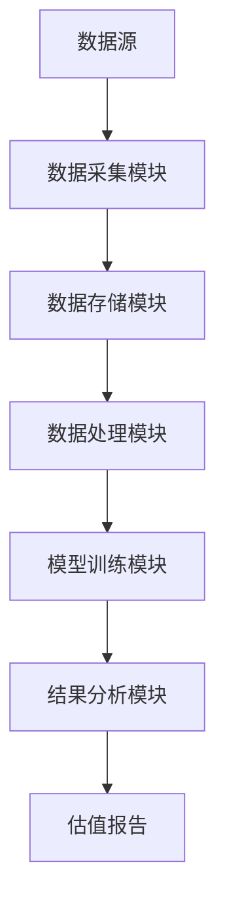
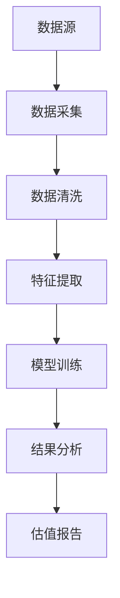

                 


# 人工智能在股市估值分析中的应用前景

> 关键词：人工智能，股市估值，机器学习，深度学习，金融时间序列分析，情感分析

> 摘要：随着人工智能技术的快速发展，其在金融领域的应用也逐渐深入。本文将从人工智能的基本概念出发，探讨其在股市估值分析中的应用前景。通过分析股市数据的复杂性，结合机器学习和深度学习算法，本文旨在揭示人工智能在股市估值中的潜在价值，并展望未来的发展方向。

---

# 第一部分：人工智能与股市估值分析概述

---

## 第1章：人工智能与股市估值分析概述

### 1.1 人工智能的基本概念

#### 1.1.1 人工智能的定义与核心概念
人工智能（Artificial Intelligence，AI）是指通过计算机模拟人类智能的技术，涵盖学习、推理、感知和决策等多个方面。其核心概念包括：
- **学习**：通过数据训练模型，使其能够从经验中改进。
- **推理**：基于已知信息进行逻辑推导。
- **感知**：通过传感器或数据输入识别环境。
- **决策**：基于分析结果做出选择。

人工智能在金融领域的应用主要集中在数据处理、预测分析和自动化交易等方面。

#### 1.1.2 人工智能在金融领域的应用背景
金融市场的数据具有高度复杂性，包括时间序列数据、文本数据（如新闻、财报）、社交网络数据等。传统的统计方法在处理这些数据时显得力不从心，而人工智能技术的强大计算能力和学习能力使其成为金融领域的重要工具。

#### 1.1.3 股市估值分析的基本原理
股市估值分析旨在通过对公司基本面、市场情绪、宏观经济指标等多方面因素的分析，预测股票的合理价值。传统的估值方法包括市盈率（P/E）、市净率（P/B）等指标，但这些方法往往难以捕捉市场的动态变化。

---

### 1.2 股市估值分析的挑战与需求

#### 1.2.1 股市数据的复杂性
股市数据具有以下特点：
- **非线性**：价格波动往往难以用简单的线性模型描述。
- **噪声干扰**：市场中的随机波动和噪声会影响数据的准确性。
- **时间依赖性**：股票价格具有强烈的时间序列特性。

#### 1.2.2 传统估值方法的局限性
传统估值方法主要依赖财务指标和统计模型，但存在以下问题：
- **滞后性**：财务数据的更新周期较长，难以捕捉市场实时变化。
- **忽略情绪因素**：传统方法难以量化市场情绪对股价的影响。
- **单因素分析**：难以同时考虑多维度的影响因素。

#### 1.2.3 人工智能在估值分析中的潜在价值
人工智能能够通过以下方式提升股市估值分析的准确性：
- **多维度数据整合**：能够同时处理结构化数据（如财务报表）和非结构化数据（如新闻、社交媒体）。
- **实时分析能力**：通过实时数据处理，捕捉市场的短期波动。
- **动态调整模型**：能够根据市场变化动态优化预测模型。

---

### 1.3 人工智能在股市估值中的应用前景

#### 1.3.1 全球金融市场的智能化趋势
全球金融市场正在经历一场智能化的变革，越来越多的机构开始采用人工智能技术进行投资决策。这一趋势主要得益于以下几个方面：
- **计算能力的提升**：云计算和大数据技术的进步为人工智能的应用提供了基础。
- **数据量的增加**：互联网的发展使得金融数据的获取变得更加便捷。
- **算法的改进**：深度学习等技术的突破提高了模型的预测能力。

#### 1.3.2 人工智能技术的快速发展
人工智能技术的快速发展为股市估值分析提供了新的工具和方法：
- **深度学习的突破**：如Transformer架构的提出，为时间序列分析提供了新的思路。
- **自然语言处理的进步**：能够更准确地分析新闻和社交媒体对市场情绪的影响。
- **强化学习的应用**：在自动化交易中展现出巨大潜力。

#### 1.3.3 未来股市估值分析的可能方向
未来，股市估值分析可能会朝着以下几个方向发展：
- **多模态数据融合**：将文本、图像等多种数据源结合起来进行分析。
- **实时预测系统**：开发能够实时更新预测结果的智能系统。
- **个性化投资策略**：基于投资者的风险偏好和投资目标，定制个性化的估值模型。

---

## 第2章：人工智能技术基础

---

### 2.1 机器学习的核心概念

#### 2.1.1 机器学习的定义与分类
机器学习是一种通过数据训练模型的技术，主要分为以下三类：
- **监督学习**：基于标记数据进行训练，如回归和分类任务。
- **无监督学习**：在无标记数据上发现隐含结构，如聚类和降维。
- **强化学习**：通过与环境交互，学习最优策略。

#### 2.1.2 常见机器学习算法
- **线性回归**：用于预测连续型变量。
- **支持向量机（SVM）**：适用于分类和回归任务。
- **随机森林**：基于决策树的集成学习方法。

#### 2.1.3 机器学习在金融中的应用
- **股票价格预测**：使用回归模型预测股票价格。
- **风险评估**：通过分类模型识别高风险投资。

---

### 2.2 深度学习的基本原理

#### 2.2.1 神经网络的结构与功能
深度学习的核心是神经网络，包括以下几层：
- **输入层**：接收原始数据。
- **隐藏层**：通过非线性变换提取特征。
- **输出层**：生成最终的预测结果。

#### 2.2.2 常见深度学习模型
- **卷积神经网络（CNN）**：适用于图像识别任务。
- **循环神经网络（RNN）**：适用于时间序列数据。
- **Transformer架构**：在自然语言处理领域表现出色。

#### 2.2.3 深度学习在金融中的应用
- **时间序列预测**：使用LSTM网络预测股票价格。
- **新闻情感分析**：通过Transformer架构分析文本情绪。

---

### 2.3 大数据分析与处理

#### 2.3.1 数据采集与清洗
- 数据采集：从股票交易所、新闻网站等多渠道获取数据。
- 数据清洗：去除噪声数据，填补缺失值。

#### 2.3.2 数据特征提取与选择
- 特征提取：通过统计方法提取有用的特征，如均值、标准差等。
- 特征选择：使用过滤法或包装法选择重要特征。

#### 2.3.3 数据可视化与分析
- 数据可视化：使用图表展示数据分布和趋势。
- 数据分析：通过统计方法发现数据中的规律。

---

## 第3章：股市数据与特征分析

---

### 3.1 股市数据的类型与特点

#### 3.1.1 常见数据类型
- **时间序列数据**：股票价格、成交量等。
- **文本数据**：新闻、社交媒体评论。
- **结构化数据**：财务报表、市场指数。

#### 3.1.2 数据的特征
- **周期性**：股票价格往往具有周期性波动。
- **随机性**：市场中的随机波动难以预测。
- **相关性**：不同股票之间可能存在相关性。

---

### 3.2 数据预处理与特征工程

#### 3.2.1 数据清洗与标准化
- 数据清洗：去除异常值，处理缺失数据。
- 数据标准化：将数据归一化到统一范围内。

#### 3.2.2 特征提取与降维
- 特征提取：通过主成分分析（PCA）提取主要特征。
- 特征降维：减少特征数量，降低计算复杂度。

#### 3.2.3 时间序列特征的构建
- 均值、标准差、最大值、最小值等统计指标。
- 增量、跌幅、波动率等技术指标。

---

## 第4章：人工智能算法在股市估值中的应用

---

### 4.1 机器学习模型在股市预测中的应用

#### 4.1.1 线性回归模型
线性回归模型通过最小化预测值与实际值的平方差，建立股票价格与相关特征之间的线性关系。

数学公式：
$$ y = \beta_0 + \beta_1x_1 + \beta_2x_2 + ... + \beta_nx_n $$

#### 4.1.2 支持向量机（SVM）
SVM通过构建超平面，将数据点分到不同的类别中。在股票价格预测中，可以用于分类任务，如判断股票价格是上涨还是下跌。

#### 4.1.3 随机森林与梯度提升树
随机森林是一种基于决策树的集成学习方法，能够处理高维数据。梯度提升树通过逐步优化损失函数，提高模型的预测能力。

---

### 4.2 深度学习模型在股市预测中的应用

#### 4.2.1 LSTM网络在时间序列预测中的应用
LSTM（长短期记忆网络）通过引入记忆单元，能够有效捕捉时间序列中的长期依赖关系。

数学公式：
$$ f_t = \sigma(W_{f} \cdot [h_{t-1}, x_t]) $$
$$ i_t = \sigma(W_{i} \cdot [h_{t-1}, x_t]) $$
$$ o_t = \sigma(W_{o} \cdot [h_{t-1}, x_t]) $$
$$ c_t = f_t \cdot c_{t-1} + i_t \cdot tanh(W_c \cdot [h_{t-1}, x_t]) $$
$$ h_t = o_t \cdot tanh(c_t) $$

#### 4.2.2 Transformer架构在金融时间序列中的应用
Transformer架构通过自注意力机制，能够捕捉数据中的全局关系。在股票价格预测中，可以用于分析不同时间点之间的依赖关系。

---

### 4.3 情感分析与新闻影响预测

#### 4.3.1 自然语言处理在新闻分析中的应用
通过自然语言处理技术，可以对新闻标题和正文进行情感分析，判断市场情绪是正面、负面还是中性。

#### 4.3.2 社交媒体情绪对股价的影响
社交媒体上的评论和转发可以反映投资者情绪，从而影响股票价格。通过分析社交媒体数据，可以预测市场的短期波动。

---

## 第5章：基于人工智能的股市估值系统设计

---

### 5.1 系统功能设计

#### 5.1.1 数据采集模块
- 从股票交易所、新闻网站等多渠道获取数据。
- 数据格式转换与存储。

#### 5.1.2 数据处理模块
- 数据清洗与标准化。
- 特征提取与选择。

#### 5.1.3 模型训练模块
- 选择合适的算法进行训练。
- 调参优化，提高模型性能。

#### 5.1.4 结果分析模块
- 对模型的预测结果进行评估。
- 输出估值报告。

---

### 5.2 系统架构设计

#### 5.2.1 系统架构图


#### 5.2.2 数据流图


---

### 5.3 项目实战

#### 5.3.1 环境安装
- Python 3.8及以上版本。
- 安装必要的库：numpy、pandas、scikit-learn、keras、transformers。

#### 5.3.2 核心代码实现

```python
import numpy as np
import pandas as pd
from sklearn.model_selection import train_test_split
from sklearn.linear_model import LinearRegression
from sklearn.metrics import mean_squared_error

# 数据加载
data = pd.read_csv('stock_data.csv')
# 数据分割
X = data[['open', 'high', 'low', 'volume']]
y = data['close']
# 训练测试集划分
X_train, X_test, y_train, y_test = train_test_split(X, y, test_size=0.2, random_state=42)
# 模型训练
model = LinearRegression()
model.fit(X_train, y_train)
# 模型预测
y_pred = model.predict(X_test)
# 评估指标
mse = mean_squared_error(y_test, y_pred)
print(f'Mean Squared Error: {mse}')
```

---

### 5.4 案例分析

#### 5.4.1 案例背景
以某只股票的历史数据为例，构建一个简单的线性回归模型，预测其未来的价格走势。

#### 5.4.2 模型实现
如上代码所示，使用线性回归模型进行训练和预测。

#### 5.4.3 结果分析
计算均方误差（MSE）作为评估指标，分析模型的预测精度。

---

## 第6章：总结与展望

---

### 6.1 小结
人工智能技术在股市估值分析中具有巨大潜力，能够通过多维度数据整合和实时分析，提升估值的准确性和及时性。

### 6.2 注意事项
- 数据质量对模型性能影响重大，需确保数据的准确性和完整性。
- 模型的解释性较差，需结合领域知识进行解释和验证。
- 需关注模型的过拟合问题，避免对市场短期波动过度敏感。

### 6.3 拓展阅读
- 《机器学习实战》
- 《深度学习》
- 《Python金融数据处理实战》

---

通过本文的分析，可以预见人工智能将在未来股市估值分析中发挥越来越重要的作用。随着技术的不断进步，我们期待看到更多创新的应用场景和方法。

