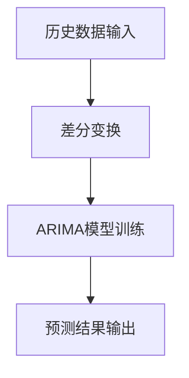
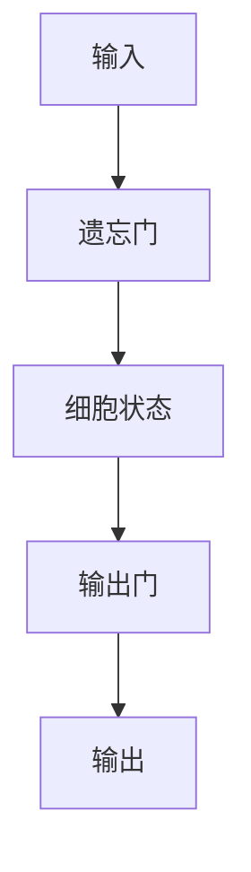
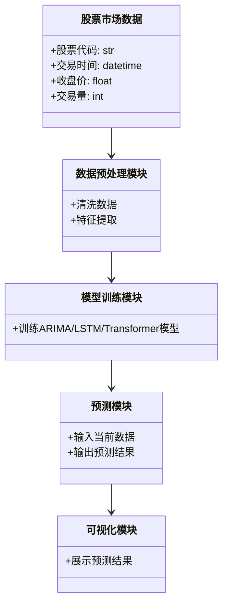
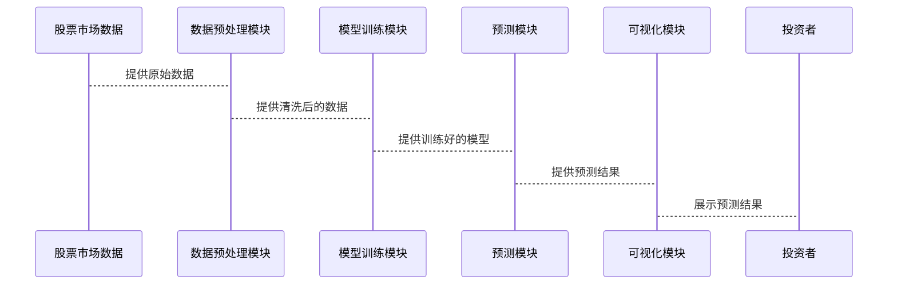

                 


# 人工智能在股市估值预测中的应用

> 关键词：人工智能、股市估值、时间序列、机器学习、深度学习、LSTM

> 摘要：本文详细探讨了人工智能在股市估值预测中的应用，从背景介绍、核心概念、算法原理、系统架构设计到项目实战，系统地分析了人工智能技术在时间序列预测中的优势与挑战。通过理论分析与实践案例结合的方式，本文为读者提供了一套完整的基于人工智能的股市估值预测解决方案，帮助读者理解并掌握这一领域的核心技术和实践方法。

---

## 第一部分: 股市估值预测的背景与挑战

### 第1章: 股市估值预测的背景与问题描述

#### 1.1 股市估值预测的背景
股市估值预测是金融市场中的一个核心问题，其目的是通过分析历史数据和市场动态，预测股票的未来价格走势，从而帮助投资者做出更明智的投资决策。传统的估值方法主要依赖于基本面分析和市场情绪分析，但这些方法往往受到市场波动性和不确定性的限制，难以准确捕捉复杂的市场变化。

人工智能（AI）技术的快速发展为股市估值预测带来了新的可能性。通过机器学习、深度学习等技术，可以对海量的市场数据进行建模和分析，提取出传统方法难以捕捉的隐含模式和规律。

#### 1.2 问题背景与目标
股市估值预测的核心问题可以归结为对时间序列数据的建模与预测。股票价格的时间序列具有以下特点：
- **非线性**：价格波动通常遵循复杂的非线性规律。
- **噪声干扰**：市场数据中存在大量噪声，如随机波动和市场参与者的短期行为。
- **依赖性**：价格走势往往受到历史数据的影响，具有很强的依赖性。

因此，如何从时间序列数据中提取有用的特征，并建立有效的预测模型，是股市估值预测的核心挑战。

#### 1.3 核心概念与联系
在股市估值预测中，涉及的核心概念包括：
- **时间序列**：按时间顺序排列的数据，如股票价格、交易量等。
- **机器学习**：一种通过数据学习模式的算法，如线性回归、支持向量机（SVM）等。
- **深度学习**：一种基于人工神经网络的机器学习方法，如卷积神经网络（CNN）、循环神经网络（RNN）等。
- **时间序列预测模型**：如ARIMA、LSTM、Transformer等。

通过对比这些概念的特征和应用场景，可以更好地理解它们在股市估值预测中的角色和联系。

---

## 第二部分: 人工智能与时间序列分析

### 第2章: 人工智能与时间序列分析

#### 2.1 人工智能的核心概念
人工智能（AI）是指通过模拟人类智能的技术，包括学习、推理、自适应等能力。在股市估值预测中，AI主要通过以下方式发挥作用：
- **数据处理**：AI可以快速处理海量的市场数据，提取有用的特征。
- **模式识别**：AI能够识别数据中的复杂模式，帮助预测未来的价格走势。
- **自适应调整**：AI模型可以根据市场变化动态调整预测策略。

#### 2.2 核心概念的对比与联系
为了更好地理解人工智能与时间序列分析的关系，我们可以通过对比分析来明确它们的特点和应用场景。

**对比表格：机器学习与深度学习的对比**

| 特性               | 机器学习                | 深度学习                |
|--------------------|-------------------------|-------------------------|
| 数据需求           | 数据量较小，特征工程重要 | 数据量大，特征工程可简化 |
| 模型复杂度         | 模型简单，易于解释       | 模型复杂，难于解释       |
| 任务类型           | 适用于分类、回归等任务   | 适用于复杂任务，如图像识别、自然语言处理等 |

**ER实体关系图：人工智能与时间序列分析的联系**

```mermaid
er
actor(投资者) --> 属于(股票市场) : 交易行为
股票市场 --> 具有(股票价格数据) : 时间序列数据
股票价格数据 --> 分析(时间序列预测模型) : 输入数据
时间序列预测模型 --> 使用(机器学习/深度学习算法) : 预测股票价格
```

---

## 第三部分: 股市估值预测的算法原理与数学模型

### 第3章: 时间序列预测的算法原理

#### 3.1 时间序列预测的基本原理
时间序列预测是通过对历史数据的建模，预测未来数据点的过程。常见的算法包括：
- **ARIMA**：自回归积分滑动平均模型，适用于线性时间序列数据。
- **LSTM**：长短期记忆网络，适用于非线性时间序列数据。
- **Transformer**：基于注意力机制的模型，近年来在时间序列预测中表现出色。

#### 3.2 常见的时间序列预测算法
##### 3.2.1 ARIMA模型的原理与实现
ARIMA（Autoregressive Integrated Moving Average）是一种经典的统计模型，适用于线性时间序列数据。

**数学公式：**
$$ ARIMA(p, d, q) = y_t = \phi_1 y_{t-1} + \phi_p y_{t-p} + \theta_1 \epsilon_{t-1} + \ldots + \theta_q \epsilon_{t-q} + \epsilon_t $$

**流程图：**


##### 3.2.2 LSTM网络的原理与实现
LSTM（Long Short-Term Memory）是一种基于循环神经网络（RNN）的变体，特别适用于处理长序列数据。

**LSTM结构：**


**数学公式：**
- 遗忘门：$$ f_t = \sigma(w_f \cdot [h_{t-1}, x_t] + b_f) $$
- 细胞状态：$$ c_t = f_t \cdot c_{t-1} + i_t \cdot g_t $$
- 输入门：$$ i_t = \sigma(w_i \cdot [h_{t-1}, x_t] + b_i) $$
- 输出门：$$ o_t = \sigma(w_o \cdot [h_{t-1}, x_t] + b_o) $$
- 输出：$$ h_t = o_t \cdot tanh(c_t) $$

##### 3.2.3 Transformer模型在时间序列预测中的应用
Transformer模型基于注意力机制，通过并行计算提高效率。

**数学公式：**
- 注意力机制：$$ \alpha_{i,j} = \text{softmax}(\frac{Q_i K_j^T}{\sqrt{d}}) $$
- 输出：$$ O_i = \sum_{j=1}^{n} \alpha_{i,j} V_j $$

---

## 第四部分: 股市估值预测系统的分析与架构设计

### 第4章: 股市估值预测系统的分析与设计

#### 4.1 问题场景介绍
股市估值预测系统的目标是通过分析历史股票价格、交易量、市场情绪等数据，预测未来股票价格走势。系统需要处理以下问题：
- 数据清洗与特征提取
- 模型训练与优化
- 预测结果的可视化与解释

#### 4.2 系统功能设计
##### 4.2.1 领域模型的Mermaid类图


##### 4.2.2 系统架构设计的Mermaid架构图


##### 4.2.3 系统接口设计与交互流程


---

## 第五部分: 股市估值预测的项目实战

### 第5章: 项目实战与实现

#### 5.1 环境安装与配置
为了运行本文中的代码，读者需要安装以下环境：
- Python 3.6+
- NumPy、Pandas、Matplotlib
- TensorFlow或Keras

#### 5.2 系统核心实现源代码
##### 5.2.1 数据预处理代码
```python
import pandas as pd
import numpy as np

# 读取数据
data = pd.read_csv('stock_prices.csv')

# 数据清洗
data.dropna(inplace=True)
data = data[['Date', 'Close']]
data.set_index('Date', inplace=True)

# 特征提取
data['Log_Return'] = np.log(data['Close'].pct_change().add(1))
```

##### 5.2.2 LSTM模型实现
```python
from tensorflow.keras.models import Sequential
from tensorflow.keras.layers import LSTM, Dense, Dropout

# 模型定义
model = Sequential()
model.add(LSTM(128, return_sequences=True, input_shape=(None, 1)))
model.add(LSTM(64, return_sequences=False))
model.add(Dense(1))

# 模型编译
model.compile(loss='mean_squared_error', optimizer='adam')
```

##### 5.2.3 预测与可视化
```python
import matplotlib.pyplot as plt

# 预测
predicted_prices = model.predict(test_data)

# 可视化
plt.plot(test_labels, label='实际价格')
plt.plot(predicted_prices, label='预测价格')
plt.legend()
plt.show()
```

---

## 第六部分: 最佳实践与总结

### 第6章: 最佳实践与总结

#### 6.1 小结
人工智能技术为股市估值预测提供了强大的工具，通过机器学习和深度学习算法，可以有效捕捉时间序列数据中的复杂模式。然而，股市的不确定性仍然对模型的准确性和稳定性提出了挑战。

#### 6.2 注意事项
- **数据质量**：数据清洗和特征提取是模型性能的关键。
- **模型选择**：不同算法适用于不同的数据特征，需根据实际情况选择合适的模型。
- **风险控制**：股市预测具有高度不确定性，需结合其他投资策略进行风险控制。

#### 6.3 拓展阅读
- 《Deep Learning》——Ian Goodfellow
- 《Time Series Analysis and Its Applications》——Shumway and Stoffer
- 《Python机器学习实战》——Andreas Müller 和 Sarah Guida

---

以上是《人工智能在股市估值预测中的应用》的完整目录和内容框架。通过理论分析与实践结合的方式，本文为读者提供了一套完整的基于人工智能的股市估值预测解决方案，帮助读者理解并掌握这一领域的核心技术和实践方法。

