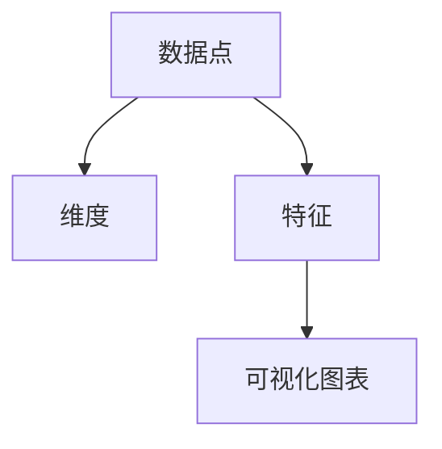
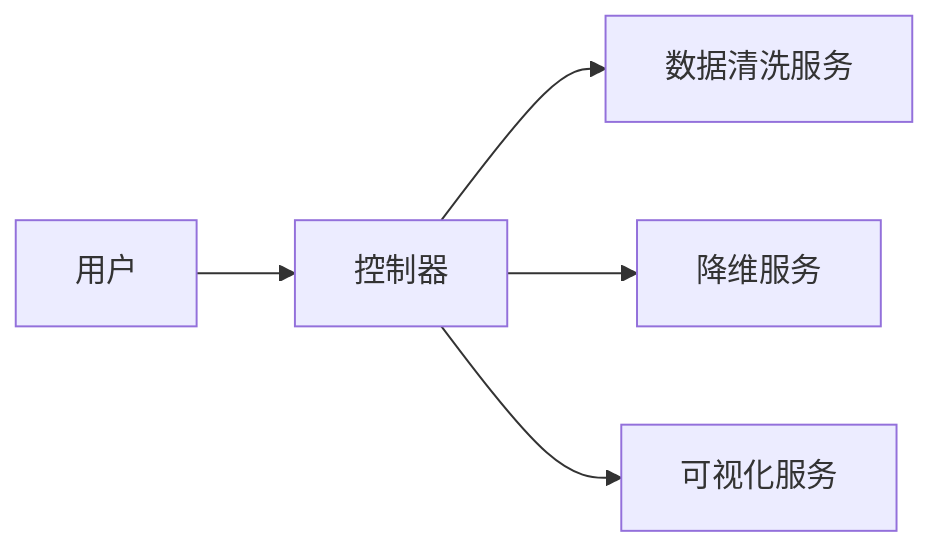

                 


# 人工智能在高维金融数据可视化中的应用

## 关键词：高维数据、人工智能、金融数据可视化、深度学习、数据降维

## 摘要：  
随着金融市场的日益复杂化和数据量的指数级增长，传统的数据处理和可视化方法已难以应对高维金融数据的挑战。人工智能技术的引入为高维金融数据的处理和可视化提供了新的可能性。本文从高维数据的特性出发，结合人工智能技术的核心原理，详细探讨了人工智能在金融数据可视化中的应用，包括降维算法、系统架构设计以及实际案例分析。通过本文的阐述，读者将能够深入了解如何利用人工智能技术提升高维金融数据的可视化效果，从而更好地进行金融分析和决策。

---

# 第一部分: 高维金融数据可视化与人工智能概述

## 第1章: 高维金融数据可视化与人工智能的背景

### 1.1 高维数据的特性与挑战  
高维数据是指包含大量维度的数据，通常在金融领域中表现为海量的交易数据、市场指标、用户行为数据等。其特性包括维度爆炸、维度稀疏性和维度冗余性。高维数据的处理和可视化面临以下主要挑战：  
1. **维度爆炸**：数据维度的增加会导致计算复杂度急剧上升，传统的二维或三维可视化方法难以有效展示高维信息。  
2. **维度稀疏性**：高维空间中数据点的稀疏性使得数据分布难以捕捉，容易导致数据的丢失或误识别。  
3. **维度冗余性**：部分维度可能与核心信息无关，冗余维度会增加数据处理的复杂性，降低可视化的效果。  

### 1.2 人工智能在金融数据可视化中的作用  
人工智能技术通过机器学习和深度学习方法，能够有效处理高维数据，并生成具有洞察力的可视化结果。其主要作用包括：  
1. **数据降维**：通过降维算法（如PCA、t-SNE等）减少数据维度，使高维数据能够在二维或三维空间中展示。  
2. **特征提取**：利用无监督学习方法提取数据中的关键特征，帮助用户更好地理解数据分布。  
3. **模式识别**：通过深度学习模型识别数据中的潜在模式和趋势，辅助用户进行金融决策。  

### 1.3 本章小结  
高维数据的特性决定了其在金融领域的复杂性，而人工智能技术为解决这一问题提供了新的思路。通过降维和特征提取，人工智能能够将高维数据转化为易于理解的可视化形式，从而帮助金融从业者更好地进行数据分析和决策。

---

## 第2章: 高维数据的核心概念与联系

### 2.1 高维数据的核心概念  
高维数据在金融领域中的核心概念包括：  
- **数据点**：金融数据中的每一个样本可以视为一个数据点，每个数据点包含多个维度的信息。  
- **维度**：数据的维度决定了数据空间的复杂性，维度越高，数据的稀疏性和复杂性越大。  
- **特征**：数据中的关键属性，例如股票价格、成交量、市场指数等。  

### 2.2 人工智能技术的核心原理  
人工智能技术的核心原理包括：  
- **机器学习**：通过训练模型从数据中提取特征和模式。  
- **深度学习**：利用多层神经网络模型进行特征提取和非线性关系建模。  
- **自然语言处理**：用于分析文本数据，提取情感倾向、关键词等信息。  

### 2.3 高维金融数据可视化的核心要素  
高维金融数据可视化的核心要素包括：  
- **数据预处理**：包括数据清洗、标准化和去噪等步骤。  
- **数据降维**：通过降维算法将高维数据映射到低维空间。  
- **可视化方法**：选择合适的可视化工具和图表形式，例如散点图、热力图等。  

### 2.4 核心概念的ER实体关系图  


---

## 第3章: 高维数据降维算法的数学模型与实现

### 3.1 线性降维算法  
#### 3.1.1 主成分分析（PCA）  
PCA是一种经典的线性降维算法，其数学模型如下：  
$$ \text{目标}：\text{最大化数据方差} $$  
$$ \text{实现步骤}：  
1. 计算数据的协方差矩阵。  
2. 对协方差矩阵进行特征值分解。  
3. 选择前k个特征向量作为主成分。 $$  

#### 3.1.2 PCA实现代码示例  
```python
import numpy as np

def pca(X, n_components):
    # 计算协方差矩阵
    cov_matrix = np.cov(X.T)
    # 计算特征值和特征向量
    eigenvalues, eigenvectors = np.linalg.eigh(cov_matrix)
    # 降维
    X_pca = np.dot(X, eigenvectors[:, :n_components])
    return X_pca
```

### 3.2 非线性降维算法  
#### 3.2.1 t-SNE算法  
t-SNE是一种常用的非线性降维算法，其数学模型如下：  
$$ \text{目标}：\text{最小化数据点之间的距离} $$  
$$ \text{实现步骤}：  
1. 计算数据的相似性矩阵。  
2. 将相似性矩阵转换为概率分布。  
3. 使用KL散度优化数据点的降维结果。 $$  

#### 3.2.2 t-SNE实现代码示例  
```python
from sklearn.manifold import TSNE

def tsne(X, n_components):
    tsne = TSNE(n_components=n_components, random_state=42)
    return tsne.fit_transform(X)
```

---

## 第4章: 高维金融数据可视化系统的架构设计

### 4.1 系统功能设计  
- **数据清洗**：处理缺失值和异常值。  
- **降维处理**：使用PCA或t-SNE进行数据降维。  
- **可视化生成**：生成散点图、热力图等可视化图表。  
- **交互分析**：支持用户对可视化结果的交互式分析。  

### 4.2 系统架构设计  


### 4.3 系统接口设计  
- **输入接口**：接收高维金融数据。  
- **输出接口**：返回降维后的数据和可视化图表。  

---

## 第5章: 项目实战

### 5.1 环境安装  
- 安装Python和相关库（如numpy、sklearn、matplotlib）。  

### 5.2 核心功能实现  
```python
import matplotlib.pyplot as plt

def visualize(X, labels):
    plt.scatter(X[:, 0], X[:, 1], c=labels)
    plt.xlabel('Component 1')
    plt.ylabel('Component 2')
    plt.show()
```

### 5.3 实际案例分析  
- 使用股票数据进行降维和可视化，分析股票价格的变化趋势。  

---

## 第6章: 小结与展望

### 6.1 本章小结  
通过本文的阐述，我们深入探讨了人工智能在高维金融数据可视化中的应用，包括降维算法、系统架构设计和实际案例分析。  

### 6.2 注意事项  
- 数据可视化结果的解释需结合具体业务背景。  
- 算法的选择需根据数据特性和任务需求灵活调整。  

### 6.3 拓展阅读  
- 推荐阅读《机器学习实战》和《深度学习》等书籍，深入理解人工智能技术的核心原理。  

---

# 结语  
人工智能技术为高维金融数据的处理和可视化提供了强大的工具和方法。通过本文的学习，读者将能够掌握高维数据可视化的核心概念和技术，从而更好地应对金融领域的复杂挑战。

