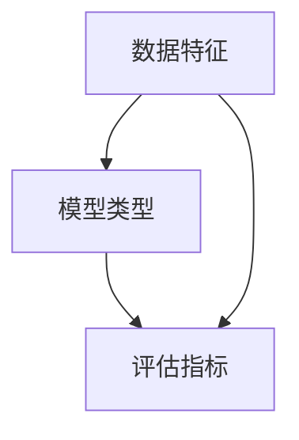
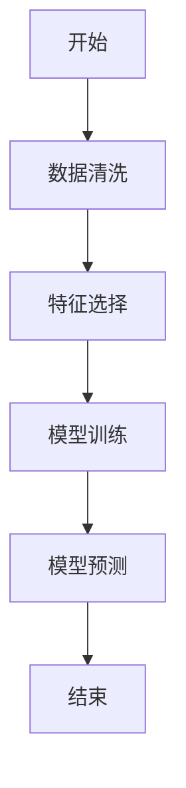
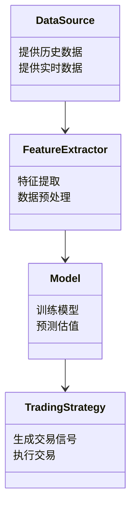

                 


# 人工智能对股市估值准确性的提升研究

## 关键词：人工智能，股市估值，算法模型，数据特征，评估指标

## 摘要：  
本文系统探讨了人工智能技术在股市估值中的应用，重点分析了如何通过机器学习算法提升估值准确性。文章从问题背景出发，详细阐述了传统估值方法的局限性，提出了基于AI的解决方案，并通过算法原理、系统架构和实际案例分析，展示了AI在提升估值准确性方面的优势。最后，本文总结了最佳实践方法，为投资者和研究者提供了有价值的参考。

---

# 第一部分: 背景介绍

## 第1章: 问题背景

### 1.1 传统估值方法的局限性
传统股市估值方法主要依赖于财务指标和历史价格数据，这些方法在一定程度上能够反映企业的基本面，但在面对市场波动、突发事件和情绪影响时显得力不从心。例如，传统方法难以捕捉市场情绪的变化，也无法有效预测短期价格波动。

### 1.2 人工智能的优势
人工智能技术，尤其是机器学习算法，能够处理海量非结构化数据（如新闻、社交媒体情绪等），并通过复杂模型捕捉市场中的潜在规律。这些技术能够显著提升估值的准确性和及时性。

### 1.3 问题解决
通过引入人工智能技术，我们可以构建更复杂的估值模型，结合多种数据源，优化预测结果，从而提高估值的准确性。

---

## 第2章: 核心概念与联系

### 2.1 核心概念原理
在股市估值中，数据特征、模型选择和评估指标是三个关键要素。数据特征决定了模型的输入信息，模型选择影响了算法的复杂度和表现，而评估指标则是衡量模型优劣的重要标准。

### 2.2 核心概念对比表
以下是传统估值方法与人工智能估值方法的核心对比：

| 对比维度 | 传统估值方法 | 人工智能估值方法 |
|----------|----------------|-------------------|
| 数据来源 | 历史价格、财务数据 | 历史价格、财务数据、新闻情绪、社交媒体数据 |
| 模型复杂度 | 线性回归、简单统计模型 | 神经网络、随机森林、支持向量机 |
| 评估指标 | R²、MAE | F1分数、AUC曲线、回撤率 |

### 2.3 实体关系图
以下是核心实体关系图：



---

## 第3章: 算法原理讲解

### 3.1 算法流程图
以下是常见的机器学习算法流程图：



### 3.2 算法数学模型

#### 线性回归模型
线性回归是最简单的回归模型，其数学表达式为：
$$ y = \beta_0 + \beta_1x + \epsilon $$
其中，$\beta_0$是截距，$\beta_1$是斜率，$\epsilon$是误差项。

#### 随机森林模型
随机森林是一种基于决策树的集成学习算法，其数学表达式可以表示为：
$$ y = \sum_{i=1}^{n} \text{Tree}_i(x) $$
其中，$\text{Tree}_i(x)$表示第$i$棵决策树的预测值，$n$是树的数量。

---

## 第4章: 系统分析与架构设计

### 4.1 问题场景介绍
在实际应用中，股市估值系统需要处理实时数据流，快速生成预测结果，并提供交易策略建议。

### 4.2 系统功能设计
以下是系统的功能模块图：



### 4.3 系统架构设计
以下是系统的架构图：


---

## 第5章: 项目实战

### 5.1 环境安装
以下是Python环境的安装步骤：
1. 安装Python：`python --version`
2. 安装相关库：`pip install numpy pandas scikit-learn`

### 5.2 核心代码实现

```python
import pandas as pd
from sklearn.model_selection import train_test_split
from sklearn.linear_model import LinearRegression
from sklearn.metrics import mean_absolute_error

# 加载数据
data = pd.read_csv('stock_data.csv')

# 数据预处理
X = data[['open', 'high', 'low', 'volume']]
y = data['close']

# 划分训练集和测试集
X_train, X_test, y_train, y_test = train_test_split(X, y, test_size=0.2, random_state=42)

# 模型训练
model = LinearRegression()
model.fit(X_train, y_train)

# 模型预测
y_pred = model.predict(X_test)

# 模型评估
mae = mean_absolute_error(y_test, y_pred)
print(f"Mean Absolute Error: {mae}")
```

### 5.3 实际案例分析
以下是使用LSTM模型预测股票价格的案例：

```python
import numpy as np
from tensorflow.keras.models import Sequential
from tensorflow.keras.layers import LSTM, Dense

# 加载数据
data = pd.read_csv('stock_data.csv')

# 数据预处理
X = data[['open', 'high', 'low', 'volume']].values
y = data['close'].values

# 划分训练集和测试集
X_train = X[:1000]
X_test = X[1000:]
y_train = y[:1000]
y_test = y[1000:]

# LSTM模型训练
model = Sequential()
model.add(LSTM(64, input_shape=(X_train.shape[1], 1)))
model.add(Dense(1))
model.compile(loss='mean_squared_error', optimizer='adam')
model.fit(X_train, y_train, epochs=10, batch_size=32)

# 模型预测
y_pred = model.predict(X_test)

# 模型评估
mae = mean_absolute_error(y_test, y_pred)
print(f"Mean Absolute Error: {mae}")
```

---

## 第6章: 最佳实践

### 6.1 小结
通过本文的分析，我们可以看到人工智能在提升股市估值准确性方面具有显著优势。然而，实际应用中仍需注意数据质量、模型选择和风险控制。

### 6.2 注意事项
1. 数据清洗和特征选择是关键步骤。
2. 模型评估需要结合多个指标。
3. 风险控制是投资决策的重要组成部分。

### 6.3 拓展阅读
1. 《机器学习实战》
2. 《深度学习》
3. 《金融时间序列分析》

---

通过以上分析，我们可以看到人工智能在股市估值中的巨大潜力。希望本文能为相关领域的研究者和投资者提供有价值的参考。

