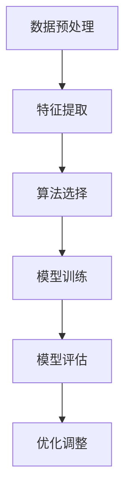
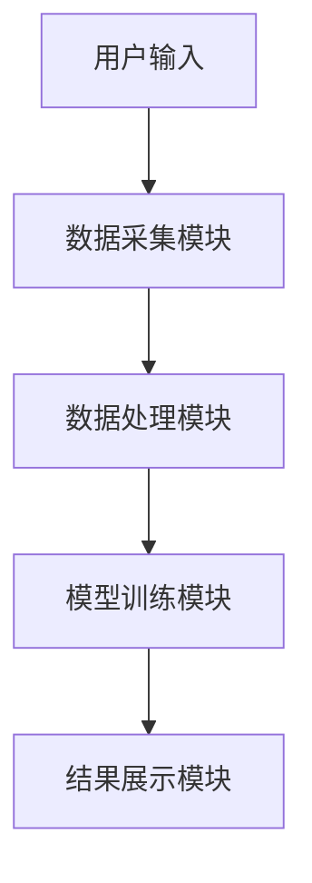

                 


# 人工智能辅助识别价值陷阱

## 关键词：人工智能、价值陷阱、投资分析、机器学习、自然语言处理、系统架构

## 摘要：  
人工智能技术在金融领域的应用日益广泛，特别是在识别“价值陷阱”方面展现出了巨大潜力。本文从价值陷阱的定义、特征入手，结合人工智能的核心算法与系统架构，详细探讨如何利用AI技术辅助投资者识别这些潜在风险。通过实际案例分析和项目实战，为读者提供一套完整的解决方案，帮助他们在投资决策中规避价值陷阱。

---

# 第1章: 价值陷阱的基本概念

## 1.1 价值陷阱的定义与分类

### 1.1.1 价值陷阱的定义  
价值陷阱是指那些表面上看具有较高投资价值，但实际存在严重问题或潜在风险的公司或资产。这类资产往往因为信息披露不充分、财务造假或管理层失误等原因，掩盖了其真实的风险。

### 1.1.2 价值陷阱的分类  
价值陷阱可以分为以下几类：  
1. **财务造假型**：公司通过虚构收入、隐瞒负债等方式制造虚假的财务报表。  
2. **管理层欺诈型**：管理层滥用职权，通过关联交易、利益输送等方式损害公司利益。  
3. **行业周期型**：某些行业因周期性波动，导致部分公司表面盈利，实则面临行业衰退风险。  
4. **技术落后型**：公司技术 outdated，无法适应市场变化，但通过表面的营销手段掩盖问题。

### 1.1.3 价值陷阱的特征  
价值陷阱的特征包括：  
- 财务数据异常，如收入与利润不匹配。  
- 经营现金流持续为负，但账面利润较高。  
- 公司管理层频繁变动或存在重大诉讼。  
- 行业环境恶化，但公司未及时调整战略。  

---

## 1.2 人工智能在投资分析中的应用

### 1.2.1 人工智能在金融领域的应用现状  
人工智能（AI）在金融领域的应用已经非常广泛，包括：  
- **量化交易**：通过算法快速捕捉市场机会。  
- **风险控制**：利用AI模型预测市场波动和信用风险。  
- **智能投顾**：为投资者提供个性化的投资建议。  

### 1.2.2 人工智能如何辅助投资决策  
AI在投资决策中的作用主要体现在以下几个方面：  
1. **数据处理**：快速分析海量数据，提取有价值的信息。  
2. **模式识别**：通过机器学习发现数据中的隐藏模式。  
3. **预测模型**：利用AI模型预测股票价格和市场趋势。  

### 1.2.3 人工智能识别价值陷阱的优势  
相比传统方法，AI在识别价值陷阱方面具有以下优势：  
1. **高效性**：AI可以在短时间内处理大量数据，发现潜在风险。  
2. **准确性**：通过深度学习模型，AI能够识别复杂的数据模式，提高识别精度。  
3. **实时性**：AI系统可以实时监控市场动态，及时发现异常情况。  

---

## 1.3 本章小结  
本章主要介绍了价值陷阱的基本概念、分类及其特征，并探讨了人工智能在投资分析中的应用及其优势。通过这些内容，我们可以理解为什么利用AI技术识别价值陷阱是必要且可行的。

---

# 第2章: 价值陷阱的识别方法

## 2.1 传统价值陷阱识别方法

### 2.1.1 财务指标分析法  
财务指标分析法是传统价值陷阱识别的主要方法，包括：  
- **市盈率（P/E）**：衡量股票价格是否合理。  
- **市净率（P/B）**：评估股票价格相对于账面价值的高低。  
- **ROE（净资产收益率）**：衡量公司盈利能力。  

### 2.1.2 市盈率与市净率分析  
通过比较市盈率和市净率，可以发现一些表面上看估值较低，但实际存在风险的公司。例如，某公司市盈率低于行业平均水平，但其收入增长缓慢，可能隐藏着价值陷阱。  

### 2.1.3 资产负债表分析  
通过分析资产负债表，可以发现公司是否存在虚增资产、隐瞒负债等问题。例如，某公司账面资产远大于实际资产，可能存在虚增资产的风险。

---

## 2.2 人工智能在价值陷阱识别中的创新方法

### 2.2.1 机器学习在财务数据分析中的应用  
机器学习可以通过以下方式辅助识别价值陷阱：  
- **异常检测**：利用聚类算法发现财务数据中的异常值。  
- **分类模型**：通过监督学习模型预测公司是否为价值陷阱。  

### 2.2.2 自然语言处理在公司公告分析中的应用  
自然语言处理（NLP）可以分析公司公告、新闻报道等文本数据，发现潜在风险。例如，通过关键词提取技术，识别公告中隐藏的负面信息。

### 2.2.3 图神经网络在产业链分析中的应用  
图神经网络可以分析公司之间的关联关系，发现产业链中的潜在风险。例如，某公司与多家问题公司存在关联交易，可能隐藏着价值陷阱。

---

## 2.3 价值陷阱识别方法对比

### 2.3.1 传统方法与AI方法对比  
| 对比维度       | 传统方法                | AI方法                  |
|-----------------|-------------------------|-------------------------|
| 数据处理能力   | 依赖人工分析            | 能够处理海量数据        |
| 分析效率       | 较低                   | 较高                   |
| 分析精度       | 受人为因素影响较大      | 更客观，精度更高        |

### 2.3.2 实际应用场景  
- **财务数据异常检测**：通过AI模型发现财务数据中的虚假成分。  
- **公司公告情感分析**：通过NLP技术识别公告中的负面情绪。  
- **产业链风险评估**：通过图神经网络发现潜在的关联风险。  

---

## 2.4 本章小结  
本章详细介绍了传统价值陷阱识别方法和人工智能的创新方法，并通过对比分析，展示了AI技术在识别价值陷阱方面的优势。

---

# 第3章: 人工智能辅助识别价值陷阱的核心算法

## 3.1 机器学习算法基础

### 3.1.1 监督学习与无监督学习  
- **监督学习**：基于标注数据进行模型训练，例如分类和回归任务。  
- **无监督学习**：基于未标注数据进行模式发现，例如聚类和降维任务。  

### 3.1.2 分类算法与回归算法  
- **分类算法**：如支持向量机（SVM）、随机森林（Random Forest）。  
- **回归算法**：如线性回归、逻辑回归（Logistic Regression）。  

### 3.1.3 深度学习与传统机器学习的对比  
- **深度学习**：基于神经网络，能够自动提取特征。  
- **传统机器学习**：需要人工设计特征，依赖领域知识。  

---

## 3.2 基于机器学习的价值陷阱识别算法

### 3.2.1 数据预处理与特征提取  
- **数据清洗**：处理缺失值、异常值等。  
- **特征工程**：将财务指标、文本特征等转化为数值特征。  

### 3.2.2 算法选择与模型训练  
- **算法选择**：根据数据特点选择合适的算法，例如使用随机森林进行分类。  
- **模型训练**：通过交叉验证优化模型参数。  

### 3.2.3 模型评估与优化  
- **评估指标**：如准确率（Accuracy）、召回率（Recall）、F1分数（F1 Score）。  
- **模型优化**：通过超参数调优提高模型性能。  

---

## 3.3 算法流程图（使用 mermaid）



---

## 3.4 本章小结  
本章详细介绍了机器学习算法在价值陷阱识别中的应用，包括数据预处理、特征提取、算法选择和模型优化等关键步骤。

---

# 第4章: 价值陷阱识别的数学模型与公式

## 4.1 传统统计模型

### 4.1.1 线性回归模型  
线性回归模型用于预测目标变量与多个自变量之间的线性关系：  
$$ y = \beta_0 + \beta_1 x_1 + \beta_2 x_2 + \cdots + \beta_n x_n $$  

### 4.1.2 马科维茨均值-方差模型  
马科维茨模型用于优化投资组合的风险和收益：  
$$ \min_{w} \frac{1}{2} w^T \Sigma w $$  
$$ \text{s.t.} \quad w^T \mu = \mu_p, \quad w^T \mathbf{1} = 1 $$  

### 4.1.3 财务指标评分模型  
财务指标评分模型通过加权计算多个财务指标的综合评分：  
$$ \text{综合评分} = \sum_{i=1}^n w_i x_i $$  

---

## 4.2 机器学习模型

### 4.2.1 支持向量机（SVM）模型  
SVM用于分类问题，其目标函数为：  
$$ \min_{w, b, \xi} \frac{1}{2} w^T w + C \sum_{i=1}^n \xi_i $$  
$$ \text{s.t.} \quad y_i (w^T x_i + b) \geq 1 - \xi_i $$  
$$ \xi_i \geq 0 $$  

### 4.2.2 随机森林模型  
随机森林通过集成学习提高模型的准确性和鲁棒性，其预测公式为：  
$$ y = \sum_{i=1}^n \text{Tree}_i(x) $$  

### 4.2.3 神经网络模型  
神经网络模型通过多层感知机（MLP）进行非线性分类或回归：  
$$ y = \sigma(w_2 a_{h} + b_2) $$  
$$ a_{h} = \sigma(w_1 x + b_1) $$  

---

## 4.3 数学公式与模型对比

| 模型类型     | 优点                           | 缺点                           |
|--------------|--------------------------------|--------------------------------|
| 线性回归     | 简单易懂，适合线性关系         | 无法处理非线性关系               |
| 随机森林     | 鲁棒性高，适合高维数据         | 对特征工程依赖较大               |
| 神经网络     | 能够处理复杂非线性关系         | 计算复杂，需要大量数据             |

---

## 4.4 本章小结  
本章详细介绍了传统统计模型和机器学习模型在价值陷阱识别中的应用，并通过对比分析，展示了不同模型的优缺点。

---

# 第5章: 人工智能辅助识别价值陷阱的系统架构

## 5.1 项目背景与目标

### 5.1.1 项目背景  
随着金融市场复杂化，投资者需要更高效、更准确的工具来识别价值陷阱。  

### 5.1.2 项目目标  
开发一个基于AI的系统，帮助投资者识别价值陷阱，优化投资决策。

---

## 5.2 系统功能设计

### 5.2.1 数据采集模块  
- 从股票数据库、新闻网站等来源获取数据。  

### 5.2.2 数据处理模块  
- 对数据进行清洗、特征提取和标注。  

### 5.2.3 模型训练模块  
- 使用机器学习算法训练价值陷阱识别模型。  

### 5.2.4 结果展示模块  
- 将识别结果以可视化形式展示给用户。  

---

## 5.3 系统架构设计



---

## 5.4 本章小结  
本章详细介绍了人工智能辅助识别价值陷阱系统的架构设计，包括功能模块和系统流程图。

---

# 第6章: 项目实战与最佳实践

## 6.1 环境搭建与代码实现

### 6.1.1 环境安装  
- 安装Python、Pandas、Scikit-learn等库。  

### 6.1.2 代码实现  
以下是价值陷阱识别模型的Python代码示例：

```python
import pandas as pd
from sklearn.ensemble import RandomForestClassifier
from sklearn.metrics import accuracy_score

# 数据加载
data = pd.read_csv('value_traps.csv')

# 特征与标签分离
X = data.drop('is_value_trap', axis=1)
y = data['is_value_trap']

# 模型训练
model = RandomForestClassifier()
model.fit(X, y)

# 模型预测
y_pred = model.predict(X)

# 模型评估
print('准确率:', accuracy_score(y, y_pred))
```

---

## 6.2 实际案例分析

### 6.2.1 案例背景  
某公司财务数据异常，但市场对其评价较高。  

### 6.2.2 数据分析  
通过模型识别，发现其收入与利润不匹配，可能存在财务造假。  

### 6.2.3 结果解读  
模型预测结果为“价值陷阱”，建议投资者谨慎决策。  

---

## 6.3 最佳实践与注意事项

### 6.3.1 数据质量  
确保数据来源可靠，避免噪声干扰。  

### 6.3.2 特征选择  
合理选择特征，避免维度灾难。  

### 6.3.3 模型优化  
通过交叉验证和超参数调优提高模型性能。  

---

## 6.4 本章小结  
本章通过实际案例展示了人工智能在识别价值陷阱中的应用，并提供了最佳实践建议。

---

# 第7章: 总结与展望

## 7.1 本章总结  
本文详细探讨了人工智能在识别价值陷阱中的应用，从算法原理到系统架构，再到项目实战，为读者提供了一套完整的解决方案。

## 7.2 未来展望  
随着AI技术的不断发展，未来价值陷阱识别将更加智能化、自动化。建议投资者密切关注技术进步，充分利用AI工具优化投资决策。

---

## 7.3 小结  
通过本文的学习，读者可以深入了解人工智能在识别价值陷阱中的潜力，并将其应用到实际投资中，从而提高投资效率和准确性。

---

## 关键词回顾  
人工智能、价值陷阱、投资分析、机器学习、自然语言处理、系统架构

---

以上是《人工智能辅助识别价值陷阱》的技术博客文章的完整目录大纲和部分详细内容。

