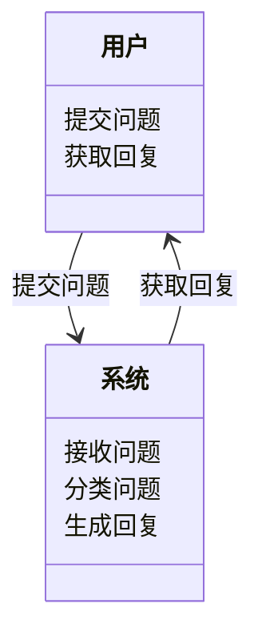
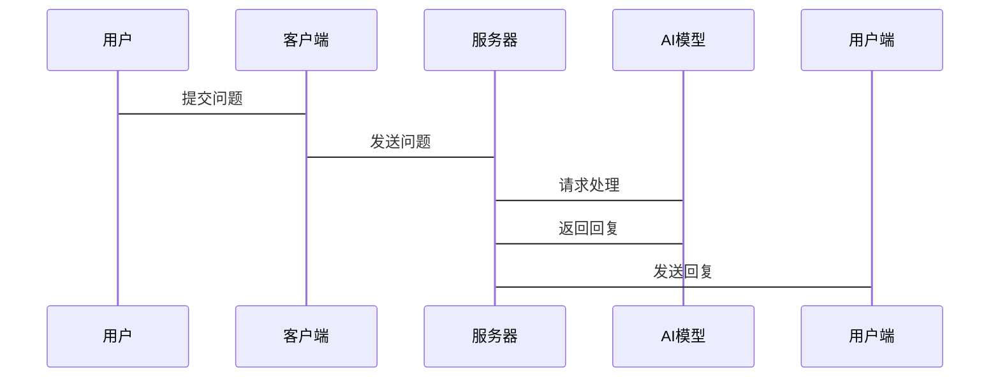

                 


# 人工智能革命：重塑产业链的投资逻辑

## 关键词
人工智能，产业链，投资逻辑，技术分析，投资策略

## 摘要
人工智能技术的迅速发展正在重塑全球产业链的结构。本文将分析人工智能如何影响产业链的各个环节，并探讨投资者在这一变革中的机会与策略。通过深入的技术分析和实际案例，本文将揭示人工智能在投资逻辑中的关键作用，并为投资者提供切实可行的建议。

---

# 第一部分: 人工智能革命的背景与趋势

## 第1章: 人工智能革命的背景与现状

### 1.1 人工智能技术的演进历程

#### 1.1.1 从传统AI到深度学习的演变
传统的AI技术依赖于规则和逻辑推理，而深度学习的突破使得AI能够通过大量数据自我学习和优化。这种演变极大地扩展了AI的应用场景，从图像识别到自然语言处理，AI的能力显著提升。

#### 1.1.2 当前AI技术的核心突破
当前，大模型（如GPT-4）的出现标志着AI技术的新高度。这些模型不仅能够处理复杂的语言任务，还能进行推理和生成，推动了AI在多个领域的广泛应用。

#### 1.1.3 人工智能对社会的深远影响
AI正在改变我们的生活方式、工作方式以及商业模式。从医疗到金融，从教育到制造业，AI的应用正在重塑传统产业的格局。

---

### 1.2 产业链的数字化转型

#### 1.2.1 传统产业链的痛点与局限
传统产业链中，信息孤岛、效率低下和资源浪费等问题普遍存在。这些痛点限制了产业链的优化和升级。

#### 1.2.2 数字化转型的必要性
数字化转型是企业应对市场竞争和效率要求的必然选择。通过数字化，企业可以实现数据的高效流动和资源的优化配置。

#### 1.2.3 人工智能在产业链中的应用场景
人工智能在供应链管理、生产优化、客户服务等方面展现了巨大的潜力。通过AI技术，企业能够实现更精准的预测和更高效的决策。

---

### 1.3 人工智能革命的投资逻辑

#### 1.3.1 投资AI的核心逻辑
AI技术的广泛应用带来了巨大的商业价值。投资者需要关注技术的成熟度、市场的接受度以及商业模式的可行性。

#### 1.3.2 产业链重构的投资机会
随着AI技术的应用，产业链中的各个环节都在发生重构。投资者需要识别那些能够利用AI技术提升竞争力的企业。

#### 1.3.3 风险与挑战
AI技术的应用也伴随着风险，如技术瓶颈、数据隐私和伦理问题等。投资者需要充分评估这些风险，并制定相应的应对策略。

---

## 第2章: 人工智能的核心技术与产业链分析

### 2.1 人工智能的核心技术

#### 2.1.1 大模型的原理与特点
大模型通过海量数据的训练，掌握了强大的语言理解和生成能力。其特点包括通用性、可扩展性和高效性。

#### 2.1.2 机器学习与深度学习的区别
机器学习是一种基于数据的模式识别技术，而深度学习是机器学习的一种特殊形式，通过多层神经网络实现更复杂的特征提取。

#### 2.1.3 自然语言处理与计算机视觉的对比
自然语言处理专注于文本的理解和生成，而计算机视觉则致力于图像和视频的分析。两者在技术原理和应用场景上有显著差异。

---

### 2.2 人工智能与产业链的深度融合

#### 2.2.1 数据驱动的产业链重构
数据是AI的核心资源，产业链的重构离不开数据的采集、处理和分析。

#### 2.2.2 技术驱动的产业变革
AI技术的应用推动了产业的变革，从制造业到服务业，AI正在改变每个行业的运作方式。

#### 2.2.3 人工智能对传统产业的颠覆性影响
AI的应用正在颠覆传统的商业模式和价值链条，带来了新的投资机会和挑战。

---

## 第3章: 人工智能算法的数学基础

### 3.1 机器学习的数学模型

#### 3.1.1 线性回归的数学公式
线性回归是最简单的机器学习模型，其数学公式为：
$$y = \beta_0 + \beta_1 x + \epsilon$$
其中，$\beta_0$是截距，$\beta_1$是斜率，$\epsilon$是误差项。

#### 3.1.2 逻辑回归的原理与应用
逻辑回归用于分类问题，其数学公式为：
$$P(y=1|x) = \frac{1}{1 + e^{- (\beta_0 + \beta_1 x)}}$$
逻辑回归通过sigmoid函数将线性回归的结果映射到概率空间。

#### 3.1.3 神经网络的数学基础
神经网络由多个层组成，每一层通过非线性激活函数进行变换。其基本结构包括输入层、隐藏层和输出层。

---

### 3.2 深度学习的算法原理

#### 3.2.1 卷积神经网络的结构与公式
卷积神经网络（CNN）通过卷积操作提取图像特征，其数学公式为：
$$f(x) = \max\left(0, x + b\right)$$
其中，$x$是输入，$b$是偏置项，$\max$是激活函数。

#### 3.2.2 循环神经网络的原理与应用
循环神经网络（RNN）用于处理序列数据，其数学公式为：
$$h_t = \tanh(W_{hh} h_{t-1} + W_{xh} x_t + b_h)$$
其中，$h_t$是当前状态，$W_{hh}$和$W_{xh}$是权重矩阵，$b_h$是偏置项。

#### 3.2.3 图神经网络的创新与挑战
图神经网络（GNN）用于处理图结构数据，其数学公式为：
$$h_v^{(l+1)} = \sigma\left(\sum_{u \in N(v)} W_{vu} h_u^{(l)} + W_{vv} h_v^{(l)}\right)$$
其中，$h_v^{(l)}$是节点$v$在第$l$层的表示，$N(v)$是$v$的邻居节点，$\sigma$是激活函数。

---

## 第4章: 人工智能系统的架构设计

### 4.1 系统架构的模块化设计

#### 4.1.1 数据采集与处理模块
数据采集模块负责从各种来源获取数据，数据处理模块对数据进行清洗和预处理。

#### 4.1.2 算法开发与训练模块
算法开发模块负责设计和实现AI算法，训练模块通过大量数据对模型进行训练和优化。

#### 4.1.3 系统部署与优化模块
系统部署模块将训练好的模型部署到实际应用环境中，优化模块负责对系统进行性能调优。

---

### 4.2 系统架构的流程图

#### 4.2.1 数据流的流向与处理
数据从输入端进入系统，经过数据处理模块后，流向算法开发模块进行训练，最终输出结果。

#### 4.2.2 算法模块的交互与协作
算法模块之间通过接口进行交互，协作完成复杂的任务，如图像识别和自然语言处理。

#### 4.2.3 系统输出的展示与反馈
系统的输出结果通过用户界面展示给用户，并根据用户反馈进行优化。

---

## 第5章: 人工智能项目的实战分析

### 5.1 项目需求分析

#### 5.1.1 项目背景与目标
以智能客服系统为例，项目的目标是通过AI技术实现客户问题的自动解答和处理。

#### 5.1.2 项目范围与约束
项目范围包括客户咨询、问题分类和自动回复，约束包括数据隐私和系统稳定性。

#### 5.1.3 项目利益相关者分析
利益相关者包括企业客户、技术团队和最终用户，需要协调各方的需求和资源。

---

### 5.2 系统功能设计

#### 5.2.1 领域模型mermaid类图


#### 5.2.2 系统架构设计mermaid架构图


#### 5.2.3 系统接口设计
系统接口包括API接口和用户界面，API接口用于与其他系统交互，用户界面用于与最终用户交互。

#### 5.2.4 系统交互mermaid序列图


---

### 5.3 项目核心实现

#### 5.3.1 环境安装
项目需要安装Python、TensorFlow、Keras和Flask等库。

#### 5.3.2 核心代码实现
以下是智能客服系统的部分代码示例：
```python
import tensorflow as tf
from tensorflow.keras import layers

# 模型定义
model = tf.keras.Sequential([
    layers.Dense(64, activation='relu', input_shape=(input_dim,)),
    layers.Dense(1, activation='sigmoid')
])

# 模型编译
model.compile(optimizer='adam', loss='binary_crossentropy', metrics=['accuracy'])

# 模型训练
model.fit(X_train, y_train, epochs=10, batch_size=32)
```

---

### 5.4 项目小结

#### 5.4.1 项目实现的关键点
模型选择、数据预处理和系统集成是项目成功的关键。

#### 5.4.2 项目的创新点
通过AI技术实现了智能客服的自动化，显著提高了效率和服务质量。

#### 5.4.3 项目的经验与教训
数据质量对模型性能影响巨大，需要在项目中高度重视数据的清洗和处理。

---

## 第六部分: 最佳实践与投资策略

## 第6章: 人工智能投资策略与未来展望

### 6.1 人工智能投资的逻辑与策略

#### 6.1.1 投资AI的核心逻辑
技术领先、市场需求和商业模式是投资AI的三大核心逻辑。

#### 6.1.2 AI产业链的投资机会
数据公司、算力供应商和应用开发商是产业链中的三大投资机会。

#### 6.1.3 投资AI的风险与挑战
技术风险、市场风险和政策风险是投资AI需要重点关注的风险。

---

### 6.2 人工智能投资的最佳实践

#### 6.2.1 技术选型的注意事项
选择技术成熟、应用广泛的AI技术，避免盲目跟风。

#### 6.2.2 数据获取与处理的建议
数据是AI的核心，投资者需要关注数据的质量和隐私问题。

#### 6.2.3 项目实施中的注意事项
项目实施需要团队协作和资源投入，需要充分考虑时间和预算。

---

### 6.3 人工智能的未来展望

#### 6.3.1 技术发展趋势
大模型的进一步优化和多模态AI的发展是未来技术的主要方向。

#### 6.3.2 产业链的进一步重构
AI技术的深入应用将进一步推动产业链的重构，带来更多的投资机会。

#### 6.3.3 投资逻辑的演变
随着AI技术的成熟，投资逻辑将更加注重技术与商业模式的结合。

---

## 总结

人工智能革命正在重塑全球产业链的投资逻辑。通过技术创新、数据驱动和模式变革，AI正在为投资者带来前所未有的机会。然而，投资AI也需要面对技术和市场的双重挑战。未来，随着AI技术的不断发展，产业链的重构将继续，投资者需要紧跟技术趋势，抓住机遇，应对挑战。

---

通过以上内容，我们可以看到人工智能在投资逻辑中的重要性，以及其对产业链的深远影响。希望本文能够为投资者提供有价值的参考和启示。

